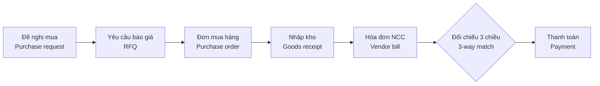
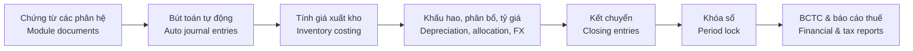
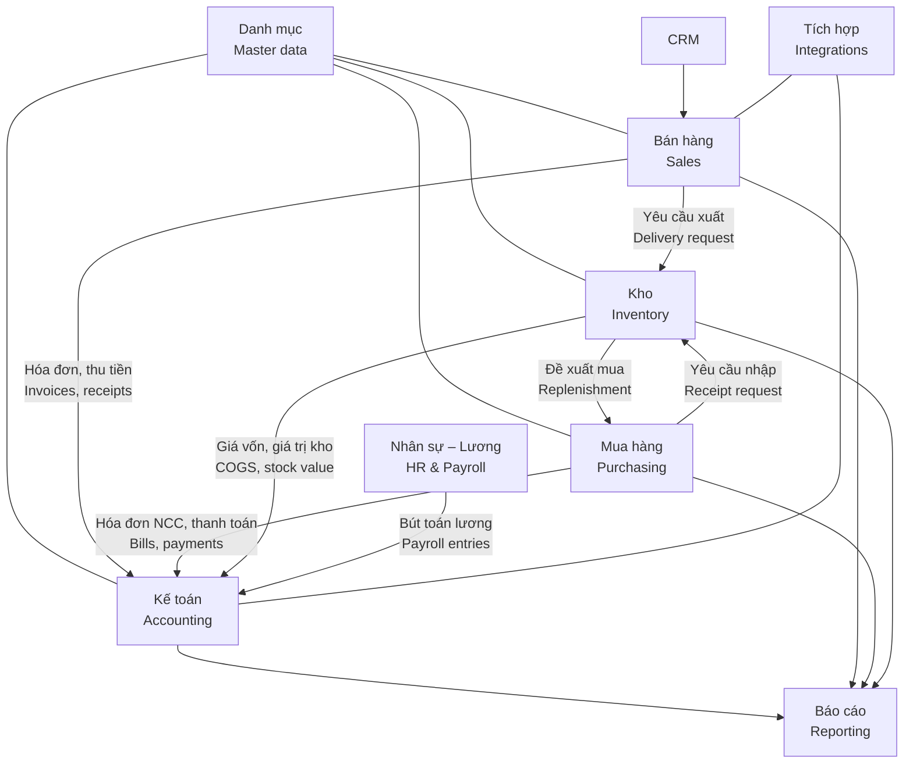

# 00 · Tổng quan dự án / Project Overview

[← Mục lục / Index](../README.md)

---

## 1. Mục đích tài liệu / Purpose of this document

- **VI:** Tài liệu này mô tả bối cảnh, mục tiêu, phạm vi, giả định, ràng buộc và lộ trình triển khai hệ thống ERP. Đây là cơ sở để ban giám đốc, người dùng nghiệp vụ, đội phát triển và đội kiểm thử thống nhất về những gì hệ thống cần làm.
- **EN:** This document describes the background, objectives, scope, assumptions, constraints and delivery roadmap of the ERP system. It is the baseline for management, business users, developers and QA to agree on what the system must do.

## 2. Bối cảnh / Background

- **VI:** Doanh nghiệp hiện quản lý bán hàng, mua hàng, kho và kế toán trên nhiều công cụ rời rạc (Excel, phần mềm kế toán riêng lẻ, email, Zalo). Dữ liệu bị nhập lặp lại nhiều lần, khó đối chiếu giữa các bộ phận, báo cáo quản trị chậm và thiếu kiểm soát nội bộ (phê duyệt, phân quyền, nhật ký thay đổi).
- **EN:** The company currently manages sales, purchasing, inventory and accounting across disconnected tools (Excel, a standalone accounting package, email, Zalo). Data is re-entered several times, hard to reconcile across departments, management reporting is slow, and internal controls (approvals, permissions, change history) are weak.

> Bối cảnh trên là giả định ban đầu, cần xác nhận với ban giám đốc.
> The background above is an initial assumption to be confirmed with management.

## 3. Mục tiêu kinh doanh / Business objectives

| # | Mục tiêu (VI) | Objective (EN) | Chỉ số đề xuất / Proposed KPI |
|---|---|---|---|
| O-1 | Hợp nhất dữ liệu trên một nền tảng duy nhất | Single source of truth on one platform | 100% chứng từ mua, bán, kho, kế toán được lập trên ERP / 100% of purchasing, sales, inventory and accounting documents created in the ERP |
| O-2 | Rút ngắn thời gian xử lý đơn hàng | Shorter order processing time | Giảm ≥ 30% so với hiện tại / ≥ 30% reduction vs. today |
| O-3 | Rút ngắn thời gian khóa sổ tháng | Faster month-end close | ≤ 5 ngày làm việc / ≤ 5 working days |
| O-4 | Tồn kho chính xác | Accurate inventory | Độ chính xác ≥ 98% khi kiểm kê / ≥ 98% accuracy at stock count |
| O-5 | Báo cáo quản trị theo thời gian thực | Real-time management reporting | Số liệu cập nhật ngay khi chứng từ được ghi sổ / Figures updated as soon as documents are posted |
| O-6 | Tuân thủ quy định kế toán & thuế Việt Nam | Compliance with Vietnamese accounting & tax rules | 100% hóa đơn bán ra là HĐĐT hợp lệ; BCTC lập trực tiếp từ hệ thống / 100% valid e-invoices; financial statements produced directly from the system |
| O-7 | Tăng cường kiểm soát nội bộ | Stronger internal control | 100% chứng từ trọng yếu có luồng duyệt và nhật ký / 100% of key documents have approval flow and audit trail |

> Giá trị KPI là đề xuất, cần ban giám đốc chốt.
> KPI targets are proposals to be confirmed by management.

## 4. Phạm vi / Scope

### 4.1 Trong phạm vi / In scope

| Phân hệ / Module | Mã / Code | Chức năng chính (VI) | Key features (EN) | Giai đoạn / Phase |
|---|---|---|---|---|
| Quản trị hệ thống / System administration | SYS | Cơ cấu tổ chức, người dùng, phân quyền, luồng duyệt, đánh số chứng từ, nhật ký, mẫu in | Org structure, users, permissions, approval flows, document numbering, audit log, print templates | P1 – P11 |
| Dữ liệu danh mục / Master data | MDM | Sản phẩm, đối tác, kho, tiền tệ, thuế, điều khoản thanh toán | Products, business partners, warehouses, currencies, taxes, payment terms | P2 – P11 |
| Bán hàng / Sales | SAL | Báo giá, đơn bán hàng, giao hàng, hóa đơn, trả hàng, khuyến mãi | Quotations, sales orders, delivery, invoicing, returns, promotions | P5 – P11 |
| Mua hàng / Purchasing | PUR | Đề nghị mua, yêu cầu báo giá, đơn mua, nhận hàng, đối chiếu 3 chiều, trả hàng | Purchase requests, RFQs, POs, receiving, 3-way match, returns | P4 – P11 |
| Kho / Inventory | INV | Đa kho, nhập/xuất/chuyển kho, lô/serial, kiểm kê, tính giá xuất kho | Multi-warehouse, receipts/issues/transfers, lot/serial, stock count, inventory valuation | P3 – P11 |
| Kế toán – Tài chính / Accounting & Finance | ACC | Sổ cái, phải thu, phải trả, tiền & ngân hàng, thuế, BCTC; TSCĐ & CCDC | GL, AR, AP, cash & bank, tax, financial statements; fixed assets & tools | P2 (năm tài chính / fiscal years) · P6 (công nợ, tiền / AR, AP, cash) · P9 (sổ cái, thuế, BCTC / GL, tax, statements) · P10 (TSCĐ / FA) · P11 (ngân sách / budget) |
| Nhân sự – Tiền lương / HR & Payroll | HRM | Hồ sơ nhân sự, hợp đồng, chấm công, nghỉ phép, tính lương, bảo hiểm, thuế TNCN | Employee records, contracts, attendance, leave, payroll, social insurance, PIT | P10 – P11 |
| Quản lý khách hàng / CRM | CRM | Khách hàng tiềm năng, cơ hội, hoạt động, chăm sóc khách hàng | Leads, opportunities, activities, customer care | P10 – P11 |
| Báo cáo / Reporting | RPT | Dashboard theo vai trò, báo cáo chuẩn, xuất Excel/PDF | Role-based dashboards, standard reports, Excel/PDF export | P3 – P11 |
| Tích hợp / Integrations | INT | HĐĐT, ngân hàng, email, API, sàn TMĐT, vận chuyển | E-invoice, banks, email, API, marketplaces, carriers | P1 – P11 |

- **VI:** Yêu cầu được sắp theo thư mục giai đoạn (`docs/phase-NN-…`). Trong mỗi thư mục, mỗi phân hệ có một tệp chỉ chứa phần việc của giai đoạn đó; phần giới thiệu phân hệ (mục tiêu, quy trình, trạng thái chứng từ, câu hỏi mở) nằm ở giai đoạn đầu tiên của phân hệ.
- **EN:** Requirements are organized in phase folders (`docs/phase-NN-…`). Inside each folder, every module has one file holding only that phase's work; the module introduction (objectives, process, document statuses, open questions) lives in the module's first phase.

### 4.2 Ngoài phạm vi / Out of scope

| # | Hạng mục (VI) | Item (EN) | Ghi chú / Note |
|---|---|---|---|
| X-1 | **Sản xuất**: định mức nguyên vật liệu (BOM), hoạch định nhu cầu vật tư (MRP), lệnh sản xuất, quy trình công đoạn, quản lý xưởng, tính giá thành sản xuất, QC sản xuất | **Manufacturing**: BOM, MRP, work orders, routings, shop floor control, production costing, production QC | Dự án riêng trong tương lai / Separate future project |
| X-2 | Bán lẻ tại quầy (POS) | Retail point of sale (POS) | Có thể xem xét ở P11 / May be considered in P11 |
| X-3 | Website thương mại điện tử | E-commerce storefront | Chỉ tích hợp sàn TMĐT ở P11 / Only marketplace integration in P11 |
| X-4 | Quản lý dự án & chấm công theo dự án (timesheet) | Project management & timesheets | — |
| X-5 | Dịch vụ hiện trường, bảo hành, bảo trì | Field service, warranty, maintenance | — |
| X-6 | Quản lý vận tải & đội xe (TMS) | Transport & fleet management (TMS) | — |
| X-7 | Quản lý kho nâng cao (wave picking, robot, kho tự động) | Advanced WMS (wave picking, robotics, automated storage) | — |
| X-8 | Hợp nhất báo cáo tài chính tập đoàn | Group financial consolidation | — |
| X-9 | Email marketing / tự động hóa marketing | Email marketing / marketing automation | — |
| X-10 | Quản lý nhiều công ty (pháp nhân) trên cùng hệ thống | Managing multiple companies (legal entities) on one system | Hệ thống chỉ phục vụ một công ty / The system serves a single company |

- **VI:** Dù chưa làm Sản xuất, mô hình dữ liệu sản phẩm, kho và giá vốn phải được thiết kế để có thể bổ sung phân hệ Sản xuất sau này mà không phải thiết kế lại (xem `NFR-MNT-002`).
- **EN:** Although Manufacturing is out of scope, the product, inventory and costing data model must be designed so that a Manufacturing module can be added later without redesign (see `NFR-MNT-002`).

## 5. Giả định / Assumptions

| # | Giả định (VI) | Assumption (EN) |
|---|---|---|
| A-01 | Doanh nghiệp hoạt động tại Việt Nam, lĩnh vực thương mại – phân phối và dịch vụ. | The company operates in Vietnam in trading/distribution and services. |
| A-02 | Một công ty (một pháp nhân), nhiều chi nhánh và nhiều kho; hệ thống không hỗ trợ nhiều công ty. | A single company (one legal entity) with multiple branches and warehouses; the system does not support multiple companies. |
| A-03 | Khoảng 300 người dùng, tối đa 100 người dùng đồng thời trong 3 năm đầu. | About 300 named users, up to 100 concurrent users in the first 3 years. |
| A-04 | Đồng tiền hạch toán là VND; có giao dịch bằng ngoại tệ (USD, EUR, …). | Functional currency is VND; foreign-currency transactions exist (USD, EUR, …). |
| A-05 | Áp dụng chế độ kế toán doanh nghiệp hiện hành: Thông tư 99/2025/TT-BTC (thay thế Thông tư 200/2014/TT-BTC từ 01/01/2026) hoặc Thông tư 133/2016/TT-BTC cho doanh nghiệp nhỏ và vừa; chọn trong thông tin doanh nghiệp. | The current Vietnamese enterprise accounting regime applies: Circular 99/2025/TT-BTC (replacing Circular 200/2014/TT-BTC from 2026-01-01) or Circular 133/2016/TT-BTC for SMEs; selected in the company profile. |
| A-06 | Doanh nghiệp sử dụng hóa đơn điện tử qua một nhà cung cấp dịch vụ HĐĐT có API. | The company issues e-invoices through an e-invoice service provider that offers an API. |
| A-07 | Hệ thống triển khai trên cloud, người dùng truy cập qua trình duyệt web. | The system is cloud-hosted and accessed through a web browser. |
| A-08 | Dữ liệu đầu kỳ (danh mục, tồn kho, công nợ, số dư tài khoản) được chuyển từ hệ thống cũ qua mẫu Excel. | Opening data (master data, stock, open AR/AP, account balances) is migrated from legacy systems via Excel templates. |

> Các tham chiếu pháp lý cần được kế toán trưởng / tư vấn thuế xác nhận lại tại thời điểm triển khai.
> Legal references must be re-validated by the chief accountant / tax advisor at implementation time.

## 6. Ràng buộc / Constraints

| # | Ràng buộc (VI) | Constraint (EN) |
|---|---|---|
| C-01 | Giao diện và tên danh mục hỗ trợ song ngữ Việt – Anh. | UI and master-data names support Vietnamese and English. |
| C-02 | Tuân thủ pháp luật Việt Nam về kế toán, thuế, hóa đơn điện tử và bảo vệ dữ liệu cá nhân. | Comply with Vietnamese law on accounting, tax, e-invoicing and personal data protection. |
| C-03 | Chứng từ và sổ kế toán được lưu trữ tối thiểu 10 năm theo Luật Kế toán. | Accounting documents and books are retained for at least 10 years under the Law on Accounting. |
| C-04 | Công nghệ: Node.js (Express), Next.js, Tailwind CSS, PostgreSQL (chi tiết tại [12 · NFR](12-non-functional.md), mục 11). | Technology: Node.js (Express), Next.js, Tailwind CSS, PostgreSQL (details in [12 · NFR](12-non-functional.md), section 11). |

## 7. Các bên liên quan / Stakeholders

| Bên liên quan (VI) | Stakeholder (EN) | Vai trò trong dự án / Role in the project |
|---|---|---|
| Ban giám đốc | Executive board | Nhà tài trợ dự án, duyệt phạm vi & ngân sách / Project sponsor, approves scope & budget |
| Kế toán trưởng | Chief accountant | Chủ sở hữu nghiệp vụ kế toán – thuế / Owner of accounting & tax processes |
| Trưởng phòng kinh doanh | Sales manager | Chủ sở hữu nghiệp vụ bán hàng & CRM / Owner of sales & CRM processes |
| Trưởng phòng mua hàng | Purchasing manager | Chủ sở hữu nghiệp vụ mua hàng / Owner of purchasing processes |
| Quản lý kho | Warehouse manager | Chủ sở hữu nghiệp vụ kho / Owner of inventory processes |
| Trưởng phòng nhân sự | HR manager | Chủ sở hữu nghiệp vụ nhân sự – tiền lương / Owner of HR & payroll processes |
| Bộ phận IT | IT department | Hạ tầng, bảo mật, quản trị hệ thống / Infrastructure, security, system administration |
| Đội dự án (PM, BA, Dev, QA) | Project team (PM, BA, Dev, QA) | Phân tích, xây dựng, kiểm thử, triển khai / Analysis, build, test, rollout |

## 8. Quy trình nghiệp vụ tổng thể / End-to-end business processes

### 8.1 Bán hàng – Thu tiền / Order-to-Cash (O2C)

### 8.2 Mua hàng – Thanh toán / Procure-to-Pay (P2P)

### 8.3 Ghi nhận – Báo cáo / Record-to-Report (R2R)

### 8.4 Sơ đồ liên kết phân hệ / Module integration map

## 9. Lộ trình triển khai / Roadmap

| Giai đoạn / Phase | Phạm vi (VI) | Scope (EN) | Điều kiện hoàn thành / Exit criteria |
|---|---|---|---|
| [**P1 — Nền tảng / Foundation**](../phase-01-foundation/README.md) | Thiết lập dự án (cấu trúc mã nguồn, CI, cơ sở dữ liệu & migration, cấu hình môi trường) và triển khai tự động lên môi trường dev / staging; người dùng, đăng nhập / đăng xuất, đổi mật khẩu; vai trò và quyền theo ma trận chức năng × hành động | Project setup (code layout, CI, database & migrations, environment configuration) and automated deployment to dev / staging; users, sign-in / sign-out, password change; roles and permissions as a function × action matrix | CI chạy lint, test, build; mỗi lần merge tự triển khai lên dev / staging; quản trị viên tạo người dùng, vai trò và gán quyền; người dùng đăng nhập, đăng xuất, đổi mật khẩu; mọi API từ chối thao tác không có quyền / CI runs lint, test and build; every merge deploys to dev / staging automatically; administrators create users and roles and grant permissions; users sign in, sign out and change passwords; every API rejects unauthorized actions |
| [**P2 — Tổ chức & danh mục / Organization & master data**](../phase-02-organization-master-data/README.md) | Vai trò nghiệp vụ & ma trận quyền mặc định; thông tin doanh nghiệp, chi nhánh, phòng ban, năm tài chính & kỳ kế toán, tham số hệ thống; sản phẩm, đối tác, kho, tiền tệ, thuế, điều khoản thanh toán, bảng giá bán; tìm kiếm | Business roles & default permission matrix; company profile, branches, departments, fiscal years & periods, system parameters; products, partners, warehouses, currencies, taxes, payment terms, sales price lists; search | Cơ cấu tổ chức và danh mục được khai báo đầy đủ; quy tắc nghiệp vụ danh mục có kiểm thử tự động / Organization and master data are fully set up; master-data business rules are covered by automated tests |
| [**P3 — Kho cơ bản / Basic inventory**](../phase-03-inventory/README.md) | Phiếu nhập, xuất, chuyển kho, kiểm kê, tồn kho theo kho, giá bình quân gia quyền, báo cáo kho; đánh số chứng từ, mẫu in mặc định; đính kèm & lưu trữ tệp | Receipts, issues, transfers, stock counts, on-hand stock per warehouse, weighted-average costing, inventory reports; document numbering, default print templates; attachments & file storage | Nghiệp vụ kho chạy thông trên dữ liệu thử; báo cáo nhập – xuất – tồn khớp với số liệu tính tay / Stock operations work end to end on test data; the stock movement report agrees with a manual calculation |
| [**P4 — Mua hàng cơ bản / Basic purchasing**](../phase-04-purchasing/README.md) | Đơn mua, nhận hàng theo đơn mua, hóa đơn nhà cung cấp, trả hàng nhà cung cấp, báo cáo mua hàng | Purchase orders, receiving against POs, vendor bills, supplier returns, purchasing reports | Luồng đơn mua → nhận hàng → hóa đơn NCC → trả hàng chạy thông trên dữ liệu thử / The PO → receipt → vendor bill → return flow works end to end on test data |
| [**P5 — Bán hàng cơ bản / Basic sales**](../phase-05-sales/README.md) | Báo giá, đơn bán hàng, giao hàng, hóa đơn (ghi số HĐĐT phát hành trên cổng nhà cung cấp), trả hàng, báo cáo bán hàng | Quotations, sales orders, deliveries, invoices (recording e-invoice numbers issued on the provider's portal), returns, sales reports | Luồng báo giá → đơn bán → giao hàng → hóa đơn → trả hàng chạy thông trên dữ liệu thử / The quotation → order → delivery → invoice → return flow works end to end on test data |
| [**P6 — Công nợ & thu chi / Receivables, payables & cash**](../phase-06-receivables-payables-cash/README.md) · go-live vận hành / operations go-live | Số dư đầu kỳ, nhập / xuất Excel & chuyển đổi dữ liệu; công nợ phải thu / phải trả, thu tiền & cấn trừ, tuổi nợ; phiếu thu / chi, giao dịch ngân hàng, sổ quỹ & sổ tiền gửi. Sổ cái, thuế, BCTC vẫn làm trên phần mềm kế toán hiện tại | Opening balances, Excel import / export & data migration; AR / AP, receipts & allocation, aging; cash receipts / payments, bank transactions, cash & bank books. GL, tax and financial statements stay in the current accounting software | Danh mục và số dư đầu kỳ được chuyển đổi và đối chiếu khớp; mua – bán – kho – công nợ – thu chi vận hành trên ERP trong 1 tháng; tồn kho và công nợ khớp với kiểm kê và đối chiếu / Master data and opening balances are migrated and reconciled; purchasing, sales, inventory, AR/AP and cash run in the ERP for one month; stock and balances agree with the physical count and reconciliations |
| [**P7 — Phê duyệt & kiểm soát / Approvals & controls**](../phase-07-approvals-controls/README.md) | Duyệt một cấp và luồng duyệt nhiều cấp có điều kiện; hạn mức, quyền theo trường, phạm vi dữ liệu (của tôi / toàn công ty / phòng ban / chi nhánh / kho / quỹ), phân tách nhiệm vụ; kiểm tra hạn mức công nợ, giá bán tối thiểu; xác thực hai lớp, quản lý phiên; thông báo; hoàn thiện tài khoản & phân quyền (quên mật khẩu qua email, khóa tài khoản, lịch sử mật khẩu, đăng xuất mọi thiết bị, sao chép vai trò, nhật ký kiểm toán, chuyển ngôn ngữ theo người dùng) | Single-level approval and multi-level conditional flows; limits, field-level permissions, data scope (own / all / department / branch / warehouse / cash fund), segregation of duties; credit limit check, minimum selling price; MFA, session management; notifications; account & access completion (forgot password by email, lockout, password history, sign-out from all devices, role cloning, audit log, per-user language switching) | Luồng duyệt được bật cho các chứng từ trọng yếu; bộ kiểm thử phân quyền (phạm vi dữ liệu, hạn mức, quyền theo trường, phân tách nhiệm vụ) đạt / Approval flows are on for key documents; the permission test suite (data scope, limits, field-level, segregation of duties) passes |
| [**P8 — Hoàn thiện mua – bán – kho / Operations completion**](../phase-08-operations-completion/README.md) | Lô / hạn dùng, serial, giữ hàng, chuyển kho hai bước, vị trí kho, FIFO; đề nghị mua, bảng giá mua, dung sai nhận hàng; phiên bản báo giá, tiền đặt cọc, chiết khấu tổng đơn; mẫu email, tùy chỉnh mẫu in, truy ngược chứng từ | Lots / expiry, serials, reservations, two-step transfers, bin locations, FIFO; purchase requests, supplier price lists, receiving tolerance; quotation revisions, deposits, order-level discounts; email templates, print template customization, drill-down | Các tính năng trên vận hành trên ERP trong 1 tháng; tồn kho theo lô khớp với kiểm kê / The features above run in the ERP for one month; stock by lot agrees with the physical count |
| [**P9 — Kế toán đầy đủ & HĐĐT / Full accounting & e-invoicing**](../phase-09-accounting-einvoicing/README.md) · go-live kế toán / accounting go-live | Hệ thống tài khoản, hạch toán tự động, bút toán, kết chuyển, khóa sổ; chênh lệch tỷ giá; đối chiếu 3 chiều, chi phí mua hàng, hàng nhập khẩu; đề nghị thanh toán, tạm ứng, đối chiếu ngân hàng; thuế GTGT, BCTC; tích hợp HĐĐT; dashboard theo vai trò | Chart of accounts, automatic posting, journal entries, closing entries, period lock; FX differences; 3-way match, landed cost, imports; payment requests, advances, bank reconciliation; VAT, financial statements; e-invoice integration; role-based dashboards | Vận hành song song 1 kỳ kế toán và khóa sổ thành công trên ERP; HĐĐT phát hành trực tiếp từ ERP / One accounting period run in parallel and closed successfully in the ERP; e-invoices issued directly from the ERP |
| [**P10 — Mở rộng / Expansion**](../phase-10-expansion/README.md) | HRM, CRM, TSCĐ & CCDC, khuyến mãi, yêu cầu báo giá, quét mã vạch, dashboard nâng cao, REST API công khai | HRM, CRM, fixed assets & tools, promotions, RFQs, barcode scanning, advanced dashboards, public REST API | Tính lương 1 kỳ trên ERP; dashboard điều hành được ban giám đốc sử dụng / One payroll run in the ERP; executive dashboard in use by management |
| [**P11 — Nâng cao / Advanced**](../phase-11-advanced/README.md) | Open API ngân hàng, sàn TMĐT, đơn vị vận chuyển, báo cáo tùy biến / BI, ngân sách, cổng nhân viên, ứng dụng di động và các tính năng "có thì tốt" | Bank Open API, marketplaces, carriers, custom reports / BI, budgeting, employee portal, mobile app and other nice-to-have features | Theo kế hoạch chi tiết từng hạng mục / Per item plan |

- **VI:** Các giai đoạn được sắp theo thứ tự phụ thuộc: giai đoạn sau dùng kết quả của giai đoạn trước. P1 – P5 là các mốc nội bộ, nghiệm thu trên dữ liệu thử; doanh nghiệp bắt đầu dùng ERP thật từ P6.
- **EN:** Phases are ordered by dependency: each phase builds on the previous ones. P1 – P5 are internal milestones accepted on test data; the company starts using the ERP for real from P6.
- **VI:** Từ P3 đến P6 chưa có luồng duyệt: chứng từ được xác nhận trực tiếp bởi người có quyền; các bước cần kiểm soát (ví dụ điều chỉnh kiểm kê) chỉ người có quyền Duyệt thực hiện được. Luồng duyệt được bổ sung ở P7 (xem [P3 · 02 · Quản trị hệ thống](../phase-03-inventory/02-system-administration.md)).
- **EN:** From P3 to P6 there are no approval flows: documents are confirmed directly by users with the right permission; controlled steps (e.g. count adjustments) can only be performed by users holding the Approve permission. Approval flows are added in P7 (see [P3 · 02 · System administration](../phase-03-inventory/02-system-administration.md)).
- **VI:** So với v0.3: P1 cũ được tách thành P1 – P6 và duyệt một cấp dời sang P7; P2 cũ được tách thành P7 (kiểm soát), P8 (hoàn thiện mua – bán – kho) và P9 (kế toán & HĐĐT); P3, P4 cũ thành P10, P11.
- **EN:** Compared with v0.3: the old P1 is split into P1 – P6 and single-level approval moves to P7; the old P2 is split into P7 (controls), P8 (operations completion) and P9 (accounting & e-invoicing); the old P3 and P4 become P10 and P11.

> Mốc thời gian cụ thể sẽ được xác định sau khi chốt phạm vi P1 – P6.
> Dates will be set after the P1 – P6 scope is frozen.

## 10. Câu hỏi mở / Open questions

| # | Câu hỏi (VI) | Question (EN) | Ảnh hưởng / Impacts |
|---|---|---|---|
| Q-01 | Ngành hàng cụ thể và đặc thù (FMCG, dược, vật liệu xây dựng, thiết bị…)? | Specific industry and its particulars (FMCG, pharma, building materials, equipment…)? | MDM, INV (lô/hạn dùng / lot/expiry) |
| Q-02 | Số chi nhánh, kho hiện tại và dự kiến? | Current and planned number of branches and warehouses? | SYS, ACC, INV |
| Q-03 | Áp dụng Thông tư 99/2025 hay Thông tư 133/2016? | Circular 99/2025 or Circular 133/2016? | ACC |
| Q-04 | Phương pháp tính giá xuất kho (bình quân cuối kỳ, bình quân tức thời, FIFO, đích danh)? | Inventory costing method (periodic average, moving average, FIFO, specific identification)? | INV, ACC |
| Q-05 | Xuất hóa đơn theo số lượng đặt hay số lượng đã giao? | Invoice on ordered or delivered quantity? | SAL, ACC |
| Q-06 | Nhà cung cấp HĐĐT hiện tại là ai? | Who is the current e-invoice provider? | INT |
| Q-07 | Triển khai cloud hay tại chỗ (on-premise)? Có yêu cầu lưu dữ liệu tại Việt Nam? | Cloud or on-premise? Is data residency in Vietnam required? | NFR |
| Q-08 | Nhân sự – tiền lương có cần làm sớm hơn P10 không? | Should HR & payroll come earlier than P10? | Lộ trình / Roadmap |
| Q-09 | Có thiết bị cần tích hợp (máy chấm công, máy quét mã vạch, máy in nhãn)? | Any devices to integrate (time clocks, barcode scanners, label printers)? | INT, INV, HRM |
| Q-10 | Cần chuyển đổi bao nhiêu năm dữ liệu lịch sử? | How many years of historical data must be migrated? | Chuyển đổi dữ liệu / Data migration |
| Q-11 | Ngưỡng giá trị và các cấp duyệt cho từng loại chứng từ? | Value thresholds and approval levels for each document type? | SYS, SAL, PUR, ACC |
| Q-12 | Từ go-live vận hành (P6) đến P9, có chấp nhận tiếp tục dùng phần mềm kế toán hiện tại cho sổ cái, thuế, BCTC không? | From the operations go-live (P6) until P9, is it acceptable to keep using the current accounting software for GL, tax and financial statements? | ACC, Lộ trình / Roadmap |
| Q-13 | Có chấp nhận go-live vận hành (P6) khi chưa có luồng duyệt, nhật ký kiểm toán, quên mật khẩu và khóa tài khoản (P7), hay phải làm các mục này trước khi go-live? | Is an operations go-live (P6) acceptable before approval flows, the audit log, forgot password and lockout exist (P7), or must these be done before go-live? | SYS, Lộ trình / Roadmap |

## 11. Lịch sử phiên bản / Revision history

| Phiên bản / Version | Ngày / Date | Mô tả / Description | Người thực hiện / Author |
|---|---|---|---|
| 0.1 | 2026-10-04 | Khởi tạo bản nháp / Initial draft | — |
| 0.2 | 2026-10-05 | Chỉ phục vụ một công ty: bỏ quản lý nhiều công ty, gộp phạm vi dữ liệu `COMPANY` vào `ALL`, bỏ `company_id` khỏi mô hình dữ liệu / Single company only: removed multi-company management, merged data scope `COMPANY` into `ALL`, removed `company_id` from the data model | — |
| 0.3 | 2026-10-05 | Chia lại 4 giai đoạn: P1 tối thiểu (mua – bán – kho, công nợ, thu chi), P2 kế toán & kiểm soát, P3 mở rộng, P4 nâng cao; mỗi tài liệu phân hệ nhóm yêu cầu theo giai đoạn / Re-phased into 4 phases: minimal P1 (purchasing – sales – inventory, AR/AP, cash), P2 accounting & controls, P3 expansion, P4 advanced; each module document groups requirements by phase | — |
| 0.4 | 2026-10-06 | Chia nhỏ thành 11 giai đoạn theo thứ tự phụ thuộc: P1 chỉ có xác thực & phân quyền; P2 tổ chức & danh mục; P3 kho; P4 mua hàng; P5 bán hàng; P6 công nợ & thu chi (go-live vận hành); P7 phê duyệt & kiểm soát; P8 hoàn thiện mua – bán – kho; P9 kế toán & HĐĐT (go-live kế toán); P10, P11 là P3, P4 cũ / Split into 11 dependency-ordered phases: P1 authentication & authorization only; P2 organization & master data; P3 inventory; P4 purchasing; P5 sales; P6 AR/AP & cash (operations go-live); P7 approvals & controls; P8 operations completion; P9 accounting & e-invoicing (accounting go-live); P10 and P11 are the old P3 and P4 | — |
| 0.5 | 2026-10-06 | Tổ chức lại tài liệu theo thư mục giai đoạn; P1 thu gọn thành Nền tảng (thiết lập dự án, triển khai, đăng nhập, người dùng, vai trò & quyền), các tính năng tài khoản còn lại dời sang P2; NFR ghi rõ giai đoạn bắt đầu áp dụng / Reorganized the documents into phase folders; P1 reduced to Foundation (project setup, deployment, sign-in, users, roles & permissions), the remaining account features moved to P2; NFRs state the phase they start applying | — |
| 0.6 | 2026-10-08 | Đơn giản phân quyền P2: chỉ kiểm tra chức năng × hành động (Xem / Tạo / Sửa / Xóa), không có thì từ chối thao tác; phạm vi dữ liệu Của tôi / Toàn công ty và quyền Duyệt trên danh mục dời sang P7 / Simplified P2 authorization: only function × action is checked (View / Create / Edit / Delete) and operations without permission are rejected; Own / All data scope and approve rights on master data moved to P7 | — |
| 0.7 | 2026-10-08 | P2 tập trung vào tổ chức, danh mục và logic nghiệp vụ; phân quyền giữ ở mức hiện tại (P1 + vai trò nghiệp vụ & ma trận mặc định). Chuyển sang P7: quên mật khẩu, khóa tài khoản, lịch sử mật khẩu, đăng xuất mọi thiết bị, sao chép vai trò, nhật ký kiểm toán (`FR-SYS-029`, `BR-ROL-006`, `FR-MDM-024`), gửi email, chuyển ngôn ngữ theo người dùng / P2 focuses on organization, master data and business logic; authorization stays as is (P1 + business roles & default matrix). Moved to P7: forgot password, lockout, password history, sign-out from all devices, role cloning, the audit log (`FR-SYS-029`, `BR-ROL-006`, `FR-MDM-024`), email sending, per-user language switching | — |
| 0.8 | 2026-10-08 | P2 chỉ làm CRUD danh mục và quy tắc nghiệp vụ. Chuyển đính kèm & lưu trữ tệp (`FR-SYS-023`, `FR-INT-017`) sang P3; nhập / xuất Excel và công cụ chuyển đổi dữ liệu (`FR-SYS-026`, `FR-SYS-027`, `NFR-DAT-004`) sang P6; thông tin xác thực bên thứ ba (`FR-INT-021`) sang P7; các bảng liên quan vẫn tạo ở P2. Thêm chức năng `MDM.WAREHOUSE`, `MDM.FINANCE`, `ACC.FISCAL_PERIOD`, bảng chức năng của từng danh mục, quy tắc quyền trên đối tác, API danh sách chọn; nhập Excel dùng quyền Tạo / P2 covers master-data CRUD and business rules only. Moved attachments & file storage (`FR-SYS-023`, `FR-INT-017`) to P3; Excel import / export and data migration tooling (`FR-SYS-026`, `FR-SYS-027`, `NFR-DAT-004`) to P6; third-party credentials (`FR-INT-021`) to P7; the related tables are still created in P2. Added the `MDM.WAREHOUSE`, `MDM.FINANCE`, `ACC.FISCAL_PERIOD` functions, the function-per-table map, partner permission rules and pick-list APIs; Excel import uses the Create permission | — |
| 0.9 | 2026-10-09 | Cập nhật công nghệ theo mã nguồn: Express 5 thay NestJS, Knex thay TypeORM, Next.js (TypeScript) thay React (Vite), PostgreSQL 17, Node.js 22; thêm cột trạng thái Đã chốt / Đề xuất và nguyên tắc hạn chế thư viện bên thứ ba (`C-04`, NFR mục 11) / Aligned the technology stack with the codebase: Express 5 instead of NestJS, Knex instead of TypeORM, Next.js (TypeScript) instead of React (Vite), PostgreSQL 17, Node.js 22; added a Chosen / Proposed status column and the minimal third-party library rule (`C-04`, NFR section 11) | — |
