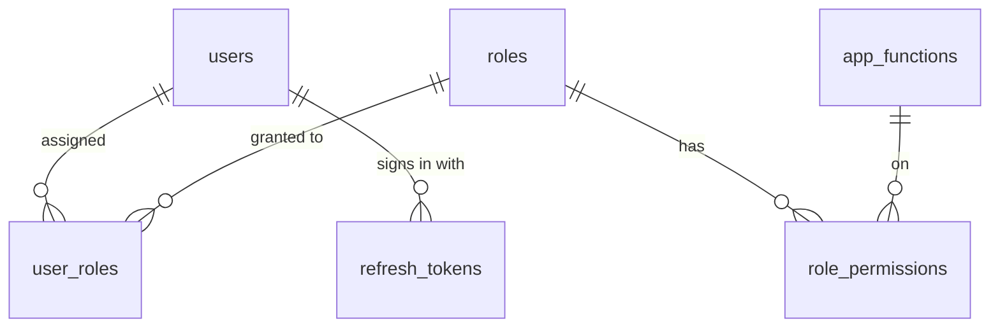

# 01 · Vai trò & Phân quyền / Roles & Permissions — Giai đoạn 1 / Phase 1

[← Giai đoạn 1 · Nền tảng / Phase 1 · Foundation](README.md)

Các giai đoạn khác của phân hệ / Other phases of this module: [P2](../phase-02-organization-master-data/01-roles-permissions.md) · [P3](../phase-03-inventory/01-roles-permissions.md) · [P4](../phase-04-purchasing/01-roles-permissions.md) · [P5](../phase-05-sales/01-roles-permissions.md) · [P6](../phase-06-receivables-payables-cash/01-roles-permissions.md) · [P7](../phase-07-approvals-controls/01-roles-permissions.md) · [P8](../phase-08-operations-completion/01-roles-permissions.md) · [P9](../phase-09-accounting-einvoicing/01-roles-permissions.md) · [P10](../phase-10-expansion/01-roles-permissions.md)

---

## Phạm vi giai đoạn / Phase scope

- **VI:** Phân quyền theo vai trò ở mức tối thiểu: vai trò được làm hành động nào trên chức năng nào. Chỉ có vai trò `ADM` và chức năng quản lý người dùng & vai trò.
- **EN:** Minimal role-based access control: which actions a role may perform on which function. Only the `ADM` role and the users & roles function exist.

## 1. Mô hình phân quyền / Permission model

- **VI:** Hệ thống áp dụng phân quyền theo vai trò (RBAC). Một người dùng có thể có nhiều vai trò; quyền hiệu lực là hợp của quyền các vai trò. Mọi kiểm tra quyền phải được thực hiện ở phía máy chủ.
- **EN:** The system uses role-based access control (RBAC). A user may hold several roles; effective permissions are the union of all role permissions. All permission checks must be enforced server-side.

| Thành phần (VI) | Component (EN) | Giá trị / Values |
|---|---|---|
| Chức năng | Function | Màn hình / nghiệp vụ, ví dụ "Người dùng & vai trò" / Screen or business function, e.g. "Users & roles" |
| Hành động | Action | Xem / View · Tạo / Create · Sửa / Edit · Xóa / Delete · Duyệt / Approve · Hủy / Cancel · In / Print · Xuất / Export · Nhập / Import |

- **VI:** Chưa làm ở P1: phạm vi dữ liệu (P2); hạn mức, quyền theo trường, phân tách nhiệm vụ (P7).
- **EN:** Not in P1: data scope (P2); limits, field-level permissions, segregation of duties (P7).

## 2. Vai trò mặc định / Default roles

| Mã / Code | Vai trò (VI) | Role (EN) |
|---|---|---|
| `ADM` | Quản trị hệ thống | System administrator |

- **VI:** Các vai trò mặc định khác được nạp ở giai đoạn có chức năng đầu tiên của chúng (xem [P2](../phase-02-organization-master-data/01-roles-permissions.md)). Quản trị viên có thể tự tạo thêm vai trò (`FR-SYS-011`).
- **EN:** The other default roles are seeded in the phase that delivers their first function (see [P2](../phase-02-organization-master-data/01-roles-permissions.md)). Administrators can create more roles themselves (`FR-SYS-011`).

## 3. Ma trận phân quyền mặc định / Default permission matrix

Ký hiệu / Legend: `V` Xem / View · `C` Tạo / Create · `E` Sửa / Edit · `D` Xóa / Delete

| Chức năng / Function | Mã / Code | ADM |
|---|---|---|
| Người dùng & vai trò / Users & roles | `SYS.USER_ROLE` | VCED |

## 4. Mô hình dữ liệu / Data model

- **VI:** Lược đồ đề xuất cho PostgreSQL 16 (xem [12 · NFR](../common/12-non-functional.md), mục 11). Đây là bản nháp, có thể thay đổi khi thiết kế chi tiết; các giai đoạn sau bổ sung cột và bảng bằng migration.
- **EN:** Proposed schema for PostgreSQL 16 (see [12 · NFR](../common/12-non-functional.md), section 11). This is a draft that may change during detailed design; later phases add columns and tables through migrations.

### 4.1 Sơ đồ quan hệ / Entity-relationship diagram



### 4.2 Danh sách bảng / Tables

| Bảng / Table | Mục đích (VI) | Purpose (EN) |
|---|---|---|
| `users` | Tài khoản người dùng. | User accounts. |
| `refresh_tokens` | Refresh token đã cấp (lưu dạng băm); dùng để xoay vòng, đăng xuất và thu hồi khi khóa người dùng (`BR-SYS-003`). | Issued refresh tokens (stored hashed); used for rotation, logout and revocation when a user is locked (`BR-SYS-003`). |
| `roles` | Vai trò: vai trò mặc định (`is_system = true`, không xóa, không đổi mã) và vai trò tùy chỉnh. | Roles: default roles (`is_system = true`, cannot be deleted or re-coded) plus custom roles. |
| `app_functions` | Danh mục chức năng — các hàng của ma trận mục 3. Khai báo trong mã nguồn, nạp bằng seed; người dùng không sửa. | Function catalog — the rows of the section 3 matrix. Defined in code and seeded; not user-editable. |
| `role_permissions` | Mỗi dòng là một ô chức năng × hành động được cấp cho vai trò. | One row per function × action granted to a role. |
| `user_roles` | Gán vai trò cho người dùng; một người dùng có thể có nhiều vai trò. | Assigns roles to users; a user may hold several roles. |

### 4.3 Tính quyền hiệu lực / Resolving effective permissions

| # | Quy tắc (VI) | Rule (EN) |
|---|---|---|
| 1 | Chỉ xét các vai trò đang hoạt động (`is_active = true`) được gán cho người dùng. | Only active roles (`is_active = true`) assigned to the user are considered. |
| 2 | Người dùng có quyền chức năng × hành động nếu ít nhất một vai trò có dòng `role_permissions` tương ứng. | A user holds a function × action if at least one of their roles has the matching `role_permissions` row. |

Ví dụ / Example — ô `ADM` × Người dùng & vai trò = `VCED` trở thành 4 dòng `role_permissions` / becomes 4 `role_permissions` rows:

| role | function_code | action |
|---|---|---|
| `ADM` | `SYS.USER_ROLE` | `VIEW` |
| `ADM` | `SYS.USER_ROLE` | `CREATE` |
| `ADM` | `SYS.USER_ROLE` | `EDIT` |
| `ADM` | `SYS.USER_ROLE` | `DELETE` |

### 4.4 DDL (PostgreSQL 16)

<details>
<summary>Xem DDL / Show DDL</summary>

```sql
CREATE TYPE permission_action AS ENUM ('VIEW','CREATE','EDIT','DELETE','APPROVE','CANCEL','PRINT','EXPORT','IMPORT');

CREATE TABLE users (
  id                   uuid         PRIMARY KEY DEFAULT gen_random_uuid(),
  username             varchar(50)  NOT NULL UNIQUE,
  email                varchar(255) NOT NULL UNIQUE,
  full_name            varchar(150) NOT NULL,
  password_hash        text         NOT NULL,  -- bcrypt / Argon2 (NFR-SEC-002)
  is_locked            boolean      NOT NULL DEFAULT false,
  password_changed_at  timestamptz,
  last_login_at        timestamptz,
  created_at           timestamptz  NOT NULL DEFAULT now(),
  created_by           uuid         REFERENCES users(id),
  updated_at           timestamptz  NOT NULL DEFAULT now(),
  updated_by           uuid         REFERENCES users(id)
);

-- Xoay vòng: mỗi lần làm mới, token cũ bị thu hồi và trỏ tới token mới
-- Rotation: each refresh revokes the old token and points it to its replacement
CREATE TABLE refresh_tokens (
  id              uuid         PRIMARY KEY DEFAULT gen_random_uuid(),
  user_id         uuid         NOT NULL REFERENCES users(id),
  token_hash      text         NOT NULL UNIQUE,
  expires_at      timestamptz  NOT NULL,
  revoked_at      timestamptz,
  replaced_by_id  uuid         REFERENCES refresh_tokens(id),
  created_at      timestamptz  NOT NULL DEFAULT now(),
  ip_address      inet,
  user_agent      text
);
CREATE INDEX ON refresh_tokens (user_id) WHERE revoked_at IS NULL;

CREATE TABLE roles (
  id           uuid         PRIMARY KEY DEFAULT gen_random_uuid(),
  code         varchar(20)  NOT NULL UNIQUE,
  name_vi      varchar(100) NOT NULL,
  name_en      varchar(100) NOT NULL,
  description  text,
  is_system    boolean      NOT NULL DEFAULT false,
  is_active    boolean      NOT NULL DEFAULT true,
  created_at   timestamptz  NOT NULL DEFAULT now(),
  created_by   uuid         REFERENCES users(id),
  updated_at   timestamptz  NOT NULL DEFAULT now(),
  updated_by   uuid         REFERENCES users(id)
);

-- Seed từ mã nguồn / seeded from code
CREATE TABLE app_functions (
  code               varchar(50)         PRIMARY KEY,
  module             varchar(10)         NOT NULL,
  name_vi            varchar(150)        NOT NULL,
  name_en            varchar(150)        NOT NULL,
  supported_actions  permission_action[] NOT NULL,
  sort_order         integer             NOT NULL DEFAULT 0,
  is_active          boolean             NOT NULL DEFAULT true
);

CREATE TABLE role_permissions (
  role_id        uuid              NOT NULL REFERENCES roles(id) ON DELETE CASCADE,
  function_code  varchar(50)       NOT NULL REFERENCES app_functions(code),
  action         permission_action NOT NULL,
  created_at     timestamptz       NOT NULL DEFAULT now(),
  created_by     uuid              REFERENCES users(id),
  PRIMARY KEY (role_id, function_code, action)
);

CREATE TABLE user_roles (
  user_id      uuid        NOT NULL REFERENCES users(id),
  role_id      uuid        NOT NULL REFERENCES roles(id),
  assigned_at  timestamptz NOT NULL DEFAULT now(),
  assigned_by  uuid        REFERENCES users(id),
  PRIMARY KEY (user_id, role_id)
);
CREATE INDEX ON user_roles (role_id);
```

</details>
