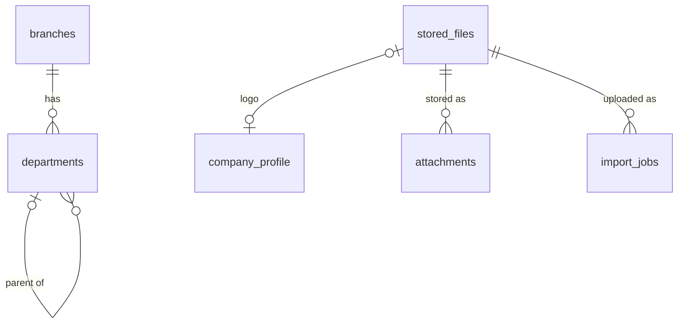

# 02 · Quản trị hệ thống / System Administration (SYS) — Giai đoạn 2 / Phase 2

[← Giai đoạn 2 · Tổ chức & danh mục / Phase 2 · Organization & master data](README.md)

Các giai đoạn khác của phân hệ / Other phases of this module: [P1](../phase-01-foundation/02-system-administration.md) · [P3](../phase-03-inventory/02-system-administration.md) · [P7](../phase-07-approvals-controls/02-system-administration.md) · [P8](../phase-08-operations-completion/02-system-administration.md) · [P9](../phase-09-accounting-einvoicing/02-system-administration.md) · [P10](../phase-10-expansion/02-system-administration.md) · [P11](../phase-11-advanced/02-system-administration.md)

---

## Phạm vi giai đoạn / Phase scope

- **VI:** Thông tin doanh nghiệp, chi nhánh, phòng ban; liên kết người dùng với nhân viên; tham số hệ thống; tên tiếng Anh trên danh mục; đính kèm, nhập / xuất Excel, tìm kiếm.
- **EN:** Company profile, branches, departments; linking users to employees; system parameters; English names on master data; attachments, Excel import / export, search.
- **VI:** Chuyển sang [P7](../phase-07-approvals-controls/02-system-administration.md): quên mật khẩu (`FR-SYS-007`), khóa tài khoản & lịch sử mật khẩu, đăng xuất mọi thiết bị, sao chép vai trò, nhật ký kiểm toán (`FR-SYS-029`), chuyển ngôn ngữ giao diện theo người dùng.
- **EN:** Moved to [P7](../phase-07-approvals-controls/02-system-administration.md): forgot password (`FR-SYS-007`), lockout & password history, sign-out from all devices, role cloning, audit log (`FR-SYS-029`), per-user UI language switching.

## 1. Mục tiêu / Objectives

- **VI:** Cung cấp nền tảng dùng chung cho mọi phân hệ: cơ cấu tổ chức, người dùng, xác thực, phân quyền, luồng phê duyệt, đánh số chứng từ, mẫu in, thông báo, nhập/xuất dữ liệu và nhật ký kiểm toán.
- **EN:** Provide the shared foundation for all modules: organization structure, users, authentication, authorization, approval workflows, document numbering, print templates, notifications, data import/export and audit logging.

## 2. Yêu cầu chức năng / Functional requirements

**Cơ cấu tổ chức / Organization structure**

#### FR-SYS-001 · Thông tin doanh nghiệp / Company profile
`Must` · `P2`

- **VI:** Hệ thống chỉ phục vụ một công ty (một pháp nhân); không có chức năng thêm, xóa hay chuyển đổi giữa các công ty. Quản trị viên cấu hình thông tin doanh nghiệp: tên, tên tiếng Anh, mã số thuế, địa chỉ, người đại diện pháp luật, logo, đồng tiền hạch toán, chế độ kế toán, năm tài chính. Thông tin này được dùng cho mẫu in, hóa đơn điện tử và báo cáo.
- **EN:** The system serves a single company (one legal entity); there is no function to add, delete or switch between companies. Administrators configure the company profile: name, English name, tax ID, address, legal representative, logo, functional currency, accounting regime and fiscal year. This profile is used on print templates, e-invoices and reports.

#### FR-SYS-002 · Quản lý chi nhánh / Manage branches
`Must` · `P2`

- **VI:** Doanh nghiệp có nhiều chi nhánh (mã, tên, địa chỉ, mã số thuế chi nhánh dạng 10-3 số nếu có, giám đốc chi nhánh). Chứng từ luôn gắn với một chi nhánh.
- **EN:** The company has multiple branches (code, name, address, branch tax ID in 10-3 format if any, branch manager). Every document belongs to one branch.

#### FR-SYS-003 · Quản lý phòng ban / Manage departments
`Must` · `P2`

- **VI:** Phòng ban được tổ chức dạng cây không giới hạn cấp, có trưởng bộ phận. Phòng ban dùng cho phân quyền dữ liệu, luồng duyệt và chiều phân tích chi phí.
- **EN:** Departments form an unlimited-depth tree with a department head. Departments drive data scope, approval routing and cost analysis dimensions.

**Cấu hình chung / General settings**

#### FR-SYS-020 · Tham số hệ thống / System parameters
`Must` · `P2`

- **VI:** Cấu hình: ngôn ngữ mặc định, múi giờ (mặc định Asia/Ho_Chi_Minh), định dạng ngày và số, số chữ số thập phân cho số lượng / đơn giá / thành tiền / tỷ giá, cho phép xuất âm kho, phương pháp tính giá xuất kho, chính sách xuất hóa đơn mặc định.
- **EN:** Configure: default language, time zone (default Asia/Ho_Chi_Minh), date and number formats, decimal places for quantity / unit price / amount / exchange rate, negative stock policy, inventory costing method, default invoicing policy.

**Tiện ích dùng chung / Common utilities**

#### FR-SYS-023 · Đính kèm tệp / Attachments
`Must` · `P2`

- **VI:** Đính kèm tệp (PDF, ảnh, Word, Excel, XML) vào mọi chứng từ và danh mục; tối đa 20 MB/tệp (cấu hình được); xem trước PDF và ảnh.
- **EN:** Attach files (PDF, images, Word, Excel, XML) to any document or master record; max 20 MB per file (configurable); preview PDFs and images.

#### FR-SYS-026 · Nhập dữ liệu từ Excel / Excel import
`Must` · `P2` (mở rộng / extended: `P8`)

- **VI:** Cung cấp mẫu Excel tải về cho danh mục và số dư đầu kỳ; kiểm tra dữ liệu và báo lỗi theo từng dòng; nhập là giao dịch toàn vẹn (lỗi thì không ghi dòng nào).
- **EN:** Provide downloadable Excel templates for master data and opening balances; validate and report errors per row; imports are all-or-nothing.

#### FR-SYS-027 · Xuất dữ liệu / Data export
`Must` · `P2`

- **VI:** Mọi danh sách xuất được ra Excel / CSV / PDF theo bộ lọc và cột đang hiển thị; người xuất phải có quyền Xem trên chức năng đó. Phạm vi dữ liệu và quyền theo trường áp dụng từ P7.
- **EN:** Every list can be exported to Excel / CSV / PDF using the current filters and visible columns; the user needs View on that function. Data scope and field-level permissions apply from P7.

#### FR-SYS-028 · Tìm kiếm & bộ lọc / Search & filters
`Must` · `P2` (mở rộng / extended: `P8`)

- **VI:** Tìm nhanh theo mã / tên; lọc theo các trường chính. Tìm kiếm tiếng Việt không phân biệt dấu (gõ "nguyen" tìm được "Nguyễn").
- **EN:** Quick search by code / name; filters on key fields. Vietnamese search is accent-insensitive (typing "nguyen" finds "Nguyễn").

#### FR-SYS-031 · Ngôn ngữ VI / EN / VI / EN language
`Must` · `P2` (mở rộng / extended: `P7`)

- **VI:** Danh mục chính (sản phẩm, đối tác, đơn vị tính, kho, thuế suất, phương thức thanh toán…) có trường tên tiếng Anh để in chứng từ tiếng Anh. Giao diện hiển thị theo ngôn ngữ mặc định trong tham số hệ thống (`FR-SYS-020`).
- **EN:** Key master data (products, partners, units of measure, warehouses, tax codes, payment methods…) has an English-name field for English printouts. The UI is shown in the default language from the system parameters (`FR-SYS-020`).

**Mở rộng yêu cầu của giai đoạn trước / Extensions to earlier-phase requirements**

| Mã / ID | Mở rộng (VI) | Extension (EN) |
|---|---|---|
| FR-SYS-004 | Liên kết người dùng với hồ sơ nhân viên (`FR-MDM-022`). | Link users to employee records (`FR-MDM-022`). |

## 3. Quy tắc nghiệp vụ / Business rules

| Mã / ID | Quy tắc (VI) | Rule (EN) | Giai đoạn / Phase |
|---|---|---|---|
| BR-SYS-002 | Danh mục đã phát sinh giao dịch không được xóa, chỉ được ngừng sử dụng. | Master data referenced by transactions cannot be deleted, only deactivated. | P2 |

## 4. Mô hình dữ liệu / Data model

- **VI:** Khối này khai báo các thành phần dùng chung cho mọi giai đoạn sau: extension, hàm tìm kiếm không dấu, domain số thập phân chính xác (`NFR-DAT-001`) và domain mã số thuế. Liên kết người dùng với nhân viên (`users.employee_id`, mở rộng `FR-SYS-004`) và khóa ngoại tới người phụ trách chi nhánh / phòng ban được thêm ở [03 · Dữ liệu danh mục](03-master-data.md), sau khi có bảng `employees`.
- **EN:** This block declares the building blocks shared by every later phase: extensions, the accent-insensitive search function, exact-decimal domains (`NFR-DAT-001`) and the tax ID domain. The user–employee link (`users.employee_id`, `FR-SYS-004` extension) and the foreign keys to branch / department managers are added in [03 · Master Data](03-master-data.md), once the `employees` table exists.



| Bảng / Table | Mục đích (VI) | Purpose (EN) |
|---|---|---|
| `company_profile` | Thông tin doanh nghiệp; luôn đúng một dòng (`FR-SYS-001`). | Company profile; always exactly one row (`FR-SYS-001`). |
| `branches` | Chi nhánh; `code` dùng trong số chứng từ (`FR-SYS-002`). | Branches; `code` is used in document numbers (`FR-SYS-002`). |
| `departments` | Phòng ban dạng cây (`FR-SYS-003`). | Department tree (`FR-SYS-003`). |
| `system_settings` | Tham số hệ thống dạng khóa – giá trị JSON (`FR-SYS-020`); giai đoạn sau thêm khóa bằng `INSERT`, không cần đổi lược đồ. | System parameters as key – JSON value (`FR-SYS-020`); later phases add keys with `INSERT`, without schema changes. |
| `attachments` | Đính kèm tệp vào mọi chứng từ / danh mục (`FR-SYS-023`). | Files attached to any document / master record (`FR-SYS-023`). |
| `import_jobs` | Lượt nhập Excel; nhập trong một giao dịch, lỗi theo dòng lưu ở `errors` (`FR-SYS-026`). | Excel import runs; one transaction per import, per-row errors in `errors` (`FR-SYS-026`). |

| Kiểu / Type | Định nghĩa / Definition |
|---|---|
| `dm_amount` | `numeric(20,4)` — số tiền / amounts |
| `dm_qty` | `numeric(18,4)` — số lượng / quantities |
| `dm_price` | `numeric(20,6)` — đơn giá / unit prices |
| `dm_rate` | `numeric(18,6)`, `> 0` — tỷ giá, hệ số / exchange rates, factors |
| `dm_pct` | `numeric(9,4)`, `0 – 100` — tỷ lệ % / percentages |
| `dm_tax_code` | 10 số, 10-3 số hoặc 12 số (`FR-MDM-012`) / 10 digits, 10-3 digits or 12 digits (`FR-MDM-012`) |

<details>
<summary>Xem DDL / Show DDL</summary>

```sql
-- Chạy sau / Run after: 11-integrations.md (P2)

CREATE EXTENSION IF NOT EXISTS unaccent;
CREATE EXTENSION IF NOT EXISTS pg_trgm;
CREATE EXTENSION IF NOT EXISTS btree_gist;  -- ràng buộc EXCLUDE trên khoảng ngày / EXCLUDE on date ranges

-- FR-SYS-028, NFR-L10N-004: unaccent() chỉ là STABLE nên phải bọc lại để dùng trong index
-- unaccent() is only STABLE, so it is wrapped to be usable in indexes
CREATE FUNCTION f_unaccent(text) RETURNS text
LANGUAGE sql IMMUTABLE PARALLEL SAFE STRICT
AS $$ SELECT public.unaccent('public.unaccent'::regdictionary, $1) $$;

-- NFR-DAT-001, BR-ACC-009: số thập phân chính xác, không dùng float
-- Exact decimals, never floating point
CREATE DOMAIN dm_amount AS numeric(20,4);
CREATE DOMAIN dm_qty    AS numeric(18,4);
CREATE DOMAIN dm_price  AS numeric(20,6);
CREATE DOMAIN dm_rate   AS numeric(18,6) CHECK (VALUE > 0);
CREATE DOMAIN dm_pct    AS numeric(9,4)  CHECK (VALUE BETWEEN 0 AND 100);

-- FR-MDM-012: kiểm tra định dạng; chữ số kiểm tra của MST 10 số được kiểm ở tầng ứng dụng
-- Format check only; the check digit of 10-digit tax IDs is validated in the application
CREATE DOMAIN dm_tax_code AS varchar(14)
  CHECK (VALUE ~ '^([0-9]{10}(-[0-9]{3})?|[0-9]{12})$');

CREATE TYPE accounting_regime AS ENUM ('TT99_2025','TT133_2016');

-- FR-SYS-001: một pháp nhân → bảng chỉ có một dòng (id luôn = true)
-- One legal entity → single-row table (id is always true)
CREATE TABLE company_profile (
  id                        boolean           PRIMARY KEY DEFAULT true CHECK (id),
  name                      varchar(255)      NOT NULL,
  name_en                   varchar(255),
  short_name                varchar(100),
  tax_code                  dm_tax_code       NOT NULL,
  address                   text              NOT NULL,
  address_en                text,
  phone                     varchar(30),
  email                     varchar(255),
  website                   varchar(255),
  legal_representative      varchar(150)      NOT NULL,
  representative_title      varchar(100),
  logo_file_id              uuid              REFERENCES stored_files(id),
  functional_currency_code  char(3)           NOT NULL DEFAULT 'VND',  -- FK thêm ở / FK added in 03-master-data
  accounting_regime         accounting_regime NOT NULL,
  fiscal_year_start_month   smallint          NOT NULL DEFAULT 1 CHECK (fiscal_year_start_month BETWEEN 1 AND 12),
  version                   integer           NOT NULL DEFAULT 1,
  created_at                timestamptz       NOT NULL DEFAULT now(),
  created_by                uuid              REFERENCES users(id),
  updated_at                timestamptz       NOT NULL DEFAULT now(),
  updated_by                uuid              REFERENCES users(id)
);

CREATE TABLE branches (
  id                   uuid         PRIMARY KEY DEFAULT gen_random_uuid(),
  code                 varchar(10)  NOT NULL UNIQUE,  -- vd / e.g. 'HN' trong / in SO-HN-2610-00001
  name                 varchar(255) NOT NULL,
  name_en              varchar(255),
  address              text,
  tax_code             dm_tax_code  CHECK (tax_code ~ '^[0-9]{10}-[0-9]{3}$'),
  manager_employee_id  uuid,                           -- FK thêm ở / FK added in 03-master-data
  is_active            boolean      NOT NULL DEFAULT true,
  version              integer      NOT NULL DEFAULT 1,
  created_at           timestamptz  NOT NULL DEFAULT now(),
  created_by           uuid         REFERENCES users(id),
  updated_at           timestamptz  NOT NULL DEFAULT now(),
  updated_by           uuid         REFERENCES users(id)
);

-- Cây không giới hạn cấp; lấy phòng ban con bằng WITH RECURSIVE theo parent_id
-- Unlimited-depth tree; fetch sub-departments with WITH RECURSIVE on parent_id
CREATE TABLE departments (
  id                uuid         PRIMARY KEY DEFAULT gen_random_uuid(),
  code              varchar(20)  NOT NULL UNIQUE,
  name              varchar(255) NOT NULL,
  name_en           varchar(255),
  parent_id         uuid         REFERENCES departments(id),
  branch_id         uuid         REFERENCES branches(id),  -- NULL = dùng chung / company-wide
  head_employee_id  uuid,                                  -- FK thêm ở / FK added in 03-master-data
  is_active         boolean      NOT NULL DEFAULT true,
  version           integer      NOT NULL DEFAULT 1,
  created_at        timestamptz  NOT NULL DEFAULT now(),
  created_by        uuid         REFERENCES users(id),
  updated_at        timestamptz  NOT NULL DEFAULT now(),
  updated_by        uuid         REFERENCES users(id),
  CHECK (parent_id <> id)
);
CREATE INDEX ON departments (parent_id);

CREATE TABLE system_settings (
  key          varchar(100) PRIMARY KEY,
  value        jsonb        NOT NULL,
  description  text,
  created_at   timestamptz  NOT NULL DEFAULT now(),
  created_by   uuid         REFERENCES users(id),
  updated_at   timestamptz  NOT NULL DEFAULT now(),
  updated_by   uuid         REFERENCES users(id)
);

INSERT INTO system_settings (key, value) VALUES
  ('general.default_language',        '"vi"'),
  ('general.timezone',                '"Asia/Ho_Chi_Minh"'),
  ('format.date',                     '"dd/MM/yyyy"'),
  ('format.number',                   '"vi"'),           -- 1.234.567,89
  ('decimals.quantity',               '3'),
  ('decimals.unit_price',             '2'),
  ('decimals.amount',                 '0'),              -- VND; ngoại tệ theo currencies.decimals
  ('decimals.exchange_rate',          '2'),
  ('inventory.allow_negative_stock',  'false'),
  ('inventory.costing_method',        '"AVG_PERIODIC"'), -- Q-04
  ('sales.invoice_policy',            '"DELIVERED"'),    -- 'ORDERED' | 'DELIVERED' (Q-05)
  ('attachments.max_size_mb',         '20'),
  ('attachments.allowed_types',       '["pdf","png","jpg","jpeg","doc","docx","xls","xlsx","xml"]');

CREATE TABLE attachments (
  id           uuid         PRIMARY KEY DEFAULT gen_random_uuid(),
  entity_type  varchar(50)  NOT NULL,  -- vd / e.g. 'product', 'partner', 'sales_order'
  entity_id    uuid         NOT NULL,
  file_id      uuid         NOT NULL REFERENCES stored_files(id),
  description  varchar(255),
  created_at   timestamptz  NOT NULL DEFAULT now(),
  created_by   uuid         REFERENCES users(id),
  updated_at   timestamptz  NOT NULL DEFAULT now(),
  updated_by   uuid         REFERENCES users(id)
);
CREATE INDEX ON attachments (entity_type, entity_id);

CREATE TYPE import_status AS ENUM ('UPLOADED','VALIDATING','VALIDATION_FAILED','IMPORTING','COMPLETED','FAILED');

CREATE TABLE import_jobs (
  id             uuid          PRIMARY KEY DEFAULT gen_random_uuid(),
  template_code  varchar(50)   NOT NULL,  -- vd / e.g. 'MDM.PRODUCT', 'OPENING_AR'
  file_id        uuid          NOT NULL REFERENCES stored_files(id),
  status         import_status NOT NULL DEFAULT 'UPLOADED',
  total_rows     integer,
  error_rows     integer,
  errors         jsonb,                   -- [{row, column, message_vi, message_en}]
  error_file_id  uuid          REFERENCES stored_files(id),  -- tệp Excel có đánh dấu lỗi / annotated error file
  started_at     timestamptz,
  finished_at    timestamptz,
  created_at     timestamptz   NOT NULL DEFAULT now(),
  created_by     uuid          REFERENCES users(id),
  updated_at     timestamptz   NOT NULL DEFAULT now(),
  updated_by     uuid          REFERENCES users(id)
);
```

</details>

## 5. Câu hỏi mở / Open questions

| # | Câu hỏi (VI) | Question (EN) |
|---|---|---|
| Q-SYS-01 | Mẫu đánh số chứng từ hiện tại của doanh nghiệp là gì, có cần giữ nguyên? | What numbering patterns are used today, and must they be kept? |
| Q-SYS-02 | Doanh nghiệp đang dùng Google Workspace hay Microsoft 365 (cho SSO và email)? | Does the company use Google Workspace or Microsoft 365 (for SSO and email)? |
