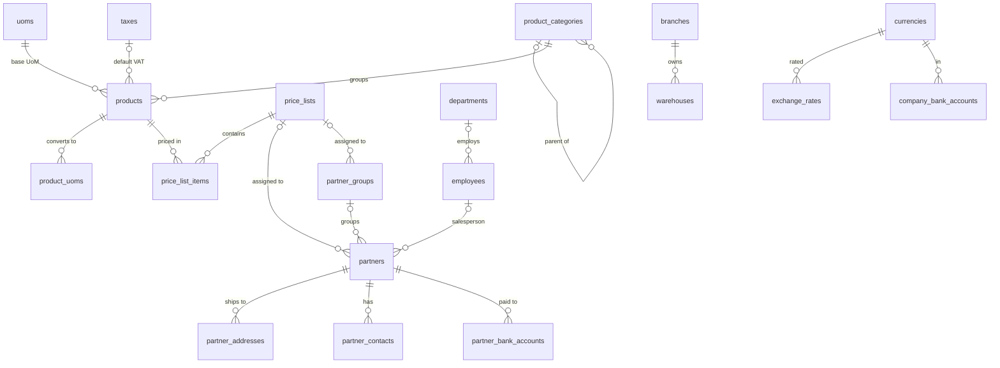

# 03 · Dữ liệu danh mục / Master Data (MDM) — Giai đoạn 2 / Phase 2

[← Giai đoạn 2 · Tổ chức & danh mục / Phase 2 · Organization & master data](README.md)

Các giai đoạn khác của phân hệ / Other phases of this module: [P7](../phase-07-approvals-controls/03-master-data.md) · [P8](../phase-08-operations-completion/03-master-data.md) · [P9](../phase-09-accounting-einvoicing/03-master-data.md) · [P11](../phase-11-advanced/03-master-data.md)

---

## Phạm vi giai đoạn / Phase scope

- **VI:** Sản phẩm, nhóm sản phẩm, đơn vị tính; khách hàng, nhà cung cấp, nhóm đối tác; tiền tệ & tỷ giá (nhập tay), thuế suất, điều khoản & phương thức thanh toán, tài khoản ngân hàng; kho, nhân viên cơ bản; bảng giá bán đơn giản.
- **EN:** Products, categories, units of measure; customers, suppliers, partner groups; currencies & rates (manual), tax codes, payment terms & methods, bank accounts; warehouses, basic employees; simple sales price lists.

## 1. Mục tiêu / Objectives

- **VI:** Quản lý tập trung, nhất quán các danh mục dùng chung cho mọi phân hệ: sản phẩm, đối tác (khách hàng, nhà cung cấp), kho, tiền tệ, thuế, điều khoản và phương thức thanh toán. Dữ liệu danh mục sạch là điều kiện tiên quyết để báo cáo chính xác.
- **EN:** Centrally and consistently manage master data shared by all modules: products, business partners (customers, suppliers), warehouses, currencies, taxes, payment terms and methods. Clean master data is a prerequisite for accurate reporting.

## 2. Yêu cầu chức năng / Functional requirements

**Sản phẩm / Products**

#### FR-MDM-001 · Hồ sơ sản phẩm / Product record
`Must` · `P2`

- **VI:** Hồ sơ sản phẩm gồm: mã, tên tiếng Việt, tên tiếng Anh, loại (hàng tồn kho / vật tư tiêu hao / dịch vụ), nhóm sản phẩm, đơn vị tính cơ bản, mã vạch, thương hiệu, quy cách, trọng lượng, kích thước, hình ảnh, thuế suất GTGT mặc định, giá bán và giá mua tham khảo, trạng thái (đang dùng / ngừng dùng).
- **EN:** A product record includes: code, Vietnamese name, English name, type (stockable / consumable / service), category, base unit of measure, barcode, brand, specification, weight, dimensions, images, default VAT rate, reference sales and purchase prices, status (active / inactive).

#### FR-MDM-002 · Nhóm sản phẩm dạng cây / Product category tree
`Must` · `P2`

- **VI:** Nhóm sản phẩm tổ chức dạng cây nhiều cấp; sản phẩm kế thừa từ nhóm các thiết lập mặc định (tài khoản kế toán, thuế suất, phương thức theo dõi lô/serial) nếu không khai báo riêng.
- **EN:** Categories form a multi-level tree; products inherit category defaults (GL accounts, tax rate, lot/serial tracking) unless overridden.

#### FR-MDM-003 · Đơn vị tính & quy đổi / Units of measure & conversion
`Must` · `P2`

- **VI:** Mỗi sản phẩm có một đơn vị tính cơ bản và nhiều đơn vị quy đổi (ví dụ 1 thùng = 24 chai). Có thể mua theo thùng, bán theo chai; tồn kho luôn lưu theo đơn vị cơ bản. Mỗi đơn vị quy đổi có thể có mã vạch riêng.
- **EN:** Each product has one base UoM and multiple conversion UoMs (e.g. 1 carton = 24 bottles). Products can be bought by carton and sold by bottle; stock is always stored in the base UoM. Each conversion UoM may have its own barcode.

**Đối tác: khách hàng & nhà cung cấp / Business partners: customers & suppliers**

#### FR-MDM-009 · Đối tác dùng chung / Unified business partner
`Must` · `P2`

- **VI:** Một đối tác có thể đồng thời là khách hàng và nhà cung cấp, dùng chung thông tin pháp lý; công nợ phải thu và phải trả được theo dõi riêng nhưng có thể bù trừ.
- **EN:** A partner can be both customer and supplier, sharing legal information; receivables and payables are tracked separately but can be netted off.

#### FR-MDM-010 · Hồ sơ khách hàng / Customer record
`Must` · `P2`

- **VI:** Mã, tên, loại (tổ chức / cá nhân), mã số thuế, địa chỉ xuất hóa đơn, nhiều địa chỉ giao hàng, nhiều người liên hệ, email nhận hóa đơn điện tử, nhóm khách hàng, nhân viên phụ trách, bảng giá, điều khoản thanh toán, hạn mức công nợ, số ngày nợ tối đa, tài khoản công nợ, tiền tệ giao dịch.
- **EN:** Code, name, type (organization / individual), tax ID, billing address, multiple shipping addresses, multiple contacts, e-invoice email, customer group, assigned salesperson, price list, payment terms, credit limit, maximum overdue days, receivable account, transaction currency.

#### FR-MDM-011 · Hồ sơ nhà cung cấp / Supplier record
`Must` · `P2`

- **VI:** Tương tự khách hàng, bổ sung: nhiều tài khoản ngân hàng, thời gian giao hàng mặc định, điều kiện giao hàng (Incoterms cho hàng nhập khẩu), tài khoản công nợ phải trả.
- **EN:** Same as customers, plus: multiple bank accounts, default lead time, delivery terms (Incoterms for imports), payable account.

#### FR-MDM-012 · Kiểm tra mã số thuế / Tax ID validation
`Must` · `P2`

- **VI:** Kiểm tra định dạng mã số thuế: 10 chữ số (doanh nghiệp), 10-3 chữ số (chi nhánh / đơn vị phụ thuộc), 12 chữ số (số định danh cá nhân dùng làm mã số thuế cá nhân). Tra cứu tên và địa chỉ từ mã số thuế qua dịch vụ bên ngoài là `Should`, `P10`.
- **EN:** Validate tax ID format: 10 digits (enterprise), 10-3 digits (branch / dependent unit), 12 digits (personal identification number used as personal tax ID). Looking up name and address by tax ID via an external service is `Should`, `P10`.

#### FR-MDM-014 · Nhóm đối tác / Partner groups
`Must` · `P2`

- **VI:** Phân nhóm khách hàng và nhà cung cấp (ví dụ đại lý, bán lẻ, dự án) để áp bảng giá, chính sách công nợ, báo cáo.
- **EN:** Group customers and suppliers (e.g. dealer, retail, project) to drive price lists, credit policies and reporting.

**Danh mục tài chính / Financial master data**

#### FR-MDM-016 · Tiền tệ & tỷ giá / Currencies & exchange rates
`Must` · `P2`

- **VI:** Khai báo tiền tệ (mã ISO, ký hiệu, số chữ số thập phân, cách đọc bằng chữ). Tỷ giá theo ngày, gồm tỷ giá mua, bán, chuyển khoản; nhập tay; nhập từ file khi có nhập Excel (`FR-SYS-026`, P6). Lấy tỷ giá tự động từ ngân hàng là `Could`, `P11`.
- **EN:** Define currencies (ISO code, symbol, decimals, amount-in-words wording). Daily exchange rates with buying, selling and transfer rates; entered manually; imported from file once Excel import exists (`FR-SYS-026`, P6). Automatic rate retrieval from banks is `Could`, `P11`.

#### FR-MDM-017 · Thuế suất / Tax codes
`Must` · `P2`

- **VI:** Danh mục thuế GTGT: 0%, 5%, 8%, 10%, không chịu thuế (KCT), không kê khai tính nộp thuế (KKKNT) và các mức khác theo quy định; mỗi thuế suất có ngày hiệu lực và tài khoản thuế đầu vào / đầu ra.
- **EN:** VAT codes: 0%, 5%, 8%, 10%, not subject to VAT (KCT), not declared (KKKNT) and other legal rates; each code has validity dates and input / output tax accounts.

#### FR-MDM-018 · Điều khoản thanh toán / Payment terms
`Must` · `P2` (mở rộng / extended: `P8`)

- **VI:** Hỗ trợ: thanh toán ngay, sau N ngày, cuối tháng + N ngày. Hạn thanh toán được tính tự động trên hóa đơn.
- **EN:** Support: immediate, net N days, end of month + N days. Due dates are computed automatically on invoices.

#### FR-MDM-019 · Phương thức thanh toán / Payment methods
`Must` · `P2`

- **VI:** Tiền mặt, chuyển khoản, thẻ, bù trừ công nợ; mỗi phương thức gắn với tài khoản tiền mặc định.
- **EN:** Cash, bank transfer, card, netting; each method maps to a default cash/bank account.

#### FR-MDM-020 · Tài khoản ngân hàng của công ty / Company bank accounts
`Must` · `P2`

- **VI:** Số tài khoản, ngân hàng, chi nhánh ngân hàng, tiền tệ, tài khoản kế toán tương ứng (TK 112x).
- **EN:** Account number, bank, bank branch, currency, mapped GL account (112x).

**Kho & danh mục khác / Warehouses & other master data**

#### FR-MDM-021 · Kho & vị trí / Warehouses & locations
`Must` · `P2` (mở rộng / extended: `P8`)

- **VI:** Kho có mã, tên, chi nhánh, địa chỉ, thủ kho, loại (thường / hàng đi đường / hàng gửi bán / hàng lỗi).
- **EN:** Warehouses have code, name, branch, address, keeper, type (normal / in-transit / consignment / defective).

#### FR-MDM-022 · Nhân viên cơ bản / Basic employee data
`Must` · `P2`

- **VI:** Danh mục nhân viên tối thiểu (mã, tên, phòng ban, chức danh, email, điện thoại) dùng cho nhân viên bán hàng, người nhận hàng, tạm ứng… Hồ sơ đầy đủ quản lý ở phân hệ Nhân sự (P10).
- **EN:** Minimal employee list (code, name, department, title, email, phone) used for salespeople, recipients, advances… Full records are managed in the HR module (P10).

**Bảng giá / Price lists**

#### FR-MDM-025 · Bảng giá bán / Sales price lists
`Must` · `P2` (mở rộng / extended: `P7`, `P8`)

- **VI:** Tạo nhiều bảng giá bán, áp dụng cho khách hàng hoặc nhóm khách hàng; mỗi dòng giá có sản phẩm, đơn vị tính, giá (gồm hoặc chưa gồm thuế), ngày hiệu lực từ – đến.
- **EN:** Create multiple sales price lists assigned to customers or customer groups; each price line has product, UoM, price (tax-inclusive or exclusive) and validity from – to.

## 3. Quy tắc nghiệp vụ / Business rules

| Mã / ID | Quy tắc (VI) | Rule (EN) | Giai đoạn / Phase |
|---|---|---|---|
| BR-MDM-001 | Mã sản phẩm và mã đối tác là duy nhất trong hệ thống và không được sửa sau khi đã phát sinh giao dịch. | Product and partner codes are unique system-wide and cannot change once used in transactions. | P2 |
| BR-MDM-002 | Không được đổi đơn vị tính cơ bản hoặc phương thức theo dõi lô/serial khi sản phẩm còn tồn kho hoặc đã có giao dịch. | Base UoM and lot/serial tracking cannot change while the product has stock or transactions. | P2 |
| BR-MDM-003 | Danh mục đã phát sinh giao dịch chỉ được ngừng sử dụng, không được xóa. | Master data used in transactions can only be deactivated, not deleted. | P2 |
| BR-MDM-005 | Nếu không có tỷ giá cho ngày chứng từ, hệ thống dùng tỷ giá gần nhất trước đó và hiển thị cảnh báo. | If no rate exists for the document date, the most recent prior rate is used and a warning is shown. | P2 |
| BR-MDM-006 | Sản phẩm loại dịch vụ không phát sinh tồn kho. | Service-type products never carry stock. | P2 |

## 4. Mô hình dữ liệu / Data model

- **VI:** Khách hàng và nhà cung cấp dùng chung bảng `partners` (`FR-MDM-009`), phân biệt bằng `is_customer` / `is_supplier`. Tài khoản kế toán được lưu dưới dạng mã (`…_account_code`) vì hệ thống tài khoản có từ P9; P9 bổ sung khóa ngoại tới `gl_accounts`. Hình ảnh sản phẩm lưu qua `attachments` (đính kèm có từ P3). Theo dõi lô / serial (`FR-MDM-004`) và tài khoản mặc định theo nhóm (`FR-MDM-006`) được thêm ở P8, P9.
- **EN:** Customers and suppliers share the `partners` table (`FR-MDM-009`), flagged by `is_customer` / `is_supplier`. GL accounts are stored as codes (`…_account_code`) because the chart of accounts arrives in P9; P9 adds foreign keys to `gl_accounts`. Product images are stored through `attachments` (attachments arrive in P3). Lot / serial tracking (`FR-MDM-004`) and category default accounts (`FR-MDM-006`) are added in P8 and P9.



| Bảng / Table | Mục đích (VI) | Purpose (EN) |
|---|---|---|
| `currencies`, `exchange_rates` | Tiền tệ (cách đọc bằng chữ VI / EN) và tỷ giá theo ngày; tra tỷ giá gần nhất `rate_date <= ngày chứng từ` (`BR-MDM-005`). | Currencies (amount-in-words wording VI / EN) and daily rates; look up the latest `rate_date <= document date` (`BR-MDM-005`). |
| `taxes` | Thuế suất GTGT có hiệu lực từ – đến; KCT / KKKNT không có `rate`. | VAT codes with validity dates; KCT / KKKNT have no `rate`. |
| `payment_terms`, `payment_methods` | Điều khoản và phương thức thanh toán. | Payment terms and methods. |
| `company_bank_accounts` | Tài khoản ngân hàng của công ty (TK 112x). | Company bank accounts (112x). |
| `uoms`, `product_categories`, `products`, `product_uoms` | Đơn vị tính, nhóm dạng cây, sản phẩm, quy đổi đơn vị (`factor` = số đơn vị cơ bản trong 1 đơn vị này). | UoMs, category tree, products, UoM conversions (`factor` = base units per one of this UoM). |
| `employees` | Danh mục nhân viên cơ bản (`FR-MDM-022`); `users.employee_id` liên kết tài khoản với nhân viên. | Basic employee list (`FR-MDM-022`); `users.employee_id` links accounts to employees. |
| `warehouses` | Kho thuộc chi nhánh, có loại kho. | Warehouses per branch, with a type. |
| `price_lists`, `price_list_items` | Bảng giá bán; dòng giá không được chồng lấn thời gian hiệu lực cho cùng sản phẩm + đơn vị tính. | Sales price lists; price lines for the same product + UoM must not overlap in validity. |
| `partner_groups`, `partners`, `partner_addresses`, `partner_contacts`, `partner_bank_accounts` | Nhóm đối tác, đối tác, địa chỉ giao hàng, người liên hệ, tài khoản ngân hàng của đối tác. | Partner groups, partners, shipping addresses, contacts, partner bank accounts. |

| Quy tắc / Rule | Cơ chế (VI) | Mechanism (EN) |
|---|---|---|
| BR-MDM-001 | `code` là `UNIQUE`; tầng service chặn sửa mã khi đã có chứng từ tham chiếu. | `code` is `UNIQUE`; the service layer blocks code changes once documents reference the record. |
| BR-MDM-002 | Tầng service chặn đổi `base_uom_id` (và `tracking_mode` từ P8) khi đã có `stock_moves`. | The service layer blocks changing `base_uom_id` (and `tracking_mode` from P8) once `stock_moves` exist. |
| BR-MDM-003 | Khóa ngoại không cascade; ngừng dùng bằng `is_active = false`. | Non-cascading foreign keys; deactivate with `is_active = false`. |
| BR-MDM-006 | Chứng từ kho từ chối dòng có `product_type = 'SERVICE'` (P3). | Stock documents reject lines with `product_type = 'SERVICE'` (P3). |

<details>
<summary>Xem DDL / Show DDL</summary>

```sql
-- Chạy sau / Run after: 02-system-administration.md, 07-accounting-finance.md (P2)

-- ===== Tiền tệ & tỷ giá / Currencies & rates (FR-MDM-016) =====
CREATE TABLE currencies (
  code            char(3)      PRIMARY KEY CHECK (code ~ '^[A-Z]{3}$'),  -- ISO 4217
  name            varchar(100) NOT NULL,
  name_en         varchar(100) NOT NULL,
  symbol          varchar(10)  NOT NULL,
  decimals        smallint     NOT NULL DEFAULT 2 CHECK (decimals BETWEEN 0 AND 4),
  words_major_vi  varchar(30)  NOT NULL,  -- 'đồng', 'đô la Mỹ'
  words_minor_vi  varchar(30),            -- 'xu', 'cent'
  words_major_en  varchar(30)  NOT NULL,  -- 'dong', 'US dollars'
  words_minor_en  varchar(30),
  is_active       boolean      NOT NULL DEFAULT true,
  version         integer      NOT NULL DEFAULT 1,
  created_at      timestamptz  NOT NULL DEFAULT now(),
  created_by      uuid         REFERENCES users(id),
  updated_at      timestamptz  NOT NULL DEFAULT now(),
  updated_by      uuid         REFERENCES users(id)
);

INSERT INTO currencies (code, name, name_en, symbol, decimals, words_major_vi, words_minor_vi, words_major_en, words_minor_en) VALUES
  ('VND', 'Đồng Việt Nam', 'Vietnamese dong', '₫', 0, 'đồng',     NULL,  'dong',       NULL),
  ('USD', 'Đô la Mỹ',      'US dollar',       '$', 2, 'đô la Mỹ', 'xu',  'US dollars', 'cents');

ALTER TABLE company_profile
  ADD CONSTRAINT company_profile_currency_fk
  FOREIGN KEY (functional_currency_code) REFERENCES currencies(code);

CREATE TYPE exchange_rate_source AS ENUM ('MANUAL','FILE');

-- Không lưu dòng cho VND (tỷ giá = 1) / No rows for VND (rate = 1)
CREATE TABLE exchange_rates (
  currency_code  char(3)              NOT NULL REFERENCES currencies(code),
  rate_date      date                 NOT NULL,
  buying_rate    dm_rate,
  selling_rate   dm_rate,
  transfer_rate  dm_rate              NOT NULL,
  source         exchange_rate_source NOT NULL DEFAULT 'MANUAL',
  created_at     timestamptz          NOT NULL DEFAULT now(),
  created_by     uuid                 REFERENCES users(id),
  updated_at     timestamptz          NOT NULL DEFAULT now(),
  updated_by     uuid                 REFERENCES users(id),
  PRIMARY KEY (currency_code, rate_date)
);

-- ===== Thuế suất / Tax codes (FR-MDM-017) =====
CREATE TYPE vat_category AS ENUM ('RATED','NOT_SUBJECT','NOT_DECLARED');  -- có thuế suất / KCT / KKKNT

CREATE TABLE taxes (
  id                   uuid         PRIMARY KEY DEFAULT gen_random_uuid(),
  code                 varchar(20)  NOT NULL UNIQUE,  -- 'VAT10', 'VAT8', 'VAT5', 'VAT0', 'KCT', 'KKKNT'
  name                 varchar(100) NOT NULL,
  name_en              varchar(100) NOT NULL,
  category             vat_category NOT NULL DEFAULT 'RATED',
  rate                 dm_pct,                         -- NULL khi KCT / KKKNT
  valid_from           date         NOT NULL,
  valid_to             date,
  input_account_code   varchar(20),                    -- vd / e.g. 1331 (FK ở / FK in P9)
  output_account_code  varchar(20),                    -- vd / e.g. 33311
  is_active            boolean      NOT NULL DEFAULT true,
  version              integer      NOT NULL DEFAULT 1,
  created_at           timestamptz  NOT NULL DEFAULT now(),
  created_by           uuid         REFERENCES users(id),
  updated_at           timestamptz  NOT NULL DEFAULT now(),
  updated_by           uuid         REFERENCES users(id),
  CHECK ((category = 'RATED') = (rate IS NOT NULL)),
  CHECK (valid_to IS NULL OR valid_to >= valid_from)
);

-- ===== Thanh toán / Payments (FR-MDM-018 – 020) =====
CREATE TYPE payment_term_type AS ENUM ('IMMEDIATE','NET_DAYS','EOM_PLUS_DAYS');

CREATE TABLE payment_terms (
  id          uuid              PRIMARY KEY DEFAULT gen_random_uuid(),
  code        varchar(20)       NOT NULL UNIQUE,
  name        varchar(100)      NOT NULL,
  name_en     varchar(100)      NOT NULL,
  term_type   payment_term_type NOT NULL,
  days        smallint          NOT NULL DEFAULT 0 CHECK (days >= 0),
  is_active   boolean           NOT NULL DEFAULT true,
  version     integer           NOT NULL DEFAULT 1,
  created_at  timestamptz       NOT NULL DEFAULT now(),
  created_by  uuid              REFERENCES users(id),
  updated_at  timestamptz       NOT NULL DEFAULT now(),
  updated_by  uuid              REFERENCES users(id),
  CHECK (term_type <> 'IMMEDIATE' OR days = 0)
);

CREATE TYPE payment_method_type AS ENUM ('CASH','BANK_TRANSFER','CARD','NETTING');

CREATE TABLE payment_methods (
  id                    uuid                PRIMARY KEY DEFAULT gen_random_uuid(),
  code                  varchar(20)         NOT NULL UNIQUE,
  name                  varchar(100)        NOT NULL,
  name_en               varchar(100)        NOT NULL,
  method_type           payment_method_type NOT NULL,
  default_account_code  varchar(20),        -- 1111 / 1121… (FK ở / FK in P9)
  is_active             boolean             NOT NULL DEFAULT true,
  version               integer             NOT NULL DEFAULT 1,
  created_at            timestamptz         NOT NULL DEFAULT now(),
  created_by            uuid                REFERENCES users(id),
  updated_at            timestamptz         NOT NULL DEFAULT now(),
  updated_by            uuid                REFERENCES users(id)
);

CREATE TABLE company_bank_accounts (
  id               uuid         PRIMARY KEY DEFAULT gen_random_uuid(),
  account_no       varchar(30)  NOT NULL,
  account_name     varchar(255) NOT NULL,
  bank_name        varchar(150) NOT NULL,
  bank_branch      varchar(150),
  currency_code    char(3)      NOT NULL REFERENCES currencies(code),
  gl_account_code  varchar(20)  NOT NULL,  -- 112x (FK ở / FK in P9)
  branch_id        uuid         REFERENCES branches(id),
  is_active        boolean      NOT NULL DEFAULT true,
  version          integer      NOT NULL DEFAULT 1,
  created_at       timestamptz  NOT NULL DEFAULT now(),
  created_by       uuid         REFERENCES users(id),
  updated_at       timestamptz  NOT NULL DEFAULT now(),
  updated_by       uuid         REFERENCES users(id),
  UNIQUE (bank_name, account_no)
);

-- ===== Sản phẩm / Products (FR-MDM-001 – 003) =====
CREATE TABLE uoms (
  id          uuid         PRIMARY KEY DEFAULT gen_random_uuid(),
  code        varchar(20)  NOT NULL UNIQUE,
  name        varchar(50)  NOT NULL,
  name_en     varchar(50)  NOT NULL,
  is_active   boolean      NOT NULL DEFAULT true,
  version     integer      NOT NULL DEFAULT 1,
  created_at  timestamptz  NOT NULL DEFAULT now(),
  created_by  uuid         REFERENCES users(id),
  updated_at  timestamptz  NOT NULL DEFAULT now(),
  updated_by  uuid         REFERENCES users(id)
);

CREATE TABLE product_categories (
  id              uuid         PRIMARY KEY DEFAULT gen_random_uuid(),
  code            varchar(30)  NOT NULL UNIQUE,
  name            varchar(255) NOT NULL,
  name_en         varchar(255),
  parent_id       uuid         REFERENCES product_categories(id),
  default_tax_id  uuid         REFERENCES taxes(id),  -- sản phẩm kế thừa nếu không khai riêng
  is_active       boolean      NOT NULL DEFAULT true,
  version         integer      NOT NULL DEFAULT 1,
  created_at      timestamptz  NOT NULL DEFAULT now(),
  created_by      uuid         REFERENCES users(id),
  updated_at      timestamptz  NOT NULL DEFAULT now(),
  updated_by      uuid         REFERENCES users(id),
  CHECK (parent_id <> id)
);
CREATE INDEX ON product_categories (parent_id);

CREATE TYPE product_type AS ENUM ('STOCKABLE','CONSUMABLE','SERVICE');

CREATE TABLE products (
  id                  uuid         PRIMARY KEY DEFAULT gen_random_uuid(),
  code                varchar(50)  NOT NULL UNIQUE,
  name                varchar(255) NOT NULL,
  name_en             varchar(255),
  product_type        product_type NOT NULL DEFAULT 'STOCKABLE',
  category_id         uuid         NOT NULL REFERENCES product_categories(id),
  base_uom_id         uuid         NOT NULL REFERENCES uoms(id),
  barcode             varchar(50)  UNIQUE,
  brand               varchar(100),
  specification       text,
  weight_kg           numeric(12,4),
  length_cm           numeric(10,2),
  width_cm            numeric(10,2),
  height_cm           numeric(10,2),
  default_tax_id      uuid         REFERENCES taxes(id),  -- NULL = theo nhóm / from category
  ref_sale_price      dm_price,
  ref_purchase_price  dm_price,
  is_active           boolean      NOT NULL DEFAULT true,
  version             integer      NOT NULL DEFAULT 1,
  created_at          timestamptz  NOT NULL DEFAULT now(),
  created_by          uuid         REFERENCES users(id),
  updated_at          timestamptz  NOT NULL DEFAULT now(),
  updated_by          uuid         REFERENCES users(id)
);
CREATE INDEX ON products (category_id);
-- FR-SYS-028: tìm không dấu; truy vấn phải dùng đúng biểu thức này
-- Accent-insensitive search; queries must use this exact expression
CREATE INDEX products_search_idx ON products
  USING gin (lower(f_unaccent(code || ' ' || name)) gin_trgm_ops);

-- Không cần dòng cho đơn vị cơ bản (hệ số 1) / No row needed for the base UoM (factor 1)
CREATE TABLE product_uoms (
  id          uuid         PRIMARY KEY DEFAULT gen_random_uuid(),
  product_id  uuid         NOT NULL REFERENCES products(id),
  uom_id      uuid         NOT NULL REFERENCES uoms(id),
  factor      dm_rate      NOT NULL,  -- 1 thùng = 24 chai → factor = 24
  barcode     varchar(50)  UNIQUE,
  is_active   boolean      NOT NULL DEFAULT true,
  created_at  timestamptz  NOT NULL DEFAULT now(),
  created_by  uuid         REFERENCES users(id),
  updated_at  timestamptz  NOT NULL DEFAULT now(),
  updated_by  uuid         REFERENCES users(id),
  UNIQUE (product_id, uom_id)
);

-- ===== Nhân viên & kho / Employees & warehouses (FR-MDM-021, FR-MDM-022) =====
CREATE TABLE employees (
  id             uuid         PRIMARY KEY DEFAULT gen_random_uuid(),
  code           varchar(20)  NOT NULL UNIQUE,
  full_name      varchar(150) NOT NULL,
  department_id  uuid         REFERENCES departments(id),
  job_title      varchar(100),
  email          varchar(255),
  phone          varchar(30),
  is_active      boolean      NOT NULL DEFAULT true,
  version        integer      NOT NULL DEFAULT 1,
  created_at     timestamptz  NOT NULL DEFAULT now(),
  created_by     uuid         REFERENCES users(id),
  updated_at     timestamptz  NOT NULL DEFAULT now(),
  updated_by     uuid         REFERENCES users(id)
);
CREATE INDEX employees_search_idx ON employees
  USING gin (lower(f_unaccent(code || ' ' || full_name)) gin_trgm_ops);

-- FR-SYS-004 (mở rộng P2 / P2 extension): liên kết người dùng với nhân viên
ALTER TABLE users ADD COLUMN employee_id uuid UNIQUE REFERENCES employees(id);

ALTER TABLE branches
  ADD CONSTRAINT branches_manager_fk FOREIGN KEY (manager_employee_id) REFERENCES employees(id);
ALTER TABLE departments
  ADD CONSTRAINT departments_head_fk FOREIGN KEY (head_employee_id) REFERENCES employees(id);

CREATE TYPE warehouse_type AS ENUM ('NORMAL','IN_TRANSIT','CONSIGNMENT','DEFECTIVE');

CREATE TABLE warehouses (
  id                  uuid           PRIMARY KEY DEFAULT gen_random_uuid(),
  code                varchar(20)    NOT NULL UNIQUE,
  name                varchar(255)   NOT NULL,
  name_en             varchar(255),
  branch_id           uuid           NOT NULL REFERENCES branches(id),
  address             text,
  keeper_employee_id  uuid           REFERENCES employees(id),
  warehouse_type      warehouse_type NOT NULL DEFAULT 'NORMAL',
  is_active           boolean        NOT NULL DEFAULT true,
  version             integer        NOT NULL DEFAULT 1,
  created_at          timestamptz    NOT NULL DEFAULT now(),
  created_by          uuid           REFERENCES users(id),
  updated_at          timestamptz    NOT NULL DEFAULT now(),
  updated_by          uuid           REFERENCES users(id)
);

-- ===== Bảng giá bán / Sales price lists (FR-MDM-025) =====
CREATE TABLE price_lists (
  id                  uuid         PRIMARY KEY DEFAULT gen_random_uuid(),
  code                varchar(30)  NOT NULL UNIQUE,
  name                varchar(255) NOT NULL,
  name_en             varchar(255),
  currency_code       char(3)      NOT NULL DEFAULT 'VND' REFERENCES currencies(code),
  prices_include_tax  boolean      NOT NULL DEFAULT false,  -- FR-SAL-009
  is_default          boolean      NOT NULL DEFAULT false,  -- bảng giá chung / general list (FR-SAL-007)
  is_active           boolean      NOT NULL DEFAULT true,
  version             integer      NOT NULL DEFAULT 1,
  created_at          timestamptz  NOT NULL DEFAULT now(),
  created_by          uuid         REFERENCES users(id),
  updated_at          timestamptz  NOT NULL DEFAULT now(),
  updated_by          uuid         REFERENCES users(id)
);
CREATE UNIQUE INDEX price_lists_one_default ON price_lists (currency_code) WHERE is_default;

CREATE TABLE price_list_items (
  id             uuid         PRIMARY KEY DEFAULT gen_random_uuid(),
  price_list_id  uuid         NOT NULL REFERENCES price_lists(id),
  product_id     uuid         NOT NULL REFERENCES products(id),
  uom_id         uuid         NOT NULL REFERENCES uoms(id),
  price          dm_price     NOT NULL CHECK (price >= 0),
  valid_from     date         NOT NULL,
  valid_to       date,                     -- NULL = không thời hạn / open-ended
  created_at     timestamptz  NOT NULL DEFAULT now(),
  created_by     uuid         REFERENCES users(id),
  updated_at     timestamptz  NOT NULL DEFAULT now(),
  updated_by     uuid         REFERENCES users(id),
  CHECK (valid_to IS NULL OR valid_to >= valid_from),
  CONSTRAINT price_list_items_no_overlap
    EXCLUDE USING gist (price_list_id WITH =, product_id WITH =, uom_id WITH =,
                        daterange(valid_from, valid_to, '[]') WITH &&)
);

-- ===== Đối tác / Business partners (FR-MDM-009 – 014) =====
CREATE TYPE partner_group_type AS ENUM ('CUSTOMER','SUPPLIER','BOTH');

CREATE TABLE partner_groups (
  id             uuid               PRIMARY KEY DEFAULT gen_random_uuid(),
  code           varchar(30)        NOT NULL UNIQUE,
  name           varchar(255)       NOT NULL,
  name_en        varchar(255),
  group_type     partner_group_type NOT NULL DEFAULT 'CUSTOMER',
  price_list_id  uuid               REFERENCES price_lists(id),  -- bảng giá của nhóm / group price list
  is_active      boolean            NOT NULL DEFAULT true,
  version        integer            NOT NULL DEFAULT 1,
  created_at     timestamptz        NOT NULL DEFAULT now(),
  created_by     uuid               REFERENCES users(id),
  updated_at     timestamptz        NOT NULL DEFAULT now(),
  updated_by     uuid               REFERENCES users(id)
);

CREATE TYPE partner_kind AS ENUM ('ORGANIZATION','INDIVIDUAL');

CREATE TABLE partners (
  id                        uuid          PRIMARY KEY DEFAULT gen_random_uuid(),
  code                      varchar(50)   NOT NULL UNIQUE,
  name                      varchar(255)  NOT NULL,
  name_en                   varchar(255),
  short_name                varchar(100),
  partner_kind              partner_kind  NOT NULL DEFAULT 'ORGANIZATION',
  is_customer               boolean       NOT NULL DEFAULT false,
  is_supplier               boolean       NOT NULL DEFAULT false,
  tax_code                  dm_tax_code,
  billing_address           text,
  phone                     varchar(30),
  email                     varchar(255),
  einvoice_email            varchar(255),
  currency_code             char(3)       NOT NULL DEFAULT 'VND' REFERENCES currencies(code),
  -- Khách hàng / Customer (FR-MDM-010)
  customer_group_id         uuid          REFERENCES partner_groups(id),
  salesperson_id            uuid          REFERENCES employees(id),
  price_list_id             uuid          REFERENCES price_lists(id),
  customer_payment_term_id  uuid          REFERENCES payment_terms(id),
  credit_limit              dm_amount     CHECK (credit_limit >= 0),  -- NULL = không giới hạn / unlimited
  max_overdue_days          smallint      CHECK (max_overdue_days >= 0),
  receivable_account_code   varchar(20),  -- 131 (FK ở / FK in P9)
  -- Nhà cung cấp / Supplier (FR-MDM-011)
  supplier_group_id         uuid          REFERENCES partner_groups(id),
  supplier_payment_term_id  uuid          REFERENCES payment_terms(id),
  lead_time_days            smallint      CHECK (lead_time_days >= 0),
  incoterm                  varchar(3),   -- FOB, CIF…
  payable_account_code      varchar(20),  -- 331 (FK ở / FK in P9)
  is_active                 boolean       NOT NULL DEFAULT true,
  version                   integer       NOT NULL DEFAULT 1,
  created_at                timestamptz   NOT NULL DEFAULT now(),
  created_by                uuid          REFERENCES users(id),
  updated_at                timestamptz   NOT NULL DEFAULT now(),
  updated_by                uuid          REFERENCES users(id),
  CHECK (is_customer OR is_supplier)
);
CREATE INDEX ON partners (tax_code);
CREATE INDEX partners_search_idx ON partners
  USING gin (lower(f_unaccent(code || ' ' || name)) gin_trgm_ops);

CREATE TABLE partner_addresses (
  id          uuid         PRIMARY KEY DEFAULT gen_random_uuid(),
  partner_id  uuid         NOT NULL REFERENCES partners(id),
  label       varchar(100),
  address     text         NOT NULL,
  receiver    varchar(150),
  phone       varchar(30),
  is_default  boolean      NOT NULL DEFAULT false,
  is_active   boolean      NOT NULL DEFAULT true,
  created_at  timestamptz  NOT NULL DEFAULT now(),
  created_by  uuid         REFERENCES users(id),
  updated_at  timestamptz  NOT NULL DEFAULT now(),
  updated_by  uuid         REFERENCES users(id)
);
CREATE UNIQUE INDEX partner_addresses_one_default ON partner_addresses (partner_id) WHERE is_default;
CREATE INDEX ON partner_addresses (partner_id);

CREATE TABLE partner_contacts (
  id          uuid         PRIMARY KEY DEFAULT gen_random_uuid(),
  partner_id  uuid         NOT NULL REFERENCES partners(id),
  full_name   varchar(150) NOT NULL,
  job_title   varchar(100),
  phone       varchar(30),
  email       varchar(255),
  is_primary  boolean      NOT NULL DEFAULT false,
  is_active   boolean      NOT NULL DEFAULT true,
  created_at  timestamptz  NOT NULL DEFAULT now(),
  created_by  uuid         REFERENCES users(id),
  updated_at  timestamptz  NOT NULL DEFAULT now(),
  updated_by  uuid         REFERENCES users(id)
);
CREATE INDEX ON partner_contacts (partner_id);

CREATE TABLE partner_bank_accounts (
  id             uuid         PRIMARY KEY DEFAULT gen_random_uuid(),
  partner_id     uuid         NOT NULL REFERENCES partners(id),
  account_no     varchar(30)  NOT NULL,
  account_name   varchar(255) NOT NULL,
  bank_name      varchar(150) NOT NULL,
  bank_branch    varchar(150),
  currency_code  char(3)      NOT NULL DEFAULT 'VND' REFERENCES currencies(code),
  is_default     boolean      NOT NULL DEFAULT false,
  is_active      boolean      NOT NULL DEFAULT true,
  created_at     timestamptz  NOT NULL DEFAULT now(),
  created_by     uuid         REFERENCES users(id),
  updated_at     timestamptz  NOT NULL DEFAULT now(),
  updated_by     uuid         REFERENCES users(id),
  UNIQUE (partner_id, bank_name, account_no)
);

-- ===== Dữ liệu khởi tạo / Seed =====
INSERT INTO taxes (code, name, name_en, category, rate, valid_from) VALUES
  ('VAT10', 'Thuế GTGT 10%',            'VAT 10%',        'RATED',        10, '2026-01-01'),
  ('VAT8',  'Thuế GTGT 8%',             'VAT 8%',         'RATED',         8, '2026-01-01'),
  ('VAT5',  'Thuế GTGT 5%',             'VAT 5%',         'RATED',         5, '2026-01-01'),
  ('VAT0',  'Thuế GTGT 0%',             'VAT 0%',         'RATED',         0, '2026-01-01'),
  ('KCT',   'Không chịu thuế GTGT',     'Not subject to VAT', 'NOT_SUBJECT',  NULL, '2026-01-01'),
  ('KKKNT', 'Không kê khai, tính nộp',  'Not declared',   'NOT_DECLARED', NULL, '2026-01-01');

INSERT INTO payment_methods (code, name, name_en, method_type) VALUES
  ('CASH', 'Tiền mặt',      'Cash',          'CASH'),
  ('BANK', 'Chuyển khoản',  'Bank transfer', 'BANK_TRANSFER'),
  ('CARD', 'Thẻ',           'Card',          'CARD'),
  ('NET',  'Bù trừ công nợ', 'Netting',      'NETTING');

INSERT INTO payment_terms (code, name, name_en, term_type, days) VALUES
  ('IMM',   'Thanh toán ngay', 'Immediate',  'IMMEDIATE', 0),
  ('NET30', 'Sau 30 ngày',     'Net 30',     'NET_DAYS',  30);
```

</details>

## 5. Câu hỏi mở / Open questions

| # | Câu hỏi (VI) | Question (EN) |
|---|---|---|
| Q-MDM-01 | Quy tắc đặt mã sản phẩm và mã đối tác hiện tại? Có cần sinh mã tự động? | Current product and partner coding rules? Should codes be auto-generated? |
| Q-MDM-02 | Khoảng bao nhiêu sản phẩm và đối tác cần chuyển đổi? | Roughly how many products and partners must be migrated? |
| Q-MDM-03 | Có sản phẩm cần biến thể (kích cỡ, màu) ngay từ P2 không? | Are product variants (size, color) needed from P2? |
