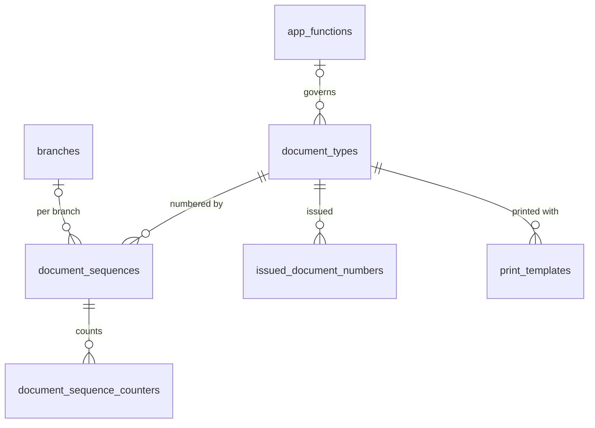

# 02 · Quản trị hệ thống / System Administration (SYS) — Giai đoạn 3 / Phase 3

[← Giai đoạn 3 · Kho cơ bản / Phase 3 · Basic inventory](README.md)

Các giai đoạn khác của phân hệ / Other phases of this module: [P1](../phase-01-foundation/02-system-administration.md) · [P2](../phase-02-organization-master-data/02-system-administration.md) · [P6](../phase-06-receivables-payables-cash/02-system-administration.md) · [P7](../phase-07-approvals-controls/02-system-administration.md) · [P8](../phase-08-operations-completion/02-system-administration.md) · [P9](../phase-09-accounting-einvoicing/02-system-administration.md) · [P10](../phase-10-expansion/02-system-administration.md) · [P11](../phase-11-advanced/02-system-administration.md)

---

## Phạm vi giai đoạn / Phase scope

- **VI:** Đánh số chứng từ, mẫu in mặc định; đính kèm tệp (chuyển từ [P2](../phase-02-organization-master-data/02-system-administration.md)).
- **EN:** Document numbering, default print templates; attachments (moved from [P2](../phase-02-organization-master-data/02-system-administration.md)).

## 1. Yêu cầu chức năng / Functional requirements

- **VI:** Từ P3 đến P6 chưa có luồng duyệt: người có quyền Tạo / Sửa xác nhận chứng từ trực tiếp (Nháp → Đã xác nhận). Các bước cần kiểm soát, ví dụ ghi sổ điều chỉnh kiểm kê (`BR-ROL-004`), chỉ người có quyền Duyệt trên chức năng đó thực hiện được; chưa có hộp chờ duyệt, lịch sử duyệt hay trả lại để sửa. Luồng duyệt (`FR-SYS-015`, `FR-SYS-016`) được bổ sung ở P7.
- **EN:** From P3 to P6 there are no approval flows: users with the Create / Edit permission confirm documents directly (Draft → Confirmed). Controlled steps, such as posting stock count adjustments (`BR-ROL-004`), can only be performed by users holding the Approve permission on that function; there is no approval inbox, approval history or return for revision yet. Approval flows (`FR-SYS-015`, `FR-SYS-016`) are added in P7.

**Cấu hình chung / General settings**

#### FR-SYS-019 · Đánh số chứng từ / Document numbering
`Must` · `P3`

- **VI:** Cấu hình mẫu số chứng từ theo loại chứng từ và chi nhánh, gồm tiền tố, mã chi nhánh, năm/tháng và số tự tăng (ví dụ `SO-HN-2610-00001`); đặt lại bộ đếm theo năm hoặc tháng. Số chính thức được cấp khi chứng từ được xác nhận; số đã cấp không được tái sử dụng.
- **EN:** Configure numbering patterns per document type and branch, including prefix, branch code, year/month and sequence (e.g. `SO-HN-2610-00001`); reset counters yearly or monthly. The official number is assigned on confirmation; issued numbers are never reused.

#### FR-SYS-021 · Mẫu in chứng từ / Print templates
`Must` · `P3` (mở rộng / extended: `P8`, `P9`)

- **VI:** Mỗi loại chứng từ có mẫu in mặc định (báo giá, đơn hàng, phiếu nhập/xuất kho, phiếu thu/chi…) theo mẫu của chế độ kế toán áp dụng, lấy logo và thông tin từ thông tin doanh nghiệp; hiển thị số tiền bằng chữ; xuất PDF.
- **EN:** Each document type has a default print template (quotation, order, goods receipt/issue, cash receipt/payment…) following the applicable accounting regime forms, using the logo and details from the company profile; amounts are spelled out in words; export to PDF.

**Tiện ích dùng chung / Common utilities**

#### FR-SYS-023 · Đính kèm tệp / Attachments
`Must` · `P3`

- **VI:** Đính kèm tệp (PDF, ảnh, Word, Excel, XML) vào mọi chứng từ và danh mục; tối đa 20 MB/tệp (cấu hình được); xem trước PDF và ảnh. Ảnh sản phẩm (`FR-MDM-001`) và logo doanh nghiệp (`FR-SYS-001`) dùng chức năng này. Thêm / xóa tệp cần quyền Sửa, xem / tải tệp cần quyền Xem trên chức năng của bản ghi được đính kèm.
- **EN:** Attach files (PDF, images, Word, Excel, XML) to any document or master record; max 20 MB per file (configurable); preview PDFs and images. Product images (`FR-MDM-001`) and the company logo (`FR-SYS-001`) use this feature. Adding / removing files needs Edit, viewing / downloading needs View on the function of the record the file is attached to.

## 2. Quy tắc nghiệp vụ / Business rules

| Mã / ID | Quy tắc (VI) | Rule (EN) | Giai đoạn / Phase |
|---|---|---|---|
| BR-SYS-001 | Số chứng từ là duy nhất trong toàn hệ thống. | Document numbers are unique system-wide. | P3 |

## 3. Mô hình dữ liệu / Data model

- **VI:** `document_types` là danh mục loại chứng từ khai báo trong mã nguồn; mỗi phân hệ nạp loại chứng từ của mình khi được triển khai. Số chính thức được cấp trong cùng giao dịch xác nhận chứng từ bằng `UPDATE document_sequence_counters … RETURNING last_value` (khóa dòng nên không trùng), sau đó ghi vào `issued_document_numbers` để bảo đảm `BR-SYS-001` trên mọi bảng chứng từ.
- **EN:** `document_types` is a code-defined catalog of document types; each module seeds its own types when delivered. The official number is assigned in the confirmation transaction with `UPDATE document_sequence_counters … RETURNING last_value` (row-locked, so no duplicates), then recorded in `issued_document_numbers` to guarantee `BR-SYS-001` across all document tables.
- **VI:** Đính kèm (`FR-SYS-023`) dùng bảng `attachments` và `stored_files` đã tạo ở P2 ([02](../phase-02-organization-master-data/02-system-administration.md), [11](../phase-02-organization-master-data/11-integrations.md)), không đổi lược đồ; giới hạn dung lượng và loại tệp lấy từ tham số `attachments.max_size_mb`, `attachments.allowed_types`.
- **EN:** Attachments (`FR-SYS-023`) use the `attachments` and `stored_files` tables created in P2, with no schema change; size and file-type limits come from the `attachments.max_size_mb` and `attachments.allowed_types` parameters.



| Bảng / Table | Mục đích (VI) | Purpose (EN) |
|---|---|---|
| `document_types` | Loại chứng từ, chức năng phân quyền tương ứng và bảng lưu. | Document types, their governing function and storage table. |
| `document_sequences` | Mẫu số theo loại chứng từ và chi nhánh (`branch_id` trống = mẫu chung); chu kỳ đặt lại bộ đếm (`FR-SYS-019`). | Numbering pattern per document type and branch (empty `branch_id` = shared pattern); counter reset cycle (`FR-SYS-019`). |
| `document_sequence_counters` | Bộ đếm theo chu kỳ (`period_key` = `''`, `'2026'` hoặc `'202610'`). | Counter per cycle (`period_key` = `''`, `'2026'` or `'202610'`). |
| `issued_document_numbers` | Sổ đăng ký mọi số đã cấp, khóa chính là số chứng từ (`BR-SYS-001`). | Registry of every issued number, keyed by the number itself (`BR-SYS-001`). |
| `print_templates` | Mẫu in theo loại chứng từ, ngôn ngữ và chế độ kế toán; mỗi tổ hợp có một mẫu mặc định (`FR-SYS-021`). | Print templates per document type, language and accounting regime; one default per combination (`FR-SYS-021`). |

<details>
<summary>Xem DDL / Show DDL</summary>

```sql
-- Chạy sau / Run after: 01-roles-permissions.md (P3)

-- Seed từ mã nguồn / seeded from code
CREATE TABLE document_types (
  code           varchar(10)  PRIMARY KEY,   -- vd / e.g. 'GR', 'GI', 'SO'
  module         varchar(10)  NOT NULL,
  name_vi        varchar(150) NOT NULL,
  name_en        varchar(150) NOT NULL,
  function_code  varchar(50)  REFERENCES app_functions(code),
  table_name     varchar(63)  NOT NULL,
  sort_order     integer      NOT NULL DEFAULT 0
);

CREATE TYPE sequence_reset AS ENUM ('NEVER','YEARLY','MONTHLY');

-- Biến của pattern / pattern tokens: {PREFIX} {BRANCH} {YYYY} {YY} {MM} {SEQ}
CREATE TABLE document_sequences (
  id             uuid           PRIMARY KEY DEFAULT gen_random_uuid(),
  document_type  varchar(10)    NOT NULL REFERENCES document_types(code),
  branch_id      uuid           REFERENCES branches(id),  -- NULL = mọi chi nhánh / all branches
  prefix         varchar(10)    NOT NULL,
  pattern        varchar(100)   NOT NULL DEFAULT '{PREFIX}-{BRANCH}-{YY}{MM}-{SEQ}',
  seq_padding    smallint       NOT NULL DEFAULT 5 CHECK (seq_padding BETWEEN 1 AND 10),
  reset_policy   sequence_reset NOT NULL DEFAULT 'MONTHLY',
  is_active      boolean        NOT NULL DEFAULT true,
  version        integer        NOT NULL DEFAULT 1,
  created_at     timestamptz    NOT NULL DEFAULT now(),
  created_by     uuid           REFERENCES users(id),
  updated_at     timestamptz    NOT NULL DEFAULT now(),
  updated_by     uuid           REFERENCES users(id),
  UNIQUE NULLS NOT DISTINCT (document_type, branch_id)
);

CREATE TABLE document_sequence_counters (
  sequence_id  uuid        NOT NULL REFERENCES document_sequences(id),
  period_key   varchar(6)  NOT NULL,  -- '' | 'YYYY' | 'YYYYMM'
  last_value   bigint      NOT NULL DEFAULT 0 CHECK (last_value >= 0),
  PRIMARY KEY (sequence_id, period_key)
);

-- BR-SYS-001: số đã cấp là duy nhất và không bao giờ bị xóa / issued numbers are unique and never deleted
CREATE TABLE issued_document_numbers (
  doc_no         varchar(30) PRIMARY KEY,
  document_type  varchar(10) NOT NULL REFERENCES document_types(code),
  document_id    uuid        NOT NULL,
  issued_at      timestamptz NOT NULL DEFAULT now(),
  issued_by      uuid        REFERENCES users(id)
);
CREATE INDEX ON issued_document_numbers (document_type, document_id);

CREATE TYPE print_language AS ENUM ('VI','EN');

CREATE TABLE print_templates (
  id                 uuid              PRIMARY KEY DEFAULT gen_random_uuid(),
  document_type      varchar(10)       NOT NULL REFERENCES document_types(code),
  language           print_language    NOT NULL DEFAULT 'VI',
  accounting_regime  accounting_regime,          -- NULL = dùng chung / any regime
  name               varchar(150)      NOT NULL,
  engine             varchar(20)       NOT NULL DEFAULT 'HANDLEBARS',
  body               text              NOT NULL, -- HTML + biến / HTML with placeholders
  paper_size         varchar(10)       NOT NULL DEFAULT 'A4',
  is_default         boolean           NOT NULL DEFAULT false,
  is_active          boolean           NOT NULL DEFAULT true,
  version            integer           NOT NULL DEFAULT 1,
  created_at         timestamptz       NOT NULL DEFAULT now(),
  created_by         uuid              REFERENCES users(id),
  updated_at         timestamptz       NOT NULL DEFAULT now(),
  updated_by         uuid              REFERENCES users(id)
);
CREATE UNIQUE INDEX print_templates_one_default
  ON print_templates (document_type, language, accounting_regime) NULLS NOT DISTINCT
  WHERE is_default;
```

</details>
