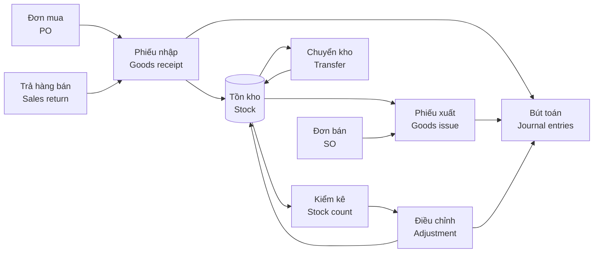
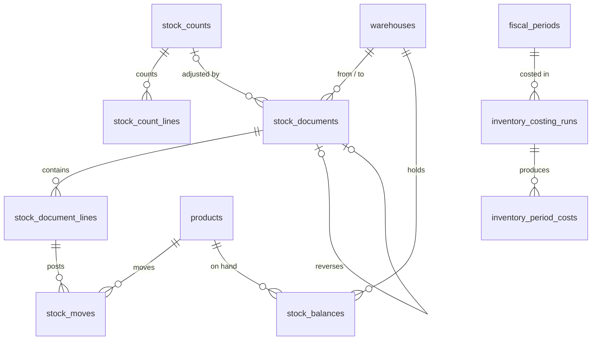

# 06 · Kho / Inventory (INV) — Giai đoạn 3 / Phase 3

[← Giai đoạn 3 · Kho cơ bản / Phase 3 · Basic inventory](README.md)

Các giai đoạn khác của phân hệ / Other phases of this module: [P7](../phase-07-approvals-controls/06-inventory.md) · [P8](../phase-08-operations-completion/06-inventory.md) · [P9](../phase-09-accounting-einvoicing/06-inventory.md) · [P10](../phase-10-expansion/06-inventory.md) · [P11](../phase-11-advanced/06-inventory.md)

---

## Phạm vi giai đoạn / Phase scope

- **VI:** Nhiều kho; phiếu nhập, phiếu xuất, chuyển kho một bước, xác nhận chứng từ; tồn thực tế theo kho; chặn xuất âm; kiểm kê cơ bản và điều chỉnh; tính giá bình quân gia quyền; báo cáo nhập – xuất – tồn.
- **EN:** Multiple warehouses; receipts, issues, one-step transfers, document confirmation; on-hand stock per warehouse; negative stock prevention; basic counts and adjustments; weighted-average costing; stock movement reports.

## 1. Mục tiêu / Objectives

- **VI:** Quản lý tồn kho chính xác theo thời gian thực trên nhiều kho, theo lô / serial / hạn dùng; chuẩn hóa nghiệp vụ nhập – xuất – chuyển – kiểm kê; tính giá xuất kho và hạch toán tự động sang kế toán.
- **EN:** Maintain accurate real-time stock across warehouses by lot / serial / expiry; standardize receipts, issues, transfers and stock counts; value inventory and post to accounting automatically.

## 2. Phạm vi / Scope

| Trong phạm vi / In scope | Ngoài phạm vi / Out of scope |
|---|---|
| Đa kho, vị trí, nhập/xuất/chuyển kho, lô/serial/hạn dùng, kiểm kê, bổ sung tồn kho, tính giá xuất kho, báo cáo kho / Multi-warehouse, locations, receipts/issues/transfers, lot/serial/expiry, stock count, replenishment, costing, inventory reports | Xuất nguyên vật liệu cho sản xuất, nhập thành phẩm, WMS nâng cao / Material issue to production, finished-goods receipt, advanced WMS |

## 3. Quy trình / Process flow



## 4. Yêu cầu chức năng / Functional requirements

**Cấu trúc kho / Warehouse structure**

#### FR-INV-001 · Đa kho & kho đặc biệt / Multi-warehouse & special warehouses
`Must` · `P3` (mở rộng / extended: `P7`, `P8`)

- **VI:** Hỗ trợ nhiều kho thuộc nhiều chi nhánh (`FR-MDM-021`).
- **EN:** Support multiple warehouses across branches (`FR-MDM-021`).

**Nghiệp vụ kho / Stock operations**

#### FR-INV-002 · Phiếu nhập kho / Goods receipt
`Must` · `P3` (mở rộng / extended: `P8`, `P9`)

- **VI:** Nhập kho từ: đơn mua, trả hàng bán, chuyển kho đến, nhập thừa kiểm kê, nhập khác (có lý do). In phiếu nhập kho theo mẫu của chế độ kế toán áp dụng.
- **EN:** Receive from: POs, sales returns, inbound transfers, count surpluses, other receipts (with reason). Print goods receipt notes in the applicable accounting-regime format.

#### FR-INV-003 · Phiếu xuất kho / Goods issue
`Must` · `P3`

- **VI:** Xuất kho cho: đơn bán hàng, trả hàng nhà cung cấp, sử dụng nội bộ (theo phòng ban, khoản mục chi phí), chuyển kho đi, xuất thiếu kiểm kê, xuất khác. In phiếu xuất kho theo mẫu của chế độ kế toán áp dụng.
- **EN:** Issue for: sales orders, supplier returns, internal use (by department, expense category), outbound transfers, count shortages, other issues. Print goods issue notes in the applicable accounting-regime format.

#### FR-INV-004 · Chuyển kho / Stock transfer
`Must` · `P3` (mở rộng / extended: `P8`, `P9`)

- **VI:** Chuyển kho một bước giữa hai kho.
- **EN:** One-step transfers between two warehouses.

#### FR-INV-006 · Xác nhận chứng từ kho / Confirm stock documents
`Must` · `P3`

- **VI:** Chứng từ kho chỉ làm thay đổi tồn kho khi được thủ kho xác nhận; trước đó chỉ là kế hoạch (ảnh hưởng tồn dự kiến).
- **EN:** Stock documents change on-hand quantities only when confirmed by the warehouse keeper; before that they only affect projected stock.

**Theo dõi tồn kho / Stock visibility**

#### FR-INV-008 · Tồn kho thời gian thực / Real-time stock
`Must` · `P3` (mở rộng / extended: `P8`)

- **VI:** Xem tồn thực tế theo sản phẩm và kho, theo đơn vị tính cơ bản và đơn vị quy đổi.
- **EN:** View on-hand quantities by product and warehouse, in base and alternate UoMs.

#### FR-INV-011 · Chặn xuất âm / Negative stock prevention
`Must` · `P3`

- **VI:** Mặc định không cho phép tồn kho âm; có thể cho phép theo kho cho người dùng có quyền, kèm báo cáo các mặt hàng đang âm.
- **EN:** Negative stock is disallowed by default; it can be allowed per warehouse for authorized users, with a report of negative items.

**Kiểm kê / Stock count**

#### FR-INV-013 · Lập kỳ kiểm kê / Create stock count
`Must` · `P3` (mở rộng / extended: `P8`)

- **VI:** Tạo đợt kiểm kê toàn bộ hoặc theo kho.
- **EN:** Create full counts or counts by warehouse.

#### FR-INV-014 · Ghi nhận số lượng thực tế / Record counted quantities
`Must` · `P3` (mở rộng / extended: `P8`, `P10`)

- **VI:** Nhập số lượng thực tế bằng tay hoặc từ file Excel.
- **EN:** Enter counted quantities manually or from Excel.

#### FR-INV-015 · Xử lý chênh lệch kiểm kê / Count variance processing
`Must` · `P3` (mở rộng / extended: `P7`, `P9`)

- **VI:** Lập báo cáo chênh lệch và biên bản kiểm kê; sau khi được người có quyền Duyệt trên Kiểm kê xác nhận (`BR-ROL-004`), hệ thống tự tạo phiếu điều chỉnh thừa / thiếu.
- **EN:** Produce the variance report and count minutes; once confirmed by a user holding the Approve permission on stock counts (`BR-ROL-004`), the system creates surplus / shortage adjustment documents.

**Tính giá & hạch toán / Costing & accounting**

#### FR-INV-018 · Phương pháp tính giá xuất kho / Costing method
`Must` · `P3` (mở rộng / extended: `P8`)

- **VI:** Hỗ trợ một phương pháp: bình quân gia quyền (cuối kỳ hoặc tức thời, chốt theo `Q-04`), áp dụng chung cho doanh nghiệp và nhất quán trong năm tài chính.
- **EN:** Support one method: weighted average (periodic or perpetual, decided under `Q-04`), applied company-wide and consistently within the fiscal year.

#### FR-INV-019 · Tính giá vốn / Cost calculation
`Must` · `P3` (mở rộng / extended: `P9`)

- **VI:** Chạy tính giá xuất kho (với bình quân cuối kỳ) và cập nhật giá vốn vào phiếu xuất; tự động tính lại khi có chứng từ phát sinh lùi ngày trong kỳ chưa khóa.
- **EN:** Run costing (for periodic average) and update costs on issues; recalculate automatically when back-dated documents are posted in an open period.

**Báo cáo / Reports**

#### FR-INV-023 · Báo cáo kho / Inventory reports
`Must` · `P3` (mở rộng / extended: `P8`)

- **VI:** Thẻ kho; sổ chi tiết vật tư, hàng hóa; báo cáo nhập – xuất – tồn theo số lượng và giá trị; giá trị tồn theo kho.
- **EN:** Stock card; detailed inventory ledger; stock movement summary (opening – in – out – closing) by quantity and value; stock value by warehouse.

## 5. Trạng thái chứng từ / Document statuses

| Chứng từ / Document | Trạng thái / Statuses |
|---|---|
| Phiếu nhập / xuất / Receipt / Issue | Nháp / Draft → Chờ xử lý / Waiting → Sẵn sàng (đã giữ hàng) / Ready → Đã xác nhận / Done · Đã hủy / Cancelled |
| Chuyển kho 2 bước / Two-step transfer | Nháp / Draft → Đã xuất (đang chuyển) / Shipped (in transit) → Đã nhận / Received · Đã hủy / Cancelled |
| Kiểm kê / Stock count | Mới / New → Đang kiểm / In progress → Chờ duyệt / Pending approval → Đã điều chỉnh / Adjusted · Đã hủy / Cancelled |

- **VI:** Trạng thái Sẵn sàng (đã giữ hàng) và chuyển kho hai bước có từ P8. Từ P3 đến P6, kiểm kê ở trạng thái Chờ duyệt chờ người có quyền Duyệt xác nhận (`BR-ROL-004`); luồng duyệt theo ngưỡng giá trị có từ P7.
- **EN:** The Ready (reserved) status and two-step transfers arrive in P8. From P3 to P6, a stock count in Pending approval waits for a user holding the Approve permission to confirm it (`BR-ROL-004`); threshold-based approval flows arrive in P7.

## 6. Quy tắc nghiệp vụ / Business rules

| Mã / ID | Quy tắc (VI) | Rule (EN) | Giai đoạn / Phase |
|---|---|---|---|
| BR-INV-001 | Mọi thay đổi tồn kho phải qua chứng từ; không sửa trực tiếp số tồn. | Every stock change goes through a document; quantities are never edited directly. | P3 |
| BR-INV-002 | Chứng từ kho đã xác nhận không được sửa; chỉ được hủy bằng chứng từ đảo nếu kỳ chưa khóa. | Confirmed stock documents cannot be edited; they can only be reversed if the period is open. | P3 |
| BR-INV-003 | Không thay đổi phương pháp tính giá trong năm tài chính. | The costing method cannot change within a fiscal year. | P3 |

## 7. Mô hình dữ liệu / Data model

- **VI:** Phiếu nhập, xuất và chuyển kho dùng chung `stock_documents` (phân biệt bằng `doc_type` + `reason`). Xác nhận chứng từ (`FR-INV-006`) trong **một giao dịch** (`NFR-DAT-002`): cấp số, ghi `stock_moves`, cập nhật `stock_balances` với `SELECT … FOR UPDATE`, chặn xuất âm nếu kho không cho phép (`FR-INV-011`). Chuyển kho một bước sinh hai dòng `stock_moves` (− kho đi, + kho đến). Lô / serial, vị trí, giữ hàng và chuyển kho hai bước được bổ sung ở P8.
- **EN:** Receipts, issues and transfers share `stock_documents` (distinguished by `doc_type` + `reason`). Confirmation (`FR-INV-006`) runs in **one transaction** (`NFR-DAT-002`): assign the number, write `stock_moves`, update `stock_balances` with `SELECT … FOR UPDATE`, and block negative stock unless the warehouse allows it (`FR-INV-011`). A one-step transfer writes two `stock_moves` rows (− source, + destination). Lots / serials, locations, reservations and two-step transfers are added in P8.



| Bảng / Table | Mục đích (VI) | Purpose (EN) |
|---|---|---|
| `expense_categories` | Khoản mục chi phí, dùng cho xuất dùng nội bộ (`FR-INV-003`), sau này cho đề nghị mua (P8) và chiều phân tích (P9). | Expense categories, used for internal-use issues (`FR-INV-003`), later for purchase requests (P8) and analytical dimensions (P9). |
| `stock_documents`, `stock_document_lines` | Chứng từ kho và dòng hàng. `source_type` / `source_id` trỏ tới đơn mua, đơn bán, trả hàng, kiểm kê. | Stock documents and lines. `source_type` / `source_id` point to the PO, SO, return or count. |
| `stock_moves` | Sổ kho chỉ ghi thêm, theo đơn vị cơ bản; số lượng không bao giờ sửa, chỉ `unit_cost` / `value` được cập nhật khi tính giá (`FR-INV-019`). | Append-only stock ledger in base UoM; quantities never change, only `unit_cost` / `value` are updated by costing (`FR-INV-019`). |
| `stock_balances` | Tồn hiện tại theo kho × sản phẩm (`FR-INV-008`). | Current on-hand per warehouse × product (`FR-INV-008`). |
| `stock_counts`, `stock_count_lines` | Đợt kiểm kê, số sổ sách chốt lúc `snapshot_at`, số thực tế, chênh lệch (`FR-INV-013` – `015`). | Count sessions, book quantity snapshotted at `snapshot_at`, counted quantity, variance (`FR-INV-013` – `015`). |
| `inventory_costing_runs`, `inventory_period_costs` | Lượt tính giá bình quân cuối kỳ và đơn giá bình quân kết quả (`FR-INV-019`). | Periodic-average costing runs and resulting average unit costs (`FR-INV-019`). |

| Quy tắc / Rule | Cơ chế (VI) | Mechanism (EN) |
|---|---|---|
| BR-INV-001 | Chỉ service xác nhận chứng từ được ghi `stock_moves` / `stock_balances`; không có API sửa tồn. | Only the confirmation service writes `stock_moves` / `stock_balances`; there is no API to edit stock. |
| BR-INV-002 | Chứng từ `DONE` không sửa; hủy bằng chứng từ đảo (`reversal_of_id`) khi kỳ còn mở. | `DONE` documents are read-only; they are reversed with a new document (`reversal_of_id`) while the period is open. |
| BR-INV-003 | Phương pháp tính giá lưu ở `fiscal_years.costing_method`; không sửa khi năm đã có `stock_moves`. | The costing method is stored in `fiscal_years.costing_method`; it cannot change once the year has `stock_moves`. |
| BR-ROL-004 | Phiếu điều chỉnh chỉ được sinh khi `stock_counts` chuyển `PENDING_APPROVAL` → `ADJUSTED` bởi người có `APPROVE` trên `INV.STOCK_COUNT`. | Adjustment documents are only generated when a count moves `PENDING_APPROVAL` → `ADJUSTED` by a user holding `APPROVE` on `INV.STOCK_COUNT`. |

<details>
<summary>Xem DDL / Show DDL</summary>

```sql
-- Chạy sau / Run after: 01-roles-permissions.md, 02-system-administration.md (P3)

INSERT INTO document_types (code, module, name_vi, name_en, function_code, table_name, sort_order) VALUES
  ('GR', 'INV', 'Phiếu nhập kho',   'Goods receipt',  'INV.STOCK_MOVE',  'stock_documents', 310),
  ('GI', 'INV', 'Phiếu xuất kho',   'Goods issue',    'INV.STOCK_MOVE',  'stock_documents', 320),
  ('TR', 'INV', 'Phiếu chuyển kho', 'Stock transfer', 'INV.STOCK_MOVE',  'stock_documents', 330),
  ('SC', 'INV', 'Phiếu kiểm kê',    'Stock count',    'INV.STOCK_COUNT', 'stock_counts',    340);

INSERT INTO document_sequences (document_type, prefix) VALUES
  ('GR', 'GR'), ('GI', 'GI'), ('TR', 'TR'), ('SC', 'SC');

-- FR-INV-011: cho phép xuất âm theo kho / negative stock allowed per warehouse
ALTER TABLE warehouses ADD COLUMN allow_negative_stock boolean NOT NULL DEFAULT false;

-- BR-INV-003: chốt phương pháp tính giá cho cả năm tài chính / one costing method per fiscal year
CREATE TYPE costing_method AS ENUM ('AVG_PERIODIC','AVG_PERPETUAL');
ALTER TABLE fiscal_years ADD COLUMN costing_method costing_method NOT NULL DEFAULT 'AVG_PERIODIC';

CREATE TABLE expense_categories (
  id                    uuid         PRIMARY KEY DEFAULT gen_random_uuid(),
  code                  varchar(30)  NOT NULL UNIQUE,
  name                  varchar(255) NOT NULL,
  name_en               varchar(255),
  parent_id             uuid         REFERENCES expense_categories(id),
  expense_account_code  varchar(20),  -- 641x / 642x (FK ở / FK in P9)
  is_active             boolean      NOT NULL DEFAULT true,
  version               integer      NOT NULL DEFAULT 1,
  created_at            timestamptz  NOT NULL DEFAULT now(),
  created_by            uuid         REFERENCES users(id),
  updated_at            timestamptz  NOT NULL DEFAULT now(),
  updated_by            uuid         REFERENCES users(id),
  CHECK (parent_id <> id)
);

CREATE TYPE stock_doc_type   AS ENUM ('RECEIPT','ISSUE','TRANSFER');
CREATE TYPE stock_doc_reason AS ENUM (
  'PURCHASE','SALES_RETURN','COUNT_SURPLUS','OTHER_RECEIPT',                -- nhập / receipts
  'SALE','SUPPLIER_RETURN','INTERNAL_USE','COUNT_SHORTAGE','OTHER_ISSUE',  -- xuất / issues
  'TRANSFER'                                                               -- chuyển kho / transfers
);
CREATE TYPE stock_doc_status AS ENUM ('DRAFT','WAITING','DONE','CANCELLED');

CREATE TABLE stock_documents (
  id                   uuid             PRIMARY KEY DEFAULT gen_random_uuid(),
  doc_no               varchar(30)      UNIQUE,  -- cấp khi xác nhận / assigned on confirmation
  doc_type             stock_doc_type   NOT NULL,
  reason               stock_doc_reason NOT NULL,
  doc_date             date             NOT NULL,
  branch_id            uuid             NOT NULL REFERENCES branches(id),
  warehouse_id         uuid             NOT NULL REFERENCES warehouses(id),  -- kho nhập (RECEIPT) / kho xuất (ISSUE, TRANSFER)
  dest_warehouse_id    uuid             REFERENCES warehouses(id),           -- kho nhận / destination (TRANSFER)
  partner_id           uuid             REFERENCES partners(id),
  using_department_id  uuid             REFERENCES departments(id),          -- xuất dùng nội bộ / internal use
  expense_category_id  uuid             REFERENCES expense_categories(id),
  source_type          varchar(30),     -- 'purchase_order', 'sales_order', 'sales_return', 'stock_count'…
  source_id            uuid,
  reversal_of_id       uuid             REFERENCES stock_documents(id),      -- BR-INV-002
  description          text,
  status               stock_doc_status NOT NULL DEFAULT 'DRAFT',
  confirmed_at         timestamptz,
  confirmed_by         uuid             REFERENCES users(id),
  cancel_reason        text,
  version              integer          NOT NULL DEFAULT 1,
  created_at           timestamptz      NOT NULL DEFAULT now(),
  created_by           uuid             REFERENCES users(id),
  updated_at           timestamptz      NOT NULL DEFAULT now(),
  updated_by           uuid             REFERENCES users(id),
  CONSTRAINT stock_documents_reason_check CHECK (CASE doc_type
    WHEN 'RECEIPT'  THEN reason IN ('PURCHASE','SALES_RETURN','COUNT_SURPLUS','OTHER_RECEIPT')
    WHEN 'ISSUE'    THEN reason IN ('SALE','SUPPLIER_RETURN','INTERNAL_USE','COUNT_SHORTAGE','OTHER_ISSUE')
    WHEN 'TRANSFER' THEN reason = 'TRANSFER' END),
  CHECK ((doc_type = 'TRANSFER') = (dest_warehouse_id IS NOT NULL)),
  CHECK (dest_warehouse_id <> warehouse_id),
  CHECK (status <> 'DONE' OR doc_no IS NOT NULL)
);
CREATE INDEX ON stock_documents (warehouse_id, doc_date);
CREATE INDEX ON stock_documents (source_type, source_id);
CREATE INDEX ON stock_documents (status) WHERE status IN ('DRAFT','WAITING');

CREATE TABLE stock_document_lines (
  id              uuid          PRIMARY KEY DEFAULT gen_random_uuid(),
  document_id     uuid          NOT NULL REFERENCES stock_documents(id),
  line_no         smallint      NOT NULL,
  product_id      uuid          NOT NULL REFERENCES products(id),  -- không nhận SERVICE / no SERVICE (BR-MDM-006)
  uom_id          uuid          NOT NULL REFERENCES uoms(id),
  qty             dm_qty        NOT NULL CHECK (qty > 0),
  uom_factor      dm_rate       NOT NULL DEFAULT 1,              -- chụp từ product_uoms / snapshot
  base_qty        numeric(18,4) GENERATED ALWAYS AS (round(qty * uom_factor, 4)) STORED,
  unit_cost       dm_price,                                      -- VND / đơn vị cơ bản / per base unit
  amount_vnd      dm_amount,
  source_line_id  uuid,                                          -- dòng đơn mua / đơn bán / trả hàng
  note            varchar(255),
  UNIQUE (document_id, line_no)
);
CREATE INDEX ON stock_document_lines (product_id);
CREATE INDEX ON stock_document_lines (source_line_id);

CREATE TABLE stock_moves (
  id            bigint      GENERATED ALWAYS AS IDENTITY PRIMARY KEY,
  move_date     date        NOT NULL,
  document_id   uuid        NOT NULL REFERENCES stock_documents(id),
  line_id       uuid        NOT NULL REFERENCES stock_document_lines(id),
  product_id    uuid        NOT NULL REFERENCES products(id),
  warehouse_id  uuid        NOT NULL REFERENCES warehouses(id),
  qty           dm_qty      NOT NULL CHECK (qty <> 0),  -- đơn vị cơ bản; + nhập, − xuất / base UoM; + in, − out
  unit_cost     dm_price,
  value         dm_amount,                             -- VND, cùng dấu với qty / same sign as qty
  created_at    timestamptz NOT NULL DEFAULT now()
);
CREATE INDEX ON stock_moves (product_id, warehouse_id, move_date, id);
CREATE INDEX ON stock_moves (document_id);

CREATE TABLE stock_balances (
  id            bigint      GENERATED ALWAYS AS IDENTITY PRIMARY KEY,
  product_id    uuid        NOT NULL REFERENCES products(id),
  warehouse_id  uuid        NOT NULL REFERENCES warehouses(id),
  on_hand_qty   dm_qty      NOT NULL DEFAULT 0,
  value_vnd     dm_amount   NOT NULL DEFAULT 0,  -- dùng cho bình quân tức thời / for perpetual average
  updated_at    timestamptz NOT NULL DEFAULT now(),
  UNIQUE (warehouse_id, product_id)
);

CREATE TYPE stock_count_status AS ENUM ('NEW','IN_PROGRESS','PENDING_APPROVAL','ADJUSTED','CANCELLED');

CREATE TABLE stock_counts (
  id            uuid               PRIMARY KEY DEFAULT gen_random_uuid(),
  doc_no        varchar(30)        UNIQUE,
  count_date    date               NOT NULL,
  branch_id     uuid               NOT NULL REFERENCES branches(id),
  warehouse_id  uuid               REFERENCES warehouses(id),  -- NULL = toàn bộ kho / all warehouses
  snapshot_at   timestamptz,                                   -- chốt số sổ sách / book snapshot
  status        stock_count_status NOT NULL DEFAULT 'NEW',
  description   text,
  approved_at   timestamptz,
  approved_by   uuid               REFERENCES users(id),        -- BR-ROL-004
  version       integer            NOT NULL DEFAULT 1,
  created_at    timestamptz        NOT NULL DEFAULT now(),
  created_by    uuid               REFERENCES users(id),
  updated_at    timestamptz        NOT NULL DEFAULT now(),
  updated_by    uuid               REFERENCES users(id)
);

CREATE TABLE stock_count_lines (
  id            uuid          PRIMARY KEY DEFAULT gen_random_uuid(),
  count_id      uuid          NOT NULL REFERENCES stock_counts(id),
  warehouse_id  uuid          NOT NULL REFERENCES warehouses(id),
  product_id    uuid          NOT NULL REFERENCES products(id),
  book_qty      dm_qty        NOT NULL,
  counted_qty   dm_qty        CHECK (counted_qty >= 0),       -- NULL = chưa đếm / not counted yet
  diff_qty      numeric(18,4) GENERATED ALWAYS AS (counted_qty - book_qty) STORED,
  unit_cost     dm_price,
  note          varchar(255),
  UNIQUE (count_id, warehouse_id, product_id)
);

CREATE TYPE costing_run_status AS ENUM ('RUNNING','COMPLETED','FAILED','SUPERSEDED');

CREATE TABLE inventory_costing_runs (
  id                uuid               PRIMARY KEY DEFAULT gen_random_uuid(),
  fiscal_period_id  uuid               NOT NULL REFERENCES fiscal_periods(id),
  method            costing_method     NOT NULL,
  status            costing_run_status NOT NULL DEFAULT 'RUNNING',
  triggered_by      varchar(20)        NOT NULL DEFAULT 'MANUAL',  -- 'MANUAL' | 'BACKDATED' (FR-INV-019)
  started_at        timestamptz        NOT NULL DEFAULT now(),
  finished_at       timestamptz,
  run_by            uuid               REFERENCES users(id),
  error             text
);
-- Mỗi kỳ chỉ một lượt đang chạy / one running costing per period
CREATE UNIQUE INDEX inventory_costing_runs_one_running
  ON inventory_costing_runs (fiscal_period_id) WHERE status = 'RUNNING';

CREATE TABLE inventory_period_costs (
  costing_run_id  uuid      NOT NULL REFERENCES inventory_costing_runs(id),
  product_id      uuid      NOT NULL REFERENCES products(id),
  warehouse_id    uuid      REFERENCES warehouses(id),  -- NULL = bình quân toàn công ty / company-wide (Q-04)
  opening_qty     dm_qty    NOT NULL,
  opening_value   dm_amount NOT NULL,
  in_qty          dm_qty    NOT NULL,
  in_value        dm_amount NOT NULL,
  avg_unit_cost   dm_price  NOT NULL,
  UNIQUE NULLS NOT DISTINCT (costing_run_id, product_id, warehouse_id)
);
```

</details>

## 8. Câu hỏi mở / Open questions

| # | Câu hỏi (VI) | Question (EN) |
|---|---|---|
| Q-INV-01 | Có cần quản lý vị trí (kệ, ô) trong kho ngay từ P3? | Are bin locations needed from P3? |
| Q-INV-02 | Có hàng gửi bán tại đại lý hoặc hàng nhận ký gửi không? | Are there goods on consignment at dealers, or consigned goods received? |
| Q-INV-03 | Tần suất kiểm kê hiện tại (tháng, quý, năm)? | Current count frequency (monthly, quarterly, yearly)? |
