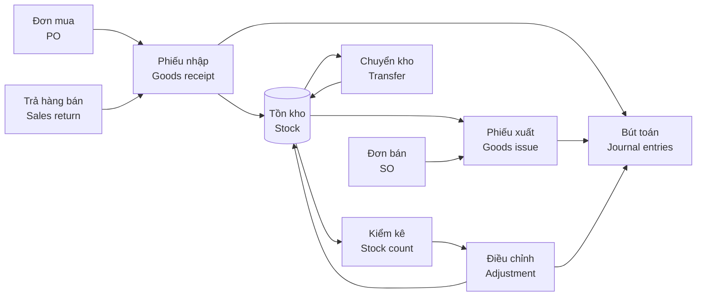

# 06 · Kho / Inventory (INV) — Giai đoạn 3 / Phase 3

[← Giai đoạn 3 · Kho cơ bản / Phase 3 · Basic inventory](README.md)

Các giai đoạn khác của phân hệ / Other phases of this module: [P7](../phase-07-approvals-controls/06-inventory.md) · [P8](../phase-08-operations-completion/06-inventory.md) · [P9](../phase-09-accounting-einvoicing/06-inventory.md) · [P10](../phase-10-expansion/06-inventory.md) · [P11](../phase-11-advanced/06-inventory.md)

---

## Phạm vi giai đoạn / Phase scope

- **VI:** Nhiều kho; phiếu nhập, phiếu xuất, chuyển kho một bước, xác nhận chứng từ; tồn thực tế theo kho; chặn xuất âm; kiểm kê cơ bản và điều chỉnh; tính giá bình quân gia quyền; báo cáo nhập – xuất – tồn.
- **EN:** Multiple warehouses; receipts, issues, one-step transfers, document confirmation; on-hand stock per warehouse; negative stock prevention; basic counts and adjustments; weighted-average costing; stock movement reports.

## 1. Mục tiêu / Objectives

- **VI:** Quản lý tồn kho chính xác theo thời gian thực trên nhiều kho, theo lô / serial / hạn dùng; chuẩn hóa nghiệp vụ nhập – xuất – chuyển – kiểm kê; tính giá xuất kho và hạch toán tự động sang kế toán.
- **EN:** Maintain accurate real-time stock across warehouses by lot / serial / expiry; standardize receipts, issues, transfers and stock counts; value inventory and post to accounting automatically.

## 2. Phạm vi / Scope

| Trong phạm vi / In scope | Ngoài phạm vi / Out of scope |
|---|---|
| Đa kho, vị trí, nhập/xuất/chuyển kho, lô/serial/hạn dùng, kiểm kê, bổ sung tồn kho, tính giá xuất kho, báo cáo kho / Multi-warehouse, locations, receipts/issues/transfers, lot/serial/expiry, stock count, replenishment, costing, inventory reports | Xuất nguyên vật liệu cho sản xuất, nhập thành phẩm, WMS nâng cao / Material issue to production, finished-goods receipt, advanced WMS |

## 3. Quy trình / Process flow

## 4. Yêu cầu chức năng / Functional requirements

**Cấu trúc kho / Warehouse structure**

#### FR-INV-001 · Đa kho & kho đặc biệt / Multi-warehouse & special warehouses
`Must` · `P3` (mở rộng / extended: `P7`, `P8`)

- **VI:** Hỗ trợ nhiều kho thuộc nhiều chi nhánh (`FR-MDM-021`).
- **EN:** Support multiple warehouses across branches (`FR-MDM-021`).

**Nghiệp vụ kho / Stock operations**

#### FR-INV-002 · Phiếu nhập kho / Goods receipt
`Must` · `P3` (mở rộng / extended: `P8`, `P9`)

- **VI:** Nhập kho từ: đơn mua, trả hàng bán, chuyển kho đến, nhập thừa kiểm kê, nhập khác (có lý do). In phiếu nhập kho theo mẫu của chế độ kế toán áp dụng.
- **EN:** Receive from: POs, sales returns, inbound transfers, count surpluses, other receipts (with reason). Print goods receipt notes in the applicable accounting-regime format.

#### FR-INV-003 · Phiếu xuất kho / Goods issue
`Must` · `P3`

- **VI:** Xuất kho cho: đơn bán hàng, trả hàng nhà cung cấp, sử dụng nội bộ (theo phòng ban, khoản mục chi phí), chuyển kho đi, xuất thiếu kiểm kê, xuất khác. In phiếu xuất kho theo mẫu của chế độ kế toán áp dụng.
- **EN:** Issue for: sales orders, supplier returns, internal use (by department, expense category), outbound transfers, count shortages, other issues. Print goods issue notes in the applicable accounting-regime format.

#### FR-INV-004 · Chuyển kho / Stock transfer
`Must` · `P3` (mở rộng / extended: `P8`, `P9`)

- **VI:** Chuyển kho một bước giữa hai kho.
- **EN:** One-step transfers between two warehouses.

#### FR-INV-006 · Xác nhận chứng từ kho / Confirm stock documents
`Must` · `P3`

- **VI:** Chứng từ kho chỉ làm thay đổi tồn kho khi được thủ kho xác nhận; trước đó chỉ là kế hoạch (ảnh hưởng tồn dự kiến).
- **EN:** Stock documents change on-hand quantities only when confirmed by the warehouse keeper; before that they only affect projected stock.

**Theo dõi tồn kho / Stock visibility**

#### FR-INV-008 · Tồn kho thời gian thực / Real-time stock
`Must` · `P3` (mở rộng / extended: `P8`)

- **VI:** Xem tồn thực tế theo sản phẩm và kho, theo đơn vị tính cơ bản và đơn vị quy đổi.
- **EN:** View on-hand quantities by product and warehouse, in base and alternate UoMs.

#### FR-INV-011 · Chặn xuất âm / Negative stock prevention
`Must` · `P3`

- **VI:** Mặc định không cho phép tồn kho âm; có thể cho phép theo kho cho người dùng có quyền, kèm báo cáo các mặt hàng đang âm.
- **EN:** Negative stock is disallowed by default; it can be allowed per warehouse for authorized users, with a report of negative items.

**Kiểm kê / Stock count**

#### FR-INV-013 · Lập kỳ kiểm kê / Create stock count
`Must` · `P3` (mở rộng / extended: `P8`)

- **VI:** Tạo đợt kiểm kê toàn bộ hoặc theo kho.
- **EN:** Create full counts or counts by warehouse.

#### FR-INV-014 · Ghi nhận số lượng thực tế / Record counted quantities
`Must` · `P3` (mở rộng / extended: `P8`, `P10`)

- **VI:** Nhập số lượng thực tế bằng tay hoặc từ file Excel.
- **EN:** Enter counted quantities manually or from Excel.

#### FR-INV-015 · Xử lý chênh lệch kiểm kê / Count variance processing
`Must` · `P3` (mở rộng / extended: `P7`, `P9`)

- **VI:** Lập báo cáo chênh lệch và biên bản kiểm kê; sau khi được người có quyền Duyệt trên Kiểm kê xác nhận (`BR-ROL-004`), hệ thống tự tạo phiếu điều chỉnh thừa / thiếu.
- **EN:** Produce the variance report and count minutes; once confirmed by a user holding the Approve permission on stock counts (`BR-ROL-004`), the system creates surplus / shortage adjustment documents.

**Tính giá & hạch toán / Costing & accounting**

#### FR-INV-018 · Phương pháp tính giá xuất kho / Costing method
`Must` · `P3` (mở rộng / extended: `P8`)

- **VI:** Hỗ trợ một phương pháp: bình quân gia quyền (cuối kỳ hoặc tức thời, chốt theo `Q-04`), áp dụng chung cho doanh nghiệp và nhất quán trong năm tài chính.
- **EN:** Support one method: weighted average (periodic or perpetual, decided under `Q-04`), applied company-wide and consistently within the fiscal year.

#### FR-INV-019 · Tính giá vốn / Cost calculation
`Must` · `P3` (mở rộng / extended: `P9`)

- **VI:** Chạy tính giá xuất kho (với bình quân cuối kỳ) và cập nhật giá vốn vào phiếu xuất; tự động tính lại khi có chứng từ phát sinh lùi ngày trong kỳ chưa khóa.
- **EN:** Run costing (for periodic average) and update costs on issues; recalculate automatically when back-dated documents are posted in an open period.

**Báo cáo / Reports**

#### FR-INV-023 · Báo cáo kho / Inventory reports
`Must` · `P3` (mở rộng / extended: `P8`)

- **VI:** Thẻ kho; sổ chi tiết vật tư, hàng hóa; báo cáo nhập – xuất – tồn theo số lượng và giá trị; giá trị tồn theo kho.
- **EN:** Stock card; detailed inventory ledger; stock movement summary (opening – in – out – closing) by quantity and value; stock value by warehouse.

## 5. Trạng thái chứng từ / Document statuses

| Chứng từ / Document | Trạng thái / Statuses |
|---|---|
| Phiếu nhập / xuất / Receipt / Issue | Nháp / Draft → Chờ xử lý / Waiting → Sẵn sàng (đã giữ hàng) / Ready → Đã xác nhận / Done · Đã hủy / Cancelled |
| Chuyển kho 2 bước / Two-step transfer | Nháp / Draft → Đã xuất (đang chuyển) / Shipped (in transit) → Đã nhận / Received · Đã hủy / Cancelled |
| Kiểm kê / Stock count | Mới / New → Đang kiểm / In progress → Chờ duyệt / Pending approval → Đã điều chỉnh / Adjusted · Đã hủy / Cancelled |

- **VI:** Trạng thái Sẵn sàng (đã giữ hàng) và chuyển kho hai bước có từ P8. Từ P3 đến P6, kiểm kê ở trạng thái Chờ duyệt chờ người có quyền Duyệt xác nhận (`BR-ROL-004`); luồng duyệt theo ngưỡng giá trị có từ P7.
- **EN:** The Ready (reserved) status and two-step transfers arrive in P8. From P3 to P6, a stock count in Pending approval waits for a user holding the Approve permission to confirm it (`BR-ROL-004`); threshold-based approval flows arrive in P7.

## 6. Quy tắc nghiệp vụ / Business rules

| Mã / ID | Quy tắc (VI) | Rule (EN) | Giai đoạn / Phase |
|---|---|---|---|
| BR-INV-001 | Mọi thay đổi tồn kho phải qua chứng từ; không sửa trực tiếp số tồn. | Every stock change goes through a document; quantities are never edited directly. | P3 |
| BR-INV-002 | Chứng từ kho đã xác nhận không được sửa; chỉ được hủy bằng chứng từ đảo nếu kỳ chưa khóa. | Confirmed stock documents cannot be edited; they can only be reversed if the period is open. | P3 |
| BR-INV-003 | Không thay đổi phương pháp tính giá trong năm tài chính. | The costing method cannot change within a fiscal year. | P3 |

## 7. Câu hỏi mở / Open questions

| # | Câu hỏi (VI) | Question (EN) |
|---|---|---|
| Q-INV-01 | Có cần quản lý vị trí (kệ, ô) trong kho ngay từ P3? | Are bin locations needed from P3? |
| Q-INV-02 | Có hàng gửi bán tại đại lý hoặc hàng nhận ký gửi không? | Are there goods on consignment at dealers, or consigned goods received? |
| Q-INV-03 | Tần suất kiểm kê hiện tại (tháng, quý, năm)? | Current count frequency (monthly, quarterly, yearly)? |
