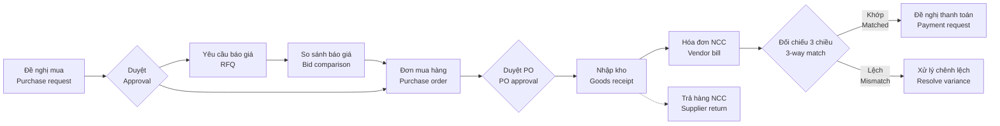
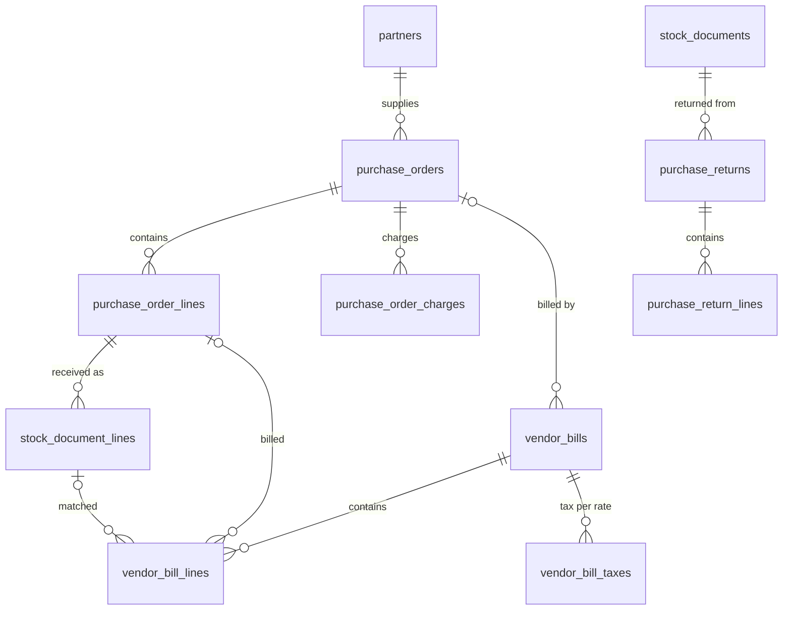

# 05 · Mua hàng / Purchasing (PUR) — Giai đoạn 4 / Phase 4

[← Giai đoạn 4 · Mua hàng cơ bản / Phase 4 · Basic purchasing](README.md)

Các giai đoạn khác của phân hệ / Other phases of this module: [P7](../phase-07-approvals-controls/05-purchasing.md) · [P8](../phase-08-operations-completion/05-purchasing.md) · [P9](../phase-09-accounting-einvoicing/05-purchasing.md) · [P10](../phase-10-expansion/05-purchasing.md) · [P11](../phase-11-advanced/05-purchasing.md)

---

## Phạm vi giai đoạn / Phase scope

- **VI:** Đơn mua lập trực tiếp, gửi PDF / email, theo dõi; nhận hàng theo đơn mua; ghi nhận hóa đơn nhà cung cấp, chống trùng hóa đơn; trả hàng nhà cung cấp; báo cáo mua hàng cơ bản. Chưa có duyệt đơn mua: người lập xác nhận đơn trực tiếp.
- **EN:** Direct purchase orders, sent as PDF / email and tracked; receiving against POs; vendor bills with duplicate prevention; supplier returns; basic purchasing reports. No PO approval yet: the creator confirms the PO directly.

## 1. Mục tiêu / Objectives

- **VI:** Chuẩn hóa quy trình mua hàng từ đề nghị mua đến nhận hàng, ghi nhận hóa đơn và thanh toán; kiểm soát ngân sách, phê duyệt và đối chiếu 3 chiều để tránh mua sai, trả tiền sai.
- **EN:** Standardize purchasing from request to receipt, vendor billing and payment; enforce budget control, approvals and 3-way matching to prevent wrong purchases and wrong payments.

## 2. Phạm vi / Scope

| Trong phạm vi / In scope | Ngoài phạm vi / Out of scope |
|---|---|
| Đề nghị mua, yêu cầu báo giá, đơn mua (trong nước & nhập khẩu), nhận hàng, hóa đơn NCC, đối chiếu 3 chiều, chi phí mua hàng, trả hàng NCC / Purchase requests, RFQs, POs (domestic & import), receiving, vendor bills, 3-way match, landed cost, supplier returns | Đấu thầu điện tử, cổng thông tin nhà cung cấp (P11) / E-tendering, supplier portal (P11) |

## 3. Quy trình / Process flow



## 4. Yêu cầu chức năng / Functional requirements

**Đơn mua hàng / Purchase orders**

#### FR-PUR-007 · Tạo đơn mua hàng / Create purchase order
`Must` · `P4` (mở rộng / extended: `P8`, `P10`)

- **VI:** Tạo đơn mua gồm: nhà cung cấp, tiền tệ và tỷ giá, điều khoản thanh toán, ngày giao dự kiến, kho nhận, dòng hàng (số lượng, đơn vị tính, đơn giá, chiết khấu, thuế suất), chi phí khác.
- **EN:** Create a PO with: supplier, currency and rate, payment terms, expected date, receiving warehouse, lines (quantity, UoM, unit price, discount, tax rate), other charges.

#### FR-PUR-010 · Gửi đơn mua / Send PO
`Must` · `P4`

- **VI:** Xuất đơn mua ra PDF theo mẫu in (`FR-SYS-021`; bản EN từ P8) và gửi email cho nhà cung cấp; ghi nhận ngày nhà cung cấp xác nhận.
- **EN:** Export the PO to PDF using the print template (`FR-SYS-021`; EN from P8) and email it to the supplier; record the supplier's confirmation date.

#### FR-PUR-011 · Theo dõi đơn mua / PO tracking
`Must` · `P4`

- **VI:** Theo dõi số lượng đã nhận, đã nhận hóa đơn, đã thanh toán theo từng dòng; cảnh báo đơn trễ hạn giao.
- **EN:** Track received, billed and paid quantities per line; alert on late deliveries.

**Nhận hàng / Receiving**

#### FR-PUR-014 · Nhận hàng theo đơn mua / Receive against PO
`Must` · `P4` (mở rộng / extended: `P8`)

- **VI:** Đơn mua đã duyệt tự động tạo phiếu nhập kho chờ xử lý; thủ kho nhận đủ hoặc một phần (`FR-INV-002`).
- **EN:** Approved POs create pending goods receipts; the warehouse receives fully or partially (`FR-INV-002`).

**Hóa đơn nhà cung cấp & đối chiếu / Vendor bills & matching**

#### FR-PUR-017 · Ghi nhận hóa đơn nhà cung cấp / Record vendor bill
`Must` · `P4`

- **VI:** Nhập hóa đơn mua gồm: ký hiệu, số hóa đơn, ngày hóa đơn, mã số thuế người bán, tiền hàng, tiền thuế theo từng thuế suất, tổng tiền; liên kết với đơn mua và phiếu nhập.
- **EN:** Record vendor bills with: invoice series, number, date, seller tax ID, net amount, tax per rate, total; link to the PO and goods receipt.

#### FR-PUR-020 · Chống trùng hóa đơn / Duplicate bill prevention
`Must` · `P4`

- **VI:** Chặn ghi nhận hóa đơn trùng (cùng mã số thuế người bán + ký hiệu + số hóa đơn).
- **EN:** Block duplicate bills (same seller tax ID + series + invoice number).

**Trả hàng nhà cung cấp / Supplier returns**

#### FR-PUR-024 · Trả hàng nhà cung cấp / Return to supplier
`Must` · `P4`

- **VI:** Lập phiếu trả hàng từ phiếu nhập gốc; xuất kho; ghi giảm công nợ phải trả; xử lý hóa đơn liên quan theo quy định hiện hành về hóa đơn.
- **EN:** Create returns from the original goods receipt; issue the goods from stock; reduce the payable; handle related invoices according to current invoicing rules.

**Báo cáo / Reports**

#### FR-PUR-026 · Báo cáo mua hàng / Purchasing reports
`Must` · `P4` (mở rộng / extended: `P8`)

- **VI:** Giá trị mua theo nhà cung cấp, sản phẩm, thời gian; đơn mua chưa nhận đủ; hàng đã nhận chưa có hóa đơn; lịch sử giá mua.
- **EN:** Purchase value by supplier, product and period; open POs; received-not-billed; purchase price history.

## 5. Trạng thái chứng từ / Document statuses

| Chứng từ / Document | Trạng thái / Statuses |
|---|---|
| Đề nghị mua / Purchase request | Nháp / Draft → Chờ duyệt / Pending approval → Đã duyệt / Approved → Đang xử lý / In progress → Hoàn tất / Done · Từ chối / Rejected · Đã hủy / Cancelled |
| Đơn mua / Purchase order | Nháp / Draft → Chờ duyệt / Pending approval → Đã duyệt / Approved → Đã gửi NCC / Sent → Nhận một phần / Partially received → Đã nhận đủ / Received → Hoàn tất / Done · Đã đóng / Closed · Đã hủy / Cancelled |
| Hóa đơn NCC / Vendor bill | Nháp / Draft → Chờ đối chiếu / Pending match → Đã ghi sổ / Posted → Trả một phần / Partially paid → Đã thanh toán / Paid · Đã hủy / Cancelled |

- **VI:** Từ P4 đến P6, người lập xác nhận đơn mua và đơn chuyển thẳng từ Nháp sang Đã duyệt; trạng thái Chờ duyệt có từ P7. Đề nghị mua có từ P8; trạng thái Chờ đối chiếu của hóa đơn NCC có từ P9 (`FR-PUR-019`).
- **EN:** From P4 to P6, the creator confirms the PO and it moves straight from Draft to Approved; the Pending approval status arrives in P7. Purchase requests arrive in P8; the vendor bill Pending match status arrives in P9 (`FR-PUR-019`).

## 6. Quy tắc nghiệp vụ / Business rules

| Mã / ID | Quy tắc (VI) | Rule (EN) | Giai đoạn / Phase |
|---|---|---|---|
| BR-PUR-002 | Không nhận hàng khi không có đơn mua, trừ khi người dùng có quyền "nhận hàng không đơn". | Goods cannot be received without a PO unless the user has the "receive without PO" permission. | P4 |
| BR-PUR-004 | Hóa đơn trùng (mã số thuế người bán + ký hiệu + số) bị chặn. | Duplicate bills (seller tax ID + series + number) are blocked. | P4 |

## 7. Mô hình dữ liệu / Data model

- **VI:** Phiếu nhập theo đơn mua là `stock_documents` (`reason = 'PURCHASE'`, `source_type = 'purchase_order'`), mỗi dòng trỏ về dòng đơn mua qua `source_line_id`; xác nhận phiếu nhập cập nhật `purchase_order_lines.qty_received`. Trả hàng nhà cung cấp sinh phiếu xuất `reason = 'SUPPLIER_RETURN'`. Công nợ phải trả theo hóa đơn được ghi nhận từ P6. Trạng thái Chờ duyệt (P7) và Chờ đối chiếu (P9) được thêm vào enum ở giai đoạn tương ứng.
- **EN:** Receipts against a PO are `stock_documents` (`reason = 'PURCHASE'`, `source_type = 'purchase_order'`), each line pointing to its PO line via `source_line_id`; confirming the receipt updates `purchase_order_lines.qty_received`. Supplier returns create issues with `reason = 'SUPPLIER_RETURN'`. Open-item payables are recorded from P6. The Pending approval (P7) and Pending match (P9) statuses are added to the enums in those phases.



| Bảng / Table | Mục đích (VI) | Purpose (EN) |
|---|---|---|
| `purchase_orders`, `purchase_order_lines`, `purchase_order_charges` | Đơn mua, dòng hàng (theo dõi `qty_received`, `qty_billed`, `qty_returned` — `FR-PUR-011`) và chi phí khác. | POs, lines (tracking `qty_received`, `qty_billed`, `qty_returned` — `FR-PUR-011`) and other charges. |
| `vendor_bills`, `vendor_bill_lines`, `vendor_bill_taxes` | Hóa đơn nhà cung cấp, dòng hàng liên kết dòng đơn mua / dòng phiếu nhập, tiền thuế theo từng thuế suất (`FR-PUR-017`). | Vendor bills, lines linked to PO lines / receipt lines, tax per rate (`FR-PUR-017`). |
| `purchase_returns`, `purchase_return_lines` | Trả hàng nhà cung cấp từ phiếu nhập gốc; ghi nhận hóa đơn điều chỉnh của nhà cung cấp nếu có (`FR-PUR-024`). | Supplier returns from the original receipt; records the supplier's adjustment invoice if any (`FR-PUR-024`). |

| Quy tắc / Rule | Cơ chế (VI) | Mechanism (EN) |
|---|---|---|
| BR-PUR-002 | Service từ chối phiếu nhập `reason = 'PURCHASE'` không có `source_id` nếu người dùng không có `CREATE` trên `INV.RECEIPT_WITHOUT_PO`. | The service rejects `reason = 'PURCHASE'` receipts without `source_id` unless the user has `CREATE` on `INV.RECEIPT_WITHOUT_PO`. |
| BR-PUR-004, FR-PUR-020 | Unique index `vendor_bills_no_duplicate` trên MST người bán + ký hiệu + số, bỏ qua hóa đơn đã hủy. | Unique index `vendor_bills_no_duplicate` on seller tax ID + series + number, ignoring cancelled bills. |

<details>
<summary>Xem DDL / Show DDL</summary>

```sql
-- Chạy sau / Run after: 01-roles-permissions.md (P4)

INSERT INTO document_types (code, module, name_vi, name_en, function_code, table_name, sort_order) VALUES
  ('PO',  'PUR', 'Đơn mua hàng',          'Purchase order',  'PUR.PURCHASE_ORDER', 'purchase_orders',  410),
  ('VB',  'ACC', 'Hóa đơn mua',           'Vendor bill',     'ACC.VENDOR_BILL',    'vendor_bills',     420),
  ('PRT', 'PUR', 'Trả hàng nhà cung cấp', 'Supplier return', 'PUR.PURCHASE_ORDER', 'purchase_returns', 430);

INSERT INTO document_sequences (document_type, prefix) VALUES ('PO', 'PO'), ('VB', 'VB'), ('PRT', 'PRT');

CREATE TYPE po_status AS ENUM ('DRAFT','APPROVED','SENT','PARTIALLY_RECEIVED','RECEIVED','DONE','CLOSED','CANCELLED');

CREATE TABLE purchase_orders (
  id                     uuid        PRIMARY KEY DEFAULT gen_random_uuid(),
  doc_no                 varchar(30) UNIQUE,
  branch_id              uuid        NOT NULL REFERENCES branches(id),
  supplier_id            uuid        NOT NULL REFERENCES partners(id),
  order_date             date        NOT NULL,
  expected_date          date,
  warehouse_id           uuid        REFERENCES warehouses(id),  -- kho nhận / receiving warehouse
  currency_code          char(3)     NOT NULL REFERENCES currencies(code),
  exchange_rate          dm_rate     NOT NULL DEFAULT 1,
  payment_term_id        uuid        REFERENCES payment_terms(id),
  status                 po_status   NOT NULL DEFAULT 'DRAFT',
  sent_at                timestamptz,                             -- FR-PUR-010
  supplier_confirmed_at  date,                                    -- FR-PUR-010
  supplier_ref           varchar(50),
  amount_untaxed         dm_amount   NOT NULL DEFAULT 0,
  amount_tax             dm_amount   NOT NULL DEFAULT 0,
  amount_total           dm_amount   NOT NULL DEFAULT 0,
  amount_total_vnd       dm_amount   NOT NULL DEFAULT 0,
  notes                  text,
  confirmed_at           timestamptz,
  confirmed_by           uuid        REFERENCES users(id),
  cancel_reason          text,
  version                integer     NOT NULL DEFAULT 1,
  created_at             timestamptz NOT NULL DEFAULT now(),
  created_by             uuid        REFERENCES users(id),
  updated_at             timestamptz NOT NULL DEFAULT now(),
  updated_by             uuid        REFERENCES users(id),
  CHECK (status IN ('DRAFT','CANCELLED') OR doc_no IS NOT NULL)
);
CREATE INDEX ON purchase_orders (supplier_id, order_date);
-- FR-PUR-011: cảnh báo đơn trễ hạn giao / late-delivery alerts
CREATE INDEX ON purchase_orders (expected_date) WHERE status IN ('APPROVED','SENT','PARTIALLY_RECEIVED');

CREATE TABLE purchase_order_lines (
  id               uuid      PRIMARY KEY DEFAULT gen_random_uuid(),
  po_id            uuid      NOT NULL REFERENCES purchase_orders(id),
  line_no          smallint  NOT NULL,
  product_id       uuid      NOT NULL REFERENCES products(id),
  description      varchar(500),
  uom_id           uuid      NOT NULL REFERENCES uoms(id),
  uom_factor       dm_rate   NOT NULL DEFAULT 1,
  qty              dm_qty    NOT NULL CHECK (qty > 0),
  unit_price       dm_price  NOT NULL CHECK (unit_price >= 0),
  discount_pct     dm_pct    NOT NULL DEFAULT 0,
  discount_amount  dm_amount NOT NULL DEFAULT 0,
  tax_id           uuid      REFERENCES taxes(id),
  amount_untaxed   dm_amount NOT NULL,
  amount_tax       dm_amount NOT NULL DEFAULT 0,
  expected_date    date,
  qty_received     dm_qty    NOT NULL DEFAULT 0,
  qty_billed       dm_qty    NOT NULL DEFAULT 0,
  qty_returned     dm_qty    NOT NULL DEFAULT 0,
  UNIQUE (po_id, line_no)
);
CREATE INDEX ON purchase_order_lines (product_id);

CREATE TABLE purchase_order_charges (
  id           uuid         PRIMARY KEY DEFAULT gen_random_uuid(),
  po_id        uuid         NOT NULL REFERENCES purchase_orders(id),
  description  varchar(255) NOT NULL,
  amount       dm_amount    NOT NULL,
  tax_id       uuid         REFERENCES taxes(id),
  amount_tax   dm_amount    NOT NULL DEFAULT 0
);

CREATE TYPE vendor_bill_status AS ENUM ('DRAFT','POSTED','PARTIALLY_PAID','PAID','CANCELLED');

CREATE TABLE vendor_bills (
  id                 uuid               PRIMARY KEY DEFAULT gen_random_uuid(),
  doc_no             varchar(30)        UNIQUE,                 -- số nội bộ / internal number
  branch_id          uuid               NOT NULL REFERENCES branches(id),
  supplier_id        uuid               NOT NULL REFERENCES partners(id),
  purchase_order_id  uuid               REFERENCES purchase_orders(id),
  seller_tax_code    dm_tax_code        NOT NULL,               -- MST người bán trên hóa đơn
  invoice_series     varchar(10)        NOT NULL,               -- ký hiệu / series, vd / e.g. 1C26TAA
  invoice_no         varchar(20)        NOT NULL,
  invoice_date       date               NOT NULL,
  accounting_date    date               NOT NULL,
  currency_code      char(3)            NOT NULL REFERENCES currencies(code),
  exchange_rate      dm_rate            NOT NULL DEFAULT 1,
  payment_term_id    uuid               REFERENCES payment_terms(id),
  due_date           date,
  amount_untaxed     dm_amount          NOT NULL DEFAULT 0,
  amount_tax         dm_amount          NOT NULL DEFAULT 0,
  amount_total       dm_amount          NOT NULL DEFAULT 0,
  amount_total_vnd   dm_amount          NOT NULL DEFAULT 0,
  description        text,
  status             vendor_bill_status NOT NULL DEFAULT 'DRAFT',
  posted_at          timestamptz,
  posted_by          uuid               REFERENCES users(id),
  cancel_reason      text,
  version            integer            NOT NULL DEFAULT 1,
  created_at         timestamptz        NOT NULL DEFAULT now(),
  created_by         uuid               REFERENCES users(id),
  updated_at         timestamptz        NOT NULL DEFAULT now(),
  updated_by         uuid               REFERENCES users(id)
);
-- BR-PUR-004, FR-PUR-020
CREATE UNIQUE INDEX vendor_bills_no_duplicate
  ON vendor_bills (seller_tax_code, upper(invoice_series), invoice_no)
  WHERE status <> 'CANCELLED';
CREATE INDEX ON vendor_bills (supplier_id, invoice_date);

CREATE TABLE vendor_bill_lines (
  id               uuid      PRIMARY KEY DEFAULT gen_random_uuid(),
  bill_id          uuid      NOT NULL REFERENCES vendor_bills(id),
  line_no          smallint  NOT NULL,
  po_line_id       uuid      REFERENCES purchase_order_lines(id),
  receipt_line_id  uuid      REFERENCES stock_document_lines(id),
  product_id       uuid      REFERENCES products(id),  -- NULL = dòng chi phí không mã / uncoded expense line (Q-PUR-03)
  description      varchar(500),
  uom_id           uuid      REFERENCES uoms(id),
  qty              dm_qty    NOT NULL DEFAULT 1 CHECK (qty > 0),
  unit_price       dm_price  NOT NULL,
  discount_amount  dm_amount NOT NULL DEFAULT 0,
  tax_id           uuid      REFERENCES taxes(id),
  amount_untaxed   dm_amount NOT NULL,
  amount_tax       dm_amount NOT NULL DEFAULT 0,
  UNIQUE (bill_id, line_no),
  CHECK (product_id IS NOT NULL OR description IS NOT NULL)
);
CREATE INDEX ON vendor_bill_lines (po_line_id);
CREATE INDEX ON vendor_bill_lines (receipt_line_id);

-- Tiền thuế theo từng thuế suất như in trên hóa đơn / tax per rate as printed on the bill
CREATE TABLE vendor_bill_taxes (
  bill_id         uuid      NOT NULL REFERENCES vendor_bills(id),
  tax_id          uuid      NOT NULL REFERENCES taxes(id),
  taxable_amount  dm_amount NOT NULL,
  tax_amount      dm_amount NOT NULL,
  PRIMARY KEY (bill_id, tax_id)
);

CREATE TYPE purchase_return_status AS ENUM ('DRAFT','CONFIRMED','CANCELLED');

CREATE TABLE purchase_returns (
  id                   uuid                   PRIMARY KEY DEFAULT gen_random_uuid(),
  doc_no               varchar(30)            UNIQUE,
  branch_id            uuid                   NOT NULL REFERENCES branches(id),
  supplier_id          uuid                   NOT NULL REFERENCES partners(id),
  return_date          date                   NOT NULL,
  receipt_id           uuid                   NOT NULL REFERENCES stock_documents(id),  -- phiếu nhập gốc / original receipt
  vendor_bill_id       uuid                   REFERENCES vendor_bills(id),
  issue_id             uuid                   REFERENCES stock_documents(id),           -- phiếu xuất trả / return issue
  reason               text                   NOT NULL,
  currency_code        char(3)                NOT NULL REFERENCES currencies(code),
  exchange_rate        dm_rate                NOT NULL DEFAULT 1,
  amount_untaxed       dm_amount              NOT NULL DEFAULT 0,
  amount_tax           dm_amount              NOT NULL DEFAULT 0,
  amount_total         dm_amount              NOT NULL DEFAULT 0,
  amount_total_vnd     dm_amount              NOT NULL DEFAULT 0,
  adj_invoice_series   varchar(10),           -- hóa đơn điều chỉnh của NCC / supplier's adjustment invoice
  adj_invoice_no       varchar(20),
  adj_invoice_date     date,
  status               purchase_return_status NOT NULL DEFAULT 'DRAFT',
  confirmed_at         timestamptz,
  confirmed_by         uuid                   REFERENCES users(id),
  version              integer                NOT NULL DEFAULT 1,
  created_at           timestamptz            NOT NULL DEFAULT now(),
  created_by           uuid                   REFERENCES users(id),
  updated_at           timestamptz            NOT NULL DEFAULT now(),
  updated_by           uuid                   REFERENCES users(id)
);

CREATE TABLE purchase_return_lines (
  id               uuid      PRIMARY KEY DEFAULT gen_random_uuid(),
  return_id        uuid      NOT NULL REFERENCES purchase_returns(id),
  line_no          smallint  NOT NULL,
  receipt_line_id  uuid      NOT NULL REFERENCES stock_document_lines(id),
  product_id       uuid      NOT NULL REFERENCES products(id),
  uom_id           uuid      NOT NULL REFERENCES uoms(id),
  uom_factor       dm_rate   NOT NULL DEFAULT 1,
  qty              dm_qty    NOT NULL CHECK (qty > 0),
  unit_price       dm_price  NOT NULL,
  tax_id           uuid      REFERENCES taxes(id),
  amount_untaxed   dm_amount NOT NULL,
  amount_tax       dm_amount NOT NULL DEFAULT 0,
  UNIQUE (return_id, line_no)
);
```

</details>

## 8. Câu hỏi mở / Open questions

| # | Câu hỏi (VI) | Question (EN) |
|---|---|---|
| Q-PUR-01 | Tỷ trọng hàng nhập khẩu và các loại chi phí nhập khẩu thường gặp? | Share of imported goods and typical import costs? |
| Q-PUR-02 | Có bắt buộc yêu cầu báo giá từ tối thiểu N nhà cung cấp cho đơn trên ngưỡng nào đó? | Is a minimum number of quotes required above a certain value? |
| Q-PUR-03 | Mua dịch vụ / chi phí (không qua kho) có đi qua đơn mua không? | Do service / expense purchases (non-stock) go through POs? |
