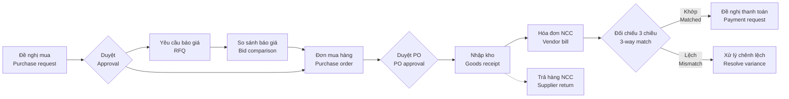

# 05 · Mua hàng / Purchasing (PUR) — Giai đoạn 4 / Phase 4

[← Giai đoạn 4 · Mua hàng cơ bản / Phase 4 · Basic purchasing](README.md)

Các giai đoạn khác của phân hệ / Other phases of this module: [P7](../phase-07-approvals-controls/05-purchasing.md) · [P8](../phase-08-operations-completion/05-purchasing.md) · [P9](../phase-09-accounting-einvoicing/05-purchasing.md) · [P10](../phase-10-expansion/05-purchasing.md) · [P11](../phase-11-advanced/05-purchasing.md)

---

## Phạm vi giai đoạn / Phase scope

- **VI:** Đơn mua lập trực tiếp, gửi PDF / email, theo dõi; nhận hàng theo đơn mua; ghi nhận hóa đơn nhà cung cấp, chống trùng hóa đơn; trả hàng nhà cung cấp; báo cáo mua hàng cơ bản. Chưa có duyệt đơn mua: người lập xác nhận đơn trực tiếp.
- **EN:** Direct purchase orders, sent as PDF / email and tracked; receiving against POs; vendor bills with duplicate prevention; supplier returns; basic purchasing reports. No PO approval yet: the creator confirms the PO directly.

## 1. Mục tiêu / Objectives

- **VI:** Chuẩn hóa quy trình mua hàng từ đề nghị mua đến nhận hàng, ghi nhận hóa đơn và thanh toán; kiểm soát ngân sách, phê duyệt và đối chiếu 3 chiều để tránh mua sai, trả tiền sai.
- **EN:** Standardize purchasing from request to receipt, vendor billing and payment; enforce budget control, approvals and 3-way matching to prevent wrong purchases and wrong payments.

## 2. Phạm vi / Scope

| Trong phạm vi / In scope | Ngoài phạm vi / Out of scope |
|---|---|
| Đề nghị mua, yêu cầu báo giá, đơn mua (trong nước & nhập khẩu), nhận hàng, hóa đơn NCC, đối chiếu 3 chiều, chi phí mua hàng, trả hàng NCC / Purchase requests, RFQs, POs (domestic & import), receiving, vendor bills, 3-way match, landed cost, supplier returns | Đấu thầu điện tử, cổng thông tin nhà cung cấp (P11) / E-tendering, supplier portal (P11) |

## 3. Quy trình / Process flow

## 4. Yêu cầu chức năng / Functional requirements

**Đơn mua hàng / Purchase orders**

#### FR-PUR-007 · Tạo đơn mua hàng / Create purchase order
`Must` · `P4` (mở rộng / extended: `P8`, `P10`)

- **VI:** Tạo đơn mua gồm: nhà cung cấp, tiền tệ và tỷ giá, điều khoản thanh toán, ngày giao dự kiến, kho nhận, dòng hàng (số lượng, đơn vị tính, đơn giá, chiết khấu, thuế suất), chi phí khác.
- **EN:** Create a PO with: supplier, currency and rate, payment terms, expected date, receiving warehouse, lines (quantity, UoM, unit price, discount, tax rate), other charges.

#### FR-PUR-010 · Gửi đơn mua / Send PO
`Must` · `P4`

- **VI:** Xuất đơn mua ra PDF theo mẫu in (`FR-SYS-021`; bản EN từ P8) và gửi email cho nhà cung cấp; ghi nhận ngày nhà cung cấp xác nhận.
- **EN:** Export the PO to PDF using the print template (`FR-SYS-021`; EN from P8) and email it to the supplier; record the supplier's confirmation date.

#### FR-PUR-011 · Theo dõi đơn mua / PO tracking
`Must` · `P4`

- **VI:** Theo dõi số lượng đã nhận, đã nhận hóa đơn, đã thanh toán theo từng dòng; cảnh báo đơn trễ hạn giao.
- **EN:** Track received, billed and paid quantities per line; alert on late deliveries.

**Nhận hàng / Receiving**

#### FR-PUR-014 · Nhận hàng theo đơn mua / Receive against PO
`Must` · `P4` (mở rộng / extended: `P8`)

- **VI:** Đơn mua đã duyệt tự động tạo phiếu nhập kho chờ xử lý; thủ kho nhận đủ hoặc một phần (`FR-INV-002`).
- **EN:** Approved POs create pending goods receipts; the warehouse receives fully or partially (`FR-INV-002`).

**Hóa đơn nhà cung cấp & đối chiếu / Vendor bills & matching**

#### FR-PUR-017 · Ghi nhận hóa đơn nhà cung cấp / Record vendor bill
`Must` · `P4`

- **VI:** Nhập hóa đơn mua gồm: ký hiệu, số hóa đơn, ngày hóa đơn, mã số thuế người bán, tiền hàng, tiền thuế theo từng thuế suất, tổng tiền; liên kết với đơn mua và phiếu nhập.
- **EN:** Record vendor bills with: invoice series, number, date, seller tax ID, net amount, tax per rate, total; link to the PO and goods receipt.

#### FR-PUR-020 · Chống trùng hóa đơn / Duplicate bill prevention
`Must` · `P4`

- **VI:** Chặn ghi nhận hóa đơn trùng (cùng mã số thuế người bán + ký hiệu + số hóa đơn).
- **EN:** Block duplicate bills (same seller tax ID + series + invoice number).

**Trả hàng nhà cung cấp / Supplier returns**

#### FR-PUR-024 · Trả hàng nhà cung cấp / Return to supplier
`Must` · `P4`

- **VI:** Lập phiếu trả hàng từ phiếu nhập gốc; xuất kho; ghi giảm công nợ phải trả; xử lý hóa đơn liên quan theo quy định hiện hành về hóa đơn.
- **EN:** Create returns from the original goods receipt; issue the goods from stock; reduce the payable; handle related invoices according to current invoicing rules.

**Báo cáo / Reports**

#### FR-PUR-026 · Báo cáo mua hàng / Purchasing reports
`Must` · `P4` (mở rộng / extended: `P8`)

- **VI:** Giá trị mua theo nhà cung cấp, sản phẩm, thời gian; đơn mua chưa nhận đủ; hàng đã nhận chưa có hóa đơn; lịch sử giá mua.
- **EN:** Purchase value by supplier, product and period; open POs; received-not-billed; purchase price history.

## 5. Trạng thái chứng từ / Document statuses

| Chứng từ / Document | Trạng thái / Statuses |
|---|---|
| Đề nghị mua / Purchase request | Nháp / Draft → Chờ duyệt / Pending approval → Đã duyệt / Approved → Đang xử lý / In progress → Hoàn tất / Done · Từ chối / Rejected · Đã hủy / Cancelled |
| Đơn mua / Purchase order | Nháp / Draft → Chờ duyệt / Pending approval → Đã duyệt / Approved → Đã gửi NCC / Sent → Nhận một phần / Partially received → Đã nhận đủ / Received → Hoàn tất / Done · Đã đóng / Closed · Đã hủy / Cancelled |
| Hóa đơn NCC / Vendor bill | Nháp / Draft → Chờ đối chiếu / Pending match → Đã ghi sổ / Posted → Trả một phần / Partially paid → Đã thanh toán / Paid · Đã hủy / Cancelled |

- **VI:** Từ P4 đến P6, người lập xác nhận đơn mua và đơn chuyển thẳng từ Nháp sang Đã duyệt; trạng thái Chờ duyệt có từ P7. Đề nghị mua có từ P8; trạng thái Chờ đối chiếu của hóa đơn NCC có từ P9 (`FR-PUR-019`).
- **EN:** From P4 to P6, the creator confirms the PO and it moves straight from Draft to Approved; the Pending approval status arrives in P7. Purchase requests arrive in P8; the vendor bill Pending match status arrives in P9 (`FR-PUR-019`).

## 6. Quy tắc nghiệp vụ / Business rules

| Mã / ID | Quy tắc (VI) | Rule (EN) | Giai đoạn / Phase |
|---|---|---|---|
| BR-PUR-002 | Không nhận hàng khi không có đơn mua, trừ khi người dùng có quyền "nhận hàng không đơn". | Goods cannot be received without a PO unless the user has the "receive without PO" permission. | P4 |
| BR-PUR-004 | Hóa đơn trùng (mã số thuế người bán + ký hiệu + số) bị chặn. | Duplicate bills (seller tax ID + series + number) are blocked. | P4 |

## 7. Câu hỏi mở / Open questions

| # | Câu hỏi (VI) | Question (EN) |
|---|---|---|
| Q-PUR-01 | Tỷ trọng hàng nhập khẩu và các loại chi phí nhập khẩu thường gặp? | Share of imported goods and typical import costs? |
| Q-PUR-02 | Có bắt buộc yêu cầu báo giá từ tối thiểu N nhà cung cấp cho đơn trên ngưỡng nào đó? | Is a minimum number of quotes required above a certain value? |
| Q-PUR-03 | Mua dịch vụ / chi phí (không qua kho) có đi qua đơn mua không? | Do service / expense purchases (non-stock) go through POs? |
