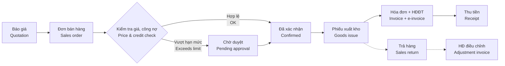
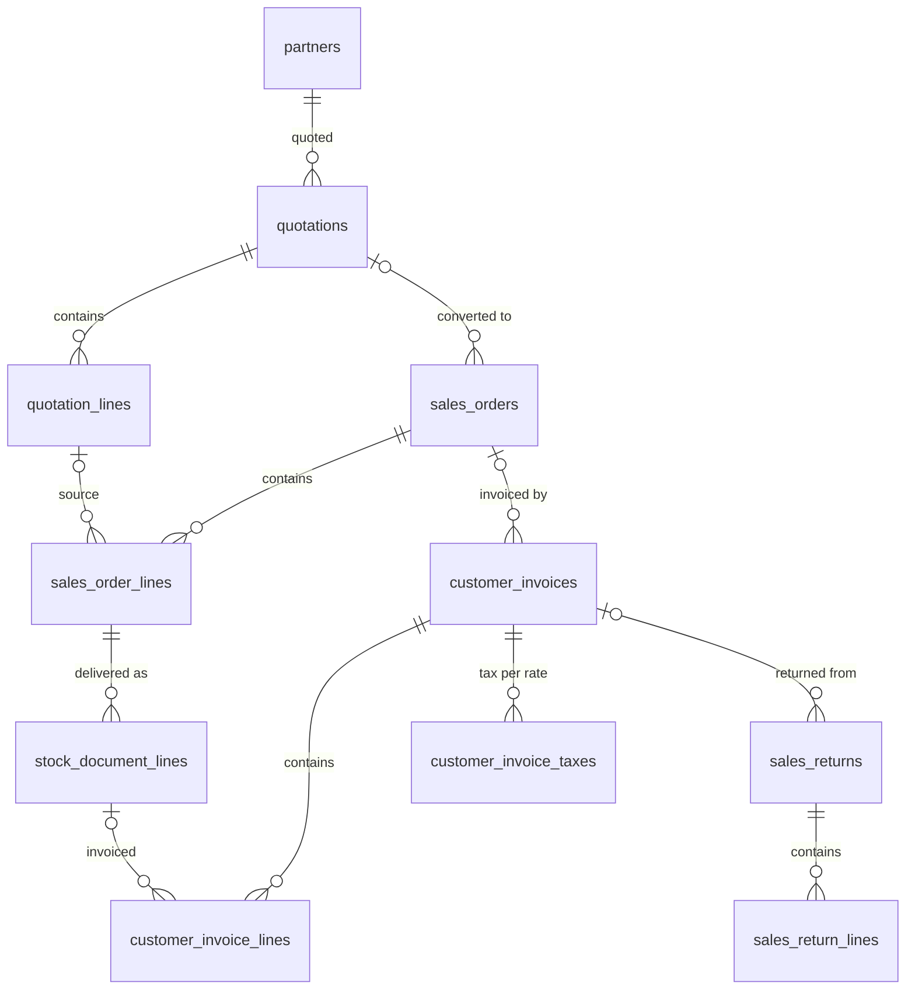

# 04 · Bán hàng / Sales (SAL) — Giai đoạn 5 / Phase 5

[← Giai đoạn 5 · Bán hàng cơ bản / Phase 5 · Basic sales](README.md)

Các giai đoạn khác của phân hệ / Other phases of this module: [P7](../phase-07-approvals-controls/04-sales.md) · [P8](../phase-08-operations-completion/04-sales.md) · [P9](../phase-09-accounting-einvoicing/04-sales.md) · [P10](../phase-10-expansion/04-sales.md) · [P11](../phase-11-advanced/04-sales.md)

---

## Phạm vi giai đoạn / Phase scope

- **VI:** Báo giá (tạo, gửi PDF / email, chuyển thành đơn); đơn bán hàng lấy giá từ bảng giá, chiết khấu dòng, giá gồm / chưa gồm thuế; giao hàng nhiều lần; hóa đơn (ghi số HĐĐT phát hành trên cổng nhà cung cấp); trả hàng; báo cáo bán hàng cơ bản. Chưa có duyệt đơn: đơn được xác nhận trực tiếp.
- **EN:** Quotations (create, send PDF / email, convert to order); sales orders priced from price lists, line discounts, tax-inclusive / exclusive prices; partial deliveries; invoices (recording e-invoice numbers issued on the provider's portal); returns; basic sales reports. No order approval yet: orders are confirmed directly.

## 1. Mục tiêu / Objectives

- **VI:** Quản lý toàn bộ chu trình bán hàng từ báo giá đến giao hàng, xuất hóa đơn và xử lý trả hàng; kiểm soát giá, chiết khấu và công nợ; cung cấp thông tin tình trạng đơn hàng theo thời gian thực.
- **EN:** Manage the full sales cycle from quotation to delivery, invoicing and returns; control pricing, discounts and credit; provide real-time order status.

## 2. Phạm vi / Scope

| Trong phạm vi / In scope | Ngoài phạm vi / Out of scope |
|---|---|
| Báo giá, đơn bán hàng, giao hàng, hóa đơn, trả hàng, khuyến mãi (P10), hoa hồng (P11) / Quotations, sales orders, delivery, invoicing, returns, promotions (P10), commissions (P11) | Bán lẻ POS, website TMĐT, hợp đồng dịch vụ định kỳ phức tạp (subscription) / Retail POS, e-commerce storefront, complex subscription contracts |

## 3. Quy trình / Process flow



## 4. Yêu cầu chức năng / Functional requirements

**Báo giá / Quotations**

#### FR-SAL-001 · Tạo báo giá / Create quotation
`Must` · `P5` (mở rộng / extended: `P10`)

- **VI:** Nhân viên kinh doanh tạo báo giá gồm: khách hàng, người liên hệ, ngày báo giá, ngày hết hiệu lực, tiền tệ, điều khoản thanh toán, điều kiện giao hàng, các dòng sản phẩm (số lượng, đơn vị tính, đơn giá, chiết khấu, thuế suất), ghi chú, điều khoản kèm theo.
- **EN:** Sales staff create quotations with: customer, contact, quotation date, expiry date, currency, payment terms, delivery terms, product lines (quantity, UoM, unit price, discount, tax rate), notes and terms & conditions.

#### FR-SAL-003 · Gửi báo giá / Send quotation
`Must` · `P5`

- **VI:** Xuất báo giá ra PDF theo mẫu in (`FR-SYS-021`; bản EN / song ngữ từ P8) và gửi email trực tiếp từ hệ thống; ghi nhận thời điểm gửi và chuyển trạng thái "Đã gửi".
- **EN:** Export the quotation to PDF using the print template (`FR-SYS-021`; EN / bilingual from P8) and email it from the system; record the send time and set status to "Sent".

#### FR-SAL-004 · Chuyển báo giá thành đơn hàng / Convert quotation to order
`Must` · `P5`

- **VI:** Chuyển báo giá thành đơn bán hàng bằng một thao tác, cho phép chọn toàn bộ hoặc một phần dòng; đơn hàng giữ liên kết với báo giá gốc.
- **EN:** Convert a quotation to a sales order in one action, selecting all or some lines; the order keeps a link to the source quotation.

**Đơn bán hàng / Sales orders**

#### FR-SAL-006 · Tạo đơn bán hàng / Create sales order
`Must` · `P5`

- **VI:** Tạo đơn từ báo giá hoặc trực tiếp gồm: khách hàng, địa chỉ giao hàng, ngày giao dự kiến, kho xuất, nhân viên bán hàng, điều khoản thanh toán, tiền tệ và tỷ giá, dòng hàng, phí vận chuyển, ghi chú nội bộ và ghi chú cho khách.
- **EN:** Create an order from a quotation or directly with: customer, shipping address, expected delivery date, source warehouse, salesperson, payment terms, currency and rate, lines, shipping fee, internal and customer notes.

#### FR-SAL-007 · Tự động lấy giá / Automatic pricing
`Must` · `P5` (mở rộng / extended: `P8`)

- **VI:** Đơn giá được lấy tự động theo thứ tự ưu tiên: bảng giá riêng của khách hàng → bảng giá của nhóm khách hàng → bảng giá chung, theo thời gian hiệu lực. Người dùng có quyền mới được sửa giá.
- **EN:** Unit price is filled automatically by priority: customer-specific price list → customer group price list → general price list, by validity period. Only authorized users can override prices.

#### FR-SAL-008 · Chiết khấu / Discounts
`Must` · `P5` (mở rộng / extended: `P8`)

- **VI:** Chiết khấu theo dòng (% hoặc số tiền).
- **EN:** Line discounts (% or amount).

#### FR-SAL-009 · Giá gồm thuế hoặc chưa gồm thuế / Tax-inclusive or exclusive prices
`Must` · `P5`

- **VI:** Bảng giá và đơn hàng hỗ trợ cả giá đã gồm thuế GTGT và chưa gồm thuế; hệ thống tính ngược tiền hàng và tiền thuế khi giá đã gồm thuế.
- **EN:** Price lists and orders support both VAT-inclusive and VAT-exclusive prices; the system back-calculates net and tax amounts for inclusive prices.

#### FR-SAL-010 · Kiểm tra tồn kho khả dụng / Stock availability check
`Must` · `P5` (mở rộng / extended: `P8`)

- **VI:** Khi nhập dòng hàng, hiển thị tồn thực tế theo kho; cảnh báo nếu không đủ hàng.
- **EN:** When entering a line, show on-hand stock per warehouse; warn if insufficient.

#### FR-SAL-014 · Giao hàng nhiều lần / Partial deliveries
`Must` · `P5`

- **VI:** Một đơn có thể giao nhiều lần; hệ thống theo dõi số lượng đã giao, còn lại và cho phép đóng phần còn lại (không giao tiếp).
- **EN:** An order can be delivered in several shipments; the system tracks delivered and remaining quantities and allows closing the remaining balance.

#### FR-SAL-016 · Sửa và hủy đơn / Amend and cancel orders
`Must` · `P5`

- **VI:** Sửa đơn đã xác nhận cần quyền riêng; từ P7 có thể phải duyệt lại (`BR-SYS-005`). Chỉ hủy được đơn hoặc phần chưa giao; bắt buộc nhập lý do hủy.
- **EN:** Editing a confirmed order requires a specific permission; from P7 it may trigger re-approval (`BR-SYS-005`). Only orders or undelivered portions can be cancelled; a cancellation reason is mandatory.

#### FR-SAL-017 · Theo dõi tình trạng đơn / Order tracking
`Must` · `P5`

- **VI:** Trên mỗi đơn hiển thị tình trạng giao hàng, xuất hóa đơn, thanh toán và các chứng từ liên quan (phiếu xuất, hóa đơn, phiếu thu, trả hàng).
- **EN:** Each order shows delivery, invoicing and payment status plus related documents (goods issues, invoices, receipts, returns).

#### FR-SAL-018 · Bán dịch vụ / Selling services
`Must` · `P5` (mở rộng / extended: `P8`)

- **VI:** Dòng hàng là dịch vụ không qua kho và được xuất hóa đơn trực tiếp.
- **EN:** Service lines bypass the warehouse and are invoiced directly.

**Giao hàng / Delivery**

#### FR-SAL-019 · Yêu cầu xuất kho / Delivery request
`Must` · `P5`

- **VI:** Đơn đã xác nhận tự động tạo phiếu xuất kho ở trạng thái chờ để kho xử lý (xem `FR-INV-003`).
- **EN:** Confirmed orders automatically create pending goods issues for the warehouse to process (see `FR-INV-003`).

#### FR-SAL-020 · Phiếu giao hàng & xác nhận giao / Delivery note & proof of delivery
`Must` · `P5`

- **VI:** In phiếu giao hàng / biên bản bàn giao có chữ ký khách hàng; cập nhật trạng thái "Đã giao". Đính kèm ảnh xác nhận giao hàng từ điện thoại là `Could`, `P11`.
- **EN:** Print delivery notes / handover minutes for customer signature; update status to "Delivered". Attaching proof-of-delivery photos from a phone is `Could`, `P11`.

**Hóa đơn / Invoicing**

#### FR-SAL-021 · Tạo hóa đơn bán hàng / Create customer invoice
`Must` · `P5` (mở rộng / extended: `P9`)

- **VI:** Tạo hóa đơn từ đơn hàng hoặc phiếu xuất; gộp nhiều phiếu xuất của cùng khách hàng vào một hóa đơn; xuất hóa đơn một phần. Hóa đơn điện tử được phát hành trên cổng của nhà cung cấp HĐĐT; người dùng ghi nhận ký hiệu và số hóa đơn điện tử vào hóa đơn trên ERP.
- **EN:** Create invoices from orders or goods issues; combine several goods issues of the same customer into one invoice; invoice partially. E-invoices are issued on the e-invoice provider's portal; users record the e-invoice series and number on the ERP invoice.

#### FR-SAL-022 · Chính sách xuất hóa đơn / Invoicing policy
`Must` · `P5` (mở rộng / extended: `P8`)

- **VI:** Một chính sách chung cho doanh nghiệp (tham số hệ thống `FR-SYS-020`): xuất hóa đơn theo số lượng đặt hoặc theo số lượng đã giao.
- **EN:** One company-wide policy (system parameter `FR-SYS-020`): invoice on ordered quantity or on delivered quantity.

**Trả hàng & điều chỉnh / Returns & adjustments**

#### FR-SAL-024 · Trả hàng bán / Sales return
`Must` · `P5`

- **VI:** Tạo phiếu trả hàng từ hóa đơn hoặc phiếu xuất gốc; số lượng trả không vượt số lượng đã giao; chọn kho nhận lại (có thể là kho hàng lỗi); bắt buộc nhập lý do trả.
- **EN:** Create a return from the original invoice or goods issue; return quantity cannot exceed delivered quantity; choose the receiving warehouse (possibly a defective-goods warehouse); a return reason is mandatory.

**Báo cáo / Reports**

#### FR-SAL-030 · Báo cáo bán hàng / Sales reports
`Must` · `P5` (mở rộng / extended: `P7`, `P8`)

- **VI:** Doanh số theo khách hàng, sản phẩm, nhân viên, chi nhánh, thời gian; đơn chưa giao; hàng đã giao chưa xuất hóa đơn; lãi gộp theo đơn / sản phẩm (chỉ người được cấp quyền xem báo cáo này).
- **EN:** Revenue by customer, product, salesperson, branch and period; open (undelivered) orders; delivered-not-invoiced; gross margin by order / product (only for users granted access to this report).

## 5. Trạng thái chứng từ / Document statuses

| Chứng từ / Document | Trạng thái / Statuses |
|---|---|
| Báo giá / Quotation | Nháp / Draft → Đã gửi / Sent → Đã chấp nhận / Accepted · Từ chối / Rejected · Hết hạn / Expired · Đã hủy / Cancelled |
| Đơn bán hàng / Sales order | Nháp / Draft → Chờ duyệt / Pending approval → Đã xác nhận / Confirmed → Giao một phần / Partially delivered → Đã giao / Delivered → Hoàn tất / Done · Tạm giữ / On hold · Đã hủy / Cancelled |
| Hóa đơn bán / Customer invoice | Nháp / Draft → Đã ghi sổ / Posted → Thu một phần / Partially paid → Đã thu đủ / Paid · Đã hủy / Cancelled |
| Trả hàng / Sales return | Nháp / Draft → Chờ duyệt / Pending approval → Đã nhận hàng / Received → Đã điều chỉnh / Credited |

- **VI:** Trạng thái Chờ duyệt có từ P7; từ P5 đến P6, chứng từ chuyển thẳng từ Nháp sang trạng thái kế tiếp. Trạng thái Hết hạn của báo giá có từ P8 (`FR-SAL-005`).
- **EN:** The Pending approval status arrives in P7; from P5 to P6, documents move straight from Draft to the next status. The quotation Expired status arrives in P8 (`FR-SAL-005`).

## 6. Quy tắc nghiệp vụ / Business rules

| Mã / ID | Quy tắc (VI) | Rule (EN) | Giai đoạn / Phase |
|---|---|---|---|
| BR-SAL-001 | Không hủy đơn đã có phiếu xuất kho đã ghi sổ; phải lập phiếu trả hàng. | Orders with posted goods issues cannot be cancelled; a return must be created instead. | P5 |
| BR-SAL-002 | Số lượng xuất hóa đơn không vượt số lượng đã giao (chính sách theo giao hàng) hoặc số lượng đặt (chính sách theo đơn). | Invoiced quantity cannot exceed delivered quantity (delivery policy) or ordered quantity (order policy). | P5 |
| BR-SAL-004 | Thời điểm lập hóa đơn tuân theo quy định về hóa đơn điện tử; hệ thống cảnh báo phiếu xuất đã giao nhưng chưa lập hóa đơn quá N ngày. | Invoice timing follows e-invoice regulations; the system warns about delivered goods not invoiced after N days. | P5 |
| BR-SAL-005 | Doanh thu bằng ngoại tệ được quy đổi sang VND theo tỷ giá giao dịch thực tế tại thời điểm ghi nhận doanh thu. | Foreign-currency revenue is converted to VND at the actual transaction rate on the recognition date. | P5 |
| BR-SAL-006 | Thành tiền VND làm tròn đến đơn vị đồng; phương pháp làm tròn tiền thuế (theo dòng hoặc theo tổng) cấu hình được và phải khớp với nhà cung cấp HĐĐT. | VND amounts are rounded to whole đồng; tax rounding (per line or per total) is configurable and must match the e-invoice provider. | P5 |

## 7. Mô hình dữ liệu / Data model

- **VI:** Đơn đã xác nhận tự sinh phiếu xuất `stock_documents` (`reason = 'SALE'`, `status = 'WAITING'`, `source_type = 'sales_order'`) — `FR-SAL-019`; xác nhận phiếu xuất cập nhật `sales_order_lines.qty_delivered`. Hóa đơn có thể gộp nhiều phiếu xuất của cùng khách hàng nên liên kết ở mức dòng (`issue_line_id`). Ở P5, số HĐĐT phát hành trên cổng nhà cung cấp được ghi tay vào `einvoice_series` / `einvoice_no`; P9 chuyển sang phát hành trực tiếp. Phương pháp làm tròn thuế (`BR-SAL-006`) lấy từ tham số `sales.tax_rounding` và được chụp lại trên từng hóa đơn.
- **EN:** A confirmed order automatically creates a `stock_documents` issue (`reason = 'SALE'`, `status = 'WAITING'`, `source_type = 'sales_order'`) — `FR-SAL-019`; confirming the issue updates `sales_order_lines.qty_delivered`. An invoice may combine several issues of the same customer, so the link is per line (`issue_line_id`). In P5, the e-invoice series / number issued on the provider's portal is typed into `einvoice_series` / `einvoice_no`; P9 switches to direct issuance. Tax rounding (`BR-SAL-006`) comes from the `sales.tax_rounding` parameter and is snapshotted on each invoice.



| Bảng / Table | Mục đích (VI) | Purpose (EN) |
|---|---|---|
| `quotations`, `quotation_lines` | Báo giá; `sent_at` ghi thời điểm gửi (`FR-SAL-003`). | Quotations; `sent_at` records when sent (`FR-SAL-003`). |
| `sales_orders`, `sales_order_lines` | Đơn bán; dòng ghi nguồn giá (`price_source`), số đã giao / đã xuất hóa đơn / đã trả / đã đóng (`FR-SAL-014`, `FR-SAL-017`). | Sales orders; lines record the price source (`price_source`) and delivered / invoiced / returned / closed quantities (`FR-SAL-014`, `FR-SAL-017`). |
| `customer_invoices`, `customer_invoice_lines`, `customer_invoice_taxes` | Hóa đơn bán, số HĐĐT, tiền thuế theo thuế suất (`FR-SAL-021`). | Customer invoices, e-invoice number, tax per rate (`FR-SAL-021`). |
| `sales_returns`, `sales_return_lines` | Trả hàng từ hóa đơn hoặc phiếu xuất gốc, kho nhận lại, lý do bắt buộc, hóa đơn điều chỉnh (`FR-SAL-024`). | Returns from the original invoice or issue, receiving warehouse, mandatory reason, adjustment invoice (`FR-SAL-024`). |
| `stock_documents.delivered_at`, `received_by_name` | Xác nhận đã giao và người nhận trên phiếu xuất (`FR-SAL-020`). | Delivery confirmation and recipient on the issue (`FR-SAL-020`). |

| Quy tắc / Rule | Cơ chế (VI) | Mechanism (EN) |
|---|---|---|
| BR-SAL-001 | Service chặn hủy đơn khi có phiếu xuất `DONE`; chỉ đóng phần chưa giao bằng `qty_cancelled`. | The service blocks cancelling orders with `DONE` issues; only the undelivered part is closed via `qty_cancelled`. |
| BR-SAL-002 | Service kiểm tra `qty_invoiced` ≤ `qty_delivered` (chính sách theo giao hàng) hoặc ≤ `qty` (theo đơn). | The service checks `qty_invoiced` ≤ `qty_delivered` (delivery policy) or ≤ `qty` (order policy). |
| BR-SAL-004 | View `rpt_delivered_not_invoiced` ([10 · Báo cáo](10-reporting.md)) có `days_since_delivery` để cảnh báo theo `sales.uninvoiced_alert_days`. | The `rpt_delivered_not_invoiced` view ([10 · Reporting](10-reporting.md)) exposes `days_since_delivery` for alerts per `sales.uninvoiced_alert_days`. |
| BR-SAL-005 | `exchange_rate` của hóa đơn là tỷ giá ghi nhận doanh thu; `amount_total_vnd` tính theo tỷ giá này. | The invoice `exchange_rate` is the revenue recognition rate; `amount_total_vnd` uses it. |

<details>
<summary>Xem DDL / Show DDL</summary>

```sql
-- Chạy sau / Run after: 01-roles-permissions.md (P5)

INSERT INTO document_types (code, module, name_vi, name_en, function_code, table_name, sort_order) VALUES
  ('QT',  'SAL', 'Báo giá',      'Quotation',        'SAL.QUOTATION',        'quotations',        510),
  ('SO',  'SAL', 'Đơn bán hàng', 'Sales order',      'SAL.SALES_ORDER',      'sales_orders',      520),
  ('CI',  'ACC', 'Hóa đơn bán',  'Customer invoice', 'ACC.CUSTOMER_INVOICE', 'customer_invoices', 530),
  ('SRT', 'SAL', 'Trả hàng bán', 'Sales return',     'SAL.SALES_RETURN',     'sales_returns',     540);

INSERT INTO document_sequences (document_type, prefix) VALUES ('QT', 'QT'), ('SO', 'SO'), ('CI', 'CI'), ('SRT', 'SRT');

INSERT INTO system_settings (key, value) VALUES
  ('sales.tax_rounding',          '"PER_LINE"'),  -- BR-SAL-006, phải khớp NCC HĐĐT / must match the e-invoice provider
  ('sales.uninvoiced_alert_days', '3')            -- BR-SAL-004
ON CONFLICT (key) DO NOTHING;

-- FR-SAL-020
ALTER TABLE stock_documents
  ADD COLUMN delivered_at      timestamptz,
  ADD COLUMN received_by_name  varchar(150);

CREATE TYPE discount_type AS ENUM ('PERCENT','AMOUNT');
CREATE TYPE tax_rounding  AS ENUM ('PER_LINE','PER_TOTAL');

-- ===== Báo giá / Quotations =====
CREATE TYPE quotation_status AS ENUM ('DRAFT','SENT','ACCEPTED','REJECTED','CANCELLED');

CREATE TABLE quotations (
  id                  uuid             PRIMARY KEY DEFAULT gen_random_uuid(),
  doc_no              varchar(30)      UNIQUE,
  branch_id           uuid             NOT NULL REFERENCES branches(id),
  customer_id         uuid             NOT NULL REFERENCES partners(id),
  contact_id          uuid             REFERENCES partner_contacts(id),
  quotation_date      date             NOT NULL,
  valid_until         date,
  salesperson_id      uuid             REFERENCES employees(id),
  currency_code       char(3)          NOT NULL REFERENCES currencies(code),
  exchange_rate       dm_rate          NOT NULL DEFAULT 1,
  payment_term_id     uuid             REFERENCES payment_terms(id),
  delivery_terms      text,
  prices_include_tax  boolean          NOT NULL DEFAULT false,
  status              quotation_status NOT NULL DEFAULT 'DRAFT',
  sent_at             timestamptz,
  notes               text,
  terms_conditions    text,
  amount_untaxed      dm_amount        NOT NULL DEFAULT 0,
  amount_tax          dm_amount        NOT NULL DEFAULT 0,
  amount_total        dm_amount        NOT NULL DEFAULT 0,
  version             integer          NOT NULL DEFAULT 1,
  created_at          timestamptz      NOT NULL DEFAULT now(),
  created_by          uuid             REFERENCES users(id),
  updated_at          timestamptz      NOT NULL DEFAULT now(),
  updated_by          uuid             REFERENCES users(id),
  CHECK (valid_until IS NULL OR valid_until >= quotation_date)
);
CREATE INDEX ON quotations (customer_id, quotation_date);

CREATE TABLE quotation_lines (
  id              uuid          PRIMARY KEY DEFAULT gen_random_uuid(),
  quotation_id    uuid          NOT NULL REFERENCES quotations(id),
  line_no         smallint      NOT NULL,
  product_id      uuid          NOT NULL REFERENCES products(id),
  description     varchar(500),
  uom_id          uuid          NOT NULL REFERENCES uoms(id),
  uom_factor      dm_rate       NOT NULL DEFAULT 1,
  qty             dm_qty        NOT NULL CHECK (qty > 0),
  unit_price      dm_price      NOT NULL CHECK (unit_price >= 0),
  discount_type   discount_type,
  discount_value  dm_amount     NOT NULL DEFAULT 0 CHECK (discount_value >= 0),
  tax_id          uuid          REFERENCES taxes(id),
  amount_untaxed  dm_amount     NOT NULL,
  amount_tax      dm_amount     NOT NULL DEFAULT 0,
  amount_total    dm_amount     NOT NULL,
  UNIQUE (quotation_id, line_no),
  CHECK (discount_type <> 'PERCENT' OR discount_value <= 100)
);

-- ===== Đơn bán hàng / Sales orders =====
CREATE TYPE so_status AS ENUM ('DRAFT','CONFIRMED','PARTIALLY_DELIVERED','DELIVERED','DONE','ON_HOLD','CANCELLED');
CREATE TYPE price_source AS ENUM ('CUSTOMER_LIST','GROUP_LIST','DEFAULT_LIST','MANUAL');

CREATE TABLE sales_orders (
  id                      uuid        PRIMARY KEY DEFAULT gen_random_uuid(),
  doc_no                  varchar(30) UNIQUE,
  branch_id               uuid        NOT NULL REFERENCES branches(id),
  quotation_id            uuid        REFERENCES quotations(id),       -- FR-SAL-004
  customer_id             uuid        NOT NULL REFERENCES partners(id),
  contact_id              uuid        REFERENCES partner_contacts(id),
  shipping_address_id     uuid        REFERENCES partner_addresses(id),
  shipping_address        text,                                         -- chụp lại / snapshot
  order_date              date        NOT NULL,
  expected_delivery_date  date,
  warehouse_id            uuid        REFERENCES warehouses(id),        -- kho xuất / source warehouse
  salesperson_id          uuid        REFERENCES employees(id),
  payment_term_id         uuid        REFERENCES payment_terms(id),
  currency_code           char(3)     NOT NULL REFERENCES currencies(code),
  exchange_rate           dm_rate     NOT NULL DEFAULT 1,
  price_list_id           uuid        REFERENCES price_lists(id),
  prices_include_tax      boolean     NOT NULL DEFAULT false,
  shipping_fee            dm_amount   NOT NULL DEFAULT 0,
  shipping_fee_tax_id     uuid        REFERENCES taxes(id),
  internal_note           text,
  customer_note           text,
  status                  so_status   NOT NULL DEFAULT 'DRAFT',
  confirmed_at            timestamptz,
  confirmed_by            uuid        REFERENCES users(id),
  cancel_reason           text,
  amount_untaxed          dm_amount   NOT NULL DEFAULT 0,
  amount_tax              dm_amount   NOT NULL DEFAULT 0,
  amount_total            dm_amount   NOT NULL DEFAULT 0,
  amount_total_vnd        dm_amount   NOT NULL DEFAULT 0,
  version                 integer     NOT NULL DEFAULT 1,
  created_at              timestamptz NOT NULL DEFAULT now(),
  created_by              uuid        REFERENCES users(id),
  updated_at              timestamptz NOT NULL DEFAULT now(),
  updated_by              uuid        REFERENCES users(id),
  CHECK (status <> 'CANCELLED' OR cancel_reason IS NOT NULL),  -- FR-SAL-016
  CHECK (status IN ('DRAFT','CANCELLED') OR doc_no IS NOT NULL)
);
CREATE INDEX ON sales_orders (customer_id, order_date);
CREATE INDEX ON sales_orders (salesperson_id, order_date);

CREATE TABLE sales_order_lines (
  id                 uuid          PRIMARY KEY DEFAULT gen_random_uuid(),
  so_id              uuid          NOT NULL REFERENCES sales_orders(id),
  line_no            smallint      NOT NULL,
  quotation_line_id  uuid          REFERENCES quotation_lines(id),
  product_id         uuid          NOT NULL REFERENCES products(id),
  description        varchar(500),
  uom_id             uuid          NOT NULL REFERENCES uoms(id),
  uom_factor         dm_rate       NOT NULL DEFAULT 1,
  qty                dm_qty        NOT NULL CHECK (qty > 0),
  unit_price         dm_price      NOT NULL CHECK (unit_price >= 0),
  price_source       price_source  NOT NULL DEFAULT 'MANUAL',  -- FR-SAL-007
  discount_type      discount_type,
  discount_value     dm_amount     NOT NULL DEFAULT 0 CHECK (discount_value >= 0),
  discount_amount    dm_amount     NOT NULL DEFAULT 0,
  tax_id             uuid          REFERENCES taxes(id),
  amount_untaxed     dm_amount     NOT NULL,
  amount_tax         dm_amount     NOT NULL DEFAULT 0,
  amount_total       dm_amount     NOT NULL,
  qty_delivered      dm_qty        NOT NULL DEFAULT 0,
  qty_invoiced       dm_qty        NOT NULL DEFAULT 0,
  qty_returned       dm_qty        NOT NULL DEFAULT 0,
  qty_cancelled      dm_qty        NOT NULL DEFAULT 0,          -- phần đóng không giao / closed balance (FR-SAL-014)
  UNIQUE (so_id, line_no),
  CHECK (discount_type <> 'PERCENT' OR discount_value <= 100),
  CHECK (qty_delivered + qty_cancelled <= qty)
);
CREATE INDEX ON sales_order_lines (product_id);

-- ===== Hóa đơn bán / Customer invoices =====
CREATE TYPE customer_invoice_status AS ENUM ('DRAFT','POSTED','PARTIALLY_PAID','PAID','CANCELLED');

CREATE TABLE customer_invoices (
  id                  uuid                    PRIMARY KEY DEFAULT gen_random_uuid(),
  doc_no              varchar(30)             UNIQUE,
  branch_id           uuid                    NOT NULL REFERENCES branches(id),
  customer_id         uuid                    NOT NULL REFERENCES partners(id),
  sales_order_id      uuid                    REFERENCES sales_orders(id),  -- NULL khi gộp nhiều đơn / NULL when combining orders
  salesperson_id      uuid                    REFERENCES employees(id),
  invoice_date        date                    NOT NULL,
  accounting_date     date                    NOT NULL,
  buyer_name          varchar(255)            NOT NULL,                     -- chụp lại / snapshot
  buyer_tax_code      dm_tax_code,
  buyer_address       text,
  currency_code       char(3)                 NOT NULL REFERENCES currencies(code),
  exchange_rate       dm_rate                 NOT NULL DEFAULT 1,           -- BR-SAL-005
  prices_include_tax  boolean                 NOT NULL DEFAULT false,
  tax_rounding        tax_rounding            NOT NULL,                     -- BR-SAL-006
  payment_term_id     uuid                    REFERENCES payment_terms(id),
  due_date            date,
  einvoice_series     varchar(10),                                          -- FR-SAL-021 (nhập tay ở P5 / manual in P5)
  einvoice_no         varchar(20),
  einvoice_date       date,
  amount_untaxed      dm_amount               NOT NULL DEFAULT 0,
  amount_tax          dm_amount               NOT NULL DEFAULT 0,
  amount_total        dm_amount               NOT NULL DEFAULT 0,
  amount_total_vnd    dm_amount               NOT NULL DEFAULT 0,
  status              customer_invoice_status NOT NULL DEFAULT 'DRAFT',
  posted_at           timestamptz,
  posted_by           uuid                    REFERENCES users(id),
  cancel_reason       text,
  version             integer                 NOT NULL DEFAULT 1,
  created_at          timestamptz             NOT NULL DEFAULT now(),
  created_by          uuid                    REFERENCES users(id),
  updated_at          timestamptz             NOT NULL DEFAULT now(),
  updated_by          uuid                    REFERENCES users(id)
);
CREATE INDEX ON customer_invoices (customer_id, invoice_date);
CREATE UNIQUE INDEX customer_invoices_einvoice_unique
  ON customer_invoices (upper(einvoice_series), einvoice_no)
  WHERE einvoice_no IS NOT NULL AND status <> 'CANCELLED';

CREATE TABLE customer_invoice_lines (
  id               uuid      PRIMARY KEY DEFAULT gen_random_uuid(),
  invoice_id       uuid      NOT NULL REFERENCES customer_invoices(id),
  line_no          smallint  NOT NULL,
  so_line_id       uuid      REFERENCES sales_order_lines(id),
  issue_line_id    uuid      REFERENCES stock_document_lines(id),  -- NULL với dịch vụ / NULL for services (FR-SAL-018)
  product_id       uuid      NOT NULL REFERENCES products(id),
  description      varchar(500),
  uom_id           uuid      NOT NULL REFERENCES uoms(id),
  uom_factor       dm_rate   NOT NULL DEFAULT 1,
  qty              dm_qty    NOT NULL CHECK (qty > 0),
  unit_price       dm_price  NOT NULL,
  discount_amount  dm_amount NOT NULL DEFAULT 0,
  tax_id           uuid      REFERENCES taxes(id),
  amount_untaxed   dm_amount NOT NULL,
  amount_tax       dm_amount NOT NULL DEFAULT 0,
  amount_total     dm_amount NOT NULL,
  UNIQUE (invoice_id, line_no)
);
CREATE INDEX ON customer_invoice_lines (so_line_id);
CREATE INDEX ON customer_invoice_lines (issue_line_id);

CREATE TABLE customer_invoice_taxes (
  invoice_id      uuid      NOT NULL REFERENCES customer_invoices(id),
  tax_id          uuid      NOT NULL REFERENCES taxes(id),
  taxable_amount  dm_amount NOT NULL,
  tax_amount      dm_amount NOT NULL,
  PRIMARY KEY (invoice_id, tax_id)
);

-- ===== Trả hàng bán / Sales returns =====
CREATE TYPE sales_return_status AS ENUM ('DRAFT','RECEIVED','CREDITED');

CREATE TABLE sales_returns (
  id                      uuid                PRIMARY KEY DEFAULT gen_random_uuid(),
  doc_no                  varchar(30)         UNIQUE,
  branch_id               uuid                NOT NULL REFERENCES branches(id),
  customer_id             uuid                NOT NULL REFERENCES partners(id),
  return_date             date                NOT NULL,
  invoice_id              uuid                REFERENCES customer_invoices(id),
  issue_id                uuid                REFERENCES stock_documents(id),
  sales_order_id          uuid                REFERENCES sales_orders(id),
  warehouse_id            uuid                NOT NULL REFERENCES warehouses(id),  -- có thể là kho hàng lỗi / may be defective
  receipt_id              uuid                REFERENCES stock_documents(id),      -- phiếu nhập hàng trả / return receipt
  reason                  text                NOT NULL,
  currency_code           char(3)             NOT NULL REFERENCES currencies(code),
  exchange_rate           dm_rate             NOT NULL DEFAULT 1,
  amount_untaxed          dm_amount           NOT NULL DEFAULT 0,
  amount_tax              dm_amount           NOT NULL DEFAULT 0,
  amount_total            dm_amount           NOT NULL DEFAULT 0,
  amount_total_vnd        dm_amount           NOT NULL DEFAULT 0,
  credit_einvoice_series  varchar(10),        -- hóa đơn điều chỉnh giảm / decrease adjustment invoice
  credit_einvoice_no      varchar(20),
  credit_einvoice_date    date,
  status                  sales_return_status NOT NULL DEFAULT 'DRAFT',
  version                 integer             NOT NULL DEFAULT 1,
  created_at              timestamptz         NOT NULL DEFAULT now(),
  created_by              uuid                REFERENCES users(id),
  updated_at              timestamptz         NOT NULL DEFAULT now(),
  updated_by              uuid                REFERENCES users(id),
  CHECK (invoice_id IS NOT NULL OR issue_id IS NOT NULL)
);

CREATE TABLE sales_return_lines (
  id               uuid      PRIMARY KEY DEFAULT gen_random_uuid(),
  return_id        uuid      NOT NULL REFERENCES sales_returns(id),
  line_no          smallint  NOT NULL,
  so_line_id       uuid      REFERENCES sales_order_lines(id),
  invoice_line_id  uuid      REFERENCES customer_invoice_lines(id),
  issue_line_id    uuid      REFERENCES stock_document_lines(id),
  product_id       uuid      NOT NULL REFERENCES products(id),
  uom_id           uuid      NOT NULL REFERENCES uoms(id),
  uom_factor       dm_rate   NOT NULL DEFAULT 1,
  qty              dm_qty    NOT NULL CHECK (qty > 0),  -- ≤ số đã giao, kiểm ở service / ≤ delivered, checked by the service
  unit_price       dm_price  NOT NULL,
  tax_id           uuid      REFERENCES taxes(id),
  amount_untaxed   dm_amount NOT NULL,
  amount_tax       dm_amount NOT NULL DEFAULT 0,
  UNIQUE (return_id, line_no)
);
```

</details>

## 8. Câu hỏi mở / Open questions

| # | Câu hỏi (VI) | Question (EN) |
|---|---|---|
| Q-SAL-01 | Khi vượt hạn mức công nợ: chặn hẳn hay chuyển duyệt? | When the credit limit is exceeded: block or route for approval? |
| Q-SAL-02 | Có bán hàng ký gửi (hàng gửi đại lý) không? | Is consignment selling (goods held at dealers) needed? |
| Q-SAL-03 | Các loại khuyến mãi đang áp dụng thực tế? | Which promotion types are actually used today? |
