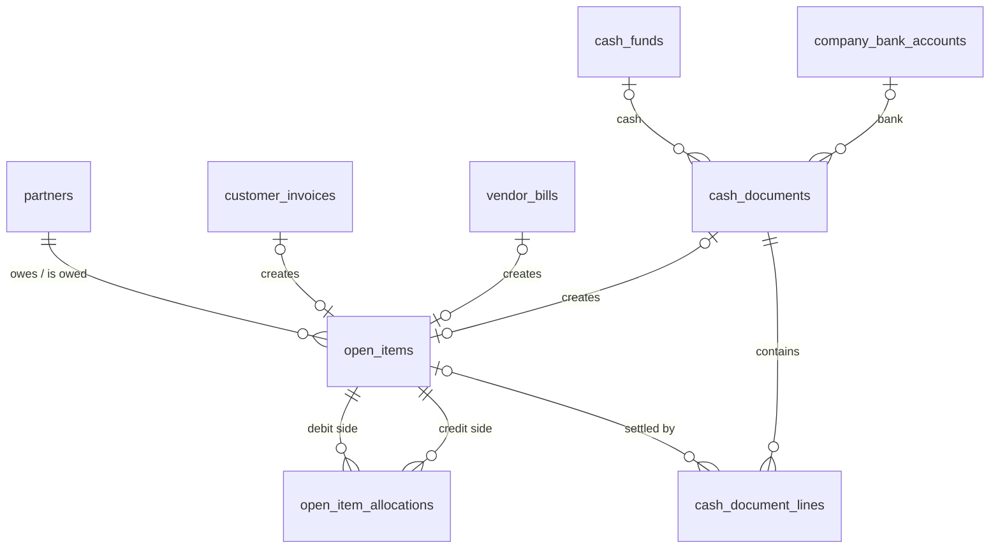

# 07 · Kế toán – Tài chính / Accounting & Finance (ACC) — Giai đoạn 6 / Phase 6

[← Giai đoạn 6 · Công nợ & thu chi / Phase 6 · Receivables, payables & cash](README.md)

Các giai đoạn khác của phân hệ / Other phases of this module: [P2](../phase-02-organization-master-data/07-accounting-finance.md) · [P9](../phase-09-accounting-einvoicing/07-accounting-finance.md) · [P10](../phase-10-expansion/07-accounting-finance.md) · [P11](../phase-11-advanced/07-accounting-finance.md)

---

## Phạm vi giai đoạn / Phase scope

- **VI:** Số dư đầu kỳ công nợ, tồn kho, tiền; công nợ phải thu / phải trả theo hóa đơn, thu tiền & cấn trừ, tuổi nợ; phiếu thu / chi, giao dịch ngân hàng, chuyển tiền nội bộ, sổ quỹ & sổ tiền gửi; ghi nhận ngoại tệ theo tỷ giá giao dịch. Sổ cái, thuế, BCTC tạm thời vẫn làm trên phần mềm kế toán hiện tại.
- **EN:** Opening AR/AP, stock and cash balances; open-item AR / AP, receipts & allocation, aging; cash receipts / payments, bank transactions, internal transfers, cash & bank books; foreign-currency recording at transaction rates. GL, tax and financial statements stay in the current accounting software for now.

## 1. Mục tiêu / Objectives

- **VI:** Ghi nhận đầy đủ, chính xác mọi nghiệp vụ kinh tế phát sinh theo chế độ kế toán Việt Nam; tự động hóa hạch toán từ các phân hệ; quản lý công nợ, tiền và thuế; lập sổ sách và báo cáo tài chính trực tiếp từ hệ thống; rút ngắn thời gian khóa sổ.
- **EN:** Record all business transactions completely and accurately under Vietnamese accounting standards; automate postings from all modules; manage receivables, payables, cash and tax; produce books and financial statements directly from the system; shorten the closing cycle.

## 2. Phạm vi & chế độ kế toán / Scope & accounting regime

| Phân hệ con / Sub-module | Giai đoạn / Phase |
|---|---|
| Công nợ phải thu / Accounts receivable (AR) | P6 |
| Công nợ phải trả / Accounts payable (AP) | P6 |
| Tiền mặt & ngân hàng / Cash & bank | P6 |
| Sổ cái / General ledger (GL) | P9 |
| Thuế / Tax | P9 |
| Báo cáo tài chính & sổ sách / Financial statements & books | P9 |
| Tài sản cố định & công cụ dụng cụ / Fixed assets & tools | P10 |
| Ngân sách / Budgeting | P11 |

- **VI:** Năm tài chính và kỳ kế toán được khai báo từ P2. Từ P6 (go-live vận hành), công nợ và thu chi chạy trên ERP; sổ cái, thuế và BCTC vẫn làm trên phần mềm kế toán hiện tại, dùng dữ liệu xuất từ ERP (`Q-ACC-05`), cho đến khi P9 hoàn thành.
- **EN:** Fiscal years and periods are set up from P2. From P6 (operations go-live), receivables, payables and cash run in the ERP; GL, tax and financial statements stay in the current accounting software, fed by data exported from the ERP (`Q-ACC-05`), until P9 is delivered.

- **VI:** Hệ thống hỗ trợ chế độ kế toán doanh nghiệp theo Thông tư 99/2025/TT-BTC (thay thế Thông tư 200/2014/TT-BTC từ 01/01/2026) và Thông tư 133/2016/TT-BTC cho doanh nghiệp nhỏ và vừa; chọn trong thông tin doanh nghiệp (FR-SYS-001). Hệ thống tài khoản, mẫu chứng từ, mẫu sổ và mẫu báo cáo phải theo chế độ được chọn và cập nhật được khi quy định thay đổi.
- **EN:** The system supports the enterprise accounting regime under Circular 99/2025/TT-BTC (replacing Circular 200/2014/TT-BTC from 2026-01-01) and Circular 133/2016/TT-BTC for SMEs, selected in the company profile (FR-SYS-001). Chart of accounts, document forms, book formats and report templates follow the selected regime and must be updatable when regulations change.

> Các tham chiếu pháp lý cần được kế toán trưởng xác nhận lại trước khi triển khai.
> Legal references must be re-validated by the chief accountant before implementation.

## 3. Yêu cầu chức năng / Functional requirements

**Thiết lập / Setup**

#### FR-ACC-004 · Số dư đầu kỳ / Opening balances
`Must` · `P6` (mở rộng / extended: `P9`)

- **VI:** Nhập công nợ đầu kỳ chi tiết theo từng hóa đơn (số, ngày, hạn thanh toán, ngoại tệ); tồn kho đầu kỳ theo kho và giá trị; số dư đầu kỳ của quỹ tiền mặt và tài khoản ngân hàng.
- **EN:** Import opening AR/AP detailed per invoice (number, date, due date, currency); opening stock by warehouse and value; opening cash fund and bank account balances.

**Sổ cái / General ledger**

#### FR-ACC-012 · Ngoại tệ / Foreign currency
`Must` · `P6` (mở rộng / extended: `P9`)

- **VI:** Ghi nhận công nợ, thu chi bằng ngoại tệ theo tỷ giá giao dịch thực tế; theo dõi cả nguyên tệ và VND.
- **EN:** Record foreign-currency receivables, payables, receipts and payments at the actual transaction rate; track both transaction currency and VND.

**Công nợ phải thu / Accounts receivable**

#### FR-ACC-013 · Công nợ theo chứng từ / Open-item receivables
`Must` · `P6`

- **VI:** Theo dõi công nợ phải thu theo khách hàng và từng hóa đơn (số tiền, đã thu, còn lại, hạn thanh toán), cả nguyên tệ và VND.
- **EN:** Track receivables per customer and per invoice (amount, paid, outstanding, due date) in both transaction currency and VND.

#### FR-ACC-014 · Thu tiền & cấn trừ / Receipts & allocation
`Must` · `P6`

- **VI:** Phân bổ một khoản thu cho một hoặc nhiều hóa đơn (tự động theo hạn cũ nhất hoặc chọn tay); khoản thu thừa ghi nhận là trả trước và cấn trừ sau.
- **EN:** Allocate a receipt to one or more invoices (automatically oldest-due-first or manually); overpayments become prepayments to be offset later.

#### FR-ACC-015 · Phân tích tuổi nợ / Aging analysis
`Must` · `P6`

- **VI:** Báo cáo tuổi nợ phải thu theo khoảng ngày cấu hình (mặc định: chưa đến hạn, 1–30, 31–60, 61–90, > 90 ngày), theo khách hàng, nhân viên bán hàng, chi nhánh.
- **EN:** AR aging by configurable buckets (default: not due, 1–30, 31–60, 61–90, > 90 days), by customer, salesperson and branch.

**Công nợ phải trả / Accounts payable**

#### FR-ACC-020 · Công nợ phải trả theo chứng từ / Open-item payables
`Must` · `P6` (mở rộng / extended: `P9`)

- **VI:** Theo dõi công nợ phải trả theo nhà cung cấp và từng hóa đơn, cả nguyên tệ và VND; báo cáo tuổi nợ phải trả.
- **EN:** Track payables per supplier and per bill in transaction currency and VND; AP aging.

**Tiền mặt & ngân hàng / Cash & bank**

#### FR-ACC-024 · Phiếu thu, phiếu chi / Cash receipts & payments
`Must` · `P6`

- **VI:** Lập phiếu thu / chi theo mẫu của chế độ kế toán, có số tiền bằng chữ, người nộp / nhận, lý do, liên kết đối tượng và hóa đơn; hỗ trợ nhiều quỹ.
- **EN:** Create cash receipts / payments in the regime's format with amount in words, payer / payee, reason, linked partner and invoices; supports multiple cash funds.

#### FR-ACC-025 · Giao dịch ngân hàng / Bank transactions
`Must` · `P6` (mở rộng / extended: `P9`)

- **VI:** Ghi nhận báo có, báo nợ, liên kết đối tượng và hóa đơn.
- **EN:** Record bank credits and debits, linked to partners and invoices.

#### FR-ACC-026 · Chuyển tiền nội bộ / Internal transfers
`Must` · `P6`

- **VI:** Chuyển tiền giữa quỹ và ngân hàng, giữa các tài khoản ngân hàng, qua tài khoản tiền đang chuyển khi cần.
- **EN:** Transfer between cash and bank and between bank accounts, via a cash-in-transit account when needed.

#### FR-ACC-028 · Sổ quỹ & sổ tiền gửi / Cash book & bank book
`Must` · `P6`

- **VI:** Sổ quỹ tiền mặt, sổ tiền gửi ngân hàng theo từng tài khoản, có số dư lũy kế theo ngày. Biên bản kiểm kê quỹ là `Should`.
- **EN:** Cash book and bank book per account with running daily balance. Cash count minutes are `Should`.

## 4. Mô hình dữ liệu / Data model

- **VI:** Công nợ theo mô hình **khoản mở** (open item): mỗi hóa đơn, trả hàng, phiếu thu / chi có đối tượng hoặc số dư đầu kỳ sinh một dòng `open_items` ở bên Nợ hoặc Có; thu / chi tiền và cấn trừ là các dòng `open_item_allocations` ghép một khoản Nợ với một khoản Có của cùng đối tượng. Khoản thu / chi chưa phân bổ hết chính là khoản trả trước (`FR-ACC-014`). Phiếu thu, phiếu chi, báo có, báo nợ và chuyển tiền nội bộ dùng chung `cash_documents`; sổ quỹ / sổ tiền gửi là view ở [10 · Báo cáo](10-reporting.md). Chưa có sổ cái: `counter_account_code` trên dòng chứng từ tiền dùng để xuất dữ liệu cho phần mềm kế toán hiện tại (`Q-ACC-05`) cho tới P9.
- **EN:** Receivables and payables use an **open-item** model: every invoice, return, partner cash document or opening balance creates one `open_items` row on the debit or credit side; receipts, payments and offsets are `open_item_allocations` rows pairing a debit item with a credit item of the same partner. An unallocated receipt / payment is the prepayment (`FR-ACC-014`). Cash receipts, cash payments, bank credits, bank debits and internal transfers share `cash_documents`; the cash / bank books are views in [10 · Reporting](10-reporting.md). There is no GL yet: `counter_account_code` on cash document lines feeds the export to the current accounting software (`Q-ACC-05`) until P9.



| Bảng / Table | Mục đích (VI) | Purpose (EN) |
|---|---|---|
| `open_items` | Khoản công nợ theo chứng từ, nguyên tệ và VND, số còn lại (`FR-ACC-013`, `FR-ACC-020`); số dư đầu kỳ có `source_type = 'OPENING'` (`FR-ACC-004`). | Open items per document, in transaction currency and VND, with the residual (`FR-ACC-013`, `FR-ACC-020`); opening balances have `source_type = 'OPENING'` (`FR-ACC-004`). |
| `open_item_allocations` | Phân bổ thu / chi cho hóa đơn, tự động theo hạn cũ nhất hoặc chọn tay (`FR-ACC-014`). | Allocation of receipts / payments to invoices, automatic oldest-due-first or manual (`FR-ACC-014`). |
| `cash_funds` | Quỹ tiền mặt theo chi nhánh, tiền tệ (`FR-ACC-024`). | Cash funds per branch and currency (`FR-ACC-024`). |
| `cash_documents`, `cash_document_lines` | Phiếu thu / chi, báo có / nợ, chuyển tiền nội bộ qua tiền đang chuyển nếu cần (`FR-ACC-024` – `026`). | Cash receipts / payments, bank credits / debits, internal transfers optionally via cash in transit (`FR-ACC-024` – `026`). |
| `cash_opening_balances` | Số dư quỹ / tài khoản ngân hàng tại ngày go-live (`FR-ACC-004`). | Cash fund / bank account balances at go-live (`FR-ACC-004`). |

| Bên / Side | Phải thu / Receivable | Phải trả / Payable |
|---|---|---|
| `DEBIT` | Hóa đơn bán, chi trả lại tiền cho khách / Customer invoice, refund to customer | Phiếu chi, trả hàng NCC / Payment, supplier return |
| `CREDIT` | Phiếu thu, trả hàng bán / Receipt, sales return | Hóa đơn mua, NCC hoàn tiền / Vendor bill, supplier refund |

<details>
<summary>Xem DDL / Show DDL</summary>

```sql
-- Chạy sau / Run after: 01-roles-permissions.md (P6)

INSERT INTO document_types (code, module, name_vi, name_en, function_code, table_name, sort_order) VALUES
  ('CR', 'ACC', 'Phiếu thu',          'Cash receipt',      'ACC.CASH_VOUCHER', 'cash_documents', 610),
  ('CP', 'ACC', 'Phiếu chi',          'Cash payment',      'ACC.CASH_VOUCHER', 'cash_documents', 620),
  ('BC', 'ACC', 'Báo có',             'Bank credit',       'ACC.BANK_TXN',     'cash_documents', 630),
  ('BD', 'ACC', 'Báo nợ',             'Bank debit',        'ACC.BANK_TXN',     'cash_documents', 640),
  ('IT', 'ACC', 'Chuyển tiền nội bộ', 'Internal transfer', 'ACC.BANK_TXN',     'cash_documents', 650);

INSERT INTO document_sequences (document_type, prefix) VALUES
  ('CR', 'CR'), ('CP', 'CP'), ('BC', 'BC'), ('BD', 'BD'), ('IT', 'IT');

INSERT INTO system_settings (key, value) VALUES
  ('ar.aging_buckets', '[30, 60, 90]')  -- FR-ACC-015: chưa đến hạn, 1–30, 31–60, 61–90, > 90
ON CONFLICT (key) DO NOTHING;

-- FR-ACC-004: tồn kho đầu kỳ nhập bằng phiếu nhập lý do OPENING.
-- ALTER TYPE … ADD VALUE phải chạy ngoài transaction (hoặc commit trước khi dùng giá trị mới).
-- Opening stock is entered as receipts with reason OPENING.
-- ALTER TYPE … ADD VALUE must run outside a transaction (or commit before the new value is used).
ALTER TYPE stock_doc_reason ADD VALUE 'OPENING';
ALTER TABLE stock_documents
  DROP CONSTRAINT stock_documents_reason_check,
  ADD CONSTRAINT stock_documents_reason_check CHECK (CASE doc_type
    WHEN 'RECEIPT'  THEN reason IN ('PURCHASE','SALES_RETURN','COUNT_SURPLUS','OTHER_RECEIPT','OPENING')
    WHEN 'ISSUE'    THEN reason IN ('SALE','SUPPLIER_RETURN','INTERNAL_USE','COUNT_SHORTAGE','OTHER_ISSUE')
    WHEN 'TRANSFER' THEN reason = 'TRANSFER' END);

-- ===== Công nợ / Receivables & payables =====
CREATE TYPE ledger_account_type AS ENUM ('RECEIVABLE','PAYABLE');
CREATE TYPE open_item_side      AS ENUM ('DEBIT','CREDIT');
CREATE TYPE open_item_source    AS ENUM ('OPENING','CUSTOMER_INVOICE','SALES_RETURN','VENDOR_BILL','PURCHASE_RETURN','CASH_DOCUMENT');

CREATE TABLE open_items (
  id               uuid                PRIMARY KEY DEFAULT gen_random_uuid(),
  account_type     ledger_account_type NOT NULL,
  partner_id       uuid                NOT NULL REFERENCES partners(id),
  branch_id        uuid                NOT NULL REFERENCES branches(id),
  side             open_item_side      NOT NULL,
  source_type      open_item_source    NOT NULL,
  source_id        uuid,                         -- NULL với số dư đầu kỳ / NULL for opening balances
  doc_no           varchar(30)         NOT NULL, -- số chứng từ / số hóa đơn gốc / document or invoice number
  doc_date         date                NOT NULL,
  due_date         date,
  currency_code    char(3)             NOT NULL REFERENCES currencies(code),
  exchange_rate    dm_rate             NOT NULL DEFAULT 1,
  amount           dm_amount           NOT NULL CHECK (amount > 0),
  amount_vnd       dm_amount           NOT NULL CHECK (amount_vnd >= 0),
  residual_amount  dm_amount           NOT NULL,
  residual_vnd     dm_amount           NOT NULL,
  description      text,
  created_at       timestamptz         NOT NULL DEFAULT now(),
  created_by       uuid                REFERENCES users(id),
  updated_at       timestamptz         NOT NULL DEFAULT now(),
  updated_by       uuid                REFERENCES users(id),
  CHECK (residual_amount BETWEEN 0 AND amount),
  CHECK ((source_type = 'OPENING') = (source_id IS NULL))
);
CREATE UNIQUE INDEX open_items_one_per_source ON open_items (source_type, source_id) WHERE source_id IS NOT NULL;
CREATE INDEX open_items_open_by_partner ON open_items (partner_id, account_type, due_date) WHERE residual_amount > 0;

CREATE TABLE open_item_allocations (
  id               uuid        PRIMARY KEY DEFAULT gen_random_uuid(),
  debit_item_id    uuid        NOT NULL REFERENCES open_items(id),
  credit_item_id   uuid        NOT NULL REFERENCES open_items(id),
  allocation_date  date        NOT NULL,
  amount           dm_amount   NOT NULL CHECK (amount > 0),  -- nguyên tệ / transaction currency
  amount_vnd       dm_amount   NOT NULL,
  is_auto          boolean     NOT NULL DEFAULT false,       -- tự động theo hạn cũ nhất / oldest-due-first
  reversed_at      timestamptz,
  reversed_by      uuid        REFERENCES users(id),
  created_at       timestamptz NOT NULL DEFAULT now(),
  created_by       uuid        REFERENCES users(id),
  CHECK (debit_item_id <> credit_item_id)
);
CREATE INDEX ON open_item_allocations (debit_item_id);
CREATE INDEX ON open_item_allocations (credit_item_id);

-- ===== Tiền mặt & ngân hàng / Cash & bank =====
CREATE TABLE cash_funds (
  id                   uuid         PRIMARY KEY DEFAULT gen_random_uuid(),
  code                 varchar(20)  NOT NULL UNIQUE,
  name                 varchar(150) NOT NULL,
  name_en              varchar(150),
  branch_id            uuid         NOT NULL REFERENCES branches(id),
  currency_code        char(3)      NOT NULL DEFAULT 'VND' REFERENCES currencies(code),
  gl_account_code      varchar(20)  NOT NULL,  -- 1111 / 1112 (FK ở / FK in P9)
  cashier_employee_id  uuid         REFERENCES employees(id),
  is_active            boolean      NOT NULL DEFAULT true,
  version              integer      NOT NULL DEFAULT 1,
  created_at           timestamptz  NOT NULL DEFAULT now(),
  created_by           uuid         REFERENCES users(id),
  updated_at           timestamptz  NOT NULL DEFAULT now(),
  updated_by           uuid         REFERENCES users(id)
);

CREATE TYPE cash_doc_type   AS ENUM ('CASH_RECEIPT','CASH_PAYMENT','BANK_CREDIT','BANK_DEBIT','INTERNAL_TRANSFER');
CREATE TYPE cash_doc_status AS ENUM ('DRAFT','POSTED','CANCELLED');

CREATE TABLE cash_documents (
  id                    uuid            PRIMARY KEY DEFAULT gen_random_uuid(),
  doc_no                varchar(30)     UNIQUE,
  doc_type              cash_doc_type   NOT NULL,
  branch_id             uuid            NOT NULL REFERENCES branches(id),
  doc_date              date            NOT NULL,
  cash_fund_id          uuid            REFERENCES cash_funds(id),             -- quỹ của chứng từ / the document's fund
  bank_account_id       uuid            REFERENCES company_bank_accounts(id),  -- tài khoản của chứng từ / the document's account
  to_cash_fund_id       uuid            REFERENCES cash_funds(id),             -- chỉ / only INTERNAL_TRANSFER
  to_bank_account_id    uuid            REFERENCES company_bank_accounts(id),
  via_in_transit        boolean         NOT NULL DEFAULT false,                -- qua TK 113 / via cash in transit
  received_date         date,                                                  -- ngày tiền đến / arrival date
  partner_id            uuid            REFERENCES partners(id),
  counterparty_name     varchar(255),   -- người nộp / nhận / payer / payee
  counterparty_address  text,
  reason                text            NOT NULL,
  currency_code         char(3)         NOT NULL REFERENCES currencies(code),
  exchange_rate         dm_rate         NOT NULL DEFAULT 1,
  amount                dm_amount       NOT NULL CHECK (amount > 0),
  amount_vnd            dm_amount       NOT NULL,
  bank_reference        varchar(100),
  status                cash_doc_status NOT NULL DEFAULT 'DRAFT',
  posted_at             timestamptz,
  posted_by             uuid            REFERENCES users(id),
  cancel_reason         text,
  version               integer         NOT NULL DEFAULT 1,
  created_at            timestamptz     NOT NULL DEFAULT now(),
  created_by            uuid            REFERENCES users(id),
  updated_at            timestamptz     NOT NULL DEFAULT now(),
  updated_by            uuid            REFERENCES users(id),
  CONSTRAINT cash_documents_account_check CHECK (CASE doc_type
    WHEN 'CASH_RECEIPT'      THEN cash_fund_id IS NOT NULL AND bank_account_id IS NULL
    WHEN 'CASH_PAYMENT'      THEN cash_fund_id IS NOT NULL AND bank_account_id IS NULL
    WHEN 'BANK_CREDIT'       THEN bank_account_id IS NOT NULL AND cash_fund_id IS NULL
    WHEN 'BANK_DEBIT'        THEN bank_account_id IS NOT NULL AND cash_fund_id IS NULL
    WHEN 'INTERNAL_TRANSFER' THEN num_nonnulls(cash_fund_id, bank_account_id) = 1
                              AND num_nonnulls(to_cash_fund_id, to_bank_account_id) = 1 END),
  CHECK (doc_type = 'INTERNAL_TRANSFER' OR num_nonnulls(to_cash_fund_id, to_bank_account_id) = 0),
  CHECK (status <> 'POSTED' OR doc_no IS NOT NULL)
);
CREATE INDEX ON cash_documents (cash_fund_id, doc_date)    WHERE cash_fund_id IS NOT NULL;
CREATE INDEX ON cash_documents (bank_account_id, doc_date) WHERE bank_account_id IS NOT NULL;
CREATE INDEX ON cash_documents (partner_id);

CREATE TABLE cash_document_lines (
  id                    uuid         PRIMARY KEY DEFAULT gen_random_uuid(),
  document_id           uuid         NOT NULL REFERENCES cash_documents(id),
  line_no               smallint     NOT NULL,
  description           varchar(500) NOT NULL,
  amount                dm_amount    NOT NULL CHECK (amount > 0),
  amount_vnd            dm_amount    NOT NULL,
  counter_account_code  varchar(20), -- TK đối ứng / offset account (Q-ACC-05; FK ở / FK in P9)
  open_item_id          uuid         REFERENCES open_items(id),  -- hóa đơn được thu / chi / invoice settled
  UNIQUE (document_id, line_no)
);

CREATE TABLE cash_opening_balances (
  id               uuid        PRIMARY KEY DEFAULT gen_random_uuid(),
  as_of_date       date        NOT NULL,  -- ngày go-live / go-live date
  cash_fund_id     uuid        REFERENCES cash_funds(id),
  bank_account_id  uuid        REFERENCES company_bank_accounts(id),
  currency_code    char(3)     NOT NULL REFERENCES currencies(code),
  amount           dm_amount   NOT NULL,
  amount_vnd       dm_amount   NOT NULL,
  created_at       timestamptz NOT NULL DEFAULT now(),
  created_by       uuid        REFERENCES users(id),
  updated_at       timestamptz NOT NULL DEFAULT now(),
  updated_by       uuid        REFERENCES users(id),
  CHECK (num_nonnulls(cash_fund_id, bank_account_id) = 1),
  UNIQUE NULLS NOT DISTINCT (cash_fund_id, bank_account_id)
);
```

</details>

## 5. Câu hỏi mở / Open questions

| # | Câu hỏi (VI) | Question (EN) |
|---|---|---|
| Q-ACC-01 | Kỳ kê khai thuế GTGT là tháng hay quý? | Is VAT filed monthly or quarterly? |
| Q-ACC-02 | Các chi nhánh hạch toán độc lập hay phụ thuộc? Có kê khai thuế riêng? | Do branches keep independent or dependent books? Do they file tax separately? |
| Q-ACC-03 | Ngân hàng nào đang sử dụng và định dạng sao kê? | Which banks are used and in what statement formats? |
| Q-ACC-04 | TSCĐ có cần làm sớm hơn P10 không (số lượng tài sản hiện có)? | Should fixed assets come earlier than P10 (how many assets exist)? |
| Q-ACC-05 | Từ P6 đến P9, phần mềm kế toán hiện tại cần ERP xuất những dữ liệu nào (hóa đơn, phiếu thu chi, nhập xuất kho…) và theo định dạng nào? | From P6 to P9, which data (invoices, cash vouchers, stock movements…) must the ERP export for the current accounting software, and in what format? |
