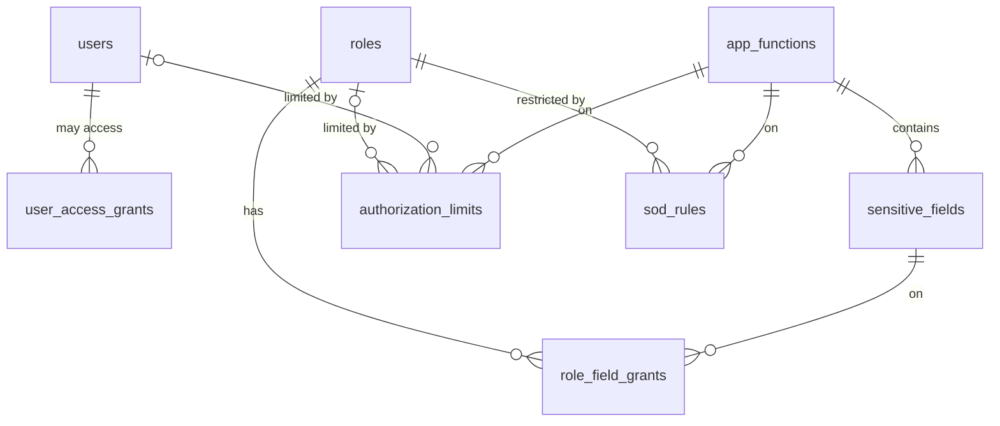

# 01 · Vai trò & Phân quyền / Roles & Permissions — Giai đoạn 7 / Phase 7

[← Giai đoạn 7 · Phê duyệt & kiểm soát / Phase 7 · Approvals & controls](README.md)

Các giai đoạn khác của phân hệ / Other phases of this module: [P1](../phase-01-foundation/01-roles-permissions.md) · [P2](../phase-02-organization-master-data/01-roles-permissions.md) · [P3](../phase-03-inventory/01-roles-permissions.md) · [P4](../phase-04-purchasing/01-roles-permissions.md) · [P5](../phase-05-sales/01-roles-permissions.md) · [P6](../phase-06-receivables-payables-cash/01-roles-permissions.md) · [P8](../phase-08-operations-completion/01-roles-permissions.md) · [P9](../phase-09-accounting-einvoicing/01-roles-permissions.md) · [P10](../phase-10-expansion/01-roles-permissions.md)

---

## Phạm vi giai đoạn / Phase scope

- **VI:** Phạm vi dữ liệu (của tôi, toàn công ty, phòng ban, chi nhánh, kho / quỹ được gán); quyền Duyệt trên danh mục; quyền theo trường; hạn mức theo vai trò hoặc người dùng; quy tắc phân tách nhiệm vụ.
- **EN:** Data scope (own, whole company, department, branch, assigned warehouse / cash fund); approve rights on master data; field-level permissions; limits per role or user; segregation-of-duties rules.

## 1. Mô hình phân quyền bổ sung / Permission model additions

| Thành phần (VI) | Component (EN) | Giá trị / Values |
|---|---|---|
| Phạm vi dữ liệu | Data scope | Của tôi / Own · Toàn công ty / All · Phòng ban / Department · Chi nhánh / Branch · Kho, quỹ được gán / Assigned |
| Hạn mức | Limits | Chiết khấu tối đa, giá trị duyệt tối đa… / Max discount, max approval amount… |
| Quyền theo trường | Field-level | Ẩn giá vốn, lãi gộp, lương… / Hide cost, gross margin, salary… |

- **VI:** Từ P2 đến P6 chỉ kiểm tra chức năng × hành động; người có quyền Xem thấy toàn bộ dữ liệu của chức năng. Từ giai đoạn này, mỗi quyền có thêm phạm vi dữ liệu (`FR-SYS-012`).
- **EN:** From P2 to P6 only function × action is checked; a user with View sees all of a function's data. From this phase on, each permission also carries a data scope (`FR-SYS-012`).

| Phạm vi / Scope | Điều kiện lọc (VI) | Filter (EN) |
|---|---|---|
| `OWN` | `owner_id` = người dùng hiện tại | `owner_id` = current user |
| `ALL` | Không lọc (toàn công ty) | No filter (whole company) |
| `DEPARTMENT` | `department_id` thuộc phòng ban được gán, kể cả phòng ban con | `department_id` in assigned departments, including sub-departments |
| `BRANCH` | `branch_id` thuộc chi nhánh được gán | `branch_id` in assigned branches |
| `ASSIGNED` | `warehouse_id` / `cash_fund_id` thuộc kho / quỹ được gán | `warehouse_id` / `cash_fund_id` in assigned warehouses / cash funds |

- **VI:** Để áp dụng được phạm vi dữ liệu, mọi bảng danh mục có người phụ trách và mọi bảng chứng từ phải có `owner_id` (người phụ trách, mặc định là người tạo), `branch_id`, `department_id`. Bảng tạo từ P2 – P6 chưa có các cột này được bổ sung bằng migration; `owner_id` của dữ liệu cũ lấy theo `created_by`.
- **EN:** For data scope to work, every master table with an owner and every document table must carry `owner_id` (the responsible user, defaulting to the creator), `branch_id` and `department_id`. Tables from P2 – P6 that lack these columns get them through a migration; existing rows take `owner_id` from `created_by`.

**Phạm vi mặc định của vai trò / Default role scopes**

| Mã / Code | Phạm vi mặc định / Default scope |
|---|---|
| `ADM` | Toàn công ty / All (chỉ cấu hình / configuration only) |
| `CEO` | Toàn công ty / All |
| `SAL` | Của tôi / Own |
| `SLM` | Phòng ban hoặc chi nhánh / Department or branch |
| `PUR` | Phòng ban / Department |
| `PUM` | Toàn công ty / All |
| `WH` | Kho được gán / Assigned warehouses |
| `WHM` | Chi nhánh / Branch |
| `ACC` | Toàn công ty / All |
| `CAC` | Toàn công ty / All |
| `CSH` | Quỹ được gán / Assigned cash funds |
| `AUD` | Toàn công ty / All |

**Quyền Duyệt trên danh mục / Approve rights on master data**

- **VI:** Bổ sung vào ma trận [P2](../phase-02-organization-master-data/01-roles-permissions.md), dùng cho luồng duyệt danh mục ([03 · Dữ liệu danh mục](03-master-data.md)).
- **EN:** Added to the [P2](../phase-02-organization-master-data/01-roles-permissions.md) matrix, used by master-data approval flows ([03 · Master Data](03-master-data.md)).

| Chức năng / Function | Mã / Code | Vai trò được thêm `A` / Roles granted `A` |
|---|---|---|
| Sản phẩm / Products | `MDM.PRODUCT` | `PUM` |
| Khách hàng / Customers | `MDM.CUSTOMER` | `SLM` |
| Nhà cung cấp / Suppliers | `MDM.SUPPLIER` | `PUM` |
| Bảng giá bán / Price lists | `MDM.PRICE_LIST` | `CEO` |

| # | Quy tắc tính quyền (VI) | Resolution rule (EN) |
|---|---|---|
| 3 | Mỗi vai trò cấp quyền tạo ra một điều kiện lọc theo phạm vi (bảng trên); điều kiện hiệu lực là **OR** của các điều kiện đó. | Each granting role yields one scope filter (table above); the effective filter is the **OR** of those filters. |
| 4 | Trường nhạy cảm ẩn mặc định, chỉ hiện khi có ít nhất một vai trò được cấp trong `role_field_grants`; `EDIT` bao gồm `VIEW`. Áp dụng cho màn hình, báo cáo, bản in, dữ liệu xuất và API. | Sensitive fields are hidden by default and shown only when at least one role has a `role_field_grants` row; `EDIT` implies `VIEW`. Applies to screens, reports, printouts, exports and the API. |
| 5 | Hạn mức: dòng theo người dùng được ưu tiên; nếu không có, lấy giá trị lớn nhất trong các vai trò; không có dòng nào = không giới hạn (xem Q-ROL-04). Số tiền tính theo đồng tiền hạch toán. | Limits: a user-level row wins; otherwise the highest value across roles applies; no row at all = unlimited (see Q-ROL-04). Amounts are in the functional currency. |
| 6 | Khi gán vai trò cho người dùng hoặc sửa quyền của vai trò, hệ thống từ chối nếu kết quả vi phạm `sod_rules`. | Assigning a role to a user or changing a role's permissions is rejected if the result violates `sod_rules`. |

- **VI:** Quy tắc 1, 2 xem [P1](../phase-01-foundation/01-roles-permissions.md).
- **EN:** Rules 1 and 2 are in [P1](../phase-01-foundation/01-roles-permissions.md).

## 2. Quy tắc phân tách nhiệm vụ / Segregation-of-duties rules

#### BR-ROL-001 · Không tự duyệt / No self-approval
`Must` · `P7`

- **VI:** Người tạo chứng từ không được duyệt chính chứng từ đó, kể cả khi có quyền duyệt.
- **EN:** The creator of a document cannot approve that same document, even if they hold the approve permission.

#### BR-ROL-002 · Tách thủ quỹ và ghi sổ / Separate cash handling and posting
`Must` · `P7`

- **VI:** Thủ quỹ không được tạo hoặc sửa bút toán sổ cái và không được duyệt phiếu chi.
- **EN:** Cashiers cannot create or edit GL journal entries and cannot approve cash payments.

#### BR-ROL-003 · Tách thông tin ngân hàng NCC và duyệt chi / Separate supplier bank details and payment approval
`Must` · `P7`

- **VI:** Người sửa tài khoản ngân hàng của nhà cung cấp không được duyệt thanh toán cho nhà cung cấp đó trong cùng kỳ.
- **EN:** A user who changes a supplier's bank account cannot approve payments to that supplier within the same period.

| Quy tắc / Rule | Cơ chế (VI) | Mechanism (EN) |
|---|---|---|
| BR-ROL-001 | Kiểm tra khi duyệt: người duyệt ≠ `created_by` của chứng từ. | Checked at approval: approver ≠ the document's `created_by`. |
| BR-ROL-002 | `sod_rules`: `CSH` × `ACC.JOURNAL_ENTRY` (`CREATE`, `EDIT`) và `CSH` × `ACC.CASH_VOUCHER` (`APPROVE`). | `sod_rules`: `CSH` × `ACC.JOURNAL_ENTRY` (`CREATE`, `EDIT`) and `CSH` × `ACC.CASH_VOUCHER` (`APPROVE`). |
| BR-ROL-003 | Kiểm tra khi duyệt chi: tra `audit_logs` các thay đổi tài khoản ngân hàng của NCC trong kỳ; người sửa ≠ người duyệt. | Checked at payment approval: look up the supplier's bank-account changes in `audit_logs` for the period; editor ≠ approver. |
| BR-ROL-006 | Mở rộng từ P2: thay đổi trên `user_access_grants`, `role_field_grants`, `authorization_limits`, `sod_rules` cũng được ghi vào `audit_logs` trong cùng giao dịch. | Extended from P2: changes to `user_access_grants`, `role_field_grants`, `authorization_limits`, `sod_rules` are also written to `audit_logs` in the same transaction. |

## 3. Mô hình dữ liệu bổ sung / Data model additions



| Thay đổi / Change | Mục đích (VI) | Purpose (EN) |
|---|---|---|
| `roles.default_data_scope` | Phạm vi mặc định của vai trò. | The role's default scope. |
| `role_permissions.data_scope` | Phạm vi riêng của một ô quyền; để trống thì dùng phạm vi mặc định của vai trò. | Scope of one permission cell; empty falls back to the role's default scope. |
| `user_access_grants` | Chi nhánh, phòng ban, kho, quỹ mà người dùng được truy cập; dùng để tính phạm vi dữ liệu. | Branches, departments, warehouses and cash funds a user may access; used to evaluate data scope. |
| `sensitive_fields` | Danh mục trường nhạy cảm: giá vốn, lãi gộp, giá mua, lương… | Catalog of sensitive fields: cost, gross margin, purchase price, salary… |
| `role_field_grants` | Vai trò được xem / sửa trường nhạy cảm nào. Không có dòng = ẩn. | Which role may view / edit which sensitive field. No row = hidden. |
| `authorization_limits` | Hạn mức theo vai trò **hoặc** theo người dùng (FR-SYS-014). | Limits per role **or** per user (FR-SYS-014). |
| `sod_rules` | Quyền mà người giữ một vai trò không được có, dù đến từ vai trò nào. | Permissions a holder of a given role must not have, whichever role grants them. |

| Kiểu / Type | Giá trị / Values |
|---|---|
| `data_scope` | `OWN` · `ALL` · `DEPARTMENT` · `BRANCH` · `ASSIGNED` (kho / quỹ được gán / assigned warehouses / cash funds) |
| `access_object_type` | `BRANCH` · `DEPARTMENT` · `WAREHOUSE` · `CASH_FUND` |
| `field_access` | `VIEW` · `EDIT` |
| `limit_type` | `MAX_DISCOUNT_PCT` · `MAX_SELF_CONFIRM_AMOUNT` · `MAX_APPROVAL_AMOUNT` |

<details>
<summary>Xem DDL / Show DDL</summary>

```sql
CREATE TYPE data_scope AS ENUM ('OWN','ALL','DEPARTMENT','BRANCH','ASSIGNED');

ALTER TABLE roles
  ADD COLUMN default_data_scope data_scope NOT NULL DEFAULT 'ALL';

ALTER TABLE role_permissions
  ADD COLUMN data_scope data_scope;  -- NULL = roles.default_data_scope

CREATE TYPE access_object_type AS ENUM ('BRANCH','DEPARTMENT','WAREHOUSE','CASH_FUND');
CREATE TYPE field_access       AS ENUM ('VIEW','EDIT');
CREATE TYPE limit_type         AS ENUM ('MAX_DISCOUNT_PCT','MAX_SELF_CONFIRM_AMOUNT','MAX_APPROVAL_AMOUNT');

-- object_id trỏ tới branches / departments / warehouses / cash_funds tùy object_type
-- object_id points to branches / departments / warehouses / cash_funds depending on object_type
CREATE TABLE user_access_grants (
  id           uuid               PRIMARY KEY DEFAULT gen_random_uuid(),
  user_id      uuid               NOT NULL REFERENCES users(id),
  object_type  access_object_type NOT NULL,
  object_id    uuid               NOT NULL,
  granted_at   timestamptz        NOT NULL DEFAULT now(),
  granted_by   uuid               REFERENCES users(id),
  UNIQUE (user_id, object_type, object_id)
);

CREATE TABLE sensitive_fields (
  code           varchar(80)  PRIMARY KEY,  -- vd / e.g. 'MDM.PRODUCT.cost_price'
  function_code  varchar(50)  NOT NULL REFERENCES app_functions(code),
  name_vi        varchar(150) NOT NULL,
  name_en        varchar(150) NOT NULL
);

CREATE TABLE role_field_grants (
  role_id     uuid         NOT NULL REFERENCES roles(id) ON DELETE CASCADE,
  field_code  varchar(80)  NOT NULL REFERENCES sensitive_fields(code),
  access      field_access NOT NULL DEFAULT 'VIEW',
  PRIMARY KEY (role_id, field_code)
);

CREATE TABLE authorization_limits (
  id             uuid          PRIMARY KEY DEFAULT gen_random_uuid(),
  role_id        uuid          REFERENCES roles(id) ON DELETE CASCADE,
  user_id        uuid          REFERENCES users(id),
  function_code  varchar(50)   NOT NULL REFERENCES app_functions(code),
  limit_type     limit_type    NOT NULL,
  limit_value    numeric(18,4) NOT NULL CHECK (limit_value >= 0),
  updated_at     timestamptz   NOT NULL DEFAULT now(),
  updated_by     uuid          REFERENCES users(id),
  CHECK (num_nonnulls(role_id, user_id) = 1),
  CHECK (limit_type <> 'MAX_DISCOUNT_PCT' OR limit_value <= 100),
  UNIQUE NULLS NOT DISTINCT (role_id, user_id, function_code, limit_type)
);

CREATE TABLE sod_rules (
  id             uuid              PRIMARY KEY DEFAULT gen_random_uuid(),
  rule_code      varchar(20)       NOT NULL,  -- vd / e.g. 'BR-ROL-002'
  role_id        uuid              NOT NULL REFERENCES roles(id) ON DELETE CASCADE,
  function_code  varchar(50)       NOT NULL REFERENCES app_functions(code),
  action         permission_action NOT NULL,
  is_active      boolean           NOT NULL DEFAULT true,
  UNIQUE (role_id, function_code, action)
);
```

</details>

## 4. Câu hỏi mở / Open questions

| # | Câu hỏi (VI) | Question (EN) |
|---|---|---|
| Q-ROL-02 | Nhân viên kinh doanh có được xem giá vốn / lãi gộp không? | May sales staff see cost / gross margin? |
| Q-ROL-03 | Ngưỡng giá trị phiếu chi cần ban giám đốc duyệt? | Payment amount threshold requiring executive approval? |
| Q-ROL-04 | Vai trò có quyền duyệt nhưng chưa khai báo hạn mức thì được duyệt không giới hạn hay bị chặn? | If a role can approve but has no limit configured, is approval unlimited or blocked? |
