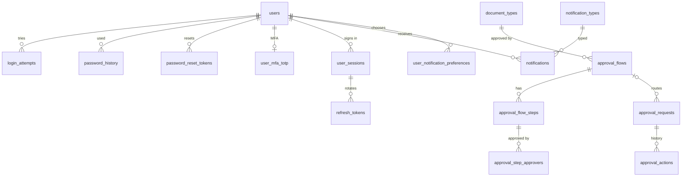

# 02 · Quản trị hệ thống / System Administration (SYS) — Giai đoạn 7 / Phase 7

[← Giai đoạn 7 · Phê duyệt & kiểm soát / Phase 7 · Approvals & controls](README.md)

Các giai đoạn khác của phân hệ / Other phases of this module: [P1](../phase-01-foundation/02-system-administration.md) · [P2](../phase-02-organization-master-data/02-system-administration.md) · [P3](../phase-03-inventory/02-system-administration.md) · [P6](../phase-06-receivables-payables-cash/02-system-administration.md) · [P8](../phase-08-operations-completion/02-system-administration.md) · [P9](../phase-09-accounting-einvoicing/02-system-administration.md) · [P10](../phase-10-expansion/02-system-administration.md) · [P11](../phase-11-advanced/02-system-administration.md)

---

## Phạm vi giai đoạn / Phase scope

- **VI:** Xác thực hai lớp, quản lý phiên; phạm vi dữ liệu, quyền theo trường, hạn mức; duyệt một cấp và luồng duyệt nhiều cấp; thông báo. Chuyển từ P2: quên mật khẩu, khóa tài khoản, lịch sử mật khẩu, đăng xuất mọi thiết bị; sao chép vai trò; nhật ký kiểm toán; chuyển ngôn ngữ theo người dùng.
- **EN:** MFA, session management; data scope, field-level permissions, limits; single-level approval and multi-level approval flows; notifications. Moved from P2: forgot password, lockout, password history, sign-out from all devices; role cloning; audit log; per-user language switching.

## 1. Yêu cầu chức năng / Functional requirements

**Người dùng & xác thực / Users & authentication**

#### FR-SYS-007 · Quên mật khẩu / Forgot password
`Must` · `P7`

- **VI:** Người dùng nhận liên kết đặt lại mật khẩu qua email; liên kết dùng một lần và hết hạn sau 30 phút. Hệ thống không tiết lộ email có tồn tại hay không.
- **EN:** Users receive a password-reset link by email; the link is single-use and expires after 30 minutes. The system does not reveal whether an email exists.

#### FR-SYS-008 · Xác thực hai lớp / Multi-factor authentication
`Should` · `P7`

- **VI:** Hỗ trợ xác thực hai lớp bằng ứng dụng TOTP (Google Authenticator, Microsoft Authenticator). Bắt buộc với vai trò `ADM`, `CAC`, `CEO` (cấu hình được).
- **EN:** Support MFA with TOTP apps (Google Authenticator, Microsoft Authenticator). Mandatory for `ADM`, `CAC`, `CEO` roles (configurable).

#### FR-SYS-010 · Quản lý phiên đăng nhập / Session management
`Should` · `P7`

- **VI:** Người dùng xem danh sách phiên đang hoạt động (thiết bị, IP, thời gian) và thu hồi phiên. Hệ thống tự đăng xuất sau 30 phút không hoạt động (cấu hình được).
- **EN:** Users view active sessions (device, IP, time) and can revoke them. The system signs out automatically after 30 minutes of inactivity (configurable).

**Phân quyền / Authorization**

#### FR-SYS-012 · Phạm vi dữ liệu / Data scope
`Must` · `P7`

- **VI:** Mỗi quyền có phạm vi dữ liệu: của tôi (chứng từ do mình phụ trách), toàn công ty, phòng ban (kể cả phòng ban con), chi nhánh, kho / quỹ được gán. Phạm vi áp dụng cho danh sách, tìm kiếm, báo cáo, xuất dữ liệu và API.
- **EN:** Each permission has a data scope: own (documents the user is responsible for), whole company, department (including sub-departments), branch, assigned warehouse / cash fund. Scope applies to lists, search, reports, exports and the API.

#### FR-SYS-013 · Quyền theo trường dữ liệu / Field-level permissions
`Should` · `P7`

- **VI:** Có thể ẩn các trường nhạy cảm (giá vốn, lãi gộp, giá mua, lương) theo vai trò trên màn hình, báo cáo, bản in và dữ liệu xuất.
- **EN:** Sensitive fields (cost, gross margin, purchase price, salary) can be hidden per role on screens, reports, printouts and exports.

#### FR-SYS-014 · Hạn mức theo vai trò / Role-based limits
`Should` · `P7`

- **VI:** Cấu hình hạn mức theo vai trò hoặc người dùng: % chiết khấu tối đa, giá trị đơn tối đa được tự xác nhận, giá trị duyệt tối đa.
- **EN:** Configure limits per role or user: maximum discount %, maximum order value that can be self-confirmed, maximum approval amount.

**Luồng phê duyệt / Approval workflow**

#### FR-SYS-015 · Cấu hình luồng duyệt / Configure approval flows
`Must` · `P7`

- **VI:** Cấu hình luồng duyệt theo loại chứng từ với điều kiện (giá trị, chi nhánh, phòng ban, % chiết khấu, loại chi phí) và nhiều cấp duyệt tuần tự. Người duyệt có thể là người dùng cụ thể, vai trò hoặc "quản lý trực tiếp". Duyệt song song (tất cả / bất kỳ) là `Should`, `P10`.
- **EN:** Configure approval flows per document type with conditions (amount, branch, department, discount %, expense type) and multiple sequential levels. Approvers can be a specific user, a role or "direct manager". Parallel approval (all / any) is `Should`, `P10`.

#### FR-SYS-016 · Thực hiện duyệt / Approve or reject
`Must` · `P7`

- **VI:** Mỗi loại chứng từ có cấu hình bật / tắt yêu cầu duyệt. Chứng từ cần duyệt chờ một người có quyền Duyệt trên chức năng đó (duyệt một cấp) hoặc đi theo luồng duyệt nhiều cấp có điều kiện (`FR-SYS-015`); người duyệt duyệt, từ chối (bắt buộc nhập lý do) hoặc trả lại để sửa; hỗ trợ duyệt hàng loạt. Lịch sử duyệt (người, thời điểm, ý kiến) hiển thị trên chứng từ. Có màn hình "Chờ tôi duyệt".
- **EN:** Each document type has an on / off approval setting. Documents that require approval wait for one user holding the Approve permission on that function (single-level) or follow a multi-level conditional flow (`FR-SYS-015`); the approver approves, rejects (reason required) or returns the document for revision; bulk approval is supported. Approval history (who, when, comments) is shown on the document. There is a "Waiting for my approval" inbox.

**Tiện ích dùng chung / Common utilities**

#### FR-SYS-025 · Thông báo / Notifications
`Must` · `P7`

- **VI:** Thông báo trong ứng dụng và qua email cho các sự kiện: chờ duyệt, được duyệt/từ chối, chứng từ được giao xử lý, hợp đồng/lô hàng sắp hết hạn, công nợ đến hạn. Người dùng tùy chọn kênh nhận cho từng loại.
- **EN:** In-app and email notifications for: pending approval, approved/rejected, document assigned, contract/lot nearing expiry, receivable/payable due. Users choose channels per notification type.

#### FR-SYS-029 · Nhật ký kiểm toán / Audit log
`Must` · `P7`

- **VI:** Ghi nhận mọi thao tác tạo, sửa, xóa, duyệt, hủy, in, xuất dữ liệu, đăng nhập (thành công/thất bại) với: người dùng, thời điểm, IP, giá trị trước – sau. Nhật ký không thể sửa hoặc xóa bởi bất kỳ người dùng nào; tra cứu theo chứng từ, người dùng, khoảng thời gian.
- **EN:** Record every create, update, delete, approve, cancel, print, export and login (success/failure) action with: user, timestamp, IP, before/after values. The log cannot be edited or deleted by any user; it is searchable by document, user and time range.

**Mở rộng yêu cầu của giai đoạn trước / Extensions to earlier-phase requirements**

| Mã / ID | Mở rộng (VI) | Extension (EN) |
|---|---|---|
| FR-SYS-004 | Gán chi nhánh, phòng ban, kho và quỹ được truy cập để áp dụng phạm vi dữ liệu (`FR-SYS-012`). | Assign accessible branches, departments, warehouses and cash funds to drive data scope (`FR-SYS-012`). |
| FR-SYS-005 | Đăng xuất khỏi tất cả thiết bị. | Sign out of all devices. |
| FR-SYS-006 | Không trùng 5 mật khẩu gần nhất. Tài khoản bị khóa tạm thời sau 5 lần đăng nhập sai liên tiếp trong 15 phút. Các tham số này cấu hình được. | Passwords must differ from the last 5 passwords. Accounts are temporarily locked after 5 consecutive failed logins within 15 minutes. These parameters are configurable. |
| FR-SYS-011 | Sao chép vai trò có sẵn để tạo vai trò mới. | Clone an existing role to create a new one. |
| FR-SYS-031 | Người dùng chuyển ngôn ngữ giao diện VI / EN bất kỳ lúc nào; lựa chọn được lưu theo người dùng. | Users switch the UI language between VI and EN at any time; the choice is saved per user. |

## 2. Quy tắc nghiệp vụ / Business rules

| Mã / ID | Quy tắc (VI) | Rule (EN) | Giai đoạn / Phase |
|---|---|---|---|
| BR-SYS-004 | Chứng từ đang chờ duyệt không được sửa; người tạo phải rút lại (recall) trước khi sửa. | Documents pending approval cannot be edited; the creator must recall them first. | P7 |
| BR-SYS-005 | Sửa chứng từ đã duyệt làm thay đổi giá trị trọng yếu (số tiền, số lượng, đối tác) sẽ đưa chứng từ về trạng thái chờ duyệt lại. | Editing an approved document's key values (amount, quantity, partner) sends it back for re-approval. | P7 |

## 3. Mô hình dữ liệu / Data model

- **VI:** Phạm vi dữ liệu, quyền theo trường, hạn mức, phân tách nhiệm vụ, sao chép vai trò và nhật ký kiểm toán (`audit_logs`) nằm ở [01 · Vai trò & phân quyền](01-roles-permissions.md). Tệp này bổ sung: bảo mật tài khoản, phiên đăng nhập, luồng duyệt và thông báo. Bật / tắt duyệt theo loại chứng từ bằng `document_types.approval_mode` (`NONE` / `SINGLE` / `FLOW`); với `FLOW`, luồng có `priority` nhỏ nhất thỏa mọi điều kiện khác `NULL` được chọn, không luồng nào thỏa thì chứng từ được xác nhận ngay. Người duyệt "quản lý trực tiếp" là trưởng phòng ban của người gửi (`departments.head_employee_id`) cho tới khi có quản lý trực tiếp trong hồ sơ nhân sự (P10).
- **EN:** Data scope, field-level permissions, limits, segregation of duties, role cloning and the audit log (`audit_logs`) live in [01 · Roles & permissions](01-roles-permissions.md). This file adds account security, sessions, approval flows and notifications. Approval is switched on / off per document type with `document_types.approval_mode` (`NONE` / `SINGLE` / `FLOW`); with `FLOW`, the active flow with the lowest `priority` whose non-`NULL` conditions all match is chosen, and if none matches the document is confirmed immediately. The "direct manager" approver is the head of the submitter's department (`departments.head_employee_id`) until direct managers exist in HR records (P10).



| Bảng / Table | Mục đích (VI) | Purpose (EN) |
|---|---|---|
| `users` (cột mới / new columns) | Ngôn ngữ giao diện (`FR-SYS-031`), khóa tạm thời `locked_until` (`FR-SYS-006`), bật MFA. | UI language (`FR-SYS-031`), temporary lock `locked_until` (`FR-SYS-006`), MFA flag. |
| `login_attempts` | Mọi lần đăng nhập thành công / thất bại; đếm lần sai trong 15 phút để khóa tạm thời. | Every successful / failed login; failures within 15 minutes drive the temporary lock. |
| `password_history` | 5 mật khẩu gần nhất không được dùng lại (`FR-SYS-006`). | The last 5 passwords cannot be reused (`FR-SYS-006`). |
| `password_reset_tokens` | Liên kết đặt lại mật khẩu dùng một lần, hết hạn sau 30 phút (`FR-SYS-007`). | Single-use reset links expiring after 30 minutes (`FR-SYS-007`). |
| `user_mfa_totp` | Bí mật TOTP (mã hóa) và bước thời gian đã dùng để chống dùng lại mã (`FR-SYS-008`). | Encrypted TOTP secret and last used time step for replay protection (`FR-SYS-008`). |
| `user_sessions` | Phiên đăng nhập theo thiết bị; thu hồi một phiên hoặc tất cả (`FR-SYS-005`, `FR-SYS-010`). | Per-device sessions; revoke one or all (`FR-SYS-005`, `FR-SYS-010`). |
| `approval_flows`, `approval_flow_steps`, `approval_step_approvers` | Cấu hình luồng duyệt có điều kiện, nhiều bước tuần tự (`FR-SYS-015`). | Conditional, multi-step sequential approval flows (`FR-SYS-015`). |
| `approval_requests`, `approval_actions` | Lượt duyệt của một chứng từ và lịch sử duyệt / từ chối / trả lại / rút lại (`FR-SYS-016`, `BR-SYS-004`); `snapshot` giữ giá trị trọng yếu để phát hiện thay đổi cần duyệt lại (`BR-SYS-005`). | Approval rounds per document and the approve / reject / return / recall history (`FR-SYS-016`, `BR-SYS-004`); `snapshot` keeps key values to detect changes needing re-approval (`BR-SYS-005`). |
| `approval_inbox(user)`, `direct_manager_user_ids(user)` | Màn hình "Chờ tôi duyệt", loại chứng từ do chính người dùng gửi (`BR-ROL-001`); hàm xác định quản lý trực tiếp. | The "Waiting for my approval" inbox, excluding documents the user submitted (`BR-ROL-001`); the direct-manager resolver. |
| `notification_types`, `notifications`, `user_notification_preferences` | Thông báo trong ứng dụng / email và lựa chọn kênh theo loại (`FR-SYS-025`). | In-app / email notifications and per-type channel choice (`FR-SYS-025`). |

<details>
<summary>Xem DDL / Show DDL</summary>

```sql
-- Chạy sau / Run after: 01-roles-permissions.md (P7)

INSERT INTO system_settings (key, value) VALUES
  ('security.password_history_count',    '5'),
  ('security.lockout_threshold',         '5'),
  ('security.lockout_window_minutes',    '15'),
  ('security.lockout_duration_minutes',  '15'),
  ('security.password_reset_ttl_minutes','30'),
  ('security.session_idle_minutes',      '30'),
  ('security.mfa_required_roles',        '["ADM","CAC","CEO"]')
ON CONFLICT (key) DO NOTHING;

-- ===== Tài khoản & phiên / Accounts & sessions =====
CREATE TYPE ui_language AS ENUM ('vi','en');

ALTER TABLE users
  ADD COLUMN preferred_language  ui_language,          -- NULL = general.default_language
  ADD COLUMN locked_until        timestamptz,          -- khóa tạm thời / temporary lock (FR-SYS-006)
  ADD COLUMN mfa_enabled         boolean NOT NULL DEFAULT false;

CREATE TABLE login_attempts (
  id              bigint       GENERATED ALWAYS AS IDENTITY PRIMARY KEY,
  attempted_at    timestamptz  NOT NULL DEFAULT now(),
  login_name      varchar(255) NOT NULL,   -- email / tên đăng nhập đã nhập / as typed
  user_id         uuid         REFERENCES users(id),
  success         boolean      NOT NULL,
  failure_reason  varchar(30),             -- 'BAD_PASSWORD','LOCKED','MFA_FAILED','UNKNOWN_USER'
  ip_address      inet,
  user_agent      text
);
CREATE INDEX ON login_attempts (user_id, attempted_at DESC);
CREATE INDEX ON login_attempts (ip_address, attempted_at DESC);

CREATE TABLE password_history (
  id             bigint      GENERATED ALWAYS AS IDENTITY PRIMARY KEY,
  user_id        uuid        NOT NULL REFERENCES users(id),
  password_hash  text        NOT NULL,
  changed_at     timestamptz NOT NULL DEFAULT now()
);
CREATE INDEX ON password_history (user_id, changed_at DESC);

CREATE TABLE password_reset_tokens (
  id            uuid        PRIMARY KEY DEFAULT gen_random_uuid(),
  user_id       uuid        NOT NULL REFERENCES users(id),
  token_hash    text        NOT NULL UNIQUE,
  expires_at    timestamptz NOT NULL,
  used_at       timestamptz,
  requested_ip  inet,
  created_at    timestamptz NOT NULL DEFAULT now(),
  CHECK (expires_at > created_at)
);

CREATE TABLE user_mfa_totp (
  user_id            uuid         PRIMARY KEY REFERENCES users(id),
  secret_ciphertext  bytea        NOT NULL,
  secret_key_id      varchar(100) NOT NULL,
  confirmed_at       timestamptz,            -- NULL = chưa quét mã xong / enrolment not finished
  last_used_step     bigint,                 -- chống dùng lại mã / replay protection
  created_at         timestamptz  NOT NULL DEFAULT now(),
  updated_at         timestamptz  NOT NULL DEFAULT now()
);

CREATE TABLE user_sessions (
  id               uuid         PRIMARY KEY DEFAULT gen_random_uuid(),
  user_id          uuid         NOT NULL REFERENCES users(id),
  created_at       timestamptz  NOT NULL DEFAULT now(),
  last_seen_at     timestamptz  NOT NULL DEFAULT now(),  -- tự đăng xuất khi quá session_idle_minutes
  ip_address       inet,
  user_agent       text,
  mfa_verified_at  timestamptz,
  revoked_at       timestamptz,
  revoked_by       uuid         REFERENCES users(id),
  revoke_reason    varchar(20)  -- 'LOGOUT','LOGOUT_ALL','IDLE','ADMIN','LOCKED'
);
CREATE INDEX ON user_sessions (user_id) WHERE revoked_at IS NULL;

ALTER TABLE refresh_tokens ADD COLUMN session_id uuid REFERENCES user_sessions(id);

-- BR-SYS-003: khóa người dùng thu hồi cả phiên / locking a user also revokes sessions
CREATE OR REPLACE FUNCTION trg_users_revoke_tokens_on_lock() RETURNS trigger
LANGUAGE plpgsql AS $$
BEGIN
  UPDATE refresh_tokens SET revoked_at = now()
   WHERE user_id = NEW.id AND revoked_at IS NULL;
  UPDATE user_sessions SET revoked_at = now(), revoke_reason = 'LOCKED'
   WHERE user_id = NEW.id AND revoked_at IS NULL;
  RETURN NEW;
END $$;

-- ===== Luồng duyệt / Approval workflow =====
CREATE TYPE approval_mode AS ENUM ('NONE','SINGLE','FLOW');
ALTER TABLE document_types ADD COLUMN approval_mode approval_mode NOT NULL DEFAULT 'NONE';

CREATE TABLE approval_flows (
  id                   uuid         PRIMARY KEY DEFAULT gen_random_uuid(),
  code                 varchar(30)  NOT NULL UNIQUE,
  name                 varchar(150) NOT NULL,
  name_en              varchar(150),
  document_type        varchar(10)  NOT NULL REFERENCES document_types(code),
  priority             integer      NOT NULL DEFAULT 100,
  -- Điều kiện, NULL = không xét / conditions, NULL = ignored
  amount_from          dm_amount,   -- VND
  amount_to            dm_amount,
  branch_id            uuid         REFERENCES branches(id),
  department_id        uuid         REFERENCES departments(id),
  discount_pct_from    dm_pct,
  expense_category_id  uuid         REFERENCES expense_categories(id),
  product_category_id  uuid         REFERENCES product_categories(id),  -- FR-PUR-009
  trigger_reason       varchar(30), -- 'CREDIT_LIMIT','BELOW_MIN_PRICE','DISCOUNT_LIMIT','OVER_TOLERANCE'…
  is_active            boolean      NOT NULL DEFAULT true,
  version              integer      NOT NULL DEFAULT 1,
  created_at           timestamptz  NOT NULL DEFAULT now(),
  created_by           uuid         REFERENCES users(id),
  updated_at           timestamptz  NOT NULL DEFAULT now(),
  updated_by           uuid         REFERENCES users(id),
  CHECK (amount_to IS NULL OR amount_from IS NULL OR amount_to >= amount_from)
);
CREATE INDEX ON approval_flows (document_type, priority) WHERE is_active;

CREATE TABLE approval_flow_steps (
  id       uuid         PRIMARY KEY DEFAULT gen_random_uuid(),
  flow_id  uuid         NOT NULL REFERENCES approval_flows(id) ON DELETE CASCADE,
  step_no  smallint     NOT NULL CHECK (step_no > 0),
  name     varchar(150),
  UNIQUE (flow_id, step_no)
);

CREATE TYPE approver_type AS ENUM ('USER','ROLE','DIRECT_MANAGER');

CREATE TABLE approval_step_approvers (
  id             uuid          PRIMARY KEY DEFAULT gen_random_uuid(),
  step_id        uuid          NOT NULL REFERENCES approval_flow_steps(id) ON DELETE CASCADE,
  approver_type  approver_type NOT NULL,
  user_id        uuid          REFERENCES users(id),
  role_id        uuid          REFERENCES roles(id),
  CHECK (CASE approver_type
           WHEN 'USER' THEN user_id IS NOT NULL AND role_id IS NULL
           WHEN 'ROLE' THEN role_id IS NOT NULL AND user_id IS NULL
           ELSE user_id IS NULL AND role_id IS NULL END)
);

CREATE TYPE approval_status AS ENUM ('PENDING','APPROVED','REJECTED','RETURNED','RECALLED');

CREATE TABLE approval_requests (
  id               uuid            PRIMARY KEY DEFAULT gen_random_uuid(),
  document_type    varchar(10)     NOT NULL REFERENCES document_types(code),
  document_id      uuid            NOT NULL,
  flow_id          uuid            REFERENCES approval_flows(id),   -- NULL = duyệt một cấp / single-level
  current_step_no  smallint        NOT NULL DEFAULT 1,
  status           approval_status NOT NULL DEFAULT 'PENDING',
  reasons          text[]          NOT NULL DEFAULT '{}',           -- vd / e.g. {CREDIT_LIMIT}
  amount_vnd       dm_amount,
  snapshot         jsonb,                                           -- BR-SYS-005
  submitted_by     uuid            NOT NULL REFERENCES users(id),
  submitted_at     timestamptz     NOT NULL DEFAULT now(),
  completed_at     timestamptz
);
-- BR-SYS-004: mỗi chứng từ chỉ một lượt đang chờ / one pending round per document
CREATE UNIQUE INDEX approval_requests_one_pending
  ON approval_requests (document_type, document_id) WHERE status = 'PENDING';
CREATE INDEX ON approval_requests (document_type, document_id);

CREATE TYPE approval_action_type AS ENUM ('SUBMIT','APPROVE','REJECT','RETURN','RECALL');

CREATE TABLE approval_actions (
  id             bigint               GENERATED ALWAYS AS IDENTITY PRIMARY KEY,
  request_id     uuid                 NOT NULL REFERENCES approval_requests(id),
  step_no        smallint             NOT NULL,
  action         approval_action_type NOT NULL,
  actor_user_id  uuid                 NOT NULL REFERENCES users(id),
  comment        text,
  acted_at       timestamptz          NOT NULL DEFAULT now(),
  CHECK (action NOT IN ('REJECT','RETURN') OR comment IS NOT NULL)  -- lý do bắt buộc / reason required
);
CREATE INDEX ON approval_actions (request_id, acted_at);

-- "Quản lý trực tiếp": trưởng phòng ban của người dùng; P10 thay bằng quản lý trong hồ sơ nhân sự
-- "Direct manager": head of the user's department; P10 replaces it with the manager from HR records
CREATE FUNCTION direct_manager_user_ids(p_user_id uuid) RETURNS SETOF uuid
LANGUAGE sql STABLE AS $$
  SELECT mgr.id
  FROM users u
  JOIN employees e   ON e.id = u.employee_id
  JOIN departments d ON d.id = e.department_id
  JOIN users mgr     ON mgr.employee_id = d.head_employee_id
  WHERE u.id = p_user_id
$$;

-- "Chờ tôi duyệt" / "Waiting for my approval". Hạn mức và phạm vi dữ liệu kiểm thêm ở service.
-- Limits and data scope are additionally checked by the service.
CREATE FUNCTION approval_inbox(p_user_id uuid) RETURNS SETOF approval_requests
LANGUAGE sql STABLE AS $$
  SELECT ar.*
  FROM approval_requests ar
  WHERE ar.status = 'PENDING'
    AND ar.submitted_by <> p_user_id                                   -- BR-ROL-001
    AND (
      EXISTS (                                                         -- luồng nhiều cấp / multi-level
        SELECT 1
        FROM approval_flow_steps s
        JOIN approval_step_approvers ap ON ap.step_id = s.id
        WHERE s.flow_id = ar.flow_id AND s.step_no = ar.current_step_no
          AND (   (ap.approver_type = 'USER' AND ap.user_id = p_user_id)
               OR (ap.approver_type = 'ROLE' AND EXISTS (
                     SELECT 1 FROM user_roles ur WHERE ur.user_id = p_user_id AND ur.role_id = ap.role_id))
               OR (ap.approver_type = 'DIRECT_MANAGER'
                   AND p_user_id IN (SELECT direct_manager_user_ids(ar.submitted_by))))
      )
      OR (ar.flow_id IS NULL AND EXISTS (                              -- một cấp / single-level
        SELECT 1
        FROM document_types dt
        JOIN v_user_permissions up ON up.function_code = dt.function_code AND up.action = 'APPROVE'
        WHERE dt.code = ar.document_type AND up.user_id = p_user_id))
    )
$$;

-- ===== Thông báo / Notifications =====
CREATE TABLE notification_types (
  code           varchar(50)  PRIMARY KEY,
  name_vi        varchar(150) NOT NULL,
  name_en        varchar(150) NOT NULL,
  default_in_app boolean      NOT NULL DEFAULT true,
  default_email  boolean      NOT NULL DEFAULT true
);

INSERT INTO notification_types (code, name_vi, name_en) VALUES
  ('APPROVAL_PENDING',      'Chứng từ chờ duyệt',                'Document pending approval'),
  ('APPROVAL_DECIDED',      'Chứng từ được duyệt / bị từ chối',  'Document approved / rejected'),
  ('DOCUMENT_ASSIGNED',     'Chứng từ được giao xử lý',          'Document assigned'),
  ('EXPIRY_ALERT',          'Hợp đồng / lô hàng sắp hết hạn',    'Contract / lot nearing expiry'),
  ('DUE_REMINDER',          'Công nợ đến hạn',                   'Receivable / payable due'),
  ('SUPPLIER_BANK_CHANGED', 'Đổi tài khoản ngân hàng NCC',       'Supplier bank account changed');  -- BR-MDM-004

CREATE TABLE notifications (
  id                bigint       GENERATED ALWAYS AS IDENTITY PRIMARY KEY,
  user_id           uuid         NOT NULL REFERENCES users(id),
  type_code         varchar(50)  NOT NULL REFERENCES notification_types(code),
  title             varchar(255) NOT NULL,  -- theo ngôn ngữ người nhận / in the recipient's language
  body              text,
  entity_type       varchar(50),
  entity_id         uuid,
  email_message_id  uuid,                   -- FK thêm ở / FK added in 11-integrations (P7)
  read_at           timestamptz,
  created_at        timestamptz  NOT NULL DEFAULT now()
);
CREATE INDEX ON notifications (user_id, created_at DESC);
CREATE INDEX notifications_unread ON notifications (user_id) WHERE read_at IS NULL;

CREATE TABLE user_notification_preferences (
  user_id    uuid        NOT NULL REFERENCES users(id),
  type_code  varchar(50) NOT NULL REFERENCES notification_types(code),
  in_app     boolean     NOT NULL,
  email      boolean     NOT NULL,
  PRIMARY KEY (user_id, type_code)
);
```

</details>
