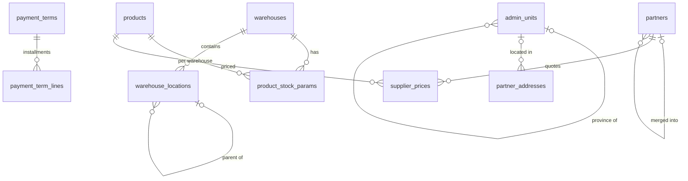

# 03 · Dữ liệu danh mục / Master Data (MDM) — Giai đoạn 8 / Phase 8

[← Giai đoạn 8 · Hoàn thiện mua – bán – kho / Phase 8 · Operations completion](README.md)

Các giai đoạn khác của phân hệ / Other phases of this module: [P2](../phase-02-organization-master-data/03-master-data.md) · [P7](../phase-07-approvals-controls/03-master-data.md) · [P9](../phase-09-accounting-einvoicing/03-master-data.md) · [P11](../phase-11-advanced/03-master-data.md)

---

## Phạm vi giai đoạn / Phase scope

- **VI:** Theo dõi lô / serial; tham số tồn kho; phát hiện trùng; thanh toán nhiều đợt; vị trí trong kho; địa chỉ hành chính; bảng giá nâng cao, bảng giá mua.
- **EN:** Lot / serial tracking; stock parameters; duplicate detection; installment terms; bin locations; administrative addresses; advanced price lists, supplier price lists.

## 1. Yêu cầu chức năng / Functional requirements

**Sản phẩm / Products**

#### FR-MDM-004 · Phương thức theo dõi lô / serial / Lot & serial tracking setting
`Must` · `P8`

- **VI:** Cấu hình theo sản phẩm: không theo dõi, theo lô (kèm ngày sản xuất, hạn sử dụng), hoặc theo số serial.
- **EN:** Configure per product: no tracking, by lot (with manufacturing date, expiry date), or by serial number.

#### FR-MDM-007 · Tham số tồn kho / Stock parameters
`Should` · `P8`

- **VI:** Tồn tối thiểu, tồn tối đa, điểm đặt hàng lại, số lượng đặt tối thiểu, nhà cung cấp ưu tiên, thời gian giao hàng (lead time) — theo sản phẩm và kho.
- **EN:** Minimum stock, maximum stock, reorder point, minimum order quantity, preferred supplier, lead time — per product and warehouse.

**Đối tác: khách hàng & nhà cung cấp / Business partners: customers & suppliers**

#### FR-MDM-013 · Phát hiện trùng lặp / Duplicate detection
`Should` · `P8`

- **VI:** Cảnh báo khi tạo đối tác trùng mã số thuế, số điện thoại hoặc email với đối tác đã có; cho phép gộp hai hồ sơ trùng (người có quyền).
- **EN:** Warn when a new partner shares a tax ID, phone or email with an existing one; allow authorized users to merge duplicates.

**Kho & danh mục khác / Warehouses & other master data**

#### FR-MDM-023 · Địa chỉ hành chính / Administrative addresses
`Should` · `P8`

- **VI:** Danh mục đơn vị hành chính theo mô hình hai cấp (tỉnh/thành phố – xã/phường) áp dụng từ 01/07/2025; vẫn lưu và hiển thị được địa chỉ cũ trên dữ liệu lịch sử.
- **EN:** Administrative units follow the two-level model (province/city – commune/ward) effective 2025-07-01; historical data keeps and displays legacy addresses.

**Bảng giá / Price lists**

#### FR-MDM-027 · Bảng giá mua của nhà cung cấp / Supplier price lists
`Should` · `P8`

- **VI:** Lưu giá mua theo nhà cung cấp, sản phẩm, bậc số lượng, tiền tệ và thời gian hiệu lực; dùng để gợi ý giá khi lập đơn mua.
- **EN:** Store purchase prices per supplier, product, quantity tier, currency and validity; used to suggest prices on purchase orders.

**Mở rộng yêu cầu của giai đoạn trước / Extensions to earlier-phase requirements**

| Mã / ID | Mở rộng (VI) | Extension (EN) |
|---|---|---|
| FR-MDM-018 | Thanh toán nhiều đợt (ví dụ 30% đặt cọc, 70% sau 30 ngày). | Installments (e.g. 30% deposit, 70% after 30 days). |
| FR-MDM-021 | Vị trí trong kho dạng cây (khu – dãy – kệ – ô), tùy chọn theo kho. | Locations within a warehouse as an optional tree (zone – aisle – rack – bin). |
| FR-MDM-025 | Bảng giá theo tiền tệ và chi nhánh; giá theo bậc số lượng. | Price lists per currency and branch; quantity tiers. |

## 2. Mô hình dữ liệu / Data model

- **VI:** Phương thức theo dõi lô / serial lấy theo sản phẩm, để trống thì theo nhóm (`FR-MDM-002`). Địa chỉ theo mô hình hai cấp được thêm dưới dạng mã đơn vị hành chính bên cạnh cột địa chỉ dạng chữ cũ, nên dữ liệu lịch sử vẫn hiển thị nguyên trạng (`FR-MDM-023`). Bảng giá thêm chi nhánh và bậc số lượng: ràng buộc không chồng lấn được thay để tính cả `min_qty`.
- **EN:** Lot / serial tracking is set per product, falling back to the category (`FR-MDM-002`). Two-level addresses are added as administrative-unit codes next to the legacy free-text address column, so historical data still displays as entered (`FR-MDM-023`). Price lists gain a branch and quantity tiers: the no-overlap constraint is replaced to include `min_qty`.



| Bảng / Table | Mục đích (VI) | Purpose (EN) |
|---|---|---|
| `products.tracking_mode`, `product_categories.default_tracking_mode` | Không theo dõi / theo lô / theo serial (`FR-MDM-004`). | None / lot / serial (`FR-MDM-004`). |
| `product_stock_params` | Tồn tối thiểu, tối đa, điểm đặt hàng lại, số lượng đặt tối thiểu, NCC ưu tiên, lead time theo sản phẩm × kho (`FR-MDM-007`). | Min, max, reorder point, minimum order quantity, preferred supplier, lead time per product × warehouse (`FR-MDM-007`). |
| `partners.merged_into_id` + index | Gộp hồ sơ trùng; index tra trùng theo MST, điện thoại, email (`FR-MDM-013`). | Merging duplicates; lookup indexes on tax ID, phone, email (`FR-MDM-013`). |
| `payment_term_lines` | Thanh toán nhiều đợt, tổng tỷ lệ = 100% (mở rộng `FR-MDM-018`). | Installments, percentages summing to 100% (`FR-MDM-018` extension). |
| `warehouse_locations` | Vị trí dạng cây khu – dãy – kệ – ô, bật theo kho (mở rộng `FR-MDM-021`). | Zone – aisle – rack – bin tree, enabled per warehouse (`FR-MDM-021` extension). |
| `admin_units` | Tỉnh / thành phố – xã / phường; đơn vị cũ giữ `valid_to` (`FR-MDM-023`). | Province / city – commune / ward; legacy units keep a `valid_to` (`FR-MDM-023`). |
| `price_lists.branch_id`, `price_list_items.min_qty` | Bảng giá theo chi nhánh, giá theo bậc số lượng (mở rộng `FR-MDM-025`). | Branch price lists, quantity-tier prices (`FR-MDM-025` extension). |
| `supplier_prices` | Bảng giá mua của nhà cung cấp (`FR-MDM-027`). | Supplier price lists (`FR-MDM-027`). |

<details>
<summary>Xem DDL / Show DDL</summary>

```sql
-- Chạy sau / Run after: 01-roles-permissions.md (P8)

-- ===== Lô / serial (FR-MDM-004) =====
CREATE TYPE tracking_mode AS ENUM ('NONE','LOT','SERIAL');

ALTER TABLE product_categories ADD COLUMN default_tracking_mode tracking_mode NOT NULL DEFAULT 'NONE';
ALTER TABLE products           ADD COLUMN tracking_mode tracking_mode;  -- NULL = theo nhóm / from category

-- ===== Tham số tồn kho / Stock parameters (FR-MDM-007) =====
CREATE TABLE product_stock_params (
  id                     uuid        PRIMARY KEY DEFAULT gen_random_uuid(),
  product_id             uuid        NOT NULL REFERENCES products(id),
  warehouse_id           uuid        NOT NULL REFERENCES warehouses(id),
  min_qty                dm_qty      CHECK (min_qty >= 0),
  max_qty                dm_qty,
  reorder_point          dm_qty,
  min_order_qty          dm_qty,
  preferred_supplier_id  uuid        REFERENCES partners(id),
  lead_time_days         smallint    CHECK (lead_time_days >= 0),
  version                integer     NOT NULL DEFAULT 1,
  created_at             timestamptz NOT NULL DEFAULT now(),
  created_by             uuid        REFERENCES users(id),
  updated_at             timestamptz NOT NULL DEFAULT now(),
  updated_by             uuid        REFERENCES users(id),
  UNIQUE (product_id, warehouse_id),
  CHECK (max_qty IS NULL OR min_qty IS NULL OR max_qty >= min_qty)
);

-- ===== Phát hiện trùng / Duplicate detection (FR-MDM-013) =====
ALTER TABLE partners ADD COLUMN merged_into_id uuid REFERENCES partners(id);
CREATE INDEX partners_phone_idx ON partners (regexp_replace(phone, '\D', '', 'g'));
CREATE INDEX partners_email_idx ON partners (lower(email));

-- ===== Thanh toán nhiều đợt / Installments (FR-MDM-018) =====
CREATE TABLE payment_term_lines (
  id               uuid              PRIMARY KEY DEFAULT gen_random_uuid(),
  payment_term_id  uuid              NOT NULL REFERENCES payment_terms(id),
  seq              smallint          NOT NULL CHECK (seq > 0),
  percent          dm_pct            NOT NULL CHECK (percent > 0),  -- tổng = 100, kiểm ở service / sums to 100
  term_type        payment_term_type NOT NULL,
  days             smallint          NOT NULL DEFAULT 0 CHECK (days >= 0),
  description      varchar(150),     -- vd / e.g. 'Đặt cọc / Deposit'
  UNIQUE (payment_term_id, seq)
);

-- ===== Vị trí trong kho / Bin locations (FR-MDM-021) =====
ALTER TABLE warehouses ADD COLUMN use_locations boolean NOT NULL DEFAULT false;

CREATE TYPE location_type AS ENUM ('ZONE','AISLE','RACK','BIN');

CREATE TABLE warehouse_locations (
  id             uuid          PRIMARY KEY DEFAULT gen_random_uuid(),
  warehouse_id   uuid          NOT NULL REFERENCES warehouses(id),
  parent_id      uuid          REFERENCES warehouse_locations(id),
  code           varchar(30)   NOT NULL,   -- vd / e.g. 'A-01-03-B'
  name           varchar(100),
  location_type  location_type NOT NULL,
  barcode        varchar(50)   UNIQUE,
  is_active      boolean       NOT NULL DEFAULT true,
  version        integer       NOT NULL DEFAULT 1,
  created_at     timestamptz   NOT NULL DEFAULT now(),
  created_by     uuid          REFERENCES users(id),
  updated_at     timestamptz   NOT NULL DEFAULT now(),
  updated_by     uuid          REFERENCES users(id),
  UNIQUE (warehouse_id, code),
  CHECK (parent_id <> id)
);

-- ===== Địa chỉ hành chính / Administrative addresses (FR-MDM-023) =====
CREATE TYPE admin_unit_level AS ENUM ('PROVINCE','WARD');

CREATE TABLE admin_units (
  code         varchar(10)      PRIMARY KEY,  -- mã đơn vị hành chính / official unit code
  name         varchar(150)     NOT NULL,
  name_en      varchar(150),
  level        admin_unit_level NOT NULL,
  parent_code  varchar(10)      REFERENCES admin_units(code),
  valid_from   date             NOT NULL DEFAULT '2025-07-01',
  valid_to     date,            -- đơn vị cũ đã sáp nhập / merged legacy units
  CHECK ((level = 'PROVINCE') = (parent_code IS NULL))
);

ALTER TABLE partners
  ADD COLUMN billing_province_code  varchar(10) REFERENCES admin_units(code),
  ADD COLUMN billing_ward_code      varchar(10) REFERENCES admin_units(code),
  ADD COLUMN billing_street         varchar(255);  -- billing_address (P2) giữ dạng chữ / kept as free text

ALTER TABLE partner_addresses
  ADD COLUMN province_code  varchar(10) REFERENCES admin_units(code),
  ADD COLUMN ward_code      varchar(10) REFERENCES admin_units(code),
  ADD COLUMN street         varchar(255);

-- ===== Bảng giá nâng cao / Advanced price lists (FR-MDM-025) =====
ALTER TABLE price_lists ADD COLUMN branch_id uuid REFERENCES branches(id);  -- NULL = mọi chi nhánh / all branches
DROP INDEX price_lists_one_default;
CREATE UNIQUE INDEX price_lists_one_default
  ON price_lists (currency_code, branch_id) NULLS NOT DISTINCT WHERE is_default;

ALTER TABLE price_list_items ADD COLUMN min_qty dm_qty NOT NULL DEFAULT 0 CHECK (min_qty >= 0);
ALTER TABLE price_list_items
  DROP CONSTRAINT price_list_items_no_overlap,
  ADD CONSTRAINT price_list_items_no_overlap
    EXCLUDE USING gist (price_list_id WITH =, product_id WITH =, uom_id WITH =, min_qty WITH =,
                        daterange(valid_from, valid_to, '[]') WITH &&);

-- ===== Bảng giá mua / Supplier price lists (FR-MDM-027) =====
CREATE TABLE supplier_prices (
  id              uuid        PRIMARY KEY DEFAULT gen_random_uuid(),
  supplier_id     uuid        NOT NULL REFERENCES partners(id),
  product_id      uuid        NOT NULL REFERENCES products(id),
  uom_id          uuid        NOT NULL REFERENCES uoms(id),
  min_qty         dm_qty      NOT NULL DEFAULT 0 CHECK (min_qty >= 0),
  currency_code   char(3)     NOT NULL REFERENCES currencies(code),
  price           dm_price    NOT NULL CHECK (price >= 0),
  supplier_code   varchar(50),  -- mã hàng của NCC / supplier's item code
  lead_time_days  smallint,
  valid_from      date        NOT NULL,
  valid_to        date,
  version         integer     NOT NULL DEFAULT 1,
  created_at      timestamptz NOT NULL DEFAULT now(),
  created_by      uuid        REFERENCES users(id),
  updated_at      timestamptz NOT NULL DEFAULT now(),
  updated_by      uuid        REFERENCES users(id),
  CHECK (valid_to IS NULL OR valid_to >= valid_from),
  CONSTRAINT supplier_prices_no_overlap
    EXCLUDE USING gist (supplier_id WITH =, product_id WITH =, uom_id WITH =, min_qty WITH =,
                        currency_code WITH =, daterange(valid_from, valid_to, '[]') WITH &&)
);
CREATE INDEX ON supplier_prices (product_id);
```

</details>
