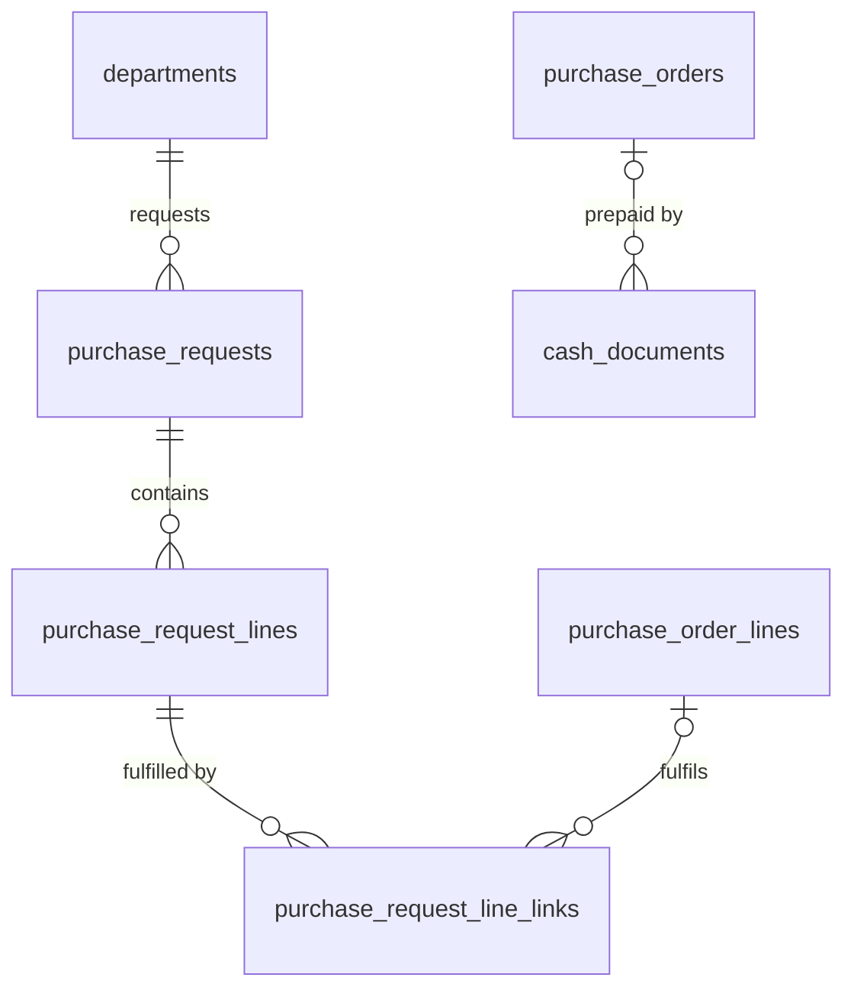

# 05 · Mua hàng / Purchasing (PUR) — Giai đoạn 8 / Phase 8

[← Giai đoạn 8 · Hoàn thiện mua – bán – kho / Phase 8 · Operations completion](README.md)

Các giai đoạn khác của phân hệ / Other phases of this module: [P4](../phase-04-purchasing/05-purchasing.md) · [P7](../phase-07-approvals-controls/05-purchasing.md) · [P9](../phase-09-accounting-einvoicing/05-purchasing.md) · [P10](../phase-10-expansion/05-purchasing.md) · [P11](../phase-11-advanced/05-purchasing.md)

---

## Phạm vi giai đoạn / Phase scope

- **VI:** Đề nghị mua (tạo, tự động, duyệt, gộp); gợi ý giá mua; ứng trước nhà cung cấp; dung sai nhận hàng; lô / serial khi nhận hàng; hiệu suất giao hàng của nhà cung cấp.
- **EN:** Purchase requests (create, automatic, approval, consolidation); purchase price suggestions; supplier prepayments; receiving tolerance; lots / serials on receipt; supplier delivery performance.

## 1. Yêu cầu chức năng / Functional requirements

**Đề nghị mua hàng / Purchase requests**

#### FR-PUR-001 · Tạo đề nghị mua hàng / Create purchase request
`Must` · `P8`

- **VI:** Nhân viên có quyền tạo đề nghị mua gồm: sản phẩm (hoặc mô tả tự do cho hàng chưa có mã), số lượng, ngày cần hàng, mục đích sử dụng, phòng ban, khoản mục chi phí, nhà cung cấp gợi ý, đính kèm.
- **EN:** Authorized employees create purchase requests with: product (or free-text description for uncoded items), quantity, required date, purpose, department, expense category, suggested supplier, attachments.

#### FR-PUR-002 · Đề nghị mua tự động / Automatic purchase requests
`Should` · `P8`

- **VI:** Hệ thống tự động đề xuất đề nghị mua khi tồn kho dự kiến xuống dưới điểm đặt hàng lại (`FR-INV-017`).
- **EN:** The system proposes purchase requests automatically when projected stock falls below the reorder point (`FR-INV-017`).

#### FR-PUR-003 · Duyệt đề nghị mua / Purchase request approval
`Must` · `P8`

- **VI:** Đề nghị mua đi qua luồng duyệt theo phòng ban và giá trị ước tính; người duyệt có thể điều chỉnh số lượng.
- **EN:** Purchase requests follow approval flows by department and estimated value; approvers may adjust quantities.

#### FR-PUR-004 · Gộp đề nghị mua / Consolidate requests
`Should` · `P8`

- **VI:** Nhân viên mua hàng gộp nhiều đề nghị đã duyệt thành một yêu cầu báo giá hoặc đơn mua theo nhà cung cấp; giữ liên kết để truy vết.
- **EN:** Buyers consolidate several approved requests into one RFQ or PO per supplier, keeping links for traceability.

**Đơn mua hàng / Purchase orders**

#### FR-PUR-008 · Gợi ý giá mua / Purchase price suggestion
`Should` · `P8`

- **VI:** Đơn giá được gợi ý từ bảng giá nhà cung cấp (`FR-MDM-027`) hoặc giá lần mua gần nhất; cảnh báo khi giá cao hơn lần mua trước quá X%.
- **EN:** Unit price is suggested from the supplier price list (`FR-MDM-027`) or the last purchase price; warn when it exceeds the last price by more than X%.

#### FR-PUR-013 · Ứng trước cho nhà cung cấp / Supplier prepayments
`Must` · `P8`

- **VI:** Ghi nhận khoản trả trước theo đơn mua; tự động cấn trừ khi thanh toán hóa đơn.
- **EN:** Record prepayments against a PO; offset them automatically when paying the bill.

**Nhận hàng / Receiving**

#### FR-PUR-015 · Dung sai nhận hàng / Receiving tolerance
`Should` · `P8`

- **VI:** Cho phép nhận vượt số lượng đặt trong dung sai X% (cấu hình theo nhóm hàng); vượt dung sai phải được duyệt.
- **EN:** Allow over-receipt within X% tolerance (configurable per category); exceeding it requires approval.

**Mở rộng yêu cầu của giai đoạn trước / Extensions to earlier-phase requirements**

| Mã / ID | Mở rộng (VI) | Extension (EN) |
|---|---|---|
| FR-PUR-007 | Tạo đơn mua từ đề nghị mua đã duyệt. | Create POs from approved purchase requests. |
| FR-PUR-014 | Ghi nhận lô / serial / hạn dùng khi nhận hàng. | Record lot / serial / expiry on receipt. |
| FR-PUR-026 | Hiệu suất giao hàng của nhà cung cấp. | Supplier delivery performance. |

## 2. Quy tắc nghiệp vụ / Business rules

| Mã / ID | Quy tắc (VI) | Rule (EN) | Giai đoạn / Phase |
|---|---|---|---|
| BR-PUR-003 | Dung sai mặc định: số lượng 0%, đơn giá ±2% (cấu hình được). | Default tolerances: quantity 0%, unit price ±2% (configurable). | P8 |

## 3. Mô hình dữ liệu / Data model

- **VI:** Đề nghị mua có luồng duyệt theo phòng ban và giá trị ước tính; người duyệt sửa được `approved_qty` (`FR-PUR-003`). Gộp nhiều dòng đề nghị vào một đơn mua được lưu ở bảng nối `purchase_request_line_links` để truy vết hai chiều (`FR-PUR-004`); P10 dùng lại bảng này cho yêu cầu báo giá. Đề nghị tự động (`FR-PUR-002`) là đề nghị có `is_auto = true` sinh từ `v_replenishment_needs`. Ứng trước nhà cung cấp là chứng từ chi (`cash_documents`) gắn `purchase_order_id` (`FR-PUR-013`). Lô / serial / hạn dùng khi nhận hàng được ghi trên dòng phiếu nhập ([06 · Kho](06-inventory.md)).
- **EN:** Purchase requests follow approval flows by department and estimated value; approvers may change `approved_qty` (`FR-PUR-003`). Consolidating several request lines into one PO is stored in the `purchase_request_line_links` join table for two-way traceability (`FR-PUR-004`); P10 reuses it for RFQs. Automatic requests (`FR-PUR-002`) are requests with `is_auto = true` generated from `v_replenishment_needs`. Supplier prepayments are payment documents (`cash_documents`) carrying `purchase_order_id` (`FR-PUR-013`). Lot / serial / expiry on receipt is recorded on receipt lines ([06 · Inventory](06-inventory.md)).



| Bảng / Table | Mục đích (VI) | Purpose (EN) |
|---|---|---|
| `purchase_requests`, `purchase_request_lines` | Đề nghị mua, có thể mô tả tự do cho hàng chưa có mã (`FR-PUR-001`). | Purchase requests, with free-text items allowed for uncoded goods (`FR-PUR-001`). |
| `purchase_request_line_links` | Liên kết dòng đề nghị ↔ dòng đơn mua, số lượng đã đặt (`FR-PUR-004`, mở rộng `FR-PUR-007`). | Request line ↔ PO line links with ordered quantity (`FR-PUR-004`, `FR-PUR-007` extension). |
| `cash_documents.purchase_order_id` | Ứng trước theo đơn mua, cấn trừ khi thanh toán hóa đơn (`FR-PUR-013`). | Prepayment against a PO, offset when paying the bill (`FR-PUR-013`). |
| `product_categories.receipt_qty_tolerance_pct`, `price_tolerance_pct` | Dung sai nhận hàng theo nhóm; trống thì theo tham số chung (`FR-PUR-015`, `BR-PUR-003`). | Receiving tolerances per category; empty falls back to the global parameters (`FR-PUR-015`, `BR-PUR-003`). |
| `rpt_supplier_delivery_performance` | Tỷ lệ giao đúng hạn và đủ số lượng theo nhà cung cấp (mở rộng `FR-PUR-026`). | On-time and in-full delivery rate per supplier (`FR-PUR-026` extension). |

<details>
<summary>Xem DDL / Show DDL</summary>

```sql
-- Chạy sau / Run after: 06-inventory.md (P8)

INSERT INTO document_types (code, module, name_vi, name_en, function_code, table_name, sort_order, approval_mode) VALUES
  ('PR', 'PUR', 'Đề nghị mua hàng', 'Purchase request', 'PUR.PURCHASE_REQUEST', 'purchase_requests', 405, 'FLOW');
INSERT INTO document_sequences (document_type, prefix) VALUES ('PR', 'PR');

-- Nhận vượt dung sai cần duyệt: luồng của phiếu nhập với trigger_reason = 'OVER_TOLERANCE'
-- Over-tolerance receipts need approval: a goods-receipt flow with trigger_reason = 'OVER_TOLERANCE'
UPDATE document_types SET approval_mode = 'FLOW' WHERE code = 'GR';

INSERT INTO system_settings (key, value) VALUES
  ('purchasing.qty_tolerance_pct',   '0'),   -- BR-PUR-003
  ('purchasing.price_tolerance_pct', '2'),
  ('purchasing.price_increase_warning_pct', '10')  -- FR-PUR-008: cảnh báo giá cao hơn lần trước X%
ON CONFLICT (key) DO NOTHING;

ALTER TABLE product_categories
  ADD COLUMN receipt_qty_tolerance_pct  dm_pct,  -- NULL = purchasing.qty_tolerance_pct
  ADD COLUMN price_tolerance_pct        dm_pct;  -- NULL = purchasing.price_tolerance_pct

CREATE TYPE purchase_request_status AS ENUM
  ('DRAFT','PENDING_APPROVAL','APPROVED','IN_PROGRESS','DONE','REJECTED','CANCELLED');

CREATE TABLE purchase_requests (
  id                     uuid                    PRIMARY KEY DEFAULT gen_random_uuid(),
  doc_no                 varchar(30)             UNIQUE,
  branch_id              uuid                    NOT NULL REFERENCES branches(id),
  department_id          uuid                    NOT NULL REFERENCES departments(id),
  requester_employee_id  uuid                    REFERENCES employees(id),
  owner_id               uuid                    REFERENCES users(id),
  request_date           date                    NOT NULL,
  required_date          date,
  purpose                text,
  expense_category_id    uuid                    REFERENCES expense_categories(id),
  is_auto                boolean                 NOT NULL DEFAULT false,  -- FR-PUR-002
  estimated_total_vnd    dm_amount               NOT NULL DEFAULT 0,
  status                 purchase_request_status NOT NULL DEFAULT 'DRAFT',
  deleted_at             timestamptz,
  deleted_by             uuid                    REFERENCES users(id),
  version                integer                 NOT NULL DEFAULT 1,
  created_at             timestamptz             NOT NULL DEFAULT now(),
  created_by             uuid                    REFERENCES users(id),
  updated_at             timestamptz             NOT NULL DEFAULT now(),
  updated_by             uuid                    REFERENCES users(id)
);
CREATE INDEX ON purchase_requests (status) WHERE status IN ('APPROVED','IN_PROGRESS');

CREATE TABLE purchase_request_lines (
  id                     uuid      PRIMARY KEY DEFAULT gen_random_uuid(),
  request_id             uuid      NOT NULL REFERENCES purchase_requests(id),
  line_no                smallint  NOT NULL,
  product_id             uuid      REFERENCES products(id),  -- NULL = hàng chưa có mã / uncoded item
  description            varchar(500),
  uom_id                 uuid      REFERENCES uoms(id),
  qty                    dm_qty    NOT NULL CHECK (qty > 0),
  approved_qty           dm_qty    CHECK (approved_qty >= 0),  -- người duyệt điều chỉnh / adjusted by approver
  estimated_unit_price   dm_price,
  suggested_supplier_id  uuid      REFERENCES partners(id),
  required_date          date,
  qty_ordered            dm_qty    NOT NULL DEFAULT 0,
  UNIQUE (request_id, line_no),
  CHECK (product_id IS NOT NULL OR description IS NOT NULL)
);

CREATE TABLE purchase_request_line_links (
  id               uuid        PRIMARY KEY DEFAULT gen_random_uuid(),
  request_line_id  uuid        NOT NULL REFERENCES purchase_request_lines(id),
  po_line_id       uuid        REFERENCES purchase_order_lines(id),
  qty              dm_qty      NOT NULL CHECK (qty > 0),
  created_at       timestamptz NOT NULL DEFAULT now(),
  created_by       uuid        REFERENCES users(id)
);
CREATE INDEX ON purchase_request_line_links (request_line_id);
CREATE INDEX ON purchase_request_line_links (po_line_id);

-- FR-PUR-013: ứng trước theo đơn mua / prepayment against a PO
ALTER TABLE cash_documents ADD COLUMN purchase_order_id uuid REFERENCES purchase_orders(id);

-- FR-PUR-026 (mở rộng / extension): giao đúng hạn = phiếu nhập đầu tiên không trễ ngày dự kiến
CREATE VIEW rpt_supplier_delivery_performance AS
WITH line_receipts AS (
  SELECT l.id AS po_line_id, po.supplier_id,
         coalesce(l.expected_date, po.expected_date) AS expected_date,
         l.qty, l.qty_received,
         min(d.doc_date) AS first_receipt_date
  FROM purchase_orders po
  JOIN purchase_order_lines l      ON l.po_id = po.id
  LEFT JOIN stock_document_lines sl ON sl.source_line_id = l.id
  LEFT JOIN stock_documents d       ON d.id = sl.document_id AND d.status = 'DONE' AND d.reason = 'PURCHASE'
  WHERE po.status NOT IN ('DRAFT','CANCELLED')
  GROUP BY l.id, po.supplier_id, coalesce(l.expected_date, po.expected_date), l.qty, l.qty_received
)
SELECT supplier_id,
       count(*)                                                        AS po_lines,
       count(*) FILTER (WHERE first_receipt_date <= expected_date)     AS on_time_lines,
       count(*) FILTER (WHERE qty_received >= qty)                     AS in_full_lines,
       round(100.0 * count(*) FILTER (WHERE first_receipt_date <= expected_date)
             / NULLIF(count(*) FILTER (WHERE expected_date IS NOT NULL), 0), 2) AS on_time_pct
FROM line_receipts
GROUP BY supplier_id;
```

</details>
