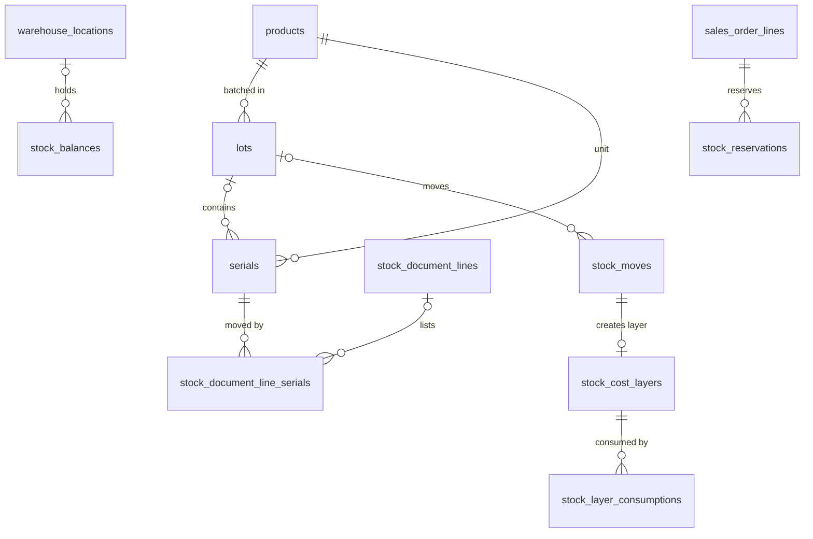

# 06 · Kho / Inventory (INV) — Giai đoạn 8 / Phase 8

[← Giai đoạn 8 · Hoàn thiện mua – bán – kho / Phase 8 · Operations completion](README.md)

Các giai đoạn khác của phân hệ / Other phases of this module: [P3](../phase-03-inventory/06-inventory.md) · [P7](../phase-07-approvals-controls/06-inventory.md) · [P9](../phase-09-accounting-einvoicing/06-inventory.md) · [P10](../phase-10-expansion/06-inventory.md) · [P11](../phase-11-advanced/06-inventory.md)

---

## Phạm vi giai đoạn / Phase scope

- **VI:** Kho đặc biệt, chuyển kho hai bước; lô / hạn dùng, serial, gợi ý FIFO / FEFO (đưa lên P3 nếu ngành hàng bắt buộc — `Q-01`); tồn khả dụng, đang về; kiểm kê nâng cao, khóa giao dịch khi kiểm kê; tồn tối thiểu / tối đa; FIFO, đích danh.
- **EN:** Special warehouses, two-step transfers; lots / expiry, serials, FIFO / FEFO suggestions (move to P3 if the industry requires it — `Q-01`); available and incoming stock; advanced counts, count freeze; min / max rules; FIFO, specific identification.

## 1. Yêu cầu chức năng / Functional requirements

**Theo dõi tồn kho / Stock visibility**

#### FR-INV-009 · Lô & hạn dùng / Lots & expiry
`Must` · `P8`

- **VI:** Truy xuất nguồn gốc hai chiều: từ lô → nhà cung cấp, phiếu nhập; và lô → khách hàng, phiếu xuất. Cảnh báo lô sắp hết hạn trước N ngày (cấu hình theo nhóm hàng); chặn xuất lô đã hết hạn.
- **EN:** Two-way traceability: lot → supplier, receipt; and lot → customer, issue. Alert on lots expiring within N days (configurable per category); block issuing expired lots.

#### FR-INV-010 · Số serial / Serial numbers
`Should` · `P8`

- **VI:** Theo dõi từng đơn vị hàng bằng số serial; tra cứu lịch sử nhập – xuất – trả của một serial.
- **EN:** Track each unit by serial number; look up the full receipt – issue – return history of a serial.

#### FR-INV-012 · Gợi ý xuất theo FIFO / FEFO / FIFO / FEFO suggestions
`Should` · `P8`

- **VI:** Khi xuất hàng theo lô, hệ thống gợi ý lô theo nguyên tắc hết hạn trước xuất trước (FEFO) hoặc nhập trước xuất trước (FIFO).
- **EN:** When issuing lot-tracked goods, the system suggests lots by first-expired-first-out (FEFO) or first-in-first-out (FIFO).

**Kiểm kê / Stock count**

#### FR-INV-016 · Khóa giao dịch khi kiểm kê / Freeze during count
`Should` · `P8`

- **VI:** Tùy chọn khóa giao dịch nhập – xuất trên phạm vi đang kiểm kê từ lúc chốt số sổ sách đến khi hoàn tất.
- **EN:** Optionally freeze receipts and issues in the count scope from book-quantity snapshot until completion.

**Bổ sung tồn kho / Replenishment**

#### FR-INV-017 · Quy tắc tồn tối thiểu / tối đa / Min / max rules
`Should` · `P8`

- **VI:** Hệ thống tính tồn dự kiến (tồn khả dụng + đang về) và đề xuất đề nghị mua hàng hoặc chuyển kho khi xuống dưới điểm đặt hàng lại, đưa về mức tối đa.
- **EN:** The system computes projected stock (available + incoming) and proposes purchase requests or transfers when it falls below the reorder point, up to the maximum level.

**Mở rộng yêu cầu của giai đoạn trước / Extensions to earlier-phase requirements**

| Mã / ID | Mở rộng (VI) | Extension (EN) |
|---|---|---|
| FR-INV-001 | Kho đặc biệt: hàng đi đường, hàng gửi bán, hàng lỗi / chờ xử lý. | Special warehouses: in transit, consignment, defective / quarantine. |
| FR-INV-002 | Ghi nhận lô, ngày sản xuất, hạn dùng, serial, vị trí. | Record lot, manufacturing date, expiry, serial and location. |
| FR-INV-004 | Chuyển kho hai bước qua kho hàng đi đường (xuất – nhận) giữa các chi nhánh. | Two-step transfers via an in-transit warehouse (ship – receive) between branches. |
| FR-INV-008 | Xem tồn đã giữ, khả dụng, đang về (từ đơn mua), đang chuyển; theo vị trí và lô. | View reserved, available, incoming (from POs) and in-transit quantities; by location and lot. |
| FR-INV-013 | Kiểm kê theo nhóm hàng, vị trí; kiểm kê cuốn chiếu (cycle count). | Counts by category or location; cycle counts. |
| FR-INV-014 | Kiểm kê "mù" (không hiển thị số sổ sách cho người đếm). | "Blind" count (book quantity hidden from counters). |
| FR-INV-018 | Bổ sung nhập trước xuất trước (FIFO), thực tế đích danh; tùy chọn phương pháp theo kho hoặc nhóm hàng. | Add FIFO and specific identification; optional method per warehouse or category. |
| FR-INV-023 | Tồn kho theo lô và hạn dùng; báo cáo hàng chậm luân chuyển và tuổi tồn kho. | Stock by lot and expiry; slow-moving and stock-aging reports. |

## 2. Quy tắc nghiệp vụ / Business rules

| Mã / ID | Quy tắc (VI) | Rule (EN) | Giai đoạn / Phase |
|---|---|---|---|
| BR-INV-004 | Hàng theo dõi lô / serial bắt buộc khai báo lô / serial khi nhập và xuất. | Lot / serial-tracked goods require lot / serial on every receipt and issue. | P8 |
| BR-INV-005 | Mặc định xuất theo FEFO; chọn lô khác cần quyền riêng. | FEFO is the default; choosing another lot requires a specific permission. | P8 |

## 3. Mô hình dữ liệu / Data model

- **VI:** Dòng chứng từ kho của hàng theo lô được tách theo lô (`lot_id`); hàng theo serial liệt kê từng serial ở `stock_document_line_serials` (`BR-INV-004`). `stock_moves` và `stock_balances` thêm chiều lô và vị trí; `stock_balances.reserved_qty` là số đã giữ cho đơn bán (`FR-SAL-011`), tồn khả dụng = `on_hand_qty − reserved_qty`. Chuyển kho hai bước dùng kho đi đường (`warehouse_type = 'IN_TRANSIT'`): xuất sinh − kho đi / + kho đi đường, nhận sinh − kho đi đường / + kho đến. FIFO và thực tế đích danh dùng lớp giá `stock_cost_layers`.
- **EN:** Stock lines for lot-tracked goods are split per lot (`lot_id`); serial-tracked goods list each serial in `stock_document_line_serials` (`BR-INV-004`). `stock_moves` and `stock_balances` gain lot and location dimensions; `stock_balances.reserved_qty` is the quantity reserved for sales orders (`FR-SAL-011`), available = `on_hand_qty − reserved_qty`. Two-step transfers go through an in-transit warehouse (`warehouse_type = 'IN_TRANSIT'`): shipping posts − source / + transit, receiving posts − transit / + destination. FIFO and specific identification use the `stock_cost_layers` cost layers.



| Bảng / Table | Mục đích (VI) | Purpose (EN) |
|---|---|---|
| `lots` | Lô, ngày sản xuất, hạn dùng, NCC; truy xuất hai chiều qua `stock_moves` (`FR-INV-009`). | Lots, manufacturing / expiry dates, supplier; two-way traceability through `stock_moves` (`FR-INV-009`). |
| `serials`, `stock_document_line_serials` | Từng đơn vị theo serial và lịch sử nhập – xuất – trả (`FR-INV-010`). | Serialized units and their receipt – issue – return history (`FR-INV-010`). |
| `stock_reservations` | Giữ hàng cho dòng đơn bán; giải phóng khi hủy, đóng hoặc xuất kho (`FR-SAL-011`). | Reservations per sales-order line; released on cancel, close or issue (`FR-SAL-011`). |
| `v_stock_availability` | Tồn thực tế, đã giữ, khả dụng, đang về từ đơn mua (mở rộng `FR-INV-008`). | On hand, reserved, available, incoming from POs (`FR-INV-008` extension). |
| `stock_counts` (cột mới / new columns) | Kiểm theo nhóm hàng / vị trí, kiểm cuốn chiếu, kiểm mù, khóa giao dịch (`FR-INV-013`, `014`, `016`). | Counts by category / location, cycle counts, blind counts, transaction freeze (`FR-INV-013`, `014`, `016`). |
| `stock_cost_layers`, `stock_layer_consumptions` | Lớp giá nhập và lượng đã xuất từ mỗi lớp cho FIFO / đích danh (mở rộng `FR-INV-018`). | Receipt cost layers and their consumption for FIFO / specific identification (`FR-INV-018` extension). |
| `v_replenishment_needs` | Sản phẩm có tồn dự kiến dưới điểm đặt hàng lại và số lượng đề xuất (`FR-INV-017`). | Products whose projected stock is below the reorder point, with the proposed quantity (`FR-INV-017`). |

<details>
<summary>Xem DDL / Show DDL</summary>

```sql
-- Chạy sau / Run after: 03-master-data.md (P8)

-- ===== Trạng thái mới / New statuses =====
ALTER TYPE stock_doc_status ADD VALUE 'READY'    BEFORE 'DONE';  -- đã giữ hàng / reserved
ALTER TYPE stock_doc_status ADD VALUE 'SHIPPED'  BEFORE 'DONE';  -- chuyển 2 bước: đang chuyển / in transit
ALTER TYPE stock_doc_status ADD VALUE 'RECEIVED' BEFORE 'DONE';  -- chuyển 2 bước: đã nhận / received

ALTER TABLE stock_documents
  ADD COLUMN transit_warehouse_id  uuid REFERENCES warehouses(id),  -- NULL = chuyển một bước / one-step
  ADD COLUMN shipped_at            timestamptz,
  ADD COLUMN received_at           timestamptz;

-- ===== Lô & serial / Lots & serials =====
CREATE TABLE lots (
  id           uuid        PRIMARY KEY DEFAULT gen_random_uuid(),
  product_id   uuid        NOT NULL REFERENCES products(id),
  lot_no       varchar(50) NOT NULL,
  mfg_date     date,
  expiry_date  date,
  supplier_id  uuid        REFERENCES partners(id),
  created_at   timestamptz NOT NULL DEFAULT now(),
  created_by   uuid        REFERENCES users(id),
  UNIQUE (product_id, lot_no),
  CHECK (expiry_date IS NULL OR mfg_date IS NULL OR expiry_date >= mfg_date)
);
CREATE INDEX ON lots (expiry_date);

CREATE TYPE serial_status AS ENUM ('IN_STOCK','ISSUED','RETURNED','SCRAPPED');

CREATE TABLE serials (
  id            uuid          PRIMARY KEY DEFAULT gen_random_uuid(),
  product_id    uuid          NOT NULL REFERENCES products(id),
  serial_no     varchar(100)  NOT NULL,
  lot_id        uuid          REFERENCES lots(id),
  status        serial_status NOT NULL DEFAULT 'IN_STOCK',
  warehouse_id  uuid          REFERENCES warehouses(id),  -- vị trí hiện tại / current warehouse
  created_at    timestamptz   NOT NULL DEFAULT now(),
  updated_at    timestamptz   NOT NULL DEFAULT now(),
  UNIQUE (product_id, serial_no)
);

ALTER TABLE stock_document_lines
  ADD COLUMN lot_id            uuid REFERENCES lots(id),
  ADD COLUMN location_id       uuid REFERENCES warehouse_locations(id),
  ADD COLUMN dest_location_id  uuid REFERENCES warehouse_locations(id);

CREATE TABLE stock_document_line_serials (
  line_id    uuid NOT NULL REFERENCES stock_document_lines(id),
  serial_id  uuid NOT NULL REFERENCES serials(id),
  PRIMARY KEY (line_id, serial_id)
);
CREATE INDEX ON stock_document_line_serials (serial_id);

ALTER TABLE stock_moves
  ADD COLUMN lot_id       uuid REFERENCES lots(id),
  ADD COLUMN location_id  uuid REFERENCES warehouse_locations(id);
CREATE INDEX ON stock_moves (lot_id) WHERE lot_id IS NOT NULL;

ALTER TABLE stock_balances
  ADD COLUMN lot_id        uuid   REFERENCES lots(id),
  ADD COLUMN location_id   uuid   REFERENCES warehouse_locations(id),
  ADD COLUMN reserved_qty  dm_qty NOT NULL DEFAULT 0 CHECK (reserved_qty >= 0),
  DROP CONSTRAINT stock_balances_warehouse_id_product_id_key,
  ADD CONSTRAINT stock_balances_dims_key UNIQUE NULLS NOT DISTINCT (warehouse_id, product_id, lot_id, location_id);

-- ===== Giữ hàng / Reservations (FR-SAL-011) =====
CREATE TYPE reservation_status AS ENUM ('ACTIVE','RELEASED','CONSUMED');

CREATE TABLE stock_reservations (
  id             uuid               PRIMARY KEY DEFAULT gen_random_uuid(),
  so_line_id     uuid               NOT NULL REFERENCES sales_order_lines(id),
  product_id     uuid               NOT NULL REFERENCES products(id),
  warehouse_id   uuid               NOT NULL REFERENCES warehouses(id),
  lot_id         uuid               REFERENCES lots(id),
  qty            dm_qty             NOT NULL CHECK (qty > 0),  -- đơn vị cơ bản / base UoM
  status         reservation_status NOT NULL DEFAULT 'ACTIVE',
  released_at    timestamptz,
  release_reason varchar(20),       -- 'CANCELLED','CLOSED','ISSUED'
  created_at     timestamptz        NOT NULL DEFAULT now(),
  created_by     uuid               REFERENCES users(id)
);
CREATE INDEX ON stock_reservations (product_id, warehouse_id) WHERE status = 'ACTIVE';
CREATE INDEX ON stock_reservations (so_line_id);

-- ===== Kiểm kê nâng cao / Advanced counts =====
CREATE TYPE stock_count_type AS ENUM ('FULL','PARTIAL','CYCLE');

ALTER TABLE stock_counts
  ADD COLUMN count_type           stock_count_type NOT NULL DEFAULT 'FULL',
  ADD COLUMN product_category_id  uuid    REFERENCES product_categories(id),
  ADD COLUMN location_id          uuid    REFERENCES warehouse_locations(id),
  ADD COLUMN is_blind             boolean NOT NULL DEFAULT false,  -- FR-INV-014
  ADD COLUMN freeze_transactions  boolean NOT NULL DEFAULT false;  -- FR-INV-016

ALTER TABLE stock_count_lines
  ADD COLUMN lot_id       uuid REFERENCES lots(id),
  ADD COLUMN location_id  uuid REFERENCES warehouse_locations(id),
  DROP CONSTRAINT stock_count_lines_count_id_warehouse_id_product_id_key,
  ADD CONSTRAINT stock_count_lines_dims_key
    UNIQUE NULLS NOT DISTINCT (count_id, warehouse_id, product_id, lot_id, location_id);

-- ===== Tính giá FIFO / đích danh / FIFO & specific identification (FR-INV-018) =====
ALTER TYPE costing_method ADD VALUE 'FIFO';
ALTER TYPE costing_method ADD VALUE 'SPECIFIC';

ALTER TABLE warehouses         ADD COLUMN costing_method costing_method;  -- NULL = theo năm tài chính
ALTER TABLE product_categories ADD COLUMN costing_method costing_method;  -- ưu tiên: nhóm > kho > năm

-- FR-INV-009: cảnh báo hết hạn theo nhóm hàng / expiry alert per category
ALTER TABLE product_categories ADD COLUMN expiry_alert_days smallint CHECK (expiry_alert_days >= 0);

CREATE TABLE stock_cost_layers (
  id             bigint      GENERATED ALWAYS AS IDENTITY PRIMARY KEY,
  in_move_id     bigint      NOT NULL UNIQUE REFERENCES stock_moves(id),
  product_id     uuid        NOT NULL REFERENCES products(id),
  warehouse_id   uuid        NOT NULL REFERENCES warehouses(id),
  lot_id         uuid        REFERENCES lots(id),
  in_date        date        NOT NULL,
  qty_in         dm_qty      NOT NULL CHECK (qty_in > 0),
  qty_remaining  dm_qty      NOT NULL CHECK (qty_remaining >= 0),
  unit_cost      dm_price    NOT NULL,
  CHECK (qty_remaining <= qty_in)
);
CREATE INDEX stock_cost_layers_open ON stock_cost_layers (product_id, warehouse_id, in_date, id)
  WHERE qty_remaining > 0;

CREATE TABLE stock_layer_consumptions (
  id           bigint   GENERATED ALWAYS AS IDENTITY PRIMARY KEY,
  out_move_id  bigint   NOT NULL REFERENCES stock_moves(id),
  layer_id     bigint   NOT NULL REFERENCES stock_cost_layers(id),
  qty          dm_qty   NOT NULL CHECK (qty > 0),
  unit_cost    dm_price NOT NULL
);
CREATE INDEX ON stock_layer_consumptions (out_move_id);

-- ===== Tồn khả dụng & bổ sung tồn / Availability & replenishment =====
CREATE VIEW v_stock_availability AS
WITH bal AS (
  SELECT warehouse_id, product_id, sum(on_hand_qty) AS on_hand_qty, sum(reserved_qty) AS reserved_qty
  FROM stock_balances GROUP BY warehouse_id, product_id
),
incoming AS (
  SELECT po.warehouse_id, l.product_id,
         sum((l.qty - l.qty_received) * l.uom_factor) AS incoming_qty
  FROM purchase_orders po
  JOIN purchase_order_lines l ON l.po_id = po.id
  WHERE po.status IN ('APPROVED','SENT','PARTIALLY_RECEIVED') AND l.qty > l.qty_received
  GROUP BY po.warehouse_id, l.product_id
)
SELECT coalesce(b.warehouse_id, i.warehouse_id) AS warehouse_id,
       coalesce(b.product_id, i.product_id)     AS product_id,
       coalesce(b.on_hand_qty, 0)               AS on_hand_qty,
       coalesce(b.reserved_qty, 0)              AS reserved_qty,
       coalesce(b.on_hand_qty, 0) - coalesce(b.reserved_qty, 0) AS available_qty,
       coalesce(i.incoming_qty, 0)              AS incoming_qty
FROM bal b
FULL JOIN incoming i ON i.warehouse_id = b.warehouse_id AND i.product_id = b.product_id;

-- FR-INV-017: tồn dự kiến = khả dụng + đang về; đề xuất đưa về mức tối đa
CREATE VIEW v_replenishment_needs AS
SELECT p.product_id, p.warehouse_id, p.reorder_point, p.max_qty, p.min_order_qty, p.preferred_supplier_id,
       coalesce(a.available_qty, 0) + coalesce(a.incoming_qty, 0) AS projected_qty,
       GREATEST(coalesce(p.max_qty, p.reorder_point) - (coalesce(a.available_qty, 0) + coalesce(a.incoming_qty, 0)),
                coalesce(p.min_order_qty, 0)) AS proposed_qty
FROM product_stock_params p
LEFT JOIN v_stock_availability a ON a.product_id = p.product_id AND a.warehouse_id = p.warehouse_id
WHERE p.reorder_point IS NOT NULL
  AND coalesce(a.available_qty, 0) + coalesce(a.incoming_qty, 0) < p.reorder_point;
```

</details>
