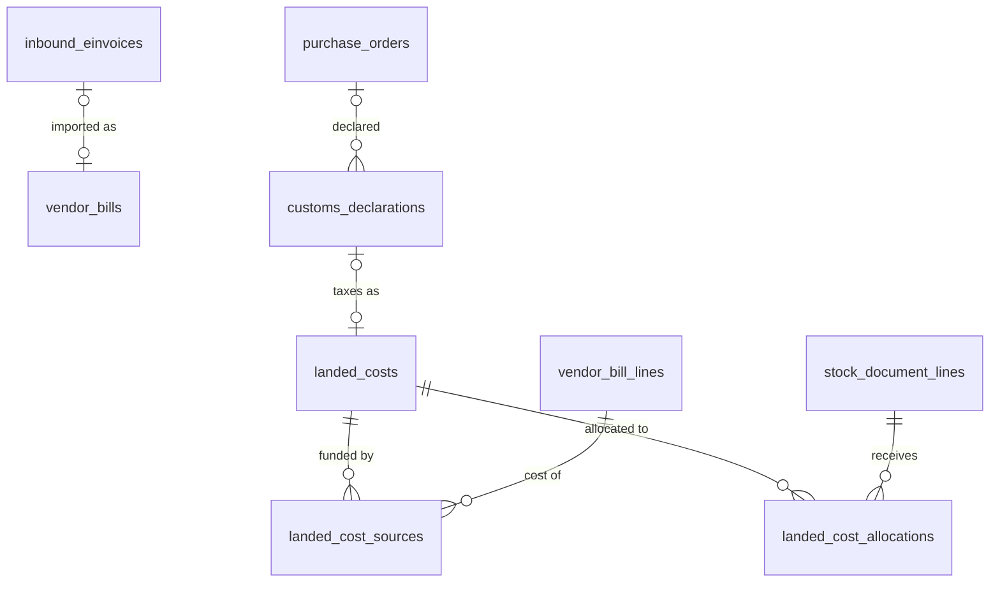

# 05 · Mua hàng / Purchasing (PUR) — Giai đoạn 9 / Phase 9

[← Giai đoạn 9 · Kế toán đầy đủ & HĐĐT / Phase 9 · Full accounting & e-invoicing](README.md)

Các giai đoạn khác của phân hệ / Other phases of this module: [P4](../phase-04-purchasing/05-purchasing.md) · [P7](../phase-07-approvals-controls/05-purchasing.md) · [P8](../phase-08-operations-completion/05-purchasing.md) · [P10](../phase-10-expansion/05-purchasing.md) · [P11](../phase-11-advanced/05-purchasing.md)

---

## Phạm vi giai đoạn / Phase scope

- **VI:** Nhập XML hóa đơn đầu vào; đối chiếu 3 chiều; hàng về chưa có hóa đơn / hàng mua đang đi đường; chi phí mua hàng, hàng nhập khẩu.
- **EN:** Inbound e-invoice XML import; 3-way match; goods received not invoiced / goods in transit; landed cost, imports.

## 1. Yêu cầu chức năng / Functional requirements

**Hóa đơn nhà cung cấp & đối chiếu / Vendor bills & matching**

#### FR-PUR-018 · Nhập hóa đơn điện tử đầu vào từ XML / Import inbound e-invoice XML
`Should` · `P9`

- **VI:** Đọc file XML hóa đơn điện tử của nhà cung cấp để tự điền thông tin hóa đơn và dòng hàng; gợi ý ghép với đơn mua / phiếu nhập; kiểm tra trạng thái hóa đơn với cơ quan thuế qua tích hợp (`FR-INT-002`).
- **EN:** Parse the supplier's e-invoice XML to pre-fill bill header and lines; suggest matching POs / receipts; check invoice status with the tax authority via integration (`FR-INT-002`).

#### FR-PUR-019 · Đối chiếu 3 chiều / 3-way match
`Must` · `P9`

- **VI:** Đối chiếu đơn mua – phiếu nhập – hóa đơn theo số lượng và đơn giá. Chênh lệch vượt dung sai sẽ chặn ghi sổ hóa đơn hoặc yêu cầu duyệt (cấu hình).
- **EN:** Match PO – goods receipt – bill on quantity and unit price. Variances beyond tolerance block bill posting or require approval (configurable).

**Tiêu chí chấp nhận / Acceptance criteria**

- **AC-1 — VI:** Đơn mua 100 cái × 50.000 ₫, đã nhận 100 cái, hóa đơn 100 cái × 50.500 ₫ (lệch 1%, dung sai giá 2%) → hóa đơn được ghi sổ; chênh lệch giá được phân bổ vào giá trị kho hoặc giá vốn tùy tình trạng tồn.
  **EN:** PO 100 pcs × ₫50,000, 100 pcs received, bill 100 pcs × ₫50,500 (1% variance, 2% tolerance) → bill is posted; the price variance goes to inventory value or COGS depending on remaining stock.
- **AC-2 — VI:** Cùng đơn, hóa đơn 110 cái nhưng mới nhận 100 cái → hóa đơn bị chặn với thông báo "Số lượng hóa đơn vượt số lượng đã nhận".
  **EN:** Same PO, bill for 110 pcs but only 100 received → bill is blocked with "Billed quantity exceeds received quantity".

#### FR-PUR-021 · Hàng về chưa có hóa đơn và hàng mua đang đi đường / Goods received not invoiced & goods in transit
`Must` · `P9`

- **VI:** Hỗ trợ hàng về trước hóa đơn (nhập kho theo giá tạm tính, điều chỉnh khi có hóa đơn) và hóa đơn về trước hàng (ghi nhận hàng mua đang đi đường).
- **EN:** Support goods received before the bill (receipt at provisional price, adjusted when the bill arrives) and bills received before the goods (goods in transit).

**Chi phí mua hàng & nhập khẩu / Landed cost & imports**

#### FR-PUR-022 · Phân bổ chi phí mua hàng / Landed cost allocation
`Should` · `P9`

- **VI:** Ghi nhận chi phí vận chuyển, bảo hiểm, thuế nhập khẩu, phí hải quan… và phân bổ vào giá trị hàng nhập theo giá trị, số lượng, trọng lượng hoặc thể tích.
- **EN:** Record freight, insurance, import duty, customs fees… and allocate them to received goods by value, quantity, weight or volume.

#### FR-PUR-023 · Mua hàng nhập khẩu / Import purchases
`Should` · `P9`

- **VI:** Đơn mua bằng ngoại tệ; ghi nhận thông tin tờ khai hải quan (số, ngày), thuế nhập khẩu, thuế GTGT hàng nhập khẩu; xử lý chênh lệch tỷ giá khi thanh toán.
- **EN:** Foreign-currency POs; record customs declaration info (number, date), import duty and import VAT; handle exchange differences on payment.

## 2. Mô hình dữ liệu / Data model

- **VI:** Hóa đơn nhập từ XML liên kết `inbound_einvoices` ([11 · Tích hợp](11-integrations.md)). Đối chiếu 3 chiều ghi kết quả trên từng dòng hóa đơn; hóa đơn có dòng lệch quá dung sai ở trạng thái `PENDING_MATCH` và bị chặn hoặc chuyển duyệt theo tham số `purchasing.match_variance_action` (`FR-PUR-019`). Hàng về trước hóa đơn nhập kho với giá tạm tính (`is_provisional_cost`), hóa đơn về trước hàng đánh dấu `goods_in_transit` (`FR-PUR-021`). Chi phí mua hàng được phân bổ xuống từng dòng phiếu nhập (`FR-PUR-022`); tờ khai hải quan ghi thuế nhập khẩu và thuế GTGT hàng nhập khẩu (`FR-PUR-023`).
- **EN:** Bills imported from XML link to `inbound_einvoices` ([11 · Integrations](11-integrations.md)). The 3-way match stores its result on each bill line; a bill with lines beyond tolerance stays `PENDING_MATCH` and is blocked or routed for approval per the `purchasing.match_variance_action` parameter (`FR-PUR-019`). Goods received before the bill are stocked at a provisional cost (`is_provisional_cost`); bills received before the goods are flagged `goods_in_transit` (`FR-PUR-021`). Landed costs are allocated to receipt lines (`FR-PUR-022`); customs declarations record import duty and import VAT (`FR-PUR-023`).



| Bảng / Table | Mục đích (VI) | Purpose (EN) |
|---|---|---|
| `vendor_bill_lines.match_status`, `qty_variance`, `price_variance_pct` | Kết quả đối chiếu 3 chiều theo dòng. | Per-line 3-way match result. |
| `landed_costs`, `landed_cost_sources`, `landed_cost_allocations` | Chứng từ chi phí mua hàng, các dòng hóa đơn chi phí và phần phân bổ theo giá trị / số lượng / trọng lượng / thể tích. | Landed cost documents, the cost bill lines and the allocation by value / quantity / weight / volume. |
| `customs_declarations` | Tờ khai hải quan: số, ngày, tỷ giá hải quan, thuế nhập khẩu, thuế GTGT hàng nhập khẩu. | Customs declarations: number, date, customs rate, import duty, import VAT. |

<details>
<summary>Xem DDL / Show DDL</summary>

```sql
-- Chạy sau / Run after: 11-integrations.md, 07-accounting-finance.md (P9)

INSERT INTO system_settings (key, value) VALUES
  ('purchasing.match_variance_action', '"BLOCK"')  -- 'BLOCK' | 'REQUIRE_APPROVAL' (FR-PUR-019)
ON CONFLICT (key) DO NOTHING;

ALTER TYPE vendor_bill_status ADD VALUE 'PENDING_MATCH' BEFORE 'POSTED';

CREATE TYPE match_status AS ENUM ('MATCHED','WITHIN_TOLERANCE','QTY_EXCEEDED','PRICE_VARIANCE','NOT_MATCHED');

ALTER TABLE vendor_bill_lines
  ADD COLUMN match_status        match_status,
  ADD COLUMN qty_variance        dm_qty,          -- số lượng hóa đơn − số lượng đã nhận chưa lên hóa đơn
  ADD COLUMN price_variance_pct  numeric(9,4);    -- (giá hóa đơn − giá đơn mua) / giá đơn mua × 100

ALTER TABLE vendor_bills
  ADD COLUMN inbound_einvoice_id  uuid    REFERENCES inbound_einvoices(id),
  ADD COLUMN goods_in_transit     boolean NOT NULL DEFAULT false,  -- hóa đơn về trước hàng (151)
  ADD COLUMN journal_entry_id     uuid    REFERENCES journal_entries(id);

-- Hàng về trước hóa đơn: giá tạm tính, điều chỉnh khi có hóa đơn / provisional cost until the bill arrives
ALTER TABLE stock_document_lines ADD COLUMN is_provisional_cost boolean NOT NULL DEFAULT false;

-- ===== Chi phí mua hàng / Landed cost (FR-PUR-022) =====
INSERT INTO document_types (code, module, name_vi, name_en, function_code, table_name, sort_order) VALUES
  ('LC', 'PUR', 'Phân bổ chi phí mua hàng', 'Landed cost', 'ACC.VENDOR_BILL', 'landed_costs', 440);
INSERT INTO document_sequences (document_type, prefix) VALUES ('LC', 'LC');

CREATE TYPE landed_cost_basis  AS ENUM ('VALUE','QUANTITY','WEIGHT','VOLUME');
CREATE TYPE landed_cost_status AS ENUM ('DRAFT','POSTED','CANCELLED');

CREATE TABLE landed_costs (
  id                uuid               PRIMARY KEY DEFAULT gen_random_uuid(),
  doc_no            varchar(30)        UNIQUE,
  branch_id         uuid               NOT NULL REFERENCES branches(id),
  cost_date         date               NOT NULL,
  description       text,
  allocation_basis  landed_cost_basis  NOT NULL DEFAULT 'VALUE',
  total_amount_vnd  dm_amount          NOT NULL DEFAULT 0,
  status            landed_cost_status NOT NULL DEFAULT 'DRAFT',
  journal_entry_id  uuid               REFERENCES journal_entries(id),
  version           integer            NOT NULL DEFAULT 1,
  created_at        timestamptz        NOT NULL DEFAULT now(),
  created_by        uuid               REFERENCES users(id),
  updated_at        timestamptz        NOT NULL DEFAULT now(),
  updated_by        uuid               REFERENCES users(id)
);

-- Dòng hóa đơn chi phí (vận chuyển, bảo hiểm, phí hải quan…) / cost bill lines (freight, insurance, customs fees…)
CREATE TABLE landed_cost_sources (
  landed_cost_id       uuid      NOT NULL REFERENCES landed_costs(id),
  vendor_bill_line_id  uuid      NOT NULL REFERENCES vendor_bill_lines(id),
  amount_vnd           dm_amount NOT NULL CHECK (amount_vnd > 0),
  PRIMARY KEY (landed_cost_id, vendor_bill_line_id)
);

CREATE TABLE landed_cost_allocations (
  id               uuid          PRIMARY KEY DEFAULT gen_random_uuid(),
  landed_cost_id   uuid          NOT NULL REFERENCES landed_costs(id),
  receipt_line_id  uuid          NOT NULL REFERENCES stock_document_lines(id),
  basis_value      numeric(20,6) NOT NULL,   -- giá trị / số lượng / kg / m3 của dòng
  amount_vnd       dm_amount     NOT NULL,
  UNIQUE (landed_cost_id, receipt_line_id)
);

-- ===== Nhập khẩu / Imports (FR-PUR-023) =====
ALTER TABLE purchase_orders
  ADD COLUMN is_import  boolean NOT NULL DEFAULT false,
  ADD COLUMN incoterm   varchar(3);

CREATE TABLE customs_declarations (
  id                 uuid        PRIMARY KEY DEFAULT gen_random_uuid(),
  declaration_no     varchar(30) NOT NULL UNIQUE,
  declaration_date   date        NOT NULL,
  purchase_order_id  uuid        REFERENCES purchase_orders(id),
  receipt_id         uuid        REFERENCES stock_documents(id),
  customs_office     varchar(150),
  currency_code      char(3)     NOT NULL REFERENCES currencies(code),
  customs_rate       dm_rate     NOT NULL,           -- tỷ giá tính thuế / customs exchange rate
  import_duty_vnd    dm_amount   NOT NULL DEFAULT 0,
  import_vat_vnd     dm_amount   NOT NULL DEFAULT 0,
  other_taxes_vnd    dm_amount   NOT NULL DEFAULT 0, -- TTĐB, BVMT… / excise, environmental…
  landed_cost_id     uuid        REFERENCES landed_costs(id),
  file_id            uuid        REFERENCES stored_files(id),
  version            integer     NOT NULL DEFAULT 1,
  created_at         timestamptz NOT NULL DEFAULT now(),
  created_by         uuid        REFERENCES users(id),
  updated_at         timestamptz NOT NULL DEFAULT now(),
  updated_by         uuid        REFERENCES users(id)
);
```

</details>
