# 07 · Kế toán – Tài chính / Accounting & Finance (ACC) — Giai đoạn 9 / Phase 9

[← Giai đoạn 9 · Kế toán đầy đủ & HĐĐT / Phase 9 · Full accounting & e-invoicing](README.md)

Các giai đoạn khác của phân hệ / Other phases of this module: [P2](../phase-02-organization-master-data/07-accounting-finance.md) · [P6](../phase-06-receivables-payables-cash/07-accounting-finance.md) · [P10](../phase-10-expansion/07-accounting-finance.md) · [P11](../phase-11-advanced/07-accounting-finance.md)

---

## Phạm vi giai đoạn / Phase scope

- **VI:** Hệ thống tài khoản, cấu hình hạch toán & bút toán tự động, bút toán thủ công / định kỳ / đảo, kết chuyển, khóa sổ; chiều phân tích; chênh lệch tỷ giá; đối chiếu & bù trừ công nợ; đề nghị thanh toán, lịch thanh toán, tạm ứng; ủy nhiệm chi, sao kê & đối chiếu ngân hàng; thuế GTGT, quản lý hóa đơn đầu ra; BCTC, sổ kế toán, báo cáo quản trị.
- **EN:** Chart of accounts, posting configuration & automatic entries, manual / recurring / reversal entries, closing entries, period lock; analytical dimensions; FX differences; balance confirmations & netting; payment requests, payment schedule, employee advances; transfer orders, bank statements & reconciliation; VAT, output invoice management; financial statements, books, management reports.

## 1. Hạch toán tự động mẫu / Sample automatic postings

> Hạch toán tự động áp dụng từ P9. Số hiệu tài khoản chỉ mang tính minh họa; hệ thống cho phép cấu hình theo chế độ kế toán áp dụng.
> Automatic posting applies from P9. Account numbers are illustrative; the system allows configuration per the applicable regime.

| Nghiệp vụ (VI) | Transaction (EN) | Nợ / Debit | Có / Credit |
|---|---|---|---|
| Nhập kho hàng mua trong nước | Domestic purchase receipt | 156 (152, 153), 1331 | 331 |
| Thuế nhập khẩu hàng mua | Import duty | 156 | 3333 |
| Thuế GTGT hàng nhập khẩu | Import VAT | 1331 | 33312 |
| Xuất kho bán hàng (giá vốn) | Goods issue for sale (COGS) | 632 | 156 |
| Hóa đơn bán hàng | Customer invoice | 131 | 511, 33311 |
| Hàng bán bị trả lại | Sales return | TK giảm trừ doanh thu / revenue deduction account, 33311 | 131 |
| Nhập lại kho hàng bị trả | Returned goods back to stock | 156 | 632 |
| Thu tiền khách hàng | Customer receipt | 111, 112 | 131 |
| Thanh toán nhà cung cấp | Supplier payment | 331 | 111, 112 |
| Xuất dùng nội bộ | Internal consumption | 641, 642 | 152, 153, 156 |
| Kiểm kê thiếu chờ xử lý | Count shortage pending resolution | 1381 | 156 |
| Kiểm kê thừa chờ xử lý | Count surplus pending resolution | 156 | 3381 |
| Tạm ứng nhân viên | Employee advance | 141 | 111, 112 |
| Khấu hao TSCĐ | Fixed-asset depreciation | 641, 642 | 214 |
| Lãi chênh lệch tỷ giá đã thực hiện | Realized FX gain | TK tiền / công nợ liên quan / Related cash or AR/AP account | 515 |
| Lỗ chênh lệch tỷ giá đã thực hiện | Realized FX loss | 635 | TK tiền / công nợ liên quan / Related cash or AR/AP account |

## 2. Yêu cầu chức năng / Functional requirements

**Thiết lập / Setup**

#### FR-ACC-001 · Hệ thống tài khoản / Chart of accounts
`Must` · `P9`

- **VI:** Nạp sẵn hệ thống tài khoản theo chế độ kế toán được chọn; cho phép mở tài khoản chi tiết nhiều cấp. Thuộc tính tài khoản: tên VI/EN, tính chất (dư Nợ / dư Có / lưỡng tính), có theo dõi đối tượng (khách hàng, nhà cung cấp, nhân viên), theo dõi ngoại tệ, được phép hạch toán hay không.
- **EN:** Preload the chart of accounts for the selected regime; allow multi-level sub-accounts. Account attributes: VI/EN names, nature (debit / credit / both), partner tracking (customer, supplier, employee), foreign-currency tracking, postable or not.

#### FR-ACC-003 · Chiều phân tích / Analytical dimensions
`Should` · `P9`

- **VI:** Gắn chiều phân tích lên dòng bút toán: chi nhánh, phòng ban, khoản mục chi phí, vụ việc / hợp đồng, sản phẩm; dùng cho báo cáo quản trị.
- **EN:** Tag journal lines with analytical dimensions: branch, department, expense category, case / contract, product; used for management reporting.

#### FR-ACC-005 · Cấu hình hạch toán tự động / Posting configuration
`Must` · `P9`

- **VI:** Cấu hình tài khoản hạch toán cho từng loại nghiệp vụ theo sản phẩm / nhóm sản phẩm / kho / nhóm đối tác / thuế suất.
- **EN:** Configure posting accounts for each transaction type by product / category / warehouse / partner group / tax code.

**Sổ cái / General ledger**

#### FR-ACC-006 · Bút toán thủ công / Manual journal entries
`Must` · `P9`

- **VI:** Lập chứng từ nghiệp vụ khác với nhiều dòng Nợ / Có, đối tượng, chiều phân tích, ngoại tệ, diễn giải, đính kèm; hệ thống kiểm tra cân đối trước khi ghi sổ. Bút toán thủ công có thể yêu cầu duyệt.
- **EN:** Create general journal entries with multiple debit / credit lines, partner, dimensions, currency, description and attachments; the system checks balance before posting. Manual entries may require approval.

#### FR-ACC-007 · Bút toán tự động từ các phân hệ / Automatic entries from modules
`Must` · `P9`

- **VI:** Chứng từ bán hàng, mua hàng, kho, tiền, lương tự động sinh bút toán khi được xác nhận / ghi sổ. Từ bút toán xem được chứng từ gốc và ngược lại (drill-down).
- **EN:** Sales, purchasing, inventory, cash and payroll documents generate entries automatically when confirmed / posted. Users can drill from an entry to its source document and back.

#### FR-ACC-008 · Bút toán định kỳ & phân bổ / Recurring entries & allocations
`Should` · `P9`

- **VI:** Thiết lập bút toán định kỳ (chi phí thuê, phân bổ chi phí trả trước…) theo lịch; hệ thống tạo bút toán nháp mỗi kỳ để kế toán xác nhận.
- **EN:** Set up recurring entries (rent, prepaid expense amortization…) on a schedule; the system creates draft entries each period for review.

#### FR-ACC-009 · Bút toán đảo / Reversal entries
`Must` · `P9`

- **VI:** Đảo một bút toán đã ghi sổ bằng một thao tác (cùng kỳ hoặc kỳ sau); bút toán gốc và bút toán đảo liên kết với nhau.
- **EN:** Reverse a posted entry in one action (same or next period); original and reversal are linked.

#### FR-ACC-010 · Kết chuyển cuối kỳ / Period-end closing entries
`Must` · `P9`

- **VI:** Thiết lập và chạy các bước kết chuyển: doanh thu, giảm trừ doanh thu, giá vốn, chi phí → xác định kết quả kinh doanh → lợi nhuận chưa phân phối; xem trước kết quả trước khi ghi.
- **EN:** Configure and run closing steps: revenue, revenue deductions, COGS, expenses → profit and loss determination → retained earnings; preview results before posting.

#### FR-ACC-011 · Khóa sổ / Period lock
`Must` · `P9`

- **VI:** Khóa kỳ theo từng phân hệ hoặc toàn bộ; mở lại kỳ đã khóa chỉ dành cho kế toán trưởng, bắt buộc ghi lý do và được ghi nhật ký.
- **EN:** Lock periods per module or globally; only the chief accountant can reopen a locked period, with a mandatory reason that is logged.

**Công nợ phải thu / Accounts receivable**

#### FR-ACC-016 · Đối chiếu công nợ / Balance confirmation
`Must` · `P9`

- **VI:** In và gửi email biên bản đối chiếu công nợ (song ngữ tùy chọn) cho khách hàng tại một thời điểm.
- **EN:** Print and email balance confirmation statements (optionally bilingual) to customers as at a date.

#### FR-ACC-017 · Bù trừ công nợ / Netting
`Should` · `P9`

- **VI:** Bù trừ công nợ phải thu và phải trả của cùng một đối tác, có chứng từ bù trừ và phê duyệt.
- **EN:** Net receivables and payables of the same partner with a netting document and approval.

**Công nợ phải trả / Accounts payable**

#### FR-ACC-021 · Đề nghị thanh toán / Payment requests
`Must` · `P9`

- **VI:** Lập đề nghị thanh toán từ hóa đơn đến hạn (một hoặc nhiều hóa đơn); duyệt theo ngưỡng giá trị; sau khi duyệt, kế toán / thủ quỹ lập phiếu chi hoặc ủy nhiệm chi.
- **EN:** Create payment requests from due bills (one or many); approve by amount threshold; once approved, accounting / cashier creates the cash payment or bank transfer order.

#### FR-ACC-022 · Lịch thanh toán / Payment schedule
`Should` · `P9`

- **VI:** Dự báo các khoản phải trả theo ngày đến hạn để lập kế hoạch dòng tiền.
- **EN:** Forecast payables by due date for cash planning.

#### FR-ACC-023 · Tạm ứng & hoàn ứng / Employee advances
`Must` · `P9`

- **VI:** Nhân viên lập đề nghị tạm ứng; sau khi duyệt và chi tiền, nhân viên lập đề nghị thanh toán tạm ứng kèm chứng từ chi tiêu; hệ thống theo dõi số dư tạm ứng theo nhân viên.
- **EN:** Employees request advances; after approval and payout, they submit an advance settlement with expense receipts; the system tracks advance balances per employee.

**Tiền mặt & ngân hàng / Cash & bank**

#### FR-ACC-027 · Nhập sao kê & đối chiếu ngân hàng / Bank statement import & reconciliation
`Should` · `P9`

- **VI:** Nhập sao kê ngân hàng (Excel, CSV); tự động gợi ý khớp giao dịch với chứng từ (theo số tiền, ngày, nội dung chứa số chứng từ); tạo chứng từ cho giao dịch chưa có; báo cáo đối chiếu số dư sổ – ngân hàng.
- **EN:** Import bank statements (Excel, CSV); auto-suggest matches with documents (by amount, date, description containing document number); create documents for unmatched lines; book-to-bank reconciliation report.

**Thuế / Tax**

#### FR-ACC-029 · Thuế GTGT đầu vào & đầu ra / Input & output VAT
`Must` · `P9`

- **VI:** Tự động tổng hợp thuế GTGT từ hóa đơn mua và bán; bảng kê hóa đơn hàng hóa, dịch vụ mua vào / bán ra theo kỳ kê khai (tháng / quý).
- **EN:** Aggregate VAT from purchase and sales invoices automatically; input / output invoice listings per filing period (monthly / quarterly).

#### FR-ACC-030 · Tờ khai thuế GTGT / VAT return
`Should` · `P9`

- **VI:** Lập số liệu tờ khai thuế GTGT theo mẫu hiện hành; xuất file XML để nộp qua phần mềm hỗ trợ kê khai / cổng thuế điện tử.
- **EN:** Prepare VAT return figures in the current form; export XML for submission via the tax filing software / e-tax portal.

#### FR-ACC-031 · Quản lý hóa đơn đầu ra / Output invoice management
`Must` · `P9`

- **VI:** Theo dõi trạng thái hóa đơn điện tử đã phát hành; xử lý hủy, điều chỉnh, thay thế và lập thông báo hóa đơn có sai sót theo quy định hiện hành (qua `FR-INT-001`).
- **EN:** Track status of issued e-invoices; handle cancellation, adjustment, replacement and erroneous-invoice notifications per current regulations (via `FR-INT-001`).

**Báo cáo tài chính & sổ sách / Financial statements & books**

#### FR-ACC-038 · Báo cáo tài chính / Financial statements
`Must` · `P9`

- **VI:** Lập báo cáo tình hình tài chính (bảng cân đối kế toán), báo cáo kết quả hoạt động kinh doanh, báo cáo lưu chuyển tiền tệ (trực tiếp và gián tiếp) theo mẫu của chế độ kế toán áp dụng, có số liệu kỳ trước để so sánh. Thuyết minh báo cáo tài chính là `Should`.
- **EN:** Produce the statement of financial position (balance sheet), income statement and cash flow statement (direct and indirect) in the applicable regime's format with prior-period comparatives. Notes to the financial statements are `Should`.

#### FR-ACC-039 · Sổ kế toán / Accounting books
`Must` · `P9`

- **VI:** Sổ nhật ký chung, sổ cái tài khoản, sổ chi tiết tài khoản, bảng cân đối số phát sinh (bảng cân đối tài khoản), sổ chi tiết công nợ theo đối tượng.
- **EN:** General journal, general ledger by account, account detail ledger, trial balance, partner sub-ledgers.

#### FR-ACC-040 · Báo cáo quản trị tài chính / Management financial reports
`Should` · `P9`

- **VI:** Kết quả kinh doanh theo chi nhánh, phòng ban, nhóm sản phẩm; báo cáo dòng tiền thực tế và dự báo; chi phí theo khoản mục.
- **EN:** P&L by branch, department and product group; actual and forecast cash flow; expenses by category.

#### FR-ACC-041 · Xuất & in sổ sách / Export & print books
`Must` · `P9`

- **VI:** Xuất sổ sách và báo cáo ra Excel / PDF với phần ký của người lập, kế toán trưởng, giám đốc; đáp ứng yêu cầu in sổ lưu trữ cuối năm.
- **EN:** Export books and reports to Excel / PDF with signature blocks (preparer, chief accountant, director); support year-end printing for archiving.

**Mở rộng yêu cầu của giai đoạn trước / Extensions to earlier-phase requirements**

| Mã / ID | Mở rộng (VI) | Extension (EN) |
|---|---|---|
| FR-ACC-002 | Trạng thái mở / khóa theo từng phân hệ (`FR-ACC-011`). | Open / locked status per module (`FR-ACC-011`). |
| FR-ACC-004 | Số dư đầu kỳ tài khoản kế toán; tồn kho đầu kỳ theo lô; kiểm tra cân đối và khớp giữa số dư tổng hợp và chi tiết. | Opening GL account balances; opening stock by lot; checks that balances are balanced and that summary and detail agree. |
| FR-ACC-012 | Tính tỷ giá ghi sổ (bình quân gia quyền di động hoặc đích danh) khi thanh toán; tự động hạch toán chênh lệch tỷ giá đã thực hiện; đánh giá lại số dư khoản mục tiền tệ có gốc ngoại tệ cuối kỳ. | Compute the book rate (moving weighted average or specific) on settlement; auto-post realized FX differences; revalue foreign-currency monetary balances at period end. |
| FR-ACC-020 | Biên bản đối chiếu công nợ phải trả (`FR-ACC-016`). | AP balance confirmations (`FR-ACC-016`). |
| FR-ACC-025 | Lập và in ủy nhiệm chi theo mẫu của từng ngân hàng. | Create and print transfer orders in each bank's format. |

## 3. Quy tắc nghiệp vụ / Business rules

| Mã / ID | Quy tắc (VI) | Rule (EN) | Giai đoạn / Phase |
|---|---|---|---|
| BR-ACC-001 | Mọi bút toán phải cân đối: tổng Nợ = tổng Có (theo VND). | Every entry must balance: total debit = total credit (in VND). | P9 |
| BR-ACC-002 | Không ghi sổ vào kỳ đã khóa. | No posting into locked periods. | P9 |
| BR-ACC-003 | Bút toán đã ghi sổ không được sửa hoặc xóa; điều chỉnh bằng bút toán đảo hoặc bút toán điều chỉnh. | Posted entries cannot be edited or deleted; corrections use reversal or adjustment entries. | P9 |
| BR-ACC-004 | Bút toán sinh từ phân hệ khác không được sửa trực tiếp ở sổ cái; phải sửa trên chứng từ gốc. | Entries generated by other modules cannot be edited in the GL; the source document must be changed. | P9 |
| BR-ACC-005 | Chỉ được hạch toán vào tài khoản chi tiết nhất (tài khoản không có tài khoản con). | Postings are only allowed on leaf accounts. | P9 |
| BR-ACC-006 | Tài khoản có theo dõi đối tượng bắt buộc nhập đối tượng trên dòng bút toán. | Partner-tracked accounts require a partner on the journal line. | P9 |
| BR-ACC-007 | Thứ tự khóa sổ: tính giá xuất kho → khấu hao, phân bổ → đánh giá lại ngoại tệ → kết chuyển → khóa kỳ. Hệ thống có danh sách kiểm tra khóa sổ. | Closing order: inventory costing → depreciation, allocations → FX revaluation → closing entries → period lock. The system provides a closing checklist. | P9 |

## 4. Mô hình dữ liệu / Data model

- **VI:** Sổ cái gồm `journal_entries` (đầu bút toán, trỏ về chứng từ gốc qua `source_type` / `source_id` — `FR-ACC-007`) và `journal_lines` (Nợ / Có VND, nguyên tệ, đối tượng, chiều phân tích). Bút toán tự động được tạo `DRAFT`, ghi đủ dòng rồi chuyển `POSTED` trong cùng giao dịch với chứng từ gốc (`NFR-DAT-002`); trigger chặn ở mức cơ sở dữ liệu các vi phạm `BR-ACC-001`, `002`, `003`, `005`, `006`, tầng service vẫn kiểm trước để báo lỗi thân thiện. Hệ thống tài khoản phải được nạp (seed theo chế độ kế toán) **trước** khi thêm khóa ngoại cho các cột mã tài khoản đã có từ P2 – P6.
- **EN:** The GL consists of `journal_entries` (headers pointing to their source document via `source_type` / `source_id` — `FR-ACC-007`) and `journal_lines` (VND debit / credit, transaction currency, partner, analytical dimensions). Automatic entries are created as `DRAFT`, filled with lines, then switched to `POSTED` in the same transaction as the source document (`NFR-DAT-002`); triggers block violations of `BR-ACC-001`, `002`, `003`, `005`, `006` at database level, while the service checks first to return friendly errors. The chart of accounts must be loaded (seeded per accounting regime) **before** adding foreign keys to the account-code columns that exist since P2 – P6.

```mermaid
erDiagram
    gl_accounts |o--o{ gl_accounts : "parent of"
    gl_accounts ||--o{ journal_lines : "posted to"
    journal_entries ||--o{ journal_lines : "contains"
    journal_entries |o--o| journal_entries : "reverses"
    fiscal_periods ||--o{ journal_entries : "in"
    fiscal_periods ||--o{ fiscal_period_module_locks : "locked per module"
    recurring_entry_templates ||--o{ recurring_entry_template_lines : "contains"
    recurring_entry_templates |o--o{ journal_entries : "generates"
    cost_objects |o--o{ journal_lines : "dimension"
    fx_revaluations ||--o{ fx_revaluation_lines : "contains"
    partners ||--o{ balance_confirmations : "confirms"
    netting_documents |o--o{ open_item_allocations : "offsets"
    payment_requests ||--o{ payment_request_lines : "pays"
    open_items ||--o{ payment_request_lines : "due"
    employee_advances |o--o{ advance_settlements : "settled by"
    advance_settlements ||--o{ advance_settlement_lines : "contains"
    bank_statement_imports ||--o{ bank_statement_lines : "contains"
    bank_statement_lines |o--o| cash_documents : "matched to"
    tax_periods ||--o{ vat_returns : "filed"
    fs_templates ||--o{ fs_template_lines : "contains"
    fs_templates ||--o{ fs_snapshots : "produced"
```



| Bảng / Table | Mục đích (VI) | Purpose (EN) |
|---|---|---|
| `gl_accounts` | Hệ thống tài khoản nhiều cấp, tính chất, theo dõi đối tượng / ngoại tệ, được hạch toán hay không (`FR-ACC-001`). | Multi-level chart of accounts, nature, partner / currency tracking, postable flag (`FR-ACC-001`). |
| `cost_objects` | Vụ việc / hợp đồng làm chiều phân tích (`FR-ACC-003`). | Cases / contracts used as an analytical dimension (`FR-ACC-003`). |
| `posting_rules` | Tài khoản hạch toán theo nghiệp vụ × vai trò dòng, lọc theo sản phẩm / nhóm / kho / nhóm đối tác / thuế suất (`FR-ACC-005`). | Posting accounts per event × line role, filtered by product / category / warehouse / partner group / tax (`FR-ACC-005`). |
| `journal_entries`, `journal_lines` | Bút toán thủ công, tự động, định kỳ, đảo, kết chuyển, đánh giá lại, số dư đầu kỳ (`FR-ACC-004`, `006` – `010`). | Manual, automatic, recurring, reversal, closing, revaluation and opening entries (`FR-ACC-004`, `006` – `010`). |
| `recurring_entry_templates`, `recurring_entry_template_lines` | Mẫu bút toán định kỳ; job tạo bút toán nháp mỗi kỳ (`FR-ACC-008`). | Recurring entry templates; a job creates draft entries each period (`FR-ACC-008`). |
| `closing_steps`, `period_close_runs`, `period_close_checklist` | Các bước kết chuyển, lượt chạy có xem trước, danh sách kiểm tra khóa sổ (`FR-ACC-010`, `BR-ACC-007`). | Closing steps, runs with preview, closing checklist (`FR-ACC-010`, `BR-ACC-007`). |
| `fiscal_period_module_locks`, `period_lock_events` | Khóa kỳ theo phân hệ; mở lại bắt buộc lý do (`FR-ACC-011`, mở rộng `FR-ACC-002`). | Per-module period locks; reopening requires a reason (`FR-ACC-011`, `FR-ACC-002` extension). |
| `fx_revaluations`, `fx_revaluation_lines`; `open_item_allocations.fx_diff_vnd` | Đánh giá lại cuối kỳ và chênh lệch tỷ giá đã thực hiện (mở rộng `FR-ACC-012`). | Period-end revaluation and realized FX differences (`FR-ACC-012` extension). |
| `balance_confirmations` | Biên bản đối chiếu công nợ phải thu / phải trả (`FR-ACC-016`, mở rộng `FR-ACC-020`). | AR / AP balance confirmations (`FR-ACC-016`, `FR-ACC-020` extension). |
| `netting_documents` | Chứng từ bù trừ công nợ phải thu – phải trả (`FR-ACC-017`). | AR – AP netting documents (`FR-ACC-017`). |
| `payment_requests`, `payment_request_lines` | Đề nghị thanh toán từ hóa đơn đến hạn (`FR-ACC-021`); lịch thanh toán là view ở [10 · Báo cáo](10-reporting.md). | Payment requests from due bills (`FR-ACC-021`); the payment schedule is a view in [10 · Reporting](10-reporting.md). |
| `employee_advances`, `advance_settlements`, `advance_settlement_lines` | Tạm ứng và thanh toán tạm ứng; số dư tạm ứng theo nhân viên (`FR-ACC-023`). | Advances and settlements; advance balance per employee (`FR-ACC-023`). |
| `bank_statement_imports`, `bank_statement_lines` | Sao kê đã nhập và kết quả khớp với chứng từ (`FR-ACC-027`). | Imported statements and their matching to documents (`FR-ACC-027`). |
| `tax_periods`, `vat_returns` | Kỳ kê khai và tờ khai GTGT, tệp XML (`FR-ACC-029`, `FR-ACC-030`). | Filing periods and VAT returns, XML file (`FR-ACC-029`, `FR-ACC-030`). |
| `fs_templates`, `fs_template_lines`, `fs_snapshots` | Mẫu BCTC theo chế độ (chỉ tiêu + công thức) và bản đã lập (`FR-ACC-038`). | Financial statement templates per regime (line items + formulas) and generated snapshots (`FR-ACC-038`). |

<details>
<summary>Xem DDL / Show DDL</summary>

```sql
-- Chạy sau / Run after: 11-integrations.md (P9)

-- ===== Hệ thống tài khoản / Chart of accounts (FR-ACC-001) =====
CREATE TYPE account_nature   AS ENUM ('DEBIT','CREDIT','BOTH');
CREATE TYPE partner_tracking AS ENUM ('NONE','CUSTOMER','SUPPLIER','EMPLOYEE','ANY');

CREATE TABLE gl_accounts (
  code               varchar(20)       PRIMARY KEY,
  parent_code        varchar(20)       REFERENCES gl_accounts(code),
  name               varchar(255)      NOT NULL,
  name_en            varchar(255),
  nature             account_nature    NOT NULL,
  partner_tracking   partner_tracking  NOT NULL DEFAULT 'NONE',
  track_currency     boolean           NOT NULL DEFAULT false,
  is_postable        boolean           NOT NULL DEFAULT true,  -- BR-ACC-005: false khi có TK con
  accounting_regime  accounting_regime NOT NULL,
  is_active          boolean           NOT NULL DEFAULT true,
  version            integer           NOT NULL DEFAULT 1,
  created_at         timestamptz       NOT NULL DEFAULT now(),
  created_by         uuid              REFERENCES users(id),
  updated_at         timestamptz       NOT NULL DEFAULT now(),
  updated_by         uuid              REFERENCES users(id),
  CHECK (parent_code <> code)
);

-- BR-ACC-005: mở TK con thì TK cha thành TK tổng hợp / adding a child makes the parent non-postable
CREATE FUNCTION trg_gl_accounts_parent_not_postable() RETURNS trigger
LANGUAGE plpgsql AS $$
BEGIN
  IF NEW.parent_code IS NOT NULL THEN
    UPDATE gl_accounts SET is_postable = false WHERE code = NEW.parent_code AND is_postable;
  END IF;
  RETURN NEW;
END $$;
CREATE TRIGGER gl_accounts_parent_not_postable
AFTER INSERT OR UPDATE OF parent_code ON gl_accounts
FOR EACH ROW EXECUTE FUNCTION trg_gl_accounts_parent_not_postable();

-- Nạp hệ thống tài khoản theo chế độ (seed) TRƯỚC khi chạy khối khóa ngoại dưới đây
-- Load the regime's chart of accounts (seed) BEFORE running the foreign-key block below
DO $$
DECLARE r record;
BEGIN
  FOR r IN SELECT * FROM (VALUES
      ('taxes', 'input_account_code'), ('taxes', 'output_account_code'),
      ('payment_methods', 'default_account_code'), ('company_bank_accounts', 'gl_account_code'),
      ('partners', 'receivable_account_code'), ('partners', 'payable_account_code'),
      ('expense_categories', 'expense_account_code'), ('cash_funds', 'gl_account_code'),
      ('cash_document_lines', 'counter_account_code')) AS v(tbl, col)
  LOOP
    EXECUTE format('ALTER TABLE %I ADD CONSTRAINT %I FOREIGN KEY (%I) REFERENCES gl_accounts(code)',
                   r.tbl, r.tbl || '_' || r.col || '_fk', r.col);
  END LOOP;
END $$;

-- ===== Chiều phân tích & cấu hình hạch toán / Dimensions & posting rules =====
CREATE TABLE cost_objects (
  id           uuid         PRIMARY KEY DEFAULT gen_random_uuid(),
  code         varchar(30)  NOT NULL UNIQUE,
  name         varchar(255) NOT NULL,
  name_en      varchar(255),
  object_type  varchar(20)  NOT NULL CHECK (object_type IN ('CASE','CONTRACT','PROJECT')),
  partner_id   uuid         REFERENCES partners(id),
  start_date   date,
  end_date     date,
  is_active    boolean      NOT NULL DEFAULT true,
  version      integer      NOT NULL DEFAULT 1,
  created_at   timestamptz  NOT NULL DEFAULT now(),
  created_by   uuid         REFERENCES users(id),
  updated_at   timestamptz  NOT NULL DEFAULT now(),
  updated_by   uuid         REFERENCES users(id)
);

-- Quy tắc có priority nhỏ nhất và mọi bộ lọc khác NULL đều khớp được chọn
-- The rule with the lowest priority whose non-NULL filters all match wins
CREATE TABLE posting_rules (
  id                   uuid        PRIMARY KEY DEFAULT gen_random_uuid(),
  event_code           varchar(50) NOT NULL,  -- 'GR.PURCHASE', 'GI.SALE', 'CI', 'VB', 'CR', 'CP'…
  line_role            varchar(30) NOT NULL,  -- 'INVENTORY','PAYABLE','INPUT_VAT','COGS','REVENUE','RECEIVABLE','OUTPUT_VAT'…
  product_category_id  uuid        REFERENCES product_categories(id),
  product_id           uuid        REFERENCES products(id),
  warehouse_id         uuid        REFERENCES warehouses(id),
  partner_group_id     uuid        REFERENCES partner_groups(id),
  tax_id               uuid        REFERENCES taxes(id),
  account_code         varchar(20) NOT NULL REFERENCES gl_accounts(code),
  priority             integer     NOT NULL DEFAULT 100,
  is_active            boolean     NOT NULL DEFAULT true,
  version              integer     NOT NULL DEFAULT 1,
  created_at           timestamptz NOT NULL DEFAULT now(),
  created_by           uuid        REFERENCES users(id),
  updated_at           timestamptz NOT NULL DEFAULT now(),
  updated_by           uuid        REFERENCES users(id)
);
CREATE INDEX ON posting_rules (event_code, line_role, priority) WHERE is_active;

-- ===== Khóa sổ theo phân hệ / Per-module period lock (FR-ACC-011) =====
CREATE TYPE ledger_module AS ENUM ('GL','SAL','PUR','INV','CASH','HRM','FA');

CREATE TABLE fiscal_period_module_locks (
  fiscal_period_id  uuid          NOT NULL REFERENCES fiscal_periods(id),
  module            ledger_module NOT NULL,
  is_locked         boolean       NOT NULL DEFAULT false,
  locked_at         timestamptz,
  locked_by         uuid          REFERENCES users(id),
  PRIMARY KEY (fiscal_period_id, module)
);

CREATE TABLE period_lock_events (
  id                bigint        GENERATED ALWAYS AS IDENTITY PRIMARY KEY,
  fiscal_period_id  uuid          NOT NULL REFERENCES fiscal_periods(id),
  module            ledger_module,                -- NULL = toàn bộ kỳ / whole period
  action            varchar(10)   NOT NULL CHECK (action IN ('LOCK','REOPEN')),
  reason            text,
  actor_user_id     uuid          NOT NULL REFERENCES users(id),
  occurred_at       timestamptz   NOT NULL DEFAULT now(),
  CHECK (action <> 'REOPEN' OR reason IS NOT NULL)  -- FR-ACC-011
);

-- ===== Sổ cái / General ledger =====
CREATE TYPE journal_entry_type   AS ENUM ('MANUAL','AUTO','RECURRING','REVERSAL','CLOSING','FX_REVALUATION','OPENING');
CREATE TYPE journal_entry_status AS ENUM ('DRAFT','PENDING_APPROVAL','POSTED','CANCELLED');
CREATE TYPE recurrence           AS ENUM ('MONTHLY','QUARTERLY','YEARLY');

CREATE TABLE recurring_entry_templates (
  id             uuid         PRIMARY KEY DEFAULT gen_random_uuid(),
  code           varchar(30)  NOT NULL UNIQUE,
  name           varchar(255) NOT NULL,
  branch_id      uuid         NOT NULL REFERENCES branches(id),
  description    text         NOT NULL,
  frequency      recurrence   NOT NULL DEFAULT 'MONTHLY',
  day_of_month   smallint     NOT NULL DEFAULT 1 CHECK (day_of_month BETWEEN 1 AND 31),
  start_date     date         NOT NULL,
  end_date       date,
  next_run_date  date         NOT NULL,
  is_active      boolean      NOT NULL DEFAULT true,
  version        integer      NOT NULL DEFAULT 1,
  created_at     timestamptz  NOT NULL DEFAULT now(),
  created_by     uuid         REFERENCES users(id),
  updated_at     timestamptz  NOT NULL DEFAULT now(),
  updated_by     uuid         REFERENCES users(id)
);

CREATE TABLE recurring_entry_template_lines (
  id                   uuid         PRIMARY KEY DEFAULT gen_random_uuid(),
  template_id          uuid         NOT NULL REFERENCES recurring_entry_templates(id) ON DELETE CASCADE,
  line_no              smallint     NOT NULL,
  account_code         varchar(20)  NOT NULL REFERENCES gl_accounts(code),
  debit_vnd            dm_amount    NOT NULL DEFAULT 0 CHECK (debit_vnd >= 0),
  credit_vnd           dm_amount    NOT NULL DEFAULT 0 CHECK (credit_vnd >= 0),
  partner_id           uuid         REFERENCES partners(id),
  department_id        uuid         REFERENCES departments(id),
  expense_category_id  uuid         REFERENCES expense_categories(id),
  cost_object_id       uuid         REFERENCES cost_objects(id),
  description          varchar(500),
  UNIQUE (template_id, line_no),
  CHECK ((debit_vnd > 0) <> (credit_vnd > 0))
);

CREATE TABLE journal_entries (
  id                     uuid                 PRIMARY KEY DEFAULT gen_random_uuid(),
  doc_no                 varchar(30)          UNIQUE,
  entry_type             journal_entry_type   NOT NULL,
  module                 ledger_module        NOT NULL DEFAULT 'GL',  -- phân hệ nguồn, dùng khi khóa sổ
  branch_id              uuid                 NOT NULL REFERENCES branches(id),
  entry_date             date                 NOT NULL,               -- ngày hạch toán / posting date
  doc_date               date,                                        -- ngày chứng từ / document date
  fiscal_period_id       uuid                 NOT NULL REFERENCES fiscal_periods(id),
  source_type            varchar(30),                                 -- FR-ACC-007 drill-down
  source_id              uuid,
  description            text                 NOT NULL,
  reversal_of_id         uuid                 REFERENCES journal_entries(id),  -- FR-ACC-009
  recurring_template_id  uuid                 REFERENCES recurring_entry_templates(id),
  status                 journal_entry_status NOT NULL DEFAULT 'DRAFT',
  total_debit_vnd        dm_amount            NOT NULL DEFAULT 0,
  total_credit_vnd       dm_amount            NOT NULL DEFAULT 0,
  posted_at              timestamptz,
  posted_by              uuid                 REFERENCES users(id),
  owner_id               uuid                 REFERENCES users(id),
  department_id          uuid                 REFERENCES departments(id),
  version                integer              NOT NULL DEFAULT 1,
  created_at             timestamptz          NOT NULL DEFAULT now(),
  created_by             uuid                 REFERENCES users(id),
  updated_at             timestamptz          NOT NULL DEFAULT now(),
  updated_by             uuid                 REFERENCES users(id),
  CHECK (status <> 'POSTED' OR (doc_no IS NOT NULL AND total_debit_vnd = total_credit_vnd)),
  CHECK ((entry_type = 'REVERSAL') = (reversal_of_id IS NOT NULL))
);
CREATE INDEX ON journal_entries (fiscal_period_id, status);
CREATE INDEX ON journal_entries (source_type, source_id);
CREATE UNIQUE INDEX journal_entries_one_reversal
  ON journal_entries (reversal_of_id) WHERE reversal_of_id IS NOT NULL AND status <> 'CANCELLED';

CREATE TABLE journal_lines (
  id                   uuid         PRIMARY KEY DEFAULT gen_random_uuid(),
  entry_id             uuid         NOT NULL REFERENCES journal_entries(id),
  line_no              smallint     NOT NULL,
  account_code         varchar(20)  NOT NULL REFERENCES gl_accounts(code),
  debit_vnd            dm_amount    NOT NULL DEFAULT 0 CHECK (debit_vnd >= 0),
  credit_vnd           dm_amount    NOT NULL DEFAULT 0 CHECK (credit_vnd >= 0),
  currency_code        char(3)      REFERENCES currencies(code),
  exchange_rate        dm_rate,
  debit_fc             dm_amount    NOT NULL DEFAULT 0,
  credit_fc            dm_amount    NOT NULL DEFAULT 0,
  partner_id           uuid         REFERENCES partners(id),
  employee_id          uuid         REFERENCES employees(id),
  open_item_id         uuid         REFERENCES open_items(id),
  -- Chiều phân tích / Analytical dimensions (FR-ACC-003)
  branch_id            uuid         REFERENCES branches(id),
  department_id        uuid         REFERENCES departments(id),
  expense_category_id  uuid         REFERENCES expense_categories(id),
  cost_object_id       uuid         REFERENCES cost_objects(id),
  product_id           uuid         REFERENCES products(id),
  description          varchar(500),
  UNIQUE (entry_id, line_no),
  CHECK ((debit_vnd > 0) <> (credit_vnd > 0))
);
CREATE INDEX ON journal_lines (account_code, entry_id);
CREATE INDEX ON journal_lines (partner_id) WHERE partner_id IS NOT NULL;

-- BR-ACC-001, 002, 005, 006: kiểm khi chuyển sang POSTED / checked on the switch to POSTED
CREATE FUNCTION trg_journal_entries_post_check() RETURNS trigger
LANGUAGE plpgsql AS $$
DECLARE
  v_debit  numeric;
  v_credit numeric;
  v_bad    text;
BEGIN
  IF NEW.status = 'POSTED' AND OLD.status IS DISTINCT FROM 'POSTED' THEN
    SELECT coalesce(sum(debit_vnd), 0), coalesce(sum(credit_vnd), 0)
      INTO v_debit, v_credit
      FROM journal_lines WHERE entry_id = NEW.id;
    IF v_debit = 0 OR v_debit <> v_credit THEN
      RAISE EXCEPTION 'BR-ACC-001: unbalanced entry % (debit %, credit %)', NEW.id, v_debit, v_credit;
    END IF;

    IF EXISTS (SELECT 1 FROM fiscal_periods p WHERE p.id = NEW.fiscal_period_id AND p.status = 'LOCKED')
       OR EXISTS (SELECT 1 FROM fiscal_period_module_locks l
                   WHERE l.fiscal_period_id = NEW.fiscal_period_id AND l.module = NEW.module AND l.is_locked) THEN
      RAISE EXCEPTION 'BR-ACC-002: period is locked for module %', NEW.module;
    END IF;

    SELECT string_agg(l.account_code, ', ') INTO v_bad
      FROM journal_lines l JOIN gl_accounts a ON a.code = l.account_code
     WHERE l.entry_id = NEW.id AND NOT a.is_postable;
    IF v_bad IS NOT NULL THEN
      RAISE EXCEPTION 'BR-ACC-005: non-leaf accounts %', v_bad;
    END IF;

    SELECT string_agg(l.account_code, ', ') INTO v_bad
      FROM journal_lines l JOIN gl_accounts a ON a.code = l.account_code
     WHERE l.entry_id = NEW.id AND a.partner_tracking <> 'NONE'
       AND l.partner_id IS NULL AND l.employee_id IS NULL;
    IF v_bad IS NOT NULL THEN
      RAISE EXCEPTION 'BR-ACC-006: partner required on accounts %', v_bad;
    END IF;

    NEW.total_debit_vnd  := v_debit;
    NEW.total_credit_vnd := v_credit;
  END IF;
  RETURN NEW;
END $$;

-- BR-ACC-003: bút toán đã ghi sổ không sửa / xóa / posted entries are immutable
CREATE FUNCTION trg_journal_entries_immutable() RETURNS trigger
LANGUAGE plpgsql AS $$
BEGIN
  IF OLD.status = 'POSTED' THEN
    RAISE EXCEPTION 'BR-ACC-003: posted entry % cannot be changed', OLD.doc_no;
  END IF;
  RETURN CASE WHEN TG_OP = 'DELETE' THEN OLD ELSE NEW END;
END $$;

CREATE FUNCTION trg_journal_lines_immutable() RETURNS trigger
LANGUAGE plpgsql AS $$
DECLARE v_entry uuid;
BEGIN
  v_entry := CASE WHEN TG_OP = 'DELETE' THEN OLD.entry_id ELSE NEW.entry_id END;
  IF EXISTS (SELECT 1 FROM journal_entries e WHERE e.id = v_entry AND e.status = 'POSTED') THEN
    RAISE EXCEPTION 'BR-ACC-003: lines of posted entry % cannot be changed', v_entry;
  END IF;
  RETURN CASE WHEN TG_OP = 'DELETE' THEN OLD ELSE NEW END;
END $$;

CREATE TRIGGER journal_entries_immutable  BEFORE UPDATE OR DELETE ON journal_entries
  FOR EACH ROW EXECUTE FUNCTION trg_journal_entries_immutable();
CREATE TRIGGER journal_entries_post_check BEFORE UPDATE OF status ON journal_entries
  FOR EACH ROW EXECUTE FUNCTION trg_journal_entries_post_check();
CREATE TRIGGER journal_lines_immutable    BEFORE INSERT OR UPDATE OR DELETE ON journal_lines
  FOR EACH ROW EXECUTE FUNCTION trg_journal_lines_immutable();

-- ===== Kết chuyển & khóa sổ / Closing (FR-ACC-010, BR-ACC-007) =====
CREATE TABLE closing_steps (
  id                      uuid         PRIMARY KEY DEFAULT gen_random_uuid(),
  step_no                 smallint     NOT NULL UNIQUE,
  name                    varchar(255) NOT NULL,
  name_en                 varchar(255),
  source_account_pattern  varchar(20)  NOT NULL,  -- vd / e.g. '511%', '632%'
  target_account_code     varchar(20)  NOT NULL REFERENCES gl_accounts(code),  -- 911, 4212
  is_active               boolean      NOT NULL DEFAULT true
);

CREATE TYPE close_run_status AS ENUM ('PREVIEW','POSTED','CANCELLED');

CREATE TABLE period_close_runs (
  id                uuid             PRIMARY KEY DEFAULT gen_random_uuid(),
  fiscal_period_id  uuid             NOT NULL REFERENCES fiscal_periods(id),
  status            close_run_status NOT NULL DEFAULT 'PREVIEW',
  preview           jsonb,           -- số liệu xem trước / previewed amounts
  journal_entry_id  uuid             REFERENCES journal_entries(id),
  run_by            uuid             REFERENCES users(id),
  run_at            timestamptz      NOT NULL DEFAULT now()
);

CREATE TYPE checklist_status AS ENUM ('PENDING','DONE','SKIPPED');

-- item_code theo BR-ACC-007: COSTING → DEPRECIATION → ALLOCATIONS → FX_REVALUATION → CLOSING_ENTRIES → LOCK
CREATE TABLE period_close_checklist (
  fiscal_period_id  uuid             NOT NULL REFERENCES fiscal_periods(id),
  item_code         varchar(30)      NOT NULL,
  seq               smallint         NOT NULL,
  status            checklist_status NOT NULL DEFAULT 'PENDING',
  completed_by      uuid             REFERENCES users(id),
  completed_at      timestamptz,
  note              text,
  PRIMARY KEY (fiscal_period_id, item_code)
);

-- ===== Ngoại tệ / Foreign currency (FR-ACC-012) =====
ALTER TABLE open_item_allocations
  ADD COLUMN fx_diff_vnd       dm_amount NOT NULL DEFAULT 0,  -- + lãi / gain, − lỗ / loss
  ADD COLUMN journal_entry_id  uuid REFERENCES journal_entries(id);

ALTER TABLE cash_documents
  ADD COLUMN book_exchange_rate  dm_rate,  -- tỷ giá ghi sổ khi chi ngoại tệ / book rate on FX payments
  ADD COLUMN journal_entry_id    uuid REFERENCES journal_entries(id);

CREATE TYPE fx_revaluation_status AS ENUM ('DRAFT','POSTED','CANCELLED');

CREATE TABLE fx_revaluations (
  id                uuid                  PRIMARY KEY DEFAULT gen_random_uuid(),
  fiscal_period_id  uuid                  NOT NULL REFERENCES fiscal_periods(id),
  revaluation_date  date                  NOT NULL,
  status            fx_revaluation_status NOT NULL DEFAULT 'DRAFT',
  journal_entry_id  uuid                  REFERENCES journal_entries(id),
  created_at        timestamptz           NOT NULL DEFAULT now(),
  created_by        uuid                  REFERENCES users(id)
);

CREATE TABLE fx_revaluation_lines (
  id               uuid          PRIMARY KEY DEFAULT gen_random_uuid(),
  revaluation_id   uuid          NOT NULL REFERENCES fx_revaluations(id),
  account_code     varchar(20)   NOT NULL REFERENCES gl_accounts(code),
  currency_code    char(3)       NOT NULL REFERENCES currencies(code),
  open_item_id     uuid          REFERENCES open_items(id),
  bank_account_id  uuid          REFERENCES company_bank_accounts(id),
  cash_fund_id     uuid          REFERENCES cash_funds(id),
  partner_id       uuid          REFERENCES partners(id),
  balance_fc       dm_amount     NOT NULL,
  book_vnd         dm_amount     NOT NULL,
  closing_rate     dm_rate       NOT NULL,
  revalued_vnd     dm_amount     NOT NULL,
  diff_vnd         numeric(20,4) GENERATED ALWAYS AS (revalued_vnd - book_vnd) STORED
);

-- ===== Công nợ / Receivables & payables =====
INSERT INTO document_types (code, module, name_vi, name_en, function_code, table_name, sort_order, approval_mode) VALUES
  ('JE',  'ACC', 'Chứng từ nghiệp vụ khác',   'Journal entry',          'ACC.JOURNAL_ENTRY',    'journal_entries',       750, 'FLOW'),
  ('BCF', 'ACC', 'Biên bản đối chiếu công nợ', 'Balance confirmation',  'ACC.CUSTOMER_INVOICE', 'balance_confirmations', 755, 'NONE'),
  ('NET', 'ACC', 'Chứng từ bù trừ công nợ',   'Netting document',       'ACC.JOURNAL_ENTRY',    'netting_documents',     756, 'SINGLE'),
  ('PRQ', 'ACC', 'Đề nghị thanh toán',        'Payment request',        'ACC.PAYMENT_REQUEST',  'payment_requests',      735, 'FLOW'),
  ('ADV', 'ACC', 'Đề nghị tạm ứng',           'Advance request',        'ACC.EMPLOYEE_ADVANCE', 'employee_advances',     736, 'FLOW'),
  ('ADS', 'ACC', 'Thanh toán tạm ứng',        'Advance settlement',     'ACC.EMPLOYEE_ADVANCE', 'advance_settlements',   737, 'FLOW');

INSERT INTO document_sequences (document_type, prefix) VALUES
  ('JE', 'JE'), ('BCF', 'BCF'), ('NET', 'NET'), ('PRQ', 'PRQ'), ('ADV', 'ADV'), ('ADS', 'ADS');

CREATE TYPE confirmation_status AS ENUM ('DRAFT','SENT','CONFIRMED','DISPUTED');

CREATE TABLE balance_confirmations (
  id                uuid                PRIMARY KEY DEFAULT gen_random_uuid(),
  doc_no            varchar(30)         UNIQUE,
  branch_id         uuid                NOT NULL REFERENCES branches(id),
  partner_id        uuid                NOT NULL REFERENCES partners(id),
  account_type      ledger_account_type NOT NULL,
  as_of_date        date                NOT NULL,
  language          print_language      NOT NULL DEFAULT 'VI',
  currency_code     char(3)             NOT NULL REFERENCES currencies(code),
  balance_fc        dm_amount           NOT NULL,
  balance_vnd       dm_amount           NOT NULL,
  status            confirmation_status NOT NULL DEFAULT 'DRAFT',
  file_id           uuid                REFERENCES stored_files(id),
  email_message_id  uuid                REFERENCES email_messages(id),
  sent_at           timestamptz,
  confirmed_at      timestamptz,
  partner_note      text,
  version           integer             NOT NULL DEFAULT 1,
  created_at        timestamptz         NOT NULL DEFAULT now(),
  created_by        uuid                REFERENCES users(id),
  updated_at        timestamptz         NOT NULL DEFAULT now(),
  updated_by        uuid                REFERENCES users(id)
);

CREATE TYPE netting_status AS ENUM ('DRAFT','PENDING_APPROVAL','POSTED','CANCELLED');

CREATE TABLE netting_documents (
  id                uuid           PRIMARY KEY DEFAULT gen_random_uuid(),
  doc_no            varchar(30)    UNIQUE,
  branch_id         uuid           NOT NULL REFERENCES branches(id),
  partner_id        uuid           NOT NULL REFERENCES partners(id),
  netting_date      date           NOT NULL,
  currency_code     char(3)        NOT NULL REFERENCES currencies(code),
  amount            dm_amount      NOT NULL CHECK (amount > 0),
  amount_vnd        dm_amount      NOT NULL,
  status            netting_status NOT NULL DEFAULT 'DRAFT',
  journal_entry_id  uuid           REFERENCES journal_entries(id),
  version           integer        NOT NULL DEFAULT 1,
  created_at        timestamptz    NOT NULL DEFAULT now(),
  created_by        uuid           REFERENCES users(id),
  updated_at        timestamptz    NOT NULL DEFAULT now(),
  updated_by        uuid           REFERENCES users(id)
);
-- Phân bổ bù trừ ghép khoản Nợ của TK phải thu với khoản Có của TK phải trả / netting pairs AR debit with AP credit
ALTER TABLE open_item_allocations ADD COLUMN netting_document_id uuid REFERENCES netting_documents(id);

CREATE TYPE payment_request_status AS ENUM ('DRAFT','PENDING_APPROVAL','APPROVED','PAID','REJECTED','CANCELLED');

CREATE TABLE payment_requests (
  id                 uuid                   PRIMARY KEY DEFAULT gen_random_uuid(),
  doc_no             varchar(30)            UNIQUE,
  branch_id          uuid                   NOT NULL REFERENCES branches(id),
  partner_id         uuid                   NOT NULL REFERENCES partners(id),
  request_date       date                   NOT NULL,
  pay_by_date        date,
  currency_code      char(3)                NOT NULL REFERENCES currencies(code),
  amount             dm_amount              NOT NULL CHECK (amount > 0),
  amount_vnd         dm_amount              NOT NULL,
  payment_method_id  uuid                   REFERENCES payment_methods(id),
  description        text,
  status             payment_request_status NOT NULL DEFAULT 'DRAFT',
  cash_document_id   uuid                   REFERENCES cash_documents(id),  -- phiếu chi / UNC đã lập
  owner_id           uuid                   REFERENCES users(id),
  department_id      uuid                   REFERENCES departments(id),
  version            integer                NOT NULL DEFAULT 1,
  created_at         timestamptz            NOT NULL DEFAULT now(),
  created_by         uuid                   REFERENCES users(id),
  updated_at         timestamptz            NOT NULL DEFAULT now(),
  updated_by         uuid                   REFERENCES users(id)
);

CREATE TABLE payment_request_lines (
  id            uuid      PRIMARY KEY DEFAULT gen_random_uuid(),
  request_id    uuid      NOT NULL REFERENCES payment_requests(id),
  open_item_id  uuid      NOT NULL REFERENCES open_items(id),
  amount        dm_amount NOT NULL CHECK (amount > 0),
  UNIQUE (request_id, open_item_id)
);

-- ===== Tạm ứng / Employee advances (FR-ACC-023) =====
ALTER TABLE cash_documents ADD COLUMN employee_id uuid REFERENCES employees(id);

CREATE TYPE advance_status AS ENUM ('DRAFT','PENDING_APPROVAL','APPROVED','PAID','SETTLED','REJECTED','CANCELLED');

CREATE TABLE employee_advances (
  id                        uuid           PRIMARY KEY DEFAULT gen_random_uuid(),
  doc_no                    varchar(30)    UNIQUE,
  branch_id                 uuid           NOT NULL REFERENCES branches(id),
  employee_id               uuid           NOT NULL REFERENCES employees(id),
  request_date              date           NOT NULL,
  purpose                   text           NOT NULL,
  currency_code             char(3)        NOT NULL DEFAULT 'VND' REFERENCES currencies(code),
  amount                    dm_amount      NOT NULL CHECK (amount > 0),
  expected_settlement_date  date,
  status                    advance_status NOT NULL DEFAULT 'DRAFT',
  cash_document_id          uuid           REFERENCES cash_documents(id),  -- phiếu chi tạm ứng / payout
  owner_id                  uuid           REFERENCES users(id),
  department_id             uuid           REFERENCES departments(id),
  version                   integer        NOT NULL DEFAULT 1,
  created_at                timestamptz    NOT NULL DEFAULT now(),
  created_by                uuid           REFERENCES users(id),
  updated_at                timestamptz    NOT NULL DEFAULT now(),
  updated_by                uuid           REFERENCES users(id)
);

CREATE TYPE settlement_status AS ENUM ('DRAFT','PENDING_APPROVAL','POSTED','CANCELLED');

CREATE TABLE advance_settlements (
  id                 uuid              PRIMARY KEY DEFAULT gen_random_uuid(),
  doc_no             varchar(30)       UNIQUE,
  branch_id          uuid              NOT NULL REFERENCES branches(id),
  employee_id        uuid              NOT NULL REFERENCES employees(id),
  advance_id         uuid              REFERENCES employee_advances(id),
  settlement_date    date              NOT NULL,
  total_expense_vnd  dm_amount         NOT NULL DEFAULT 0,
  status             settlement_status NOT NULL DEFAULT 'DRAFT',
  journal_entry_id   uuid              REFERENCES journal_entries(id),
  cash_document_id   uuid              REFERENCES cash_documents(id),  -- hoàn lại / chi thêm phần chênh
  owner_id           uuid              REFERENCES users(id),
  department_id      uuid              REFERENCES departments(id),
  version            integer           NOT NULL DEFAULT 1,
  created_at         timestamptz       NOT NULL DEFAULT now(),
  created_by         uuid              REFERENCES users(id),
  updated_at         timestamptz       NOT NULL DEFAULT now(),
  updated_by         uuid              REFERENCES users(id)
);

CREATE TABLE advance_settlement_lines (
  id                    uuid         PRIMARY KEY DEFAULT gen_random_uuid(),
  settlement_id         uuid         NOT NULL REFERENCES advance_settlements(id),
  line_no               smallint     NOT NULL,
  description           varchar(500) NOT NULL,
  expense_account_code  varchar(20)  NOT NULL REFERENCES gl_accounts(code),
  expense_category_id   uuid         REFERENCES expense_categories(id),
  department_id         uuid         REFERENCES departments(id),
  amount_untaxed        dm_amount    NOT NULL,
  tax_id                uuid         REFERENCES taxes(id),
  amount_tax            dm_amount    NOT NULL DEFAULT 0,
  seller_tax_code       dm_tax_code,  -- hóa đơn chi tiêu / expense invoice
  invoice_series        varchar(10),
  invoice_no            varchar(20),
  invoice_date          date,
  UNIQUE (settlement_id, line_no)
);

-- ===== Ủy nhiệm chi / Transfer orders (FR-ACC-025) =====
ALTER TABLE company_bank_accounts ADD COLUMN transfer_order_template_id uuid REFERENCES print_templates(id);
ALTER TABLE cash_documents
  ADD COLUMN payee_bank_account_id  uuid REFERENCES partner_bank_accounts(id),
  ADD COLUMN payee_account_no       varchar(30),   -- chụp lại / snapshot
  ADD COLUMN payee_bank_name        varchar(150);

-- ===== Sao kê & đối chiếu ngân hàng / Bank statements & reconciliation (FR-ACC-027) =====
CREATE TABLE bank_statement_imports (
  id               uuid        PRIMARY KEY DEFAULT gen_random_uuid(),
  bank_account_id  uuid        NOT NULL REFERENCES company_bank_accounts(id),
  mapping_id       uuid        REFERENCES bank_statement_mappings(id),
  file_id          uuid        NOT NULL REFERENCES stored_files(id),
  period_from      date        NOT NULL,
  period_to        date        NOT NULL,
  opening_balance  dm_amount,
  closing_balance  dm_amount,
  imported_at      timestamptz NOT NULL DEFAULT now(),
  imported_by      uuid        REFERENCES users(id)
);

CREATE TYPE statement_match_status AS ENUM ('UNMATCHED','SUGGESTED','MATCHED','CREATED','IGNORED');

CREATE TABLE bank_statement_lines (
  id                    uuid                   PRIMARY KEY DEFAULT gen_random_uuid(),
  import_id             uuid                   NOT NULL REFERENCES bank_statement_imports(id),
  line_no               integer                NOT NULL,
  txn_date              date                   NOT NULL,
  value_date            date,
  description           text,
  debit                 dm_amount              NOT NULL DEFAULT 0,
  credit                dm_amount              NOT NULL DEFAULT 0,
  balance               dm_amount,
  bank_reference        varchar(100),
  counterparty_name     varchar(255),
  counterparty_account  varchar(30),
  match_status          statement_match_status NOT NULL DEFAULT 'UNMATCHED',
  cash_document_id      uuid                   REFERENCES cash_documents(id),
  matched_by            uuid                   REFERENCES users(id),
  matched_at            timestamptz,
  UNIQUE (import_id, line_no)
);
CREATE UNIQUE INDEX bank_statement_lines_one_match ON bank_statement_lines (cash_document_id)
  WHERE cash_document_id IS NOT NULL AND match_status IN ('MATCHED','CREATED');

-- ===== Thuế GTGT / VAT (FR-ACC-029, FR-ACC-030) =====
CREATE TYPE tax_period_type   AS ENUM ('MONTH','QUARTER');
CREATE TYPE vat_return_status AS ENUM ('DRAFT','FINAL','SUBMITTED');

CREATE TABLE tax_periods (
  id           uuid            PRIMARY KEY DEFAULT gen_random_uuid(),
  period_type  tax_period_type NOT NULL,  -- Q-ACC-01
  start_date   date            NOT NULL,
  end_date     date            NOT NULL,
  is_closed    boolean         NOT NULL DEFAULT false,
  UNIQUE (start_date, end_date),
  CHECK (end_date > start_date)
);

CREATE TABLE vat_returns (
  id              uuid              PRIMARY KEY DEFAULT gen_random_uuid(),
  tax_period_id   uuid              NOT NULL REFERENCES tax_periods(id),
  form_code       varchar(20)       NOT NULL DEFAULT '01/GTGT',
  amendment_no    smallint          NOT NULL DEFAULT 0,  -- 0 = tờ khai lần đầu / original return
  data            jsonb             NOT NULL,            -- chỉ tiêu tờ khai / return line items
  xml_file_id     uuid              REFERENCES stored_files(id),  -- FR-INT-013
  status          vat_return_status NOT NULL DEFAULT 'DRAFT',
  submitted_at    timestamptz,
  version         integer           NOT NULL DEFAULT 1,
  created_at      timestamptz       NOT NULL DEFAULT now(),
  created_by      uuid              REFERENCES users(id),
  updated_at      timestamptz       NOT NULL DEFAULT now(),
  updated_by      uuid              REFERENCES users(id),
  UNIQUE (tax_period_id, form_code, amendment_no)
);

-- ===== Báo cáo tài chính / Financial statements (FR-ACC-038) =====
CREATE TABLE fs_templates (
  id                 uuid              PRIMARY KEY DEFAULT gen_random_uuid(),
  report_code        varchar(10)       NOT NULL,  -- 'B01', 'B02', 'B03-TT', 'B03-GT'
  accounting_regime  accounting_regime NOT NULL,
  name               varchar(255)      NOT NULL,
  name_en            varchar(255),
  valid_from         date              NOT NULL,
  is_active          boolean           NOT NULL DEFAULT true,
  UNIQUE (report_code, accounting_regime, valid_from)
);

-- formula: vd / e.g. 'DEBIT_BALANCE(111,112,113)', 'CREDIT_TURNOVER(511)', '[110]+[120]'
CREATE TABLE fs_template_lines (
  id           uuid         PRIMARY KEY DEFAULT gen_random_uuid(),
  template_id  uuid         NOT NULL REFERENCES fs_templates(id) ON DELETE CASCADE,
  line_code    varchar(10)  NOT NULL,  -- mã số chỉ tiêu / line item code
  sort_order   integer      NOT NULL,
  name         varchar(500) NOT NULL,
  name_en      varchar(500),
  formula      text,
  note_ref     varchar(10),            -- thuyết minh / note reference
  is_bold      boolean      NOT NULL DEFAULT false,
  UNIQUE (template_id, line_code)
);

CREATE TABLE fs_snapshots (
  id            uuid        PRIMARY KEY DEFAULT gen_random_uuid(),
  template_id   uuid        NOT NULL REFERENCES fs_templates(id),
  period_from   date        NOT NULL,
  period_to     date        NOT NULL,
  data          jsonb       NOT NULL,  -- {line_code: {current, prior}}
  file_id       uuid        REFERENCES stored_files(id),
  is_final      boolean     NOT NULL DEFAULT false,
  generated_at  timestamptz NOT NULL DEFAULT now(),
  generated_by  uuid        REFERENCES users(id)
);
```

</details>
