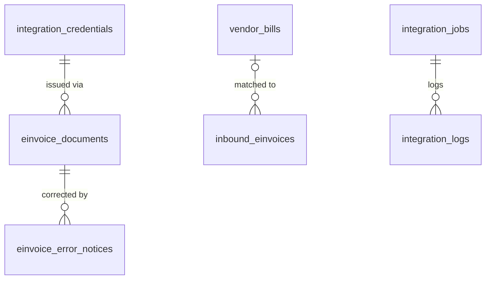

# 11 · Tích hợp / Integrations (INT) — Giai đoạn 9 / Phase 9

[← Giai đoạn 9 · Kế toán đầy đủ & HĐĐT / Phase 9 · Full accounting & e-invoicing](README.md)

Các giai đoạn khác của phân hệ / Other phases of this module: [P2](../phase-02-organization-master-data/11-integrations.md) · [P7](../phase-07-approvals-controls/11-integrations.md) · [P10](../phase-10-expansion/11-integrations.md) · [P11](../phase-11-advanced/11-integrations.md)

---

## Phạm vi giai đoạn / Phase scope

- **VI:** Tích hợp nhà cung cấp HĐĐT; HĐĐT đầu vào; nhập sao kê ngân hàng; xuất dữ liệu kê khai thuế; nhật ký tích hợp, chống trùng lặp, hàng đợi.
- **EN:** E-invoice provider integration; inbound e-invoices; bank statement import; tax filing export; integration log, idempotency, queues.

## 1. Tổng quan tích hợp / Integration overview

| Mã / ID | Hệ thống (VI) | System (EN) | Hướng / Direction | Ưu tiên / Priority | Giai đoạn / Phase |
|---|---|---|---|---|---|
| FR-INT-001 | Nhà cung cấp hóa đơn điện tử | E-invoice provider | ERP → NCC / provider | Must | P9 |
| FR-INT-002 | Hóa đơn điện tử đầu vào | Inbound e-invoices | Ngoài / External → ERP | Should | P9 |
| FR-INT-003 | Sao kê ngân hàng (file) | Bank statements (file) | Ngân hàng / Bank → ERP | Should | P9 |
| FR-INT-013 | Kê khai thuế (XML) | Tax filing (XML) | ERP → file | Should | P9 |

## 2. Yêu cầu chức năng / Functional requirements

**Hóa đơn điện tử / E-invoicing**

#### FR-INT-001 · Tích hợp nhà cung cấp hóa đơn điện tử / E-invoice provider integration
`Must` · `P9`

- **VI:** Tích hợp qua API với ít nhất một nhà cung cấp dịch vụ hóa đơn điện tử; thiết kế theo mô hình adapter để thay hoặc thêm nhà cung cấp mà không sửa nghiệp vụ. Hỗ trợ: phát hành hóa đơn (có mã / không có mã của cơ quan thuế), ký số, gửi khách hàng, tra cứu trạng thái, hủy, điều chỉnh, thay thế, thông báo hóa đơn có sai sót, phiếu xuất kho kiêm vận chuyển nội bộ điện tử; lưu bản XML và PDF trên ERP.
- **EN:** Integrate via API with at least one e-invoice provider; use an adapter pattern so providers can be replaced or added without changing business logic. Support: issuing invoices (with / without tax authority code), digital signing, sending to customers, status lookup, cancellation, adjustment, replacement, erroneous-invoice notification, electronic internal transfer notes; store XML and PDF copies in the ERP.

#### FR-INT-002 · Hóa đơn điện tử đầu vào / Inbound e-invoices
`Should` · `P9`

- **VI:** Nhận hóa đơn đầu vào qua email hoặc tải file XML; đồng bộ danh sách hóa đơn mua vào từ cổng hóa đơn điện tử của cơ quan thuế (trực tiếp hoặc qua nhà cung cấp, tùy khả năng kỹ thuật và pháp lý); đối chiếu với hóa đơn đã ghi nhận để phát hiện hóa đơn thiếu hoặc sai lệch.
- **EN:** Receive inbound invoices via email or XML upload; sync the list of purchase invoices from the tax authority's e-invoice portal (directly or via a provider, subject to technical and legal feasibility); reconcile with recorded bills to detect missing or mismatched invoices.

**Ngân hàng & thanh toán / Banking & payments**

#### FR-INT-003 · Nhập sao kê ngân hàng / Bank statement import
`Should` · `P9`

- **VI:** Nhập sao kê theo định dạng của từng ngân hàng (Excel, CSV, MT940) với bộ ánh xạ cột cấu hình được; phục vụ đối chiếu ngân hàng (`FR-ACC-027`).
- **EN:** Import statements in each bank's format (Excel, CSV, MT940) with configurable column mappings; feeds bank reconciliation (`FR-ACC-027`).

**Thuế, API & hạ tầng / Tax, API & infrastructure**

#### FR-INT-013 · Xuất dữ liệu kê khai thuế / Tax filing export
`Should` · `P9`

- **VI:** Xuất tờ khai và bảng kê theo định dạng XML của phần mềm hỗ trợ kê khai thuế hiện hành (`FR-ACC-030`).
- **EN:** Export returns and listings in the XML format of the current tax filing software (`FR-ACC-030`).

## 3. Yêu cầu chung cho tích hợp / General integration requirements

| Mã / ID | Yêu cầu (VI) | Requirement (EN) | Ưu tiên / Priority |
|---|---|---|---|
| FR-INT-018 | Nhật ký tích hợp: lưu yêu cầu / phản hồi (che dữ liệu nhạy cảm), trạng thái, số lần thử; màn hình theo dõi và xử lý lỗi. | Integration log: store requests / responses (sensitive data masked), status, attempts; monitoring and error-handling screen. | Must · P9 |
| FR-INT-019 | Chống trùng lặp (idempotency): một chứng từ không bao giờ được phát hành hai lần khi gửi lại. | Idempotency: a document must never be issued twice on retry. | Must · P9 |
| FR-INT-020 | Xử lý bất đồng bộ qua hàng đợi, thử lại có giãn cách tăng dần; thông báo cho người phụ trách khi lỗi kéo dài. | Asynchronous processing via queues, retries with exponential backoff; alert the owner on persistent failures. | Must · P9 |

## 4. Mô hình dữ liệu / Data model

- **VI:** Mọi lời gọi ra bên ngoài đi qua `integration_jobs`: job được tạo trong cùng giao dịch nghiệp vụ với `idempotency_key` duy nhất (ví dụ `EINVOICE_ISSUE:<invoice id>`), worker BullMQ xử lý và thử lại có giãn cách; tạo lại job cùng khóa bị chặn, nên một chứng từ không thể phát hành hai lần (`FR-INT-019`, `FR-INT-020`). `einvoice_documents` lưu HĐĐT đầu ra cho cả hóa đơn bán và phiếu xuất kho kiêm vận chuyển nội bộ; nhà cung cấp HĐĐT là một dòng `integration_credentials` (adapter theo `provider_code`). Tệp XML tờ khai thuế (`FR-INT-013`) lưu ở `vat_returns.xml_file_id` ([07 · Kế toán](07-accounting-finance.md)).
- **EN:** Every outbound call goes through `integration_jobs`: the job is created in the business transaction with a unique `idempotency_key` (e.g. `EINVOICE_ISSUE:<invoice id>`), a BullMQ worker processes it and retries with back-off; creating a second job with the same key is rejected, so a document can never be issued twice (`FR-INT-019`, `FR-INT-020`). `einvoice_documents` stores output e-invoices for both customer invoices and internal transfer notes; the e-invoice provider is an `integration_credentials` row (adapter chosen by `provider_code`). The tax return XML (`FR-INT-013`) is stored in `vat_returns.xml_file_id` ([07 · Accounting](07-accounting-finance.md)).



| Bảng / Table | Mục đích (VI) | Purpose (EN) |
|---|---|---|
| `einvoice_documents` | HĐĐT đầu ra: ký hiệu, số, mã CQT, trạng thái, XML / PDF (`FR-INT-001`, `FR-ACC-031`). | Output e-invoices: series, number, tax authority code, status, XML / PDF (`FR-INT-001`, `FR-ACC-031`). |
| `einvoice_error_notices` | Thông báo hóa đơn có sai sót / hủy / điều chỉnh / thay thế gửi CQT qua nhà cung cấp. | Erroneous-invoice notices (cancel / adjust / replace) sent to the tax authority via the provider. |
| `inbound_einvoices` | HĐĐT đầu vào nhận qua email, tải lên hoặc đồng bộ cổng thuế; đối chiếu với hóa đơn đã ghi nhận (`FR-INT-002`). | Inbound e-invoices from email, upload or tax-portal sync; reconciled with recorded bills (`FR-INT-002`). |
| `bank_statement_mappings` | Bộ ánh xạ cột sao kê theo ngân hàng / định dạng (`FR-INT-003`). | Statement column mappings per bank / format (`FR-INT-003`). |
| `integration_jobs`, `integration_logs` | Hàng đợi bền vững, chống trùng; nhật ký yêu cầu / phản hồi đã che dữ liệu nhạy cảm (`FR-INT-018` – `020`). | Durable, idempotent job queue; request / response log with sensitive data masked (`FR-INT-018` – `020`). |

<details>
<summary>Xem DDL / Show DDL</summary>

```sql
-- Chạy sau / Run after: 01-roles-permissions.md (P9)

-- ===== Hàng đợi & nhật ký tích hợp / Integration jobs & logs =====
CREATE TYPE integration_job_status AS ENUM ('PENDING','RUNNING','SUCCEEDED','FAILED','DEAD');

CREATE TABLE integration_jobs (
  id               uuid                   PRIMARY KEY DEFAULT gen_random_uuid(),
  job_type         varchar(50)            NOT NULL,  -- 'EINVOICE_ISSUE', 'EINVOICE_STATUS', 'INBOUND_SYNC'…
  idempotency_key  varchar(150)           NOT NULL UNIQUE,  -- FR-INT-019
  entity_type      varchar(50),
  entity_id        uuid,
  payload          jsonb,
  status           integration_job_status NOT NULL DEFAULT 'PENDING',
  attempts         smallint               NOT NULL DEFAULT 0,
  max_attempts     smallint               NOT NULL DEFAULT 8,
  next_attempt_at  timestamptz            NOT NULL DEFAULT now(),
  last_error       text,
  owner_user_id    uuid                   REFERENCES users(id),  -- nhận cảnh báo lỗi kéo dài / alerted on persistent failure
  created_at       timestamptz            NOT NULL DEFAULT now(),
  updated_at       timestamptz            NOT NULL DEFAULT now()
);
CREATE INDEX integration_jobs_due ON integration_jobs (next_attempt_at) WHERE status IN ('PENDING','FAILED');
CREATE INDEX ON integration_jobs (entity_type, entity_id);

CREATE TABLE integration_logs (
  id               bigint      GENERATED ALWAYS AS IDENTITY PRIMARY KEY,
  job_id           uuid        REFERENCES integration_jobs(id),
  provider_code    varchar(50) NOT NULL,
  operation        varchar(50) NOT NULL,
  direction        varchar(3)  NOT NULL CHECK (direction IN ('OUT','IN')),
  request_masked   jsonb,
  response_masked  jsonb,
  http_status      smallint,
  success          boolean     NOT NULL,
  duration_ms      integer,
  correlation_id   varchar(64),
  created_at       timestamptz NOT NULL DEFAULT now()
);
CREATE INDEX ON integration_logs (job_id);
CREATE INDEX ON integration_logs (provider_code, created_at DESC);

-- ===== HĐĐT đầu ra / Output e-invoices (FR-INT-001) =====
CREATE TYPE einvoice_kind   AS ENUM ('INVOICE','INTERNAL_TRANSFER_NOTE');
CREATE TYPE einvoice_status AS ENUM ('PENDING','ISSUING','ISSUED','SENT_TO_BUYER','CANCELLED','REPLACED','ADJUSTED','ERROR');

CREATE TABLE einvoice_documents (
  id                      uuid            PRIMARY KEY DEFAULT gen_random_uuid(),
  kind                    einvoice_kind   NOT NULL,
  source_type             varchar(30)     NOT NULL,  -- 'customer_invoice' | 'stock_document'
  source_id               uuid            NOT NULL,
  provider_credential_id  uuid            NOT NULL REFERENCES integration_credentials(id),
  template_code           varchar(20),               -- mẫu số / form number
  series                  varchar(10),               -- ký hiệu / series
  invoice_no              varchar(20),
  issue_date              date,
  with_tax_authority_code boolean         NOT NULL DEFAULT true,
  tax_authority_code      varchar(50),               -- mã của CQT / tax authority code
  status                  einvoice_status NOT NULL DEFAULT 'PENDING',
  idempotency_key         varchar(150)    NOT NULL UNIQUE,
  xml_file_id             uuid            REFERENCES stored_files(id),
  pdf_file_id             uuid            REFERENCES stored_files(id),
  sent_to_buyer_at        timestamptz,
  last_error              text,
  created_at              timestamptz     NOT NULL DEFAULT now(),
  created_by              uuid            REFERENCES users(id),
  updated_at              timestamptz     NOT NULL DEFAULT now(),
  updated_by              uuid            REFERENCES users(id)
);
CREATE UNIQUE INDEX einvoice_documents_number
  ON einvoice_documents (upper(series), invoice_no) WHERE invoice_no IS NOT NULL;
CREATE INDEX ON einvoice_documents (source_type, source_id);

CREATE TYPE einvoice_notice_status AS ENUM ('DRAFT','SENT','ACCEPTED','REJECTED');

CREATE TABLE einvoice_error_notices (
  id                    uuid                   PRIMARY KEY DEFAULT gen_random_uuid(),
  einvoice_document_id  uuid                   NOT NULL REFERENCES einvoice_documents(id),
  notice_type           varchar(20)            NOT NULL CHECK (notice_type IN ('CANCEL','ADJUST','REPLACE','EXPLAIN')),
  reason                text                   NOT NULL,
  status                einvoice_notice_status NOT NULL DEFAULT 'DRAFT',
  sent_at               timestamptz,
  response              jsonb,
  file_id               uuid                   REFERENCES stored_files(id),
  created_at            timestamptz            NOT NULL DEFAULT now(),
  created_by            uuid                   REFERENCES users(id)
);

-- ===== HĐĐT đầu vào / Inbound e-invoices (FR-INT-002) =====
CREATE TYPE inbound_einvoice_source AS ENUM ('EMAIL','UPLOAD','PORTAL_SYNC');
CREATE TYPE inbound_einvoice_status AS ENUM ('NEW','MATCHED','MISSING_IN_ERP','MISMATCH','IGNORED');

CREATE TABLE inbound_einvoices (
  id                    uuid                    PRIMARY KEY DEFAULT gen_random_uuid(),
  source                inbound_einvoice_source NOT NULL,
  seller_tax_code       dm_tax_code             NOT NULL,
  seller_name           varchar(255),
  series                varchar(10)             NOT NULL,
  invoice_no            varchar(20)             NOT NULL,
  issue_date            date                    NOT NULL,
  buyer_tax_code        dm_tax_code,
  currency_code         char(3)                 REFERENCES currencies(code),
  amount_untaxed        dm_amount,
  amount_tax            dm_amount,
  amount_total          dm_amount,
  tax_authority_code    varchar(50),
  tax_authority_status  varchar(30),            -- trạng thái tra cứu CQT / status from the tax authority
  lines                 jsonb,                  -- dòng hàng đọc từ XML / lines parsed from XML
  xml_file_id           uuid                    REFERENCES stored_files(id),
  pdf_file_id           uuid                    REFERENCES stored_files(id),
  received_at           timestamptz             NOT NULL DEFAULT now(),
  status                inbound_einvoice_status NOT NULL DEFAULT 'NEW',
  vendor_bill_id        uuid                    REFERENCES vendor_bills(id),
  note                  text,
  UNIQUE (seller_tax_code, series, invoice_no)
);

-- ===== Sao kê ngân hàng / Bank statements (FR-INT-003) =====
CREATE TYPE statement_format AS ENUM ('EXCEL','CSV','MT940');

CREATE TABLE bank_statement_mappings (
  id                 uuid             PRIMARY KEY DEFAULT gen_random_uuid(),
  name               varchar(100)     NOT NULL UNIQUE,
  bank_name          varchar(150)     NOT NULL,
  format             statement_format NOT NULL,
  column_map         jsonb            NOT NULL,  -- {"txn_date":"B","description":"D","debit":"E","credit":"F"…}
  date_format        varchar(20),
  decimal_separator  char(1),
  skip_rows          smallint         NOT NULL DEFAULT 0,
  is_active          boolean          NOT NULL DEFAULT true,
  version            integer          NOT NULL DEFAULT 1,
  created_at         timestamptz      NOT NULL DEFAULT now(),
  created_by         uuid             REFERENCES users(id),
  updated_at         timestamptz      NOT NULL DEFAULT now(),
  updated_by         uuid             REFERENCES users(id)
);
```

</details>
