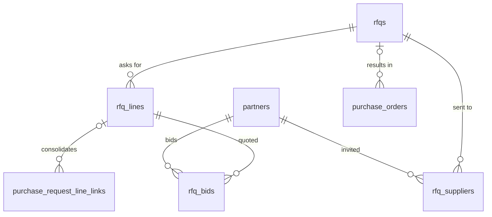

# 05 · Mua hàng / Purchasing (PUR) — Giai đoạn 10 / Phase 10

[← Giai đoạn 10 · Mở rộng / Phase 10 · Expansion](README.md)

Các giai đoạn khác của phân hệ / Other phases of this module: [P4](../phase-04-purchasing/05-purchasing.md) · [P7](../phase-07-approvals-controls/05-purchasing.md) · [P8](../phase-08-operations-completion/05-purchasing.md) · [P9](../phase-09-accounting-einvoicing/05-purchasing.md) · [P11](../phase-11-advanced/05-purchasing.md)

---

## Phạm vi giai đoạn / Phase scope

- **VI:** Yêu cầu báo giá & so sánh báo giá.
- **EN:** RFQs & bid comparison.

## 1. Yêu cầu chức năng / Functional requirements

**Yêu cầu báo giá / Requests for quotation**

#### FR-PUR-005 · Gửi yêu cầu báo giá / Send RFQs
`Should` · `P10`

- **VI:** Tạo yêu cầu báo giá và gửi email cho nhiều nhà cung cấp cùng lúc kèm file PDF.
- **EN:** Create an RFQ and email it to several suppliers at once with a PDF.

#### FR-PUR-006 · So sánh báo giá / Bid comparison
`Should` · `P10`

- **VI:** Nhập báo giá của từng nhà cung cấp; bảng so sánh đơn giá, tổng tiền, thời gian giao, điều khoản thanh toán; chọn nhà cung cấp kèm lý do lựa chọn và tạo đơn mua.
- **EN:** Enter each supplier's quote; compare unit price, total, lead time and payment terms side by side; select a supplier with a justification and create the PO.

**Mở rộng yêu cầu của giai đoạn trước / Extensions to earlier-phase requirements**

| Mã / ID | Mở rộng (VI) | Extension (EN) |
|---|---|---|
| FR-PUR-007 | Tạo đơn mua từ yêu cầu báo giá đã chọn nhà cung cấp. | Create POs from RFQs with a selected supplier. |

## 2. Quy tắc nghiệp vụ / Business rules

| Mã / ID | Quy tắc (VI) | Rule (EN) | Giai đoạn / Phase |
|---|---|---|---|
| BR-PUR-006 | Cảnh báo khi nhà cung cấp có mã số thuế ở trạng thái ngừng hoạt động hoặc rủi ro (nếu tra cứu được). | Warn when the supplier's tax ID is inactive or flagged as risky (when lookup is available). | P10 |

## 3. Mô hình dữ liệu / Data model

- **VI:** Yêu cầu báo giá gửi cho nhiều nhà cung cấp (`rfq_suppliers`), mỗi nhà cung cấp nhập báo giá theo từng dòng (`rfq_bids`) để so sánh; chọn nhà cung cấp bắt buộc lý do và sinh đơn mua có `rfq_id` (`FR-PUR-005`, `FR-PUR-006`). Dòng đề nghị mua gộp vào yêu cầu báo giá dùng lại `purchase_request_line_links` (P8). Trạng thái mã số thuế của nhà cung cấp cho `BR-PUR-006` nằm ở `partners.tax_status` ([11 · Tích hợp](11-integrations.md)).
- **EN:** An RFQ is sent to several suppliers (`rfq_suppliers`); each supplier's quote is entered per line (`rfq_bids`) for comparison; selecting a supplier requires a justification and creates a PO carrying `rfq_id` (`FR-PUR-005`, `FR-PUR-006`). Purchase request lines consolidated into an RFQ reuse `purchase_request_line_links` (P8). The supplier tax status for `BR-PUR-006` is `partners.tax_status` ([11 · Integrations](11-integrations.md)).



<details>
<summary>Xem DDL / Show DDL</summary>

```sql
-- Chạy sau / Run after: 01-roles-permissions.md (P10)

INSERT INTO document_types (code, module, name_vi, name_en, function_code, table_name, sort_order) VALUES
  ('RFQ', 'PUR', 'Yêu cầu báo giá', 'Request for quotation', 'PUR.RFQ', 'rfqs', 415);
INSERT INTO document_sequences (document_type, prefix) VALUES ('RFQ', 'RFQ');

CREATE TYPE rfq_status AS ENUM ('DRAFT','SENT','BIDDING_CLOSED','AWARDED','CANCELLED');

CREATE TABLE rfqs (
  id                     uuid        PRIMARY KEY DEFAULT gen_random_uuid(),
  doc_no                 varchar(30) UNIQUE,
  branch_id              uuid        NOT NULL REFERENCES branches(id),
  title                  varchar(255) NOT NULL,
  request_date           date        NOT NULL,
  bid_deadline           timestamptz,
  status                 rfq_status  NOT NULL DEFAULT 'DRAFT',
  selected_supplier_id   uuid        REFERENCES partners(id),
  selection_reason       text,
  owner_id               uuid        REFERENCES users(id),
  department_id          uuid        REFERENCES departments(id),
  version                integer     NOT NULL DEFAULT 1,
  created_at             timestamptz NOT NULL DEFAULT now(),
  created_by             uuid        REFERENCES users(id),
  updated_at             timestamptz NOT NULL DEFAULT now(),
  updated_by             uuid        REFERENCES users(id),
  CHECK (status <> 'AWARDED' OR (selected_supplier_id IS NOT NULL AND selection_reason IS NOT NULL))
);

CREATE TABLE rfq_lines (
  id           uuid         PRIMARY KEY DEFAULT gen_random_uuid(),
  rfq_id       uuid         NOT NULL REFERENCES rfqs(id),
  line_no      smallint     NOT NULL,
  product_id   uuid         REFERENCES products(id),
  description  varchar(500),
  uom_id       uuid         REFERENCES uoms(id),
  qty          dm_qty       NOT NULL CHECK (qty > 0),
  UNIQUE (rfq_id, line_no),
  CHECK (product_id IS NOT NULL OR description IS NOT NULL)
);

CREATE TABLE rfq_suppliers (
  rfq_id            uuid         NOT NULL REFERENCES rfqs(id),
  supplier_id       uuid         NOT NULL REFERENCES partners(id),
  email             varchar(255),
  email_message_id  uuid         REFERENCES email_messages(id),
  sent_at           timestamptz,
  responded_at      timestamptz,
  PRIMARY KEY (rfq_id, supplier_id)
);

CREATE TABLE rfq_bids (
  id               uuid        PRIMARY KEY DEFAULT gen_random_uuid(),
  rfq_line_id      uuid        NOT NULL REFERENCES rfq_lines(id),
  supplier_id      uuid        NOT NULL REFERENCES partners(id),
  currency_code    char(3)     NOT NULL REFERENCES currencies(code),
  unit_price       dm_price    NOT NULL CHECK (unit_price >= 0),
  tax_id           uuid        REFERENCES taxes(id),
  lead_time_days   smallint,
  payment_term_id  uuid        REFERENCES payment_terms(id),
  valid_until      date,
  note             text,
  created_at       timestamptz NOT NULL DEFAULT now(),
  created_by       uuid        REFERENCES users(id),
  UNIQUE (rfq_line_id, supplier_id)
);

ALTER TABLE purchase_request_line_links ADD COLUMN rfq_line_id uuid REFERENCES rfq_lines(id);
ALTER TABLE purchase_orders             ADD COLUMN rfq_id      uuid REFERENCES rfqs(id);  -- FR-PUR-007 (mở rộng)
```

</details>
