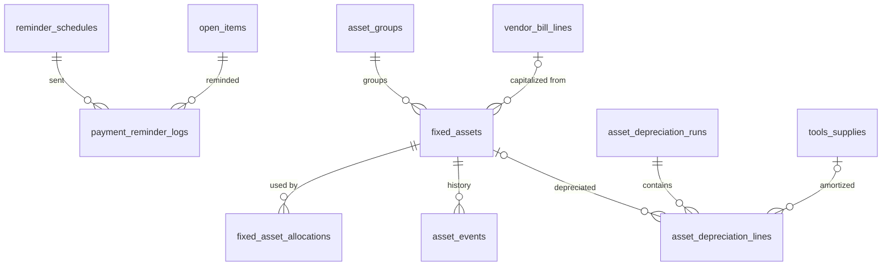

# 07 · Kế toán – Tài chính / Accounting & Finance (ACC) — Giai đoạn 10 / Phase 10

[← Giai đoạn 10 · Mở rộng / Phase 10 · Expansion](README.md)

Các giai đoạn khác của phân hệ / Other phases of this module: [P2](../phase-02-organization-master-data/07-accounting-finance.md) · [P6](../phase-06-receivables-payables-cash/07-accounting-finance.md) · [P9](../phase-09-accounting-einvoicing/07-accounting-finance.md) · [P11](../phase-11-advanced/07-accounting-finance.md)

---

## Phạm vi giai đoạn / Phase scope

- **VI:** Nhắc nợ; tài sản cố định & công cụ dụng cụ.
- **EN:** Payment reminders; fixed assets & tools.

## 1. Yêu cầu chức năng / Functional requirements

**Công nợ phải thu / Accounts receivable**

#### FR-ACC-018 · Nhắc nợ / Payment reminders
`Should` · `P10`

- **VI:** Tự động gửi email nhắc nợ trước và sau hạn thanh toán theo lịch cấu hình.
- **EN:** Automatically email payment reminders before and after due dates on a configurable schedule.

**Tài sản cố định & công cụ dụng cụ / Fixed assets & tools**

#### FR-ACC-033 · Sổ tài sản cố định / Fixed-asset register
`Should` · `P10`

- **VI:** Quản lý TSCĐ hữu hình và vô hình: mã, tên, nhóm, nguyên giá, nguồn vốn, ngày đưa vào sử dụng, bộ phận sử dụng, tài khoản nguyên giá / khấu hao / chi phí, thời gian khấu hao; ghi tăng từ hóa đơn mua.
- **EN:** Manage tangible and intangible fixed assets: code, name, group, cost, funding source, in-service date, using department, cost / depreciation / expense accounts, useful life; capitalize from vendor bills.

#### FR-ACC-034 · Khấu hao tự động / Automatic depreciation
`Should` · `P10`

- **VI:** Tính khấu hao hằng tháng theo phương pháp đường thẳng (mặc định), số dư giảm dần có điều chỉnh hoặc theo số lượng sản phẩm; phân bổ chi phí khấu hao theo bộ phận và sinh bút toán.
- **EN:** Compute monthly depreciation using straight-line (default), declining balance with adjustment, or units-of-production; allocate depreciation by department and generate entries.

#### FR-ACC-035 · Biến động tài sản / Asset changes
`Should` · `P10`

- **VI:** Ghi nhận điều chuyển bộ phận, đánh giá lại, nâng cấp, thanh lý / nhượng bán, ngừng khấu hao; lịch sử biến động theo từng tài sản.
- **EN:** Record transfers between departments, revaluation, upgrades, disposal / sale, depreciation suspension; full history per asset.

#### FR-ACC-036 · Công cụ dụng cụ / Tools & supplies
`Should` · `P10`

- **VI:** Ghi tăng công cụ dụng cụ, phân bổ dần chi phí qua nhiều kỳ, theo dõi bộ phận sử dụng, báo hỏng / mất.
- **EN:** Record tools & supplies, amortize their cost over several periods, track the using department, record damage / loss.

## 2. Mô hình dữ liệu / Data model

- **VI:** Nhắc nợ chạy theo lịch: mỗi lịch có độ lệch so với hạn thanh toán (âm = trước hạn) và mẫu email; nhật ký gửi bảo đảm mỗi khoản công nợ chỉ được nhắc một lần cho mỗi lịch (`FR-ACC-018`). Tài sản cố định và công cụ dụng cụ dùng chung lượt khấu hao / phân bổ hằng tháng (`asset_depreciation_runs`), mỗi lượt sinh một bút toán phân bổ theo bộ phận sử dụng (`FR-ACC-034`). Mọi biến động tài sản lưu ở `asset_events` để có lịch sử đầy đủ (`FR-ACC-035`).
- **EN:** Payment reminders run on schedules: each schedule has an offset from the due date (negative = before due) and an email template; the send log guarantees each open item is reminded once per schedule (`FR-ACC-018`). Fixed assets and tools share the monthly depreciation / amortization runs (`asset_depreciation_runs`); each run posts one entry allocated by using department (`FR-ACC-034`). Every asset change is stored in `asset_events` for a full history (`FR-ACC-035`).



| Bảng / Table | Mục đích (VI) | Purpose (EN) |
|---|---|---|
| `reminder_schedules`, `payment_reminder_logs` | Lịch và nhật ký nhắc nợ (`FR-ACC-018`). | Reminder schedules and send log (`FR-ACC-018`). |
| `asset_groups`, `fixed_assets`, `fixed_asset_allocations` | Sổ TSCĐ, ghi tăng từ hóa đơn mua, tỷ lệ phân bổ theo bộ phận (`FR-ACC-033`). | Fixed-asset register, capitalized from vendor bills, allocation by department (`FR-ACC-033`). |
| `asset_events` | Điều chuyển, đánh giá lại, nâng cấp, thanh lý / nhượng bán, ngừng / tiếp tục khấu hao (`FR-ACC-035`). | Transfers, revaluations, upgrades, disposals / sales, suspension / resumption (`FR-ACC-035`). |
| `asset_depreciation_runs`, `asset_depreciation_lines` | Khấu hao TSCĐ và phân bổ CCDC theo kỳ (`FR-ACC-034`, `FR-ACC-036`). | Periodic depreciation of assets and amortization of tools (`FR-ACC-034`, `FR-ACC-036`). |
| `tools_supplies` | Công cụ dụng cụ: phân bổ nhiều kỳ, bộ phận sử dụng, báo hỏng / mất (`FR-ACC-036`). | Tools & supplies: multi-period amortization, using department, damage / loss (`FR-ACC-036`). |

<details>
<summary>Xem DDL / Show DDL</summary>

```sql
-- Chạy sau / Run after: 01-roles-permissions.md (P10)

-- ===== Nhắc nợ / Payment reminders (FR-ACC-018) =====
CREATE TABLE reminder_schedules (
  id                   uuid                PRIMARY KEY DEFAULT gen_random_uuid(),
  name                 varchar(150)        NOT NULL,
  account_type         ledger_account_type NOT NULL DEFAULT 'RECEIVABLE',
  offset_days          smallint            NOT NULL,  -- −3 = trước hạn 3 ngày; 7 = quá hạn 7 ngày
  email_template_code  varchar(50)         NOT NULL,  -- email_templates.code (P8)
  is_active            boolean             NOT NULL DEFAULT true,
  created_at           timestamptz         NOT NULL DEFAULT now(),
  created_by           uuid                REFERENCES users(id)
);

CREATE TABLE payment_reminder_logs (
  id                uuid        PRIMARY KEY DEFAULT gen_random_uuid(),
  schedule_id       uuid        NOT NULL REFERENCES reminder_schedules(id),
  open_item_id      uuid        NOT NULL REFERENCES open_items(id),
  partner_id        uuid        NOT NULL REFERENCES partners(id),
  email_message_id  uuid        REFERENCES email_messages(id),
  sent_at           timestamptz NOT NULL DEFAULT now(),
  UNIQUE (schedule_id, open_item_id)
);

-- ===== Tài sản cố định / Fixed assets (FR-ACC-033 – 035) =====
CREATE TYPE asset_kind          AS ENUM ('TANGIBLE','INTANGIBLE');
CREATE TYPE depreciation_method AS ENUM ('STRAIGHT_LINE','DECLINING_BALANCE','UNITS_OF_PRODUCTION');
CREATE TYPE asset_status        AS ENUM ('DRAFT','IN_USE','SUSPENDED','FULLY_DEPRECIATED','DISPOSED');

CREATE TABLE asset_groups (
  id                       uuid         PRIMARY KEY DEFAULT gen_random_uuid(),
  code                     varchar(30)  NOT NULL UNIQUE,
  name                     varchar(255) NOT NULL,
  name_en                  varchar(255),
  asset_kind               asset_kind   NOT NULL DEFAULT 'TANGIBLE',
  cost_account_code        varchar(20)  REFERENCES gl_accounts(code),  -- 211 / 213
  accum_dep_account_code   varchar(20)  REFERENCES gl_accounts(code),  -- 214
  expense_account_code     varchar(20)  REFERENCES gl_accounts(code),  -- 627 / 641 / 642
  default_useful_months    smallint     CHECK (default_useful_months > 0),
  is_active                boolean      NOT NULL DEFAULT true,
  created_at               timestamptz  NOT NULL DEFAULT now(),
  created_by               uuid         REFERENCES users(id),
  updated_at               timestamptz  NOT NULL DEFAULT now(),
  updated_by               uuid         REFERENCES users(id)
);

CREATE TABLE fixed_assets (
  id                        uuid                PRIMARY KEY DEFAULT gen_random_uuid(),
  code                      varchar(30)         NOT NULL UNIQUE,
  name                      varchar(255)        NOT NULL,
  group_id                  uuid                NOT NULL REFERENCES asset_groups(id),
  branch_id                 uuid                NOT NULL REFERENCES branches(id),
  original_cost_vnd         dm_amount           NOT NULL CHECK (original_cost_vnd > 0),
  funding_source            varchar(50),        -- nguồn vốn / funding source
  acquisition_date          date                NOT NULL,
  in_service_date           date,
  useful_life_months        smallint            NOT NULL CHECK (useful_life_months > 0),
  method                    depreciation_method NOT NULL DEFAULT 'STRAIGHT_LINE',
  declining_factor          numeric(4,2),       -- hệ số điều chỉnh / adjustment factor
  total_units               numeric(18,4),      -- theo số lượng sản phẩm / units of production
  salvage_value_vnd         dm_amount           NOT NULL DEFAULT 0,
  accumulated_dep_vnd       dm_amount           NOT NULL DEFAULT 0,
  cost_account_code         varchar(20)         REFERENCES gl_accounts(code),  -- NULL = theo nhóm
  accum_dep_account_code    varchar(20)         REFERENCES gl_accounts(code),
  expense_account_code      varchar(20)         REFERENCES gl_accounts(code),
  vendor_bill_line_id       uuid                REFERENCES vendor_bill_lines(id),  -- ghi tăng từ hóa đơn mua
  status                    asset_status        NOT NULL DEFAULT 'DRAFT',
  version                   integer             NOT NULL DEFAULT 1,
  created_at                timestamptz         NOT NULL DEFAULT now(),
  created_by                uuid                REFERENCES users(id),
  updated_at                timestamptz         NOT NULL DEFAULT now(),
  updated_by                uuid                REFERENCES users(id),
  CHECK (method <> 'DECLINING_BALANCE' OR declining_factor IS NOT NULL),
  CHECK (method <> 'UNITS_OF_PRODUCTION' OR total_units > 0),
  CHECK (accumulated_dep_vnd <= original_cost_vnd)
);

-- Phân bổ chi phí khấu hao theo bộ phận sử dụng; tổng = 100 / depreciation split by department; sums to 100
CREATE TABLE fixed_asset_allocations (
  asset_id       uuid   NOT NULL REFERENCES fixed_assets(id),
  department_id  uuid   NOT NULL REFERENCES departments(id),
  percent        dm_pct NOT NULL CHECK (percent > 0),
  PRIMARY KEY (asset_id, department_id)
);

CREATE TYPE asset_event_type AS ENUM
  ('IN_SERVICE','TRANSFER','REVALUATION','UPGRADE','SUSPEND','RESUME','DISPOSAL','SALE');

CREATE TABLE asset_events (
  id                   uuid             PRIMARY KEY DEFAULT gen_random_uuid(),
  asset_id             uuid             NOT NULL REFERENCES fixed_assets(id),
  event_type           asset_event_type NOT NULL,
  event_date           date             NOT NULL,
  from_department_id   uuid             REFERENCES departments(id),
  to_department_id     uuid             REFERENCES departments(id),
  cost_delta_vnd       dm_amount        NOT NULL DEFAULT 0,  -- đánh giá lại, nâng cấp / revaluation, upgrade
  useful_life_months   smallint,                             -- thời gian khấu hao mới / new useful life
  proceeds_vnd         dm_amount,                            -- thanh lý, nhượng bán / disposal proceeds
  decision_no          varchar(50),
  journal_entry_id     uuid             REFERENCES journal_entries(id),
  note                 text,
  created_at           timestamptz      NOT NULL DEFAULT now(),
  created_by           uuid             REFERENCES users(id)
);
CREATE INDEX ON asset_events (asset_id, event_date);

-- ===== Công cụ dụng cụ / Tools & supplies (FR-ACC-036) =====
CREATE TYPE tool_status AS ENUM ('IN_USE','DAMAGED','LOST','FULLY_ALLOCATED');

CREATE TABLE tools_supplies (
  id                       uuid        PRIMARY KEY DEFAULT gen_random_uuid(),
  code                     varchar(30) NOT NULL UNIQUE,
  name                     varchar(255) NOT NULL,
  branch_id                uuid        NOT NULL REFERENCES branches(id),
  quantity                 dm_qty      NOT NULL DEFAULT 1 CHECK (quantity > 0),
  cost_vnd                 dm_amount   NOT NULL CHECK (cost_vnd > 0),
  start_date               date        NOT NULL,
  allocation_periods       smallint    NOT NULL CHECK (allocation_periods > 0),
  allocated_vnd            dm_amount   NOT NULL DEFAULT 0,
  department_id            uuid        REFERENCES departments(id),
  prepaid_account_code     varchar(20) REFERENCES gl_accounts(code),  -- 242
  expense_account_code     varchar(20) REFERENCES gl_accounts(code),
  status                   tool_status NOT NULL DEFAULT 'IN_USE',
  status_note              text,       -- báo hỏng / mất / damage or loss note
  stock_document_line_id   uuid        REFERENCES stock_document_lines(id),  -- xuất dùng từ kho / issued from stock
  version                  integer     NOT NULL DEFAULT 1,
  created_at               timestamptz NOT NULL DEFAULT now(),
  created_by               uuid        REFERENCES users(id),
  updated_at               timestamptz NOT NULL DEFAULT now(),
  updated_by               uuid        REFERENCES users(id),
  CHECK (allocated_vnd <= cost_vnd)
);

-- ===== Khấu hao & phân bổ / Depreciation & amortization (FR-ACC-034, 036) =====
CREATE TYPE depreciation_run_status AS ENUM ('DRAFT','POSTED','CANCELLED');

CREATE TABLE asset_depreciation_runs (
  id                uuid                    PRIMARY KEY DEFAULT gen_random_uuid(),
  fiscal_period_id  uuid                    NOT NULL REFERENCES fiscal_periods(id),
  status            depreciation_run_status NOT NULL DEFAULT 'DRAFT',
  journal_entry_id  uuid                    REFERENCES journal_entries(id),
  run_by            uuid                    REFERENCES users(id),
  run_at            timestamptz             NOT NULL DEFAULT now()
);
CREATE UNIQUE INDEX asset_depreciation_runs_one_posted
  ON asset_depreciation_runs (fiscal_period_id) WHERE status = 'POSTED';

CREATE TABLE asset_depreciation_lines (
  id             uuid          PRIMARY KEY DEFAULT gen_random_uuid(),
  run_id         uuid          NOT NULL REFERENCES asset_depreciation_runs(id),
  asset_id       uuid          REFERENCES fixed_assets(id),
  tool_id        uuid          REFERENCES tools_supplies(id),
  department_id  uuid          REFERENCES departments(id),
  units_used     numeric(18,4),                -- UNITS_OF_PRODUCTION
  amount_vnd     dm_amount     NOT NULL CHECK (amount_vnd >= 0),
  CHECK (num_nonnulls(asset_id, tool_id) = 1)
);
CREATE INDEX ON asset_depreciation_lines (asset_id);
CREATE INDEX ON asset_depreciation_lines (tool_id);
```

</details>
