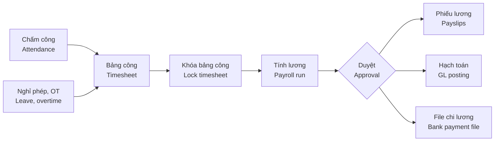
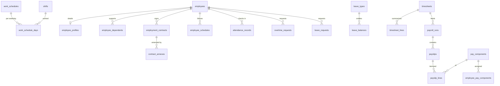

# 08 · Nhân sự – Tiền lương / HR & Payroll (HRM) — Giai đoạn 10 / Phase 10

[← Giai đoạn 10 · Mở rộng / Phase 10 · Expansion](README.md)

Các giai đoạn khác của phân hệ / Other phases of this module: [P11](../phase-11-advanced/08-hr-payroll.md)

---

## Phạm vi giai đoạn / Phase scope

- **VI:** Hồ sơ nhân viên, hợp đồng lao động; ca làm việc, nhập dữ liệu chấm công, làm thêm giờ, nghỉ phép, bảng công; thành phần lương, bảo hiểm, thuế TNCN, tính lương & phiếu lương, hạch toán lương, file chi lương, báo cáo.
- **EN:** Employee profiles, employment contracts; shifts, attendance import, overtime, leave, timesheets; pay components, insurance, PIT, payroll run & payslips, payroll posting, bank payroll file, reports.

## 1. Mục tiêu / Objectives

> **Giai đoạn / Phase:** P10 – P11 — Từ P2 đến P9 chỉ dùng danh mục nhân viên cơ bản (`FR-MDM-022`).
> **Phase:** P10 – P11 — P2 to P9 only use the basic employee list (`FR-MDM-022`).


- **VI:** Số hóa hồ sơ nhân sự, hợp đồng, chấm công, nghỉ phép; tính lương, bảo hiểm bắt buộc và thuế TNCN chính xác theo quy định; hạch toán lương tự động sang kế toán; cung cấp cổng tự phục vụ cho nhân viên.
- **EN:** Digitize employee records, contracts, attendance and leave; compute payroll, mandatory insurance and personal income tax accurately per regulations; post payroll to accounting automatically; provide an employee self-service portal.

## 2. Phạm vi / Scope

| Trong phạm vi / In scope | Ngoài phạm vi / Out of scope |
|---|---|
| Hồ sơ nhân sự, cơ cấu tổ chức, hợp đồng, chấm công, nghỉ phép, làm thêm giờ, tiền lương, bảo hiểm, thuế TNCN, cổng nhân viên / Employee records, org structure, contracts, attendance, leave, overtime, payroll, insurance, PIT, self-service | Tuyển dụng, đào tạo, đánh giá hiệu suất (P11); kết nối trực tiếp cổng BHXH / Recruitment, training, performance reviews (P11); direct social-insurance portal integration |

## 3. Quy trình tính lương / Payroll process



## 4. Yêu cầu chức năng / Functional requirements

**Hồ sơ nhân sự / Employee records**

#### FR-HRM-001 · Hồ sơ nhân viên / Employee profile
`Should` · `P10`

- **VI:** Thông tin cá nhân, số định danh cá nhân / CCCD, mã số thuế cá nhân, số sổ BHXH, tài khoản ngân hàng, trình độ, người phụ thuộc, liên hệ khẩn cấp, tài liệu đính kèm; thông tin công việc: phòng ban, chức danh, cấp bậc, quản lý trực tiếp, ngày vào làm.
- **EN:** Personal data, personal ID / citizen ID, personal tax ID, social insurance number, bank account, education, dependents, emergency contact, attachments; job data: department, title, grade, direct manager, start date.

#### FR-HRM-003 · Hợp đồng lao động / Employment contracts
`Should` · `P10`

- **VI:** Quản lý hợp đồng (thử việc, xác định thời hạn, không xác định thời hạn), phụ lục, mức lương hợp đồng và lương đóng bảo hiểm; cảnh báo hợp đồng sắp hết hạn trước 30 ngày; in hợp đồng theo mẫu.
- **EN:** Manage contracts (probation, fixed-term, indefinite), annexes, contractual salary and insurance salary; alert 30 days before expiry; print contracts from templates.

**Chấm công & nghỉ phép / Attendance & leave**

#### FR-HRM-005 · Ca làm việc / Shifts & schedules
`Should` · `P10`

- **VI:** Khai báo ca làm việc (giờ vào, giờ ra, nghỉ giữa ca), lịch làm việc theo tuần, ngày nghỉ lễ.
- **EN:** Define shifts (in, out, breaks), weekly work schedules and public holidays.

#### FR-HRM-006 · Dữ liệu chấm công / Attendance data
`Should` · `P10`

- **VI:** Nhập dữ liệu chấm công từ máy chấm công hoặc file; điều chỉnh có phê duyệt. Chấm công bằng điện thoại (GPS, Wi-Fi) là `Could`, `P11`.
- **EN:** Import attendance from time clocks or files; corrections require approval. Mobile check-in (GPS, Wi-Fi) is `Could`, `P11`.

#### FR-HRM-007 · Làm thêm giờ / Overtime
`Should` · `P10`

- **VI:** Đăng ký và duyệt làm thêm giờ; hệ số làm thêm giờ (ngày thường, ngày nghỉ, ngày lễ, ban đêm) cấu hình được theo quy định.
- **EN:** Request and approve overtime; overtime rates (weekday, rest day, holiday, night) are configurable per regulations.

#### FR-HRM-008 · Nghỉ phép / Leave management
`Should` · `P10`

- **VI:** Loại nghỉ (phép năm, ốm đau, thai sản, việc riêng có lương, không lương…); số ngày phép năm theo quy định và thâm niên; nhân viên gửi đơn, quản lý duyệt; theo dõi số dư phép và phép tồn chuyển năm.
- **EN:** Leave types (annual, sick, maternity, paid personal, unpaid…); annual entitlement by regulation and seniority; employees request, managers approve; track balances and carry-over.

#### FR-HRM-009 · Bảng công tổng hợp / Monthly timesheet
`Should` · `P10`

- **VI:** Tổng hợp ngày công, giờ làm thêm, ngày nghỉ theo nhân viên trong kỳ; khóa bảng công trước khi tính lương.
- **EN:** Summarize workdays, overtime hours and leave per employee for the period; lock the timesheet before payroll.

**Tiền lương / Payroll**

#### FR-HRM-010 · Thành phần lương / Pay components
`Should` · `P10`

- **VI:** Khai báo thành phần lương: lương cơ bản, phụ cấp (đánh dấu có chịu thuế TNCN, có đóng bảo hiểm hay không), thưởng, làm thêm giờ, hoa hồng (`FR-SAL-028`, khi có ở P11), khấu trừ; công thức tính cấu hình được.
- **EN:** Define pay components: base salary, allowances (flagged as PIT-taxable and insurance-contributable or not), bonuses, overtime, commissions (`FR-SAL-028`, once available in P11), deductions; formulas are configurable.

#### FR-HRM-011 · Bảo hiểm bắt buộc / Mandatory insurance
`Should` · `P10`

- **VI:** Tính BHXH, BHYT, BHTN phần người lao động và người sử dụng lao động, kinh phí công đoàn; tỷ lệ, mức trần, mức sàn (lương cơ sở, lương tối thiểu vùng) cấu hình theo ngày hiệu lực.
- **EN:** Compute social, health and unemployment insurance (employee and employer shares) and trade-union fee; rates, caps and floors (base salary, regional minimum wage) are configurable with effective dates.

#### FR-HRM-012 · Thuế thu nhập cá nhân / Personal income tax
`Should` · `P10`

- **VI:** Tính thuế TNCN theo biểu lũy tiến từng phần cho người cư trú có hợp đồng từ 3 tháng trở lên; giảm trừ gia cảnh cho bản thân và người phụ thuộc; các trường hợp khấu trừ khác theo quy định. Biểu thuế và mức giảm trừ cấu hình theo ngày hiệu lực.
- **EN:** Compute PIT using progressive brackets for residents with contracts of 3 months or more; family deductions for the taxpayer and dependents; other withholding cases per regulations. Brackets and deductions are configurable with effective dates.

#### FR-HRM-013 · Tính lương & phiếu lương / Payroll run & payslips
`Should` · `P10`

- **VI:** Chạy tính lương theo kỳ tháng cho toàn bộ hoặc nhóm nhân viên; xem trước, điều chỉnh, duyệt; gửi phiếu lương qua email (PDF có mật khẩu là `Could`) và hiển thị trên cổng nhân viên.
- **EN:** Run monthly payroll for all or a group of employees; preview, adjust, approve; email payslips (password-protected PDF is `Could`) and show them on the self-service portal.

#### FR-HRM-014 · Hạch toán lương / Payroll posting
`Should` · `P10`

- **VI:** Sau khi duyệt, tự động sinh bút toán chi phí lương theo bộ phận, phải trả người lao động, các khoản bảo hiểm và thuế TNCN phải nộp sang phân hệ Kế toán.
- **EN:** After approval, automatically generate entries for salary expense by department, payables to employees, insurance and PIT liabilities in the Accounting module.

#### FR-HRM-015 · File chi lương ngân hàng / Bank payroll file
`Should` · `P10`

- **VI:** Xuất file chi lương theo định dạng của ngân hàng trả lương.
- **EN:** Export the payroll payment file in the paying bank's format.

#### FR-HRM-016 · Báo cáo nhân sự – tiền lương / HR & payroll reports
`Should` · `P10`

- **VI:** Bảng lương tổng hợp và chi tiết; báo cáo tăng / giảm lao động tham gia bảo hiểm; dữ liệu tờ khai khấu trừ và quyết toán thuế TNCN; báo cáo biến động nhân sự, cơ cấu lao động.
- **EN:** Payroll summary and detail; insurance enrollment change reports; data for PIT withholding and annual finalization returns; headcount movement and workforce structure reports.

## 5. Quy tắc nghiệp vụ / Business rules

| Mã / ID | Quy tắc (VI) | Rule (EN) |
|---|---|---|
| BR-HRM-001 | Thông tin cá nhân và lương là dữ liệu cá nhân, chỉ người có quyền được xem; mọi lượt xem dữ liệu lương được ghi nhật ký. | Personal and salary data are personal data visible only to authorized users; every view of salary data is logged. |
| BR-HRM-002 | Bảng lương đã duyệt không được sửa; điều chỉnh ở kỳ sau hoặc bằng bảng lương bổ sung. | Approved payrolls cannot be edited; corrections go to the next period or a supplementary payroll. |
| BR-HRM-003 | Tham số luật định (tỷ lệ bảo hiểm, lương tối thiểu vùng, biểu thuế, mức giảm trừ) có ngày hiệu lực; hệ thống áp dụng giá trị hiệu lực của kỳ lương. | Statutory parameters (insurance rates, regional minimum wage, tax brackets, deductions) have effective dates; the system applies the values effective for the pay period. |
| BR-HRM-004 | Không tính lương khi bảng công của kỳ chưa khóa. | Payroll cannot run until the period's timesheet is locked. |

## 6. Mô hình dữ liệu / Data model

- **VI:** Hồ sơ nhân sự mở rộng `employees` (P2) bằng bảng 1-1 `employee_profiles` để tách dữ liệu cá nhân nhạy cảm (`BR-HRM-001`, `NFR-PRV-002`): các trường lương, số định danh, tài khoản ngân hàng được khai báo trong `sensitive_fields`, mọi lượt xem lương ghi `audit_logs` với `operation = 'VIEW'`. Tham số luật định và biểu thuế lưu theo ngày hiệu lực; kỳ lương lấy giá trị hiệu lực của kỳ (`BR-HRM-003`) — DDL không nạp sẵn số liệu vì mức lương cơ sở, lương tối thiểu vùng, giảm trừ gia cảnh, biểu thuế thay đổi theo văn bản, HR nạp theo văn bản đang hiệu lực. Trigger chặn tính lương khi bảng công chưa khóa (`BR-HRM-004`) và chặn sửa bảng lương đã duyệt (`BR-HRM-002`). Từ giai đoạn này, người duyệt "quản lý trực tiếp" lấy theo `employee_profiles.direct_manager_id`.
- **EN:** HR records extend `employees` (P2) with the 1-to-1 `employee_profiles` table to isolate sensitive personal data (`BR-HRM-001`, `NFR-PRV-002`): salary, ID number and bank account fields are declared in `sensitive_fields`, and every salary view is written to `audit_logs` with `operation = 'VIEW'`. Statutory parameters and tax brackets are stored with effective dates; a payroll uses the values effective for its period (`BR-HRM-003`) — the DDL seeds no figures because base salary, regional minimum wage, family deductions and tax brackets change by regulation; HR loads the values currently in force. Triggers block payroll calculation on an unlocked timesheet (`BR-HRM-004`) and edits to approved payrolls (`BR-HRM-002`). From this phase, the "direct manager" approver comes from `employee_profiles.direct_manager_id`.



| Bảng / Table | Mục đích (VI) | Purpose (EN) |
|---|---|---|
| `employee_profiles`, `employee_dependents` | Thông tin cá nhân, công việc, quản lý trực tiếp, người phụ thuộc (`FR-HRM-001`). | Personal and job data, direct manager, dependents (`FR-HRM-001`). |
| `employment_contracts`, `contract_annexes` | Hợp đồng, phụ lục, lương hợp đồng / đóng bảo hiểm; index cảnh báo hết hạn (`FR-HRM-003`). | Contracts, annexes, contractual / insurance salary; expiry-alert index (`FR-HRM-003`). |
| `shifts`, `work_schedules`, `work_schedule_days`, `employee_schedules`, `public_holidays` | Ca, lịch làm việc tuần, ngày lễ (`FR-HRM-005`). | Shifts, weekly schedules, holidays (`FR-HRM-005`). |
| `attendance_records`, `attendance_corrections` | Dữ liệu chấm công thô và điều chỉnh có duyệt (`FR-HRM-006`). | Raw attendance and approved corrections (`FR-HRM-006`). |
| `overtime_rates`, `overtime_requests` | Hệ số và đăng ký làm thêm giờ (`FR-HRM-007`). | Overtime rates and requests (`FR-HRM-007`). |
| `leave_types`, `leave_balances`, `leave_requests` | Loại nghỉ, số dư phép theo năm (kể cả phép tồn), đơn nghỉ (`FR-HRM-008`). | Leave types, yearly balances (incl. carry-over), requests (`FR-HRM-008`). |
| `timesheets`, `timesheet_lines` | Bảng công tháng; khóa trước khi tính lương (`FR-HRM-009`). | Monthly timesheet; locked before payroll (`FR-HRM-009`). |
| `pay_components`, `employee_pay_components` | Thành phần lương, công thức, cờ chịu thuế / tính bảo hiểm (`FR-HRM-010`). | Pay components, formulas, taxable / insurable flags (`FR-HRM-010`). |
| `statutory_parameters`, `pit_brackets` | Tỷ lệ bảo hiểm, mức trần / sàn, giảm trừ, biểu thuế lũy tiến theo ngày hiệu lực (`FR-HRM-011`, `FR-HRM-012`). | Insurance rates, caps / floors, deductions, progressive tax brackets by effective date (`FR-HRM-011`, `FR-HRM-012`). |
| `payroll_runs`, `payslips`, `payslip_lines` | Kỳ lương (thường / bổ sung), phiếu lương, chi tiết theo thành phần; bút toán và file chi lương (`FR-HRM-013` – `015`). | Payroll runs (regular / supplementary), payslips, per-component detail; journal entry and bank file (`FR-HRM-013` – `015`). |

<details>
<summary>Xem DDL / Show DDL</summary>

```sql
-- Chạy sau / Run after: 01-roles-permissions.md, 02-system-administration.md, 07-accounting-finance.md (P10)

INSERT INTO document_types (code, module, name_vi, name_en, function_code, table_name, sort_order, approval_mode) VALUES
  ('LV',  'HRM', 'Đơn nghỉ phép',          'Leave request',         'HRM.EMPLOYEE', 'leave_requests',         820, 'FLOW'),
  ('OT',  'HRM', 'Đăng ký làm thêm giờ',   'Overtime request',      'HRM.EMPLOYEE', 'overtime_requests',      821, 'FLOW'),
  ('ATC', 'HRM', 'Điều chỉnh chấm công',   'Attendance correction', 'HRM.EMPLOYEE', 'attendance_corrections', 822, 'FLOW'),
  ('PAY', 'HRM', 'Bảng lương',             'Payroll run',           'HRM.PAYROLL',  'payroll_runs',           830, 'SINGLE');
INSERT INTO document_sequences (document_type, prefix, reset_policy) VALUES ('PAY', 'PAY', 'YEARLY');

CREATE TYPE request_status AS ENUM ('DRAFT','PENDING_APPROVAL','APPROVED','REJECTED','CANCELLED');

-- ===== Hồ sơ nhân sự / Employee records (FR-HRM-001, FR-HRM-003) =====
CREATE TYPE employment_status AS ENUM ('PROBATION','ACTIVE','ON_LEAVE','TERMINATED');
CREATE TYPE gender            AS ENUM ('MALE','FEMALE','OTHER');

CREATE TABLE employee_profiles (
  employee_id                 uuid              PRIMARY KEY REFERENCES employees(id),
  date_of_birth               date,
  gender                      gender,
  national_id                 varchar(12),      -- số định danh cá nhân / CCCD
  national_id_issued_on       date,
  national_id_issued_by       varchar(150),
  personal_tax_code           dm_tax_code,
  social_insurance_no         varchar(10),
  bank_account_no             varchar(30),
  bank_name                   varchar(150),
  education_level             varchar(100),
  permanent_address           text,
  current_address             text,
  emergency_contact_name      varchar(150),
  emergency_contact_phone     varchar(30),
  emergency_contact_relation  varchar(50),
  grade                       varchar(20),
  direct_manager_id           uuid              REFERENCES employees(id),
  hire_date                   date              NOT NULL,
  probation_end_date          date,
  termination_date            date,
  employment_status           employment_status NOT NULL DEFAULT 'ACTIVE',
  version                     integer           NOT NULL DEFAULT 1,
  created_at                  timestamptz       NOT NULL DEFAULT now(),
  created_by                  uuid              REFERENCES users(id),
  updated_at                  timestamptz       NOT NULL DEFAULT now(),
  updated_by                  uuid              REFERENCES users(id),
  CHECK (direct_manager_id <> employee_id)
);
CREATE UNIQUE INDEX employee_profiles_national_id ON employee_profiles (national_id) WHERE national_id IS NOT NULL;

CREATE TABLE employee_dependents (
  id              uuid         PRIMARY KEY DEFAULT gen_random_uuid(),
  employee_id     uuid         NOT NULL REFERENCES employees(id),
  full_name       varchar(150) NOT NULL,
  relationship    varchar(30)  NOT NULL,
  date_of_birth   date,
  national_id     varchar(12),
  tax_code        dm_tax_code,
  deduction_from  date,        -- giảm trừ gia cảnh từ / family deduction from
  deduction_to    date,
  created_at      timestamptz  NOT NULL DEFAULT now(),
  created_by      uuid         REFERENCES users(id),
  updated_at      timestamptz  NOT NULL DEFAULT now(),
  updated_by      uuid         REFERENCES users(id)
);
CREATE INDEX ON employee_dependents (employee_id);

CREATE TYPE contract_type   AS ENUM ('PROBATION','FIXED_TERM','INDEFINITE');
CREATE TYPE contract_status AS ENUM ('DRAFT','ACTIVE','EXPIRED','TERMINATED');

CREATE TABLE employment_contracts (
  id                uuid            PRIMARY KEY DEFAULT gen_random_uuid(),
  contract_no       varchar(30)     NOT NULL UNIQUE,
  employee_id       uuid            NOT NULL REFERENCES employees(id),
  contract_type     contract_type   NOT NULL,
  start_date        date            NOT NULL,
  end_date          date,
  job_title         varchar(100),
  contract_salary   dm_amount       NOT NULL,
  insurance_salary  dm_amount       NOT NULL,
  signed_date       date,
  status            contract_status NOT NULL DEFAULT 'DRAFT',
  file_id           uuid            REFERENCES stored_files(id),
  version           integer         NOT NULL DEFAULT 1,
  created_at        timestamptz     NOT NULL DEFAULT now(),
  created_by        uuid            REFERENCES users(id),
  updated_at        timestamptz     NOT NULL DEFAULT now(),
  updated_by        uuid            REFERENCES users(id),
  CHECK ((contract_type = 'INDEFINITE') = (end_date IS NULL)),
  CHECK (end_date IS NULL OR end_date >= start_date)
);
CREATE INDEX employment_contracts_expiring ON employment_contracts (end_date) WHERE status = 'ACTIVE';

CREATE TABLE contract_annexes (
  id                    uuid        PRIMARY KEY DEFAULT gen_random_uuid(),
  contract_id           uuid        NOT NULL REFERENCES employment_contracts(id),
  annex_no              varchar(30) NOT NULL,
  effective_date        date        NOT NULL,
  content               text        NOT NULL,
  new_contract_salary   dm_amount,
  new_insurance_salary  dm_amount,
  file_id               uuid        REFERENCES stored_files(id),
  created_at            timestamptz NOT NULL DEFAULT now(),
  created_by            uuid        REFERENCES users(id),
  UNIQUE (contract_id, annex_no)
);

-- Quản lý trực tiếp lấy từ hồ sơ nhân sự, không có thì theo trưởng phòng ban (P7)
-- Direct manager from HR records, falling back to the department head (P7)
CREATE OR REPLACE FUNCTION direct_manager_user_ids(p_user_id uuid) RETURNS SETOF uuid
LANGUAGE sql STABLE AS $$
  SELECT m.id FROM (
    SELECT coalesce(
      (SELECT mu.id FROM users u
         JOIN employee_profiles ep ON ep.employee_id = u.employee_id
         JOIN users mu             ON mu.employee_id = ep.direct_manager_id
        WHERE u.id = p_user_id),
      (SELECT mgr.id FROM users u
         JOIN employees e   ON e.id = u.employee_id
         JOIN departments d ON d.id = e.department_id
         JOIN users mgr     ON mgr.employee_id = d.head_employee_id
        WHERE u.id = p_user_id)) AS id
  ) m
  WHERE m.id IS NOT NULL
$$;

-- ===== Ca & lịch làm việc / Shifts & schedules (FR-HRM-005) =====
CREATE TABLE shifts (
  id              uuid         PRIMARY KEY DEFAULT gen_random_uuid(),
  code            varchar(20)  NOT NULL UNIQUE,
  name            varchar(100) NOT NULL,
  start_time      time         NOT NULL,
  end_time        time         NOT NULL,
  break_minutes   smallint     NOT NULL DEFAULT 0,
  is_overnight    boolean      NOT NULL DEFAULT false,
  standard_hours  numeric(4,2) NOT NULL,
  is_active       boolean      NOT NULL DEFAULT true
);

CREATE TABLE work_schedules (
  id         uuid         PRIMARY KEY DEFAULT gen_random_uuid(),
  code       varchar(20)  NOT NULL UNIQUE,
  name       varchar(100) NOT NULL,
  is_active  boolean      NOT NULL DEFAULT true
);

CREATE TABLE work_schedule_days (
  schedule_id  uuid     NOT NULL REFERENCES work_schedules(id) ON DELETE CASCADE,
  weekday      smallint NOT NULL CHECK (weekday BETWEEN 1 AND 7),  -- ISO: 1 = thứ Hai / Monday
  shift_id     uuid     NOT NULL REFERENCES shifts(id),
  PRIMARY KEY (schedule_id, weekday, shift_id)
);

CREATE TABLE employee_schedules (
  id           uuid PRIMARY KEY DEFAULT gen_random_uuid(),
  employee_id  uuid NOT NULL REFERENCES employees(id),
  schedule_id  uuid NOT NULL REFERENCES work_schedules(id),
  valid_from   date NOT NULL,
  valid_to     date,
  EXCLUDE USING gist (employee_id WITH =, daterange(valid_from, valid_to, '[]') WITH &&)
);

CREATE TABLE public_holidays (
  holiday_date  date         PRIMARY KEY,
  name          varchar(150) NOT NULL,
  name_en       varchar(150),
  is_paid       boolean      NOT NULL DEFAULT true
);

-- ===== Chấm công / Attendance (FR-HRM-006) =====
CREATE TYPE attendance_source AS ENUM ('DEVICE','FILE','MANUAL');

CREATE TABLE attendance_records (
  id             bigint            GENERATED ALWAYS AS IDENTITY PRIMARY KEY,
  employee_id    uuid              NOT NULL REFERENCES employees(id),
  check_time     timestamptz       NOT NULL,
  source         attendance_source NOT NULL,
  device_id      uuid,             -- FK thêm ở / FK added in 11-integrations (P10)
  import_job_id  uuid              REFERENCES import_jobs(id),
  created_at     timestamptz       NOT NULL DEFAULT now(),
  UNIQUE (employee_id, check_time)
);

CREATE TABLE attendance_corrections (
  id              uuid           PRIMARY KEY DEFAULT gen_random_uuid(),
  employee_id     uuid           NOT NULL REFERENCES employees(id),
  work_date       date           NOT NULL,
  corrected_in    timestamptz,
  corrected_out   timestamptz,
  reason          text           NOT NULL,
  status          request_status NOT NULL DEFAULT 'DRAFT',
  owner_id        uuid           REFERENCES users(id),
  version         integer        NOT NULL DEFAULT 1,
  created_at      timestamptz    NOT NULL DEFAULT now(),
  created_by      uuid           REFERENCES users(id),
  updated_at      timestamptz    NOT NULL DEFAULT now(),
  updated_by      uuid           REFERENCES users(id)
);

-- ===== Làm thêm giờ / Overtime (FR-HRM-007) =====
CREATE TYPE overtime_kind AS ENUM ('WEEKDAY','REST_DAY','HOLIDAY','WEEKDAY_NIGHT','REST_DAY_NIGHT','HOLIDAY_NIGHT');

CREATE TABLE overtime_rates (
  kind        overtime_kind NOT NULL,
  valid_from  date          NOT NULL,
  multiplier  numeric(5,2)  NOT NULL CHECK (multiplier > 0),  -- vd / e.g. 1.50 = 150%
  PRIMARY KEY (kind, valid_from)
);

CREATE TABLE overtime_requests (
  id           uuid           PRIMARY KEY DEFAULT gen_random_uuid(),
  employee_id  uuid           NOT NULL REFERENCES employees(id),
  work_date    date           NOT NULL,
  start_at     timestamptz    NOT NULL,
  end_at       timestamptz    NOT NULL,
  hours        numeric(5,2)   NOT NULL CHECK (hours > 0),
  kind         overtime_kind  NOT NULL,
  reason       text,
  status       request_status NOT NULL DEFAULT 'DRAFT',
  owner_id     uuid           REFERENCES users(id),
  version      integer        NOT NULL DEFAULT 1,
  created_at   timestamptz    NOT NULL DEFAULT now(),
  created_by   uuid           REFERENCES users(id),
  updated_at   timestamptz    NOT NULL DEFAULT now(),
  updated_by   uuid           REFERENCES users(id),
  CHECK (end_at > start_at)
);

-- ===== Nghỉ phép / Leave (FR-HRM-008) =====
CREATE TABLE leave_types (
  id                      uuid         PRIMARY KEY DEFAULT gen_random_uuid(),
  code                    varchar(20)  NOT NULL UNIQUE,
  name                    varchar(100) NOT NULL,
  name_en                 varchar(100),
  is_paid                 boolean      NOT NULL,
  uses_balance            boolean      NOT NULL DEFAULT false,  -- trừ vào số dư phép / deducted from balance
  is_active               boolean      NOT NULL DEFAULT true
);

INSERT INTO leave_types (code, name, name_en, is_paid, uses_balance) VALUES
  ('ANNUAL',    'Phép năm',             'Annual leave',        true,  true),
  ('SICK',      'Ốm đau',               'Sick leave',          false, false),  -- hưởng BHXH / paid by social insurance
  ('MATERNITY', 'Thai sản',             'Maternity leave',     false, false),
  ('PERSONAL',  'Việc riêng có lương',  'Paid personal leave', true,  false),
  ('UNPAID',    'Không lương',          'Unpaid leave',        false, false);

CREATE TABLE leave_balances (
  employee_id        uuid         NOT NULL REFERENCES employees(id),
  leave_type_id      uuid         NOT NULL REFERENCES leave_types(id),
  year               smallint     NOT NULL,
  entitled_days      numeric(5,1) NOT NULL DEFAULT 0,  -- theo luật và thâm niên / by law and seniority
  carried_over_days  numeric(5,1) NOT NULL DEFAULT 0,
  used_days          numeric(5,1) NOT NULL DEFAULT 0,
  PRIMARY KEY (employee_id, leave_type_id, year)
);

CREATE TABLE leave_requests (
  id               uuid           PRIMARY KEY DEFAULT gen_random_uuid(),
  employee_id      uuid           NOT NULL REFERENCES employees(id),
  leave_type_id    uuid           NOT NULL REFERENCES leave_types(id),
  from_date        date           NOT NULL,
  to_date          date           NOT NULL,
  start_half_day   boolean        NOT NULL DEFAULT false,  -- bắt đầu từ buổi chiều / starts in the afternoon
  end_half_day     boolean        NOT NULL DEFAULT false,  -- kết thúc buổi sáng / ends at noon
  days             numeric(5,1)   NOT NULL CHECK (days > 0),
  reason           text,
  status           request_status NOT NULL DEFAULT 'DRAFT',
  owner_id         uuid           REFERENCES users(id),
  version          integer        NOT NULL DEFAULT 1,
  created_at       timestamptz    NOT NULL DEFAULT now(),
  created_by       uuid           REFERENCES users(id),
  updated_at       timestamptz    NOT NULL DEFAULT now(),
  updated_by       uuid           REFERENCES users(id),
  CHECK (to_date >= from_date)
);
CREATE INDEX ON leave_requests (employee_id, from_date);

-- ===== Bảng công / Timesheets (FR-HRM-009) =====
CREATE TYPE timesheet_status AS ENUM ('OPEN','LOCKED');

CREATE TABLE timesheets (
  id            uuid             PRIMARY KEY DEFAULT gen_random_uuid(),
  period_year   smallint         NOT NULL,
  period_month  smallint         NOT NULL CHECK (period_month BETWEEN 1 AND 12),
  status        timesheet_status NOT NULL DEFAULT 'OPEN',
  locked_at     timestamptz,
  locked_by     uuid             REFERENCES users(id),
  created_at    timestamptz      NOT NULL DEFAULT now(),
  created_by    uuid             REFERENCES users(id),
  UNIQUE (period_year, period_month)
);

CREATE TABLE timesheet_lines (
  timesheet_id       uuid         NOT NULL REFERENCES timesheets(id),
  employee_id        uuid         NOT NULL REFERENCES employees(id),
  standard_days      numeric(4,1) NOT NULL,
  worked_days        numeric(4,1) NOT NULL DEFAULT 0,
  paid_leave_days    numeric(4,1) NOT NULL DEFAULT 0,
  unpaid_leave_days  numeric(4,1) NOT NULL DEFAULT 0,
  holiday_days       numeric(4,1) NOT NULL DEFAULT 0,
  overtime_hours     jsonb        NOT NULL DEFAULT '{}',  -- {"WEEKDAY": 4.5, "HOLIDAY": 8}
  late_minutes       integer      NOT NULL DEFAULT 0,
  PRIMARY KEY (timesheet_id, employee_id)
);

-- ===== Tiền lương / Payroll (FR-HRM-010 – 015) =====
CREATE TYPE pay_component_kind AS ENUM ('EARNING','DEDUCTION','EMPLOYER_CONTRIBUTION');

CREATE TABLE pay_components (
  id                    uuid               PRIMARY KEY DEFAULT gen_random_uuid(),
  code                  varchar(30)        NOT NULL UNIQUE,  -- dùng làm biến trong công thức / used as a formula variable
  name                  varchar(150)       NOT NULL,
  name_en               varchar(150),
  kind                  pay_component_kind NOT NULL,
  is_pit_taxable        boolean            NOT NULL DEFAULT true,
  is_insurance_base     boolean            NOT NULL DEFAULT false,
  formula               text,              -- vd / e.g. 'BASE_SALARY * WORKED_DAYS / STANDARD_DAYS'
  expense_account_code  varchar(20)        REFERENCES gl_accounts(code),
  sort_order            integer            NOT NULL DEFAULT 0,
  is_active             boolean            NOT NULL DEFAULT true,
  version               integer            NOT NULL DEFAULT 1,
  created_at            timestamptz        NOT NULL DEFAULT now(),
  created_by            uuid               REFERENCES users(id),
  updated_at            timestamptz        NOT NULL DEFAULT now(),
  updated_by            uuid               REFERENCES users(id)
);

CREATE TABLE employee_pay_components (
  id            uuid      PRIMARY KEY DEFAULT gen_random_uuid(),
  employee_id   uuid      NOT NULL REFERENCES employees(id),
  component_id  uuid      NOT NULL REFERENCES pay_components(id),
  amount        dm_amount NOT NULL,
  valid_from    date      NOT NULL,
  valid_to      date,
  EXCLUDE USING gist (employee_id WITH =, component_id WITH =, daterange(valid_from, valid_to, '[]') WITH &&)
);

-- BR-HRM-003: mã tham số vd / e.g. SI_EE_RATE, HI_EE_RATE, UI_EE_RATE, SI_ER_RATE, HI_ER_RATE, UI_ER_RATE,
-- UNION_FEE_RATE, BASE_SALARY, REGIONAL_MIN_WAGE_1..4, SI_CAP_MULTIPLIER, PERSONAL_DEDUCTION, DEPENDENT_DEDUCTION
CREATE TABLE statutory_parameters (
  code         varchar(40)   NOT NULL,
  valid_from   date          NOT NULL,
  value        numeric(20,6) NOT NULL,
  legal_ref    varchar(255), -- văn bản quy định / legal reference
  PRIMARY KEY (code, valid_from)
);

CREATE TABLE pit_brackets (
  valid_from   date      NOT NULL,
  bracket_no   smallint  NOT NULL CHECK (bracket_no > 0),
  lower_bound  dm_amount NOT NULL,
  upper_bound  dm_amount,           -- NULL = bậc cao nhất / top bracket
  rate         dm_pct    NOT NULL,
  PRIMARY KEY (valid_from, bracket_no),
  CHECK (upper_bound IS NULL OR upper_bound > lower_bound)
);

CREATE TYPE payroll_run_type AS ENUM ('REGULAR','SUPPLEMENTARY');
CREATE TYPE payroll_status   AS ENUM ('DRAFT','CALCULATED','PENDING_APPROVAL','APPROVED','POSTED','PAID','CANCELLED');

CREATE TABLE payroll_runs (
  id                uuid             PRIMARY KEY DEFAULT gen_random_uuid(),
  doc_no            varchar(30)      UNIQUE,
  branch_id         uuid             NOT NULL REFERENCES branches(id),
  period_year       smallint         NOT NULL,
  period_month      smallint         NOT NULL CHECK (period_month BETWEEN 1 AND 12),
  run_type          payroll_run_type NOT NULL DEFAULT 'REGULAR',
  timesheet_id      uuid             NOT NULL REFERENCES timesheets(id),
  status            payroll_status   NOT NULL DEFAULT 'DRAFT',
  calculated_at     timestamptz,
  journal_entry_id  uuid             REFERENCES journal_entries(id),  -- FR-HRM-014
  bank_file_id      uuid             REFERENCES stored_files(id),     -- FR-HRM-015
  paid_at           timestamptz,
  owner_id          uuid             REFERENCES users(id),
  version           integer          NOT NULL DEFAULT 1,
  created_at        timestamptz      NOT NULL DEFAULT now(),
  created_by        uuid             REFERENCES users(id),
  updated_at        timestamptz      NOT NULL DEFAULT now(),
  updated_by        uuid             REFERENCES users(id)
);
CREATE UNIQUE INDEX payroll_runs_one_regular
  ON payroll_runs (branch_id, period_year, period_month)
  WHERE run_type = 'REGULAR' AND status <> 'CANCELLED';

CREATE TABLE payslips (
  id                  uuid        PRIMARY KEY DEFAULT gen_random_uuid(),
  payroll_run_id      uuid        NOT NULL REFERENCES payroll_runs(id),
  employee_id         uuid        NOT NULL REFERENCES employees(id),
  department_id       uuid        REFERENCES departments(id),
  gross_income        dm_amount   NOT NULL,
  insurance_base      dm_amount   NOT NULL DEFAULT 0,
  si_employee         dm_amount   NOT NULL DEFAULT 0,
  hi_employee         dm_amount   NOT NULL DEFAULT 0,
  ui_employee         dm_amount   NOT NULL DEFAULT 0,
  union_fee_employee  dm_amount   NOT NULL DEFAULT 0,
  taxable_income      dm_amount   NOT NULL DEFAULT 0,
  family_deduction    dm_amount   NOT NULL DEFAULT 0,
  assessable_income   dm_amount   NOT NULL DEFAULT 0,
  pit                 dm_amount   NOT NULL DEFAULT 0,
  other_deductions    dm_amount   NOT NULL DEFAULT 0,
  net_pay             dm_amount   NOT NULL,
  si_employer         dm_amount   NOT NULL DEFAULT 0,
  hi_employer         dm_amount   NOT NULL DEFAULT 0,
  ui_employer         dm_amount   NOT NULL DEFAULT 0,
  union_fee_employer  dm_amount   NOT NULL DEFAULT 0,
  email_message_id    uuid        REFERENCES email_messages(id),
  emailed_at          timestamptz,
  UNIQUE (payroll_run_id, employee_id)
);

CREATE TABLE payslip_lines (
  payslip_id    uuid          NOT NULL REFERENCES payslips(id),
  component_id  uuid          NOT NULL REFERENCES pay_components(id),
  quantity      numeric(18,4),
  rate          numeric(20,6),
  amount        dm_amount     NOT NULL,
  PRIMARY KEY (payslip_id, component_id)
);

-- BR-HRM-004: không tính lương khi bảng công chưa khóa / no payroll on an unlocked timesheet
CREATE FUNCTION trg_payroll_runs_check() RETURNS trigger
LANGUAGE plpgsql AS $$
BEGIN
  IF NEW.status NOT IN ('DRAFT','CANCELLED')
     AND EXISTS (SELECT 1 FROM timesheets t WHERE t.id = NEW.timesheet_id AND t.status <> 'LOCKED') THEN
    RAISE EXCEPTION 'BR-HRM-004: timesheet % is not locked', NEW.timesheet_id;
  END IF;
  -- BR-HRM-002: bảng lương đã duyệt chỉ được chuyển tiếp trạng thái / approved payrolls only move forward
  IF TG_OP = 'UPDATE' AND OLD.status IN ('APPROVED','POSTED','PAID')
     AND (NEW.timesheet_id, NEW.period_year, NEW.period_month) IS DISTINCT FROM
         (OLD.timesheet_id, OLD.period_year, OLD.period_month) THEN
    RAISE EXCEPTION 'BR-HRM-002: approved payroll % cannot be edited', OLD.doc_no;
  END IF;
  RETURN NEW;
END $$;
CREATE TRIGGER payroll_runs_check BEFORE INSERT OR UPDATE ON payroll_runs
  FOR EACH ROW EXECUTE FUNCTION trg_payroll_runs_check();

-- BR-HRM-002: phiếu lương của bảng lương đã duyệt không sửa / payslips of approved payrolls are immutable
CREATE FUNCTION trg_payslips_immutable() RETURNS trigger
LANGUAGE plpgsql AS $$
DECLARE v_run uuid;
BEGIN
  IF TG_TABLE_NAME = 'payslips' THEN
    v_run := CASE WHEN TG_OP = 'DELETE' THEN OLD.payroll_run_id ELSE NEW.payroll_run_id END;
  ELSE
    SELECT p.payroll_run_id INTO v_run FROM payslips p
     WHERE p.id = CASE WHEN TG_OP = 'DELETE' THEN OLD.payslip_id ELSE NEW.payslip_id END;
  END IF;
  IF EXISTS (SELECT 1 FROM payroll_runs r WHERE r.id = v_run AND r.status IN ('APPROVED','POSTED','PAID'))
     AND NOT (TG_TABLE_NAME = 'payslips' AND TG_OP = 'UPDATE'
              AND (to_jsonb(NEW) - '{email_message_id,emailed_at}'::text[])
                = (to_jsonb(OLD) - '{email_message_id,emailed_at}'::text[])) THEN
    RAISE EXCEPTION 'BR-HRM-002: payroll % is approved', v_run;
  END IF;
  RETURN CASE WHEN TG_OP = 'DELETE' THEN OLD ELSE NEW END;
END $$;
CREATE TRIGGER payslips_immutable      BEFORE INSERT OR UPDATE OR DELETE ON payslips
  FOR EACH ROW EXECUTE FUNCTION trg_payslips_immutable();
CREATE TRIGGER payslip_lines_immutable BEFORE INSERT OR UPDATE OR DELETE ON payslip_lines
  FOR EACH ROW EXECUTE FUNCTION trg_payslips_immutable();

-- ===== Trường nhạy cảm / Sensitive fields (BR-HRM-001, NFR-PRV-002) =====
INSERT INTO sensitive_fields (code, function_code, name_vi, name_en) VALUES
  ('HRM.PAYROLL.salary',              'HRM.PAYROLL',  'Lương, thu nhập',          'Salary, income'),
  ('HRM.EMPLOYEE.national_id',        'HRM.EMPLOYEE', 'Số định danh cá nhân',     'Personal ID number'),
  ('HRM.EMPLOYEE.bank_account_no',    'HRM.EMPLOYEE', 'Số tài khoản ngân hàng',   'Bank account number'),
  ('HRM.EMPLOYEE.personal_tax_code',  'HRM.EMPLOYEE', 'Mã số thuế cá nhân',       'Personal tax ID');

INSERT INTO role_field_grants (role_id, field_code, access)
SELECT r.id, f.code, m.access::field_access
FROM (VALUES ('HR','EDIT'), ('HRM','EDIT'), ('CEO','VIEW')) AS m(role_code, access)
JOIN roles r ON r.code = m.role_code
CROSS JOIN sensitive_fields f
WHERE f.code LIKE 'HRM.%'
UNION ALL
SELECT r.id, 'HRM.PAYROLL.salary', 'VIEW'
FROM roles r WHERE r.code IN ('ACC','CAC')
ON CONFLICT DO NOTHING;
```

</details>

## 7. Câu hỏi mở / Open questions

| # | Câu hỏi (VI) | Question (EN) |
|---|---|---|
| Q-HRM-01 | Số nhân viên và số loại hình lương (thời gian, khoán, doanh số)? | Headcount and salary schemes (time-based, piece-rate, commission)? |
| Q-HRM-02 | Loại máy chấm công đang dùng và cách xuất dữ liệu? | Which time clocks are used and how do they export data? |
| Q-HRM-03 | Có cần làm nhân sự – tiền lương sớm hơn P10? | Should HR & payroll come earlier than P10? |
