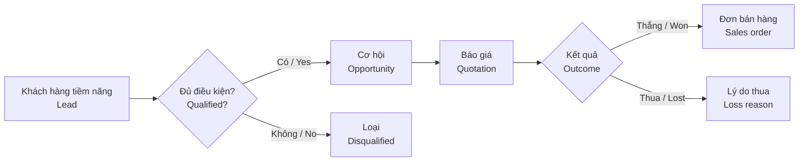

# 09 · Quản lý quan hệ khách hàng / CRM — Giai đoạn 10 / Phase 10

[← Giai đoạn 10 · Mở rộng / Phase 10 · Expansion](README.md)

Các giai đoạn khác của phân hệ / Other phases of this module: [P11](../phase-11-advanced/09-crm.md)

---

## Phạm vi giai đoạn / Phase scope

- **VI:** Khách hàng tiềm năng, phân bổ, chuyển đổi; cơ hội & pipeline; hoạt động & lịch hẹn; hồ sơ khách hàng 360°; báo cáo CRM.
- **EN:** Leads, assignment, conversion; opportunities & pipeline; activities & appointments; customer 360° view; CRM reports.

## 1. Mục tiêu / Objectives

> **Giai đoạn / Phase:** P10 – P11

- **VI:** Quản lý khách hàng tiềm năng và cơ hội bán hàng trước khi phát sinh đơn hàng; ghi nhận mọi tương tác với khách hàng; giúp quản lý dự báo doanh số và đo hiệu quả đội kinh doanh.
- **EN:** Manage leads and sales opportunities before orders exist; record every customer interaction; help managers forecast revenue and measure sales team performance.

## 2. Phạm vi / Scope

| Trong phạm vi / In scope | Ngoài phạm vi / Out of scope |
|---|---|
| Khách hàng tiềm năng, cơ hội, pipeline, hoạt động, hồ sơ khách hàng 360°, khiếu nại cơ bản / Leads, opportunities, pipeline, activities, customer 360° view, basic complaints | Email marketing, tự động hóa marketing, tổng đài (call center) / Email marketing, marketing automation, call center |

## 3. Quy trình / Process flow

## 4. Yêu cầu chức năng / Functional requirements

#### FR-CRM-001 · Khách hàng tiềm năng / Leads
`Should` · `P10`

- **VI:** Ghi nhận khách hàng tiềm năng: tên, công ty, liên hệ, nguồn (website, sự kiện, giới thiệu, mạng xã hội…), nhu cầu, nhân viên phụ trách, trạng thái; nhập hàng loạt từ Excel.
- **EN:** Record leads: name, company, contact, source (website, event, referral, social media…), needs, owner, status; bulk import from Excel.

#### FR-CRM-003 · Phân bổ lead / Lead assignment
`Should` · `P10`

- **VI:** Phân bổ lead thủ công hoặc tự động theo khu vực, nhóm sản phẩm hoặc xoay vòng; thông báo cho nhân viên được giao.
- **EN:** Assign leads manually or automatically by region, product group or round-robin; notify the assignee.

#### FR-CRM-004 · Chuyển đổi lead / Lead conversion
`Should` · `P10`

- **VI:** Chuyển lead đủ điều kiện thành khách hàng và cơ hội; kiểm tra trùng với khách hàng đã có (`FR-MDM-013`).
- **EN:** Convert qualified leads into a customer and an opportunity; check for duplicates against existing customers (`FR-MDM-013`).

#### FR-CRM-005 · Cơ hội & pipeline / Opportunities & pipeline
`Should` · `P10`

- **VI:** Cơ hội có giá trị kỳ vọng, xác suất thành công, ngày dự kiến chốt, giai đoạn (cấu hình được); hiển thị dạng bảng kanban kéo thả; bắt buộc nhập lý do khi thắng / thua.
- **EN:** Opportunities have expected value, probability, expected close date and stage (configurable); shown as a drag-and-drop kanban board; a win / loss reason is mandatory.

#### FR-CRM-006 · Hoạt động & lịch hẹn / Activities & appointments
`Should` · `P10`

- **VI:** Ghi nhận cuộc gọi, cuộc gặp, email, công việc gắn với lead / cơ hội / khách hàng; nhắc việc; lịch cá nhân và lịch nhóm.
- **EN:** Log calls, meetings, emails and tasks against leads / opportunities / customers; reminders; personal and team calendars.

#### FR-CRM-007 · Hồ sơ khách hàng 360° / Customer 360° view
`Should` · `P10`

- **VI:** Một màn hình tổng hợp: thông tin liên hệ, hoạt động, cơ hội, báo giá, đơn hàng, hóa đơn, công nợ, khiếu nại, doanh số lũy kế.
- **EN:** One screen showing contacts, activities, opportunities, quotations, orders, invoices, receivables, complaints and cumulative revenue.

#### FR-CRM-010 · Báo cáo CRM / CRM reports
`Should` · `P10`

- **VI:** Phễu bán hàng, tỷ lệ chuyển đổi theo giai đoạn và nguồn, dự báo doanh số (giá trị × xác suất), hiệu suất hoạt động của nhân viên, lý do thua.
- **EN:** Sales funnel, conversion rates by stage and source, revenue forecast (value × probability), activity performance per salesperson, loss reasons.

### 4.3 Không làm / Won't do

#### ~~FR-CRM-011 · Email marketing~~
`Won't`

- **VI:** Không làm trong phạm vi dự án hiện tại; có thể tích hợp công cụ chuyên dụng sau.
- **EN:** Not in the current project scope; a dedicated tool may be integrated later.

## 5. Trạng thái / Statuses

| Đối tượng / Object | Trạng thái / Statuses |
|---|---|
| Lead | Mới / New → Đang liên hệ / Contacted → Đủ điều kiện / Qualified → Đã chuyển đổi / Converted · Không phù hợp / Disqualified |
| Cơ hội / Opportunity | Tiếp cận / Prospecting → Xác định nhu cầu / Needs analysis → Báo giá / Proposal → Đàm phán / Negotiation → Thắng / Won · Thua / Lost |

## 6. Quy tắc nghiệp vụ / Business rules

| Mã / ID | Quy tắc (VI) | Rule (EN) |
|---|---|---|
| BR-CRM-001 | Nhân viên kinh doanh chỉ thấy lead, cơ hội của mình; quản lý thấy của cả nhóm. | Salespeople see only their own leads and opportunities; managers see their team's. |
| BR-CRM-002 | Lead không có hoạt động trong N ngày được cảnh báo và có thể thu hồi để phân bổ lại. | Leads with no activity for N days are flagged and can be reclaimed for reassignment. |

## 7. Câu hỏi mở / Open questions

| # | Câu hỏi (VI) | Question (EN) |
|---|---|---|
| Q-CRM-01 | Các nguồn khách hàng tiềm năng chính hiện nay? | What are the main lead sources today? |
| Q-CRM-02 | Các giai đoạn bán hàng thực tế của doanh nghiệp? | What are the company's actual sales stages? |
