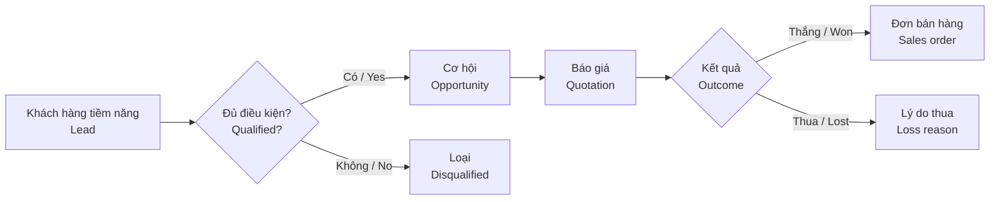
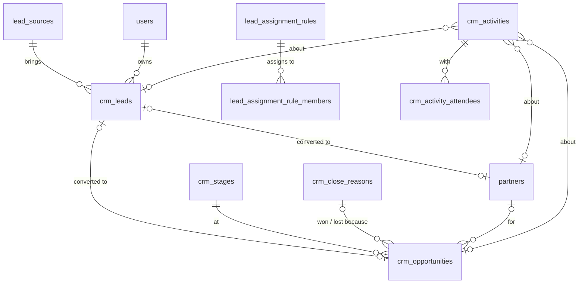

# 09 · Quản lý quan hệ khách hàng / CRM — Giai đoạn 10 / Phase 10

[← Giai đoạn 10 · Mở rộng / Phase 10 · Expansion](README.md)

Các giai đoạn khác của phân hệ / Other phases of this module: [P11](../phase-11-advanced/09-crm.md)

---

## Phạm vi giai đoạn / Phase scope

- **VI:** Khách hàng tiềm năng, phân bổ, chuyển đổi; cơ hội & pipeline; hoạt động & lịch hẹn; hồ sơ khách hàng 360°; báo cáo CRM.
- **EN:** Leads, assignment, conversion; opportunities & pipeline; activities & appointments; customer 360° view; CRM reports.

## 1. Mục tiêu / Objectives

> **Giai đoạn / Phase:** P10 – P11


- **VI:** Quản lý khách hàng tiềm năng và cơ hội bán hàng trước khi phát sinh đơn hàng; ghi nhận mọi tương tác với khách hàng; giúp quản lý dự báo doanh số và đo hiệu quả đội kinh doanh.
- **EN:** Manage leads and sales opportunities before orders exist; record every customer interaction; help managers forecast revenue and measure sales team performance.

## 2. Phạm vi / Scope

| Trong phạm vi / In scope | Ngoài phạm vi / Out of scope |
|---|---|
| Khách hàng tiềm năng, cơ hội, pipeline, hoạt động, hồ sơ khách hàng 360°, khiếu nại cơ bản / Leads, opportunities, pipeline, activities, customer 360° view, basic complaints | Email marketing, tự động hóa marketing, tổng đài (call center) / Email marketing, marketing automation, call center |

## 3. Quy trình / Process flow



## 4. Yêu cầu chức năng / Functional requirements

#### FR-CRM-001 · Khách hàng tiềm năng / Leads
`Should` · `P10`

- **VI:** Ghi nhận khách hàng tiềm năng: tên, công ty, liên hệ, nguồn (website, sự kiện, giới thiệu, mạng xã hội…), nhu cầu, nhân viên phụ trách, trạng thái; nhập hàng loạt từ Excel.
- **EN:** Record leads: name, company, contact, source (website, event, referral, social media…), needs, owner, status; bulk import from Excel.

#### FR-CRM-003 · Phân bổ lead / Lead assignment
`Should` · `P10`

- **VI:** Phân bổ lead thủ công hoặc tự động theo khu vực, nhóm sản phẩm hoặc xoay vòng; thông báo cho nhân viên được giao.
- **EN:** Assign leads manually or automatically by region, product group or round-robin; notify the assignee.

#### FR-CRM-004 · Chuyển đổi lead / Lead conversion
`Should` · `P10`

- **VI:** Chuyển lead đủ điều kiện thành khách hàng và cơ hội; kiểm tra trùng với khách hàng đã có (`FR-MDM-013`).
- **EN:** Convert qualified leads into a customer and an opportunity; check for duplicates against existing customers (`FR-MDM-013`).

#### FR-CRM-005 · Cơ hội & pipeline / Opportunities & pipeline
`Should` · `P10`

- **VI:** Cơ hội có giá trị kỳ vọng, xác suất thành công, ngày dự kiến chốt, giai đoạn (cấu hình được); hiển thị dạng bảng kanban kéo thả; bắt buộc nhập lý do khi thắng / thua.
- **EN:** Opportunities have expected value, probability, expected close date and stage (configurable); shown as a drag-and-drop kanban board; a win / loss reason is mandatory.

#### FR-CRM-006 · Hoạt động & lịch hẹn / Activities & appointments
`Should` · `P10`

- **VI:** Ghi nhận cuộc gọi, cuộc gặp, email, công việc gắn với lead / cơ hội / khách hàng; nhắc việc; lịch cá nhân và lịch nhóm.
- **EN:** Log calls, meetings, emails and tasks against leads / opportunities / customers; reminders; personal and team calendars.

#### FR-CRM-007 · Hồ sơ khách hàng 360° / Customer 360° view
`Should` · `P10`

- **VI:** Một màn hình tổng hợp: thông tin liên hệ, hoạt động, cơ hội, báo giá, đơn hàng, hóa đơn, công nợ, khiếu nại, doanh số lũy kế.
- **EN:** One screen showing contacts, activities, opportunities, quotations, orders, invoices, receivables, complaints and cumulative revenue.

#### FR-CRM-010 · Báo cáo CRM / CRM reports
`Should` · `P10`

- **VI:** Phễu bán hàng, tỷ lệ chuyển đổi theo giai đoạn và nguồn, dự báo doanh số (giá trị × xác suất), hiệu suất hoạt động của nhân viên, lý do thua.
- **EN:** Sales funnel, conversion rates by stage and source, revenue forecast (value × probability), activity performance per salesperson, loss reasons.

### 4.3 Không làm / Won't do

#### ~~FR-CRM-011 · Email marketing~~
`Won't`

- **VI:** Không làm trong phạm vi dự án hiện tại; có thể tích hợp công cụ chuyên dụng sau.
- **EN:** Not in the current project scope; a dedicated tool may be integrated later.

## 5. Trạng thái / Statuses

| Đối tượng / Object | Trạng thái / Statuses |
|---|---|
| Lead | Mới / New → Đang liên hệ / Contacted → Đủ điều kiện / Qualified → Đã chuyển đổi / Converted · Không phù hợp / Disqualified |
| Cơ hội / Opportunity | Tiếp cận / Prospecting → Xác định nhu cầu / Needs analysis → Báo giá / Proposal → Đàm phán / Negotiation → Thắng / Won · Thua / Lost |

## 6. Quy tắc nghiệp vụ / Business rules

| Mã / ID | Quy tắc (VI) | Rule (EN) |
|---|---|---|
| BR-CRM-001 | Nhân viên kinh doanh chỉ thấy lead, cơ hội của mình; quản lý thấy của cả nhóm. | Salespeople see only their own leads and opportunities; managers see their team's. |
| BR-CRM-002 | Lead không có hoạt động trong N ngày được cảnh báo và có thể thu hồi để phân bổ lại. | Leads with no activity for N days are flagged and can be reclaimed for reassignment. |

## 7. Mô hình dữ liệu / Data model

- **VI:** Lead, cơ hội và hoạt động có `owner_id`, `department_id`, `branch_id` để áp phạm vi dữ liệu (`BR-CRM-001`). Chuyển đổi lead tạo đối tác (`partners`, kiểm trùng theo `FR-MDM-013`) và cơ hội, rồi ghi lại liên kết trên lead (`FR-CRM-004`). Giai đoạn và lý do thắng / thua là danh mục cấu hình được (`Q-CRM-02`). `last_activity_at` được cập nhật khi ghi hoạt động, phục vụ cảnh báo lead không hoạt động sau `crm.lead_inactivity_days` ngày (`BR-CRM-002`). Hồ sơ 360° là view tổng hợp trên dữ liệu đã có.
- **EN:** Leads, opportunities and activities carry `owner_id`, `department_id`, `branch_id` for data scope (`BR-CRM-001`). Converting a lead creates a partner (`partners`, duplicate-checked per `FR-MDM-013`) and an opportunity, then records the links on the lead (`FR-CRM-004`). Stages and win / loss reasons are configurable catalogs (`Q-CRM-02`). `last_activity_at` is updated when an activity is logged, driving the inactive-lead alert after `crm.lead_inactivity_days` days (`BR-CRM-002`). The 360° view aggregates existing data.



| Bảng / Table | Mục đích (VI) | Purpose (EN) |
|---|---|---|
| `lead_sources`, `crm_leads` | Nguồn và khách hàng tiềm năng (`FR-CRM-001`). | Lead sources and leads (`FR-CRM-001`). |
| `lead_assignment_rules`, `lead_assignment_rule_members` | Phân bổ theo khu vực, nhóm sản phẩm hoặc xoay vòng (`FR-CRM-003`). | Assignment by region, product group or round-robin (`FR-CRM-003`). |
| `crm_stages`, `crm_close_reasons`, `crm_opportunities` | Giai đoạn, lý do thắng / thua bắt buộc, cơ hội (`FR-CRM-005`). | Stages, mandatory win / loss reasons, opportunities (`FR-CRM-005`). |
| `crm_activities`, `crm_activity_attendees` | Cuộc gọi, cuộc gặp, email, công việc; nhắc việc; lịch nhóm (`FR-CRM-006`). | Calls, meetings, emails, tasks; reminders; team calendars (`FR-CRM-006`). |
| `v_customer_360` | Tổng hợp hoạt động, cơ hội, báo giá, đơn, hóa đơn, công nợ, doanh số (`FR-CRM-007`). | Activities, opportunities, quotations, orders, invoices, receivables, revenue in one row (`FR-CRM-007`). |

<details>
<summary>Xem DDL / Show DDL</summary>

```sql
-- Chạy sau / Run after: 02-system-administration.md (P10)

INSERT INTO system_settings (key, value) VALUES ('crm.lead_inactivity_days', '14')  -- BR-CRM-002
ON CONFLICT (key) DO NOTHING;

CREATE TABLE lead_sources (
  code       varchar(30)  PRIMARY KEY,  -- 'WEBSITE','EVENT','REFERRAL','SOCIAL'…
  name_vi    varchar(100) NOT NULL,
  name_en    varchar(100) NOT NULL,
  is_active  boolean      NOT NULL DEFAULT true
);

CREATE TYPE lead_status AS ENUM ('NEW','CONTACTED','QUALIFIED','CONVERTED','DISQUALIFIED');

CREATE TABLE crm_leads (
  id                        uuid         PRIMARY KEY DEFAULT gen_random_uuid(),
  code                      varchar(30)  NOT NULL UNIQUE,
  full_name                 varchar(150) NOT NULL,
  company_name              varchar(255),
  job_title                 varchar(100),
  phone                     varchar(30),
  email                     varchar(255),
  address                   text,
  province_code             varchar(10)  REFERENCES admin_units(code),
  source_code               varchar(30)  REFERENCES lead_sources(code),
  needs                     text,
  product_category_id       uuid         REFERENCES product_categories(id),
  status                    lead_status  NOT NULL DEFAULT 'NEW',
  disqualify_reason         text,
  last_activity_at          timestamptz,
  converted_partner_id      uuid         REFERENCES partners(id),
  converted_opportunity_id  uuid,                                  -- FK thêm bên dưới / FK added below
  converted_at              timestamptz,
  owner_id                  uuid         REFERENCES users(id),
  department_id             uuid         REFERENCES departments(id),
  branch_id                 uuid         REFERENCES branches(id),
  import_job_id             uuid         REFERENCES import_jobs(id),  -- nhập hàng loạt / bulk import
  version                   integer      NOT NULL DEFAULT 1,
  created_at                timestamptz  NOT NULL DEFAULT now(),
  created_by                uuid         REFERENCES users(id),
  updated_at                timestamptz  NOT NULL DEFAULT now(),
  updated_by                uuid         REFERENCES users(id),
  CHECK (status <> 'DISQUALIFIED' OR disqualify_reason IS NOT NULL),
  CHECK (status <> 'CONVERTED' OR converted_partner_id IS NOT NULL)
);
CREATE INDEX ON crm_leads (owner_id, status);
CREATE INDEX crm_leads_inactive ON crm_leads (last_activity_at) WHERE status IN ('NEW','CONTACTED','QUALIFIED');
CREATE INDEX crm_leads_search_idx ON crm_leads
  USING gin (lower(f_unaccent(full_name || ' ' || coalesce(company_name, ''))) gin_trgm_ops);

CREATE TYPE lead_rule_type AS ENUM ('REGION','PRODUCT_GROUP','ROUND_ROBIN');

CREATE TABLE lead_assignment_rules (
  id                   uuid           PRIMARY KEY DEFAULT gen_random_uuid(),
  name                 varchar(150)   NOT NULL,
  rule_type            lead_rule_type NOT NULL,
  province_code        varchar(10)    REFERENCES admin_units(code),
  product_category_id  uuid           REFERENCES product_categories(id),
  priority             integer        NOT NULL DEFAULT 100,
  is_active            boolean        NOT NULL DEFAULT true,
  created_at           timestamptz    NOT NULL DEFAULT now(),
  created_by           uuid           REFERENCES users(id),
  CHECK (rule_type <> 'REGION' OR province_code IS NOT NULL),
  CHECK (rule_type <> 'PRODUCT_GROUP' OR product_category_id IS NOT NULL)
);

CREATE TABLE lead_assignment_rule_members (
  rule_id           uuid        NOT NULL REFERENCES lead_assignment_rules(id) ON DELETE CASCADE,
  user_id           uuid        NOT NULL REFERENCES users(id),
  sort_order        smallint    NOT NULL DEFAULT 0,
  last_assigned_at  timestamptz,  -- xoay vòng: chọn người có giá trị nhỏ nhất / round-robin picks the oldest
  PRIMARY KEY (rule_id, user_id)
);

CREATE TABLE crm_stages (
  id                   uuid         PRIMARY KEY DEFAULT gen_random_uuid(),
  code                 varchar(30)  NOT NULL UNIQUE,
  name                 varchar(100) NOT NULL,
  name_en              varchar(100),
  sort_order           smallint     NOT NULL,
  default_probability  dm_pct       NOT NULL DEFAULT 0,
  is_won               boolean      NOT NULL DEFAULT false,
  is_lost              boolean      NOT NULL DEFAULT false,
  is_active            boolean      NOT NULL DEFAULT true,
  CHECK (NOT (is_won AND is_lost))
);

INSERT INTO crm_stages (code, name, name_en, sort_order, default_probability, is_won, is_lost) VALUES
  ('PROSPECTING', 'Tiếp cận',            'Prospecting',    10,  10, false, false),
  ('NEEDS',       'Xác định nhu cầu',    'Needs analysis', 20,  25, false, false),
  ('PROPOSAL',    'Báo giá',             'Proposal',       30,  50, false, false),
  ('NEGOTIATION', 'Đàm phán',            'Negotiation',    40,  75, false, false),
  ('WON',         'Thắng',               'Won',            90, 100, true,  false),
  ('LOST',        'Thua',                'Lost',           99,   0, false, true);

CREATE TABLE crm_close_reasons (
  id         uuid         PRIMARY KEY DEFAULT gen_random_uuid(),
  code       varchar(30)  NOT NULL UNIQUE,
  name       varchar(150) NOT NULL,
  name_en    varchar(150),
  outcome    varchar(4)   NOT NULL CHECK (outcome IN ('WON','LOST')),
  is_active  boolean      NOT NULL DEFAULT true
);

CREATE TYPE opportunity_status AS ENUM ('OPEN','WON','LOST');

CREATE TABLE crm_opportunities (
  id                   uuid               PRIMARY KEY DEFAULT gen_random_uuid(),
  code                 varchar(30)        NOT NULL UNIQUE,
  name                 varchar(255)       NOT NULL,
  partner_id           uuid               REFERENCES partners(id),
  lead_id              uuid               REFERENCES crm_leads(id),
  stage_id             uuid               NOT NULL REFERENCES crm_stages(id),
  expected_value       dm_amount          NOT NULL DEFAULT 0,
  currency_code        char(3)            NOT NULL DEFAULT 'VND' REFERENCES currencies(code),
  probability          dm_pct             NOT NULL DEFAULT 0,
  expected_close_date  date,
  status               opportunity_status NOT NULL DEFAULT 'OPEN',
  close_reason_id      uuid               REFERENCES crm_close_reasons(id),
  close_note           text,
  closed_at            timestamptz,
  sales_order_id       uuid               REFERENCES sales_orders(id),
  owner_id             uuid               REFERENCES users(id),
  department_id        uuid               REFERENCES departments(id),
  branch_id            uuid               REFERENCES branches(id),
  version              integer            NOT NULL DEFAULT 1,
  created_at           timestamptz        NOT NULL DEFAULT now(),
  created_by           uuid               REFERENCES users(id),
  updated_at           timestamptz        NOT NULL DEFAULT now(),
  updated_by           uuid               REFERENCES users(id),
  CHECK (partner_id IS NOT NULL OR lead_id IS NOT NULL),
  CHECK (status = 'OPEN' OR close_reason_id IS NOT NULL)  -- FR-CRM-005: lý do bắt buộc / reason required
);
CREATE INDEX ON crm_opportunities (owner_id, status);
CREATE INDEX ON crm_opportunities (stage_id) WHERE status = 'OPEN';

ALTER TABLE crm_leads
  ADD CONSTRAINT crm_leads_converted_opportunity_fk
  FOREIGN KEY (converted_opportunity_id) REFERENCES crm_opportunities(id);

CREATE TYPE activity_type AS ENUM ('CALL','MEETING','EMAIL','TASK');

CREATE TABLE crm_activities (
  id              uuid          PRIMARY KEY DEFAULT gen_random_uuid(),
  activity_type   activity_type NOT NULL,
  subject         varchar(255)  NOT NULL,
  description     text,
  lead_id         uuid          REFERENCES crm_leads(id),
  opportunity_id  uuid          REFERENCES crm_opportunities(id),
  partner_id      uuid          REFERENCES partners(id),
  start_at        timestamptz,
  end_at          timestamptz,
  due_at          timestamptz,
  reminder_at     timestamptz,
  done_at         timestamptz,
  location        varchar(255),
  outcome         text,
  owner_id        uuid          REFERENCES users(id),
  department_id   uuid          REFERENCES departments(id),
  created_at      timestamptz   NOT NULL DEFAULT now(),
  created_by      uuid          REFERENCES users(id),
  updated_at      timestamptz   NOT NULL DEFAULT now(),
  updated_by      uuid          REFERENCES users(id),
  CHECK (num_nonnulls(lead_id, opportunity_id, partner_id) >= 1),
  CHECK (end_at IS NULL OR start_at IS NULL OR end_at >= start_at)
);
CREATE INDEX ON crm_activities (owner_id, start_at);
CREATE INDEX crm_activities_reminders ON crm_activities (reminder_at) WHERE done_at IS NULL;

CREATE TABLE crm_activity_attendees (
  activity_id  uuid NOT NULL REFERENCES crm_activities(id) ON DELETE CASCADE,
  user_id      uuid NOT NULL REFERENCES users(id),
  PRIMARY KEY (activity_id, user_id)
);

-- FR-CRM-007: hồ sơ khách hàng 360° (thêm khiếu nại ở P11) / customer 360° view (complaints added in P11)
CREATE VIEW v_customer_360 AS
SELECT p.id AS partner_id, p.code, p.name, p.phone, p.email, p.salesperson_id,
       (SELECT count(*) FROM crm_activities a WHERE a.partner_id = p.id)                         AS activities,
       (SELECT max(coalesce(a.done_at, a.start_at)) FROM crm_activities a WHERE a.partner_id = p.id) AS last_activity_at,
       (SELECT count(*) FROM crm_opportunities o WHERE o.partner_id = p.id AND o.status = 'OPEN')    AS open_opportunities,
       (SELECT count(*) FROM quotations q WHERE q.customer_id = p.id)                               AS quotations,
       (SELECT count(*) FROM sales_orders s WHERE s.customer_id = p.id AND s.status <> 'CANCELLED')  AS orders,
       (SELECT coalesce(sum(i.amount_total_vnd), 0) FROM customer_invoices i
         WHERE i.customer_id = p.id AND i.status IN ('POSTED','PARTIALLY_PAID','PAID'))             AS lifetime_revenue_vnd,
       (SELECT coalesce(sum(CASE WHEN oi.side = 'DEBIT' THEN oi.residual_vnd ELSE -oi.residual_vnd END), 0)
          FROM open_items oi WHERE oi.partner_id = p.id AND oi.account_type = 'RECEIVABLE')         AS receivable_vnd
FROM partners p
WHERE p.is_customer;
```

</details>

## 8. Câu hỏi mở / Open questions

| # | Câu hỏi (VI) | Question (EN) |
|---|---|---|
| Q-CRM-01 | Các nguồn khách hàng tiềm năng chính hiện nay? | What are the main lead sources today? |
| Q-CRM-02 | Các giai đoạn bán hàng thực tế của doanh nghiệp? | What are the company's actual sales stages? |
