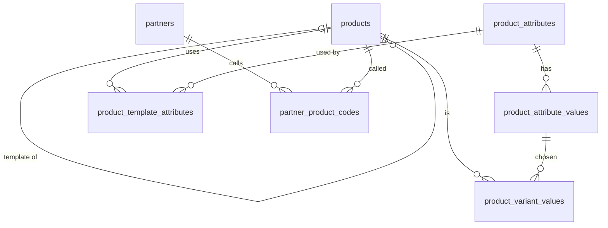

# 03 · Dữ liệu danh mục / Master Data (MDM) — Giai đoạn 11 / Phase 11

[← Giai đoạn 11 · Nâng cao / Phase 11 · Advanced](README.md)

Các giai đoạn khác của phân hệ / Other phases of this module: [P2](../phase-02-organization-master-data/03-master-data.md) · [P7](../phase-07-approvals-controls/03-master-data.md) · [P8](../phase-08-operations-completion/03-master-data.md) · [P9](../phase-09-accounting-einvoicing/03-master-data.md)

---

## Phạm vi giai đoạn / Phase scope

- **VI:** Biến thể sản phẩm; mã hàng của đối tác; lấy tỷ giá tự động.
- **EN:** Product variants; partner item codes; automatic exchange rates.

## 1. Yêu cầu chức năng / Functional requirements

**Sản phẩm / Products**

#### FR-MDM-005 · Biến thể sản phẩm / Product variants
`Could` · `P11`

- **VI:** Sản phẩm mẫu có các thuộc tính (kích cỡ, màu sắc…) sinh ra các biến thể, mỗi biến thể có mã, mã vạch, giá và tồn kho riêng.
- **EN:** Product templates with attributes (size, color…) generate variants, each with its own code, barcode, price and stock.

#### FR-MDM-008 · Mã hàng của đối tác / Partner item codes
`Could` · `P11`

- **VI:** Lưu mã và tên hàng mà khách hàng / nhà cung cấp sử dụng để in trên chứng từ gửi cho họ.
- **EN:** Store the item codes and names used by customers / suppliers so they can be printed on documents sent to them.

## 2. Mô hình dữ liệu / Data model

- **VI:** Biến thể là các dòng `products` bình thường (có mã, mã vạch, giá, tồn riêng) trỏ về sản phẩm mẫu qua `template_id`; tổ hợp thuộc tính của từng biến thể lưu ở `product_variant_values` (`FR-MDM-005`). Sản phẩm mẫu (`is_template = true`) không được giao dịch. Mã hàng của đối tác dùng khi in chứng từ gửi đối tác đó (`FR-MDM-008`). Tỷ giá lấy tự động được ghi vào `exchange_rates` với nguồn `BANK_API` ([11 · Tích hợp](11-integrations.md)).
- **EN:** Variants are ordinary `products` rows (own code, barcode, price, stock) pointing to their template via `template_id`; each variant's attribute combination is stored in `product_variant_values` (`FR-MDM-005`). Templates (`is_template = true`) are never transacted. Partner item codes are used when printing documents sent to that partner (`FR-MDM-008`). Automatically fetched rates are written to `exchange_rates` with source `BANK_API` ([11 · Integrations](11-integrations.md)).



<details>
<summary>Xem DDL / Show DDL</summary>

```sql
-- Chạy sau / Run after: 02-system-administration.md (P11)

-- ===== Biến thể sản phẩm / Product variants (FR-MDM-005) =====
ALTER TABLE products
  ADD COLUMN is_template  boolean NOT NULL DEFAULT false,
  ADD COLUMN template_id  uuid    REFERENCES products(id),
  ADD CONSTRAINT products_variant_check CHECK (NOT (is_template AND template_id IS NOT NULL));

CREATE TABLE product_attributes (
  id          uuid         PRIMARY KEY DEFAULT gen_random_uuid(),
  code        varchar(30)  NOT NULL UNIQUE,  -- 'SIZE', 'COLOR'
  name        varchar(100) NOT NULL,
  name_en     varchar(100),
  created_at  timestamptz  NOT NULL DEFAULT now(),
  created_by  uuid         REFERENCES users(id)
);

CREATE TABLE product_attribute_values (
  id            uuid         PRIMARY KEY DEFAULT gen_random_uuid(),
  attribute_id  uuid         NOT NULL REFERENCES product_attributes(id),
  code          varchar(30)  NOT NULL,       -- dùng để sinh mã biến thể / used to build variant codes
  value         varchar(100) NOT NULL,
  value_en      varchar(100),
  sort_order    smallint     NOT NULL DEFAULT 0,
  UNIQUE (attribute_id, code)
);

CREATE TABLE product_template_attributes (
  template_id   uuid NOT NULL REFERENCES products(id),
  attribute_id  uuid NOT NULL REFERENCES product_attributes(id),
  PRIMARY KEY (template_id, attribute_id)
);

CREATE TABLE product_variant_values (
  product_id          uuid NOT NULL REFERENCES products(id),
  attribute_value_id  uuid NOT NULL REFERENCES product_attribute_values(id),
  PRIMARY KEY (product_id, attribute_value_id)
);

-- ===== Mã hàng của đối tác / Partner item codes (FR-MDM-008) =====
CREATE TABLE partner_product_codes (
  partner_id    uuid         NOT NULL REFERENCES partners(id),
  product_id    uuid         NOT NULL REFERENCES products(id),
  partner_code  varchar(50)  NOT NULL,
  partner_name  varchar(255),
  created_at    timestamptz  NOT NULL DEFAULT now(),
  created_by    uuid         REFERENCES users(id),
  updated_at    timestamptz  NOT NULL DEFAULT now(),
  updated_by    uuid         REFERENCES users(id),
  PRIMARY KEY (partner_id, product_id),
  UNIQUE (partner_id, partner_code)
);

-- ===== Tỷ giá tự động / Automatic rates (FR-MDM-016, FR-INT-008) =====
ALTER TYPE exchange_rate_source ADD VALUE 'BANK_API';
ALTER TABLE exchange_rates ADD COLUMN source_bank varchar(50);  -- ngân hàng nguồn / source bank
```

</details>
