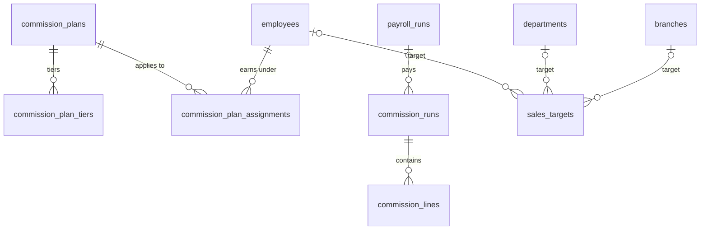

# 04 · Bán hàng / Sales (SAL) — Giai đoạn 11 / Phase 11

[← Giai đoạn 11 · Nâng cao / Phase 11 · Advanced](README.md)

Các giai đoạn khác của phân hệ / Other phases of this module: [P5](../phase-05-sales/04-sales.md) · [P7](../phase-07-approvals-controls/04-sales.md) · [P8](../phase-08-operations-completion/04-sales.md) · [P9](../phase-09-accounting-einvoicing/04-sales.md) · [P10](../phase-10-expansion/04-sales.md)

---

## Phạm vi giai đoạn / Phase scope

- **VI:** Hoa hồng, chỉ tiêu doanh số; ảnh xác nhận giao hàng.
- **EN:** Commissions, sales targets; proof-of-delivery photos.

## 1. Yêu cầu chức năng / Functional requirements

**Khuyến mãi & hoa hồng / Promotions & commissions**

#### FR-SAL-028 · Hoa hồng bán hàng / Sales commissions
`Could` · `P11`

- **VI:** Tính hoa hồng cho nhân viên bán hàng theo doanh số, lãi gộp hoặc doanh số đã thu tiền; chuyển dữ liệu sang tính lương.
- **EN:** Compute salesperson commissions based on revenue, gross margin or collected revenue; feed results into payroll.

#### FR-SAL-029 · Chỉ tiêu doanh số / Sales targets
`Could` · `P11`

- **VI:** Đặt chỉ tiêu doanh số theo nhân viên, nhóm, chi nhánh, tháng; theo dõi tỷ lệ hoàn thành.
- **EN:** Set revenue targets per salesperson, team, branch and month; track achievement.

## 2. Mô hình dữ liệu / Data model

- **VI:** Chính sách hoa hồng tính theo doanh số, lãi gộp hoặc doanh số đã thu, có bậc tỷ lệ; mỗi kỳ chạy một lượt tính, kết quả `commission_lines` được kỳ lương cùng tháng đọc làm thành phần lương `COMMISSION` (`FR-SAL-028`, `FR-HRM-010`). Chỉ tiêu doanh số đặt theo đúng một cấp: nhân viên, phòng ban (nhóm) hoặc chi nhánh (`FR-SAL-029`). Ảnh xác nhận giao hàng là `attachments` loại `POD` kèm thời điểm và tọa độ chụp (`FR-SAL-020`). Hai chức năng `SAL.COMMISSION`, `SAL.TARGET` là **đề xuất**, cần chốt cùng ma trận.
- **EN:** Commission plans are based on revenue, gross margin or collected revenue, with tiered rates; each period has one calculation run whose `commission_lines` are read by that month's payroll as the `COMMISSION` pay component (`FR-SAL-028`, `FR-HRM-010`). Sales targets are set at exactly one level: salesperson, department (team) or branch (`FR-SAL-029`). Proof-of-delivery photos are `attachments` of category `POD` with capture time and coordinates (`FR-SAL-020`). The `SAL.COMMISSION` and `SAL.TARGET` functions are **proposed** and must be confirmed with the matrix.



<details>
<summary>Xem DDL / Show DDL</summary>

```sql
-- Chạy sau / Run after: 03-master-data.md (P11)

INSERT INTO app_functions (code, module, name_vi, name_en, supported_actions, sort_order) VALUES
  ('SAL.COMMISSION', 'SAL', 'Hoa hồng bán hàng', 'Sales commissions', '{VIEW,CREATE,EDIT,DELETE,APPROVE}', 550),
  ('SAL.TARGET',     'SAL', 'Chỉ tiêu doanh số', 'Sales targets',     '{VIEW,CREATE,EDIT,DELETE}',         560)
ON CONFLICT (code) DO NOTHING;

INSERT INTO role_permissions (role_id, function_code, action)
SELECT r.id, m.function_code, a
FROM (VALUES ('SAL.COMMISSION', 'CEO', 'VA'), ('SAL.COMMISSION', 'SLM', 'VCE'), ('SAL.COMMISSION', 'HRM', 'V'),
             ('SAL.COMMISSION', 'CAC', 'V'),
             ('SAL.TARGET',     'CEO', 'VCED'), ('SAL.TARGET', 'SLM', 'VCE'), ('SAL.TARGET', 'SAL', 'V'))
       AS m(function_code, role_code, letters)
JOIN roles r ON r.code = m.role_code
CROSS JOIN LATERAL perm_letters(m.letters) AS a
ON CONFLICT DO NOTHING;

-- ===== Hoa hồng / Commissions (FR-SAL-028) =====
CREATE TYPE commission_basis AS ENUM ('REVENUE','GROSS_MARGIN','COLLECTED_REVENUE');

CREATE TABLE commission_plans (
  id          uuid             PRIMARY KEY DEFAULT gen_random_uuid(),
  code        varchar(30)      NOT NULL UNIQUE,
  name        varchar(150)     NOT NULL,
  basis       commission_basis NOT NULL,
  valid_from  date             NOT NULL,
  valid_to    date,
  is_active   boolean          NOT NULL DEFAULT true,
  version     integer          NOT NULL DEFAULT 1,
  created_at  timestamptz      NOT NULL DEFAULT now(),
  created_by  uuid             REFERENCES users(id),
  updated_at  timestamptz      NOT NULL DEFAULT now(),
  updated_by  uuid             REFERENCES users(id)
);

-- Bậc lũy tiến: phần cơ sở trong [from_amount, bậc kế tiếp) hưởng rate_pct
-- Progressive tiers: the base within [from_amount, next tier) earns rate_pct
CREATE TABLE commission_plan_tiers (
  plan_id      uuid      NOT NULL REFERENCES commission_plans(id) ON DELETE CASCADE,
  from_amount  dm_amount NOT NULL CHECK (from_amount >= 0),
  rate_pct     dm_pct    NOT NULL,
  PRIMARY KEY (plan_id, from_amount)
);

CREATE TABLE commission_plan_assignments (
  plan_id      uuid NOT NULL REFERENCES commission_plans(id),
  employee_id  uuid NOT NULL REFERENCES employees(id),
  valid_from   date NOT NULL,
  valid_to     date,
  PRIMARY KEY (plan_id, employee_id, valid_from)
);

CREATE TYPE commission_run_status AS ENUM ('DRAFT','APPROVED','SENT_TO_PAYROLL','CANCELLED');

CREATE TABLE commission_runs (
  id              uuid                  PRIMARY KEY DEFAULT gen_random_uuid(),
  period_year     smallint              NOT NULL,
  period_month    smallint              NOT NULL CHECK (period_month BETWEEN 1 AND 12),
  status          commission_run_status NOT NULL DEFAULT 'DRAFT',
  payroll_run_id  uuid                  REFERENCES payroll_runs(id),
  created_at      timestamptz           NOT NULL DEFAULT now(),
  created_by      uuid                  REFERENCES users(id)
);
CREATE UNIQUE INDEX commission_runs_one_per_period
  ON commission_runs (period_year, period_month) WHERE status <> 'CANCELLED';

CREATE TABLE commission_lines (
  run_id             uuid      NOT NULL REFERENCES commission_runs(id),
  employee_id        uuid      NOT NULL REFERENCES employees(id),
  plan_id            uuid      NOT NULL REFERENCES commission_plans(id),
  basis_amount_vnd   dm_amount NOT NULL,
  commission_vnd     dm_amount NOT NULL,
  adjustment_vnd     dm_amount NOT NULL DEFAULT 0,
  note               text,
  PRIMARY KEY (run_id, employee_id, plan_id)
);

-- ===== Chỉ tiêu doanh số / Sales targets (FR-SAL-029) =====
CREATE TABLE sales_targets (
  id             uuid        PRIMARY KEY DEFAULT gen_random_uuid(),
  period_year    smallint    NOT NULL,
  period_month   smallint    NOT NULL CHECK (period_month BETWEEN 1 AND 12),
  employee_id    uuid        REFERENCES employees(id),
  department_id  uuid        REFERENCES departments(id),
  branch_id      uuid        REFERENCES branches(id),
  target_vnd     dm_amount   NOT NULL CHECK (target_vnd >= 0),
  created_at     timestamptz NOT NULL DEFAULT now(),
  created_by     uuid        REFERENCES users(id),
  updated_at     timestamptz NOT NULL DEFAULT now(),
  updated_by     uuid        REFERENCES users(id),
  CHECK (num_nonnulls(employee_id, department_id, branch_id) = 1),
  UNIQUE NULLS NOT DISTINCT (period_year, period_month, employee_id, department_id, branch_id)
);

-- ===== Ảnh xác nhận giao hàng / Proof-of-delivery photos (FR-SAL-020) =====
ALTER TABLE attachments
  ADD COLUMN category     varchar(30),     -- vd / e.g. 'POD'
  ADD COLUMN captured_at  timestamptz,
  ADD COLUMN geo_lat      numeric(9,6),
  ADD COLUMN geo_lng      numeric(9,6);
```

</details>
