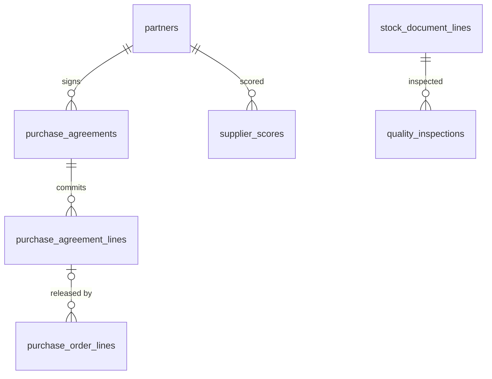

# 05 · Mua hàng / Purchasing (PUR) — Giai đoạn 11 / Phase 11

[← Giai đoạn 11 · Nâng cao / Phase 11 · Advanced](README.md)

Các giai đoạn khác của phân hệ / Other phases of this module: [P4](../phase-04-purchasing/05-purchasing.md) · [P7](../phase-07-approvals-controls/05-purchasing.md) · [P8](../phase-08-operations-completion/05-purchasing.md) · [P9](../phase-09-accounting-einvoicing/05-purchasing.md) · [P10](../phase-10-expansion/05-purchasing.md)

---

## Phạm vi giai đoạn / Phase scope

- **VI:** Hợp đồng khung; kiểm tra chất lượng khi nhận; đánh giá nhà cung cấp.
- **EN:** Blanket agreements; incoming quality check; supplier evaluation.

## 1. Yêu cầu chức năng / Functional requirements

**Đơn mua hàng / Purchase orders**

#### FR-PUR-012 · Hợp đồng khung / Blanket agreements
`Could` · `P11`

- **VI:** Hợp đồng nguyên tắc với nhà cung cấp (giá, số lượng cam kết, thời hạn); các đơn mua trích từ hợp đồng và theo dõi lượng đã thực hiện.
- **EN:** Framework agreements with suppliers (price, committed quantity, term); POs are released against the agreement and consumption is tracked.

**Nhận hàng / Receiving**

#### FR-PUR-016 · Kiểm tra chất lượng khi nhận / Incoming quality check
`Could` · `P11`

- **VI:** Ghi nhận kết quả kiểm tra (đạt / không đạt) khi nhận; hàng không đạt chuyển sang kho chờ xử lý hoặc trả lại nhà cung cấp.
- **EN:** Record inspection results (pass / fail) on receipt; failed goods move to a quarantine warehouse or are returned to the supplier.

**Quản lý nhà cung cấp / Supplier management**

#### FR-PUR-025 · Đánh giá nhà cung cấp / Supplier evaluation
`Could` · `P11`

- **VI:** Tính điểm nhà cung cấp theo tỷ lệ giao đúng hạn, tỷ lệ hàng lỗi, biến động giá; hiển thị trên hồ sơ nhà cung cấp.
- **EN:** Score suppliers on on-time delivery rate, defect rate and price variance; show the score on the supplier record.

## 2. Mô hình dữ liệu / Data model

- **VI:** Hợp đồng khung lưu giá và số lượng cam kết theo dòng; dòng đơn mua trích từ hợp đồng trỏ `agreement_line_id` và cộng dồn `released_qty` (`FR-PUR-012`). Kiểm tra chất lượng ghi theo dòng phiếu nhập; hàng không đạt được chuyển sang kho chờ xử lý (phiếu chuyển kho) hoặc trả nhà cung cấp (`purchase_returns`) — `FR-PUR-016`. Điểm nhà cung cấp tính định kỳ từ tỷ lệ giao đúng hạn (`rpt_supplier_delivery_performance`, P8), tỷ lệ lỗi (`quality_inspections`) và biến động giá; điểm mới nhất chép lên `partners.supplier_score` để hiển thị trên hồ sơ (`FR-PUR-025`).
- **EN:** Blanket agreements store committed price and quantity per line; PO lines released against an agreement point to `agreement_line_id` and accumulate `released_qty` (`FR-PUR-012`). Quality checks are recorded per receipt line; failed goods are moved to a quarantine warehouse (transfer) or returned to the supplier (`purchase_returns`) — `FR-PUR-016`. Supplier scores are computed periodically from on-time rate (`rpt_supplier_delivery_performance`, P8), defect rate (`quality_inspections`) and price variance; the latest score is copied to `partners.supplier_score` for the supplier record (`FR-PUR-025`).



<details>
<summary>Xem DDL / Show DDL</summary>

```sql
-- Chạy sau / Run after: 04-sales.md (P11)

-- ===== Hợp đồng khung / Blanket agreements (FR-PUR-012) =====
INSERT INTO document_types (code, module, name_vi, name_en, function_code, table_name, sort_order, approval_mode) VALUES
  ('PA', 'PUR', 'Hợp đồng khung mua hàng', 'Purchase agreement', 'PUR.PURCHASE_ORDER', 'purchase_agreements', 412, 'FLOW');
INSERT INTO document_sequences (document_type, prefix, reset_policy) VALUES ('PA', 'PA', 'YEARLY');

CREATE TYPE agreement_status AS ENUM ('DRAFT','PENDING_APPROVAL','ACTIVE','EXPIRED','CLOSED','CANCELLED');

CREATE TABLE purchase_agreements (
  id               uuid             PRIMARY KEY DEFAULT gen_random_uuid(),
  doc_no           varchar(30)      UNIQUE,
  branch_id        uuid             NOT NULL REFERENCES branches(id),
  supplier_id      uuid             NOT NULL REFERENCES partners(id),
  start_date       date             NOT NULL,
  end_date         date             NOT NULL,
  currency_code    char(3)          NOT NULL REFERENCES currencies(code),
  payment_term_id  uuid             REFERENCES payment_terms(id),
  terms            text,
  status           agreement_status NOT NULL DEFAULT 'DRAFT',
  file_id          uuid             REFERENCES stored_files(id),
  owner_id         uuid             REFERENCES users(id),
  department_id    uuid             REFERENCES departments(id),
  version          integer          NOT NULL DEFAULT 1,
  created_at       timestamptz      NOT NULL DEFAULT now(),
  created_by       uuid             REFERENCES users(id),
  updated_at       timestamptz      NOT NULL DEFAULT now(),
  updated_by       uuid             REFERENCES users(id),
  CHECK (end_date >= start_date)
);

CREATE TABLE purchase_agreement_lines (
  id              uuid      PRIMARY KEY DEFAULT gen_random_uuid(),
  agreement_id    uuid      NOT NULL REFERENCES purchase_agreements(id),
  line_no         smallint  NOT NULL,
  product_id      uuid      NOT NULL REFERENCES products(id),
  uom_id          uuid      NOT NULL REFERENCES uoms(id),
  unit_price      dm_price  NOT NULL CHECK (unit_price >= 0),
  committed_qty   dm_qty    CHECK (committed_qty > 0),  -- NULL = không cam kết số lượng / no committed quantity
  released_qty    dm_qty    NOT NULL DEFAULT 0,
  UNIQUE (agreement_id, line_no)
);

ALTER TABLE purchase_order_lines ADD COLUMN agreement_line_id uuid REFERENCES purchase_agreement_lines(id);

-- ===== Kiểm tra chất lượng / Incoming quality check (FR-PUR-016) =====
CREATE TYPE inspection_result      AS ENUM ('PASS','FAIL','PARTIAL');
CREATE TYPE inspection_disposition AS ENUM ('ACCEPT','QUARANTINE','RETURN');

CREATE TABLE quality_inspections (
  id                uuid                   PRIMARY KEY DEFAULT gen_random_uuid(),
  receipt_line_id   uuid                   NOT NULL REFERENCES stock_document_lines(id),
  inspected_qty     dm_qty                 NOT NULL CHECK (inspected_qty > 0),
  passed_qty        dm_qty                 NOT NULL CHECK (passed_qty >= 0),
  failed_qty        dm_qty                 NOT NULL CHECK (failed_qty >= 0),
  result            inspection_result      NOT NULL,
  disposition       inspection_disposition NOT NULL DEFAULT 'ACCEPT',
  transfer_id       uuid                   REFERENCES stock_documents(id),   -- chuyển kho chờ xử lý / to quarantine
  purchase_return_id uuid                  REFERENCES purchase_returns(id),
  note              text,
  inspector_id      uuid                   REFERENCES users(id),
  inspected_at      timestamptz            NOT NULL DEFAULT now(),
  CHECK (passed_qty + failed_qty = inspected_qty)
);
CREATE INDEX ON quality_inspections (receipt_line_id);

-- ===== Đánh giá nhà cung cấp / Supplier evaluation (FR-PUR-025) =====
CREATE TABLE supplier_scores (
  supplier_id         uuid          NOT NULL REFERENCES partners(id),
  period_start        date          NOT NULL,
  period_end          date          NOT NULL,
  on_time_rate        dm_pct,
  defect_rate         dm_pct,
  price_variance_pct  numeric(9,4),
  score               numeric(5,2)  NOT NULL CHECK (score BETWEEN 0 AND 100),
  computed_at         timestamptz   NOT NULL DEFAULT now(),
  PRIMARY KEY (supplier_id, period_start)
);

ALTER TABLE partners ADD COLUMN supplier_score numeric(5,2);
```

</details>
