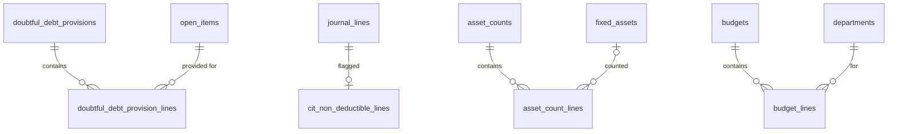

# 07 · Kế toán – Tài chính / Accounting & Finance (ACC) — Giai đoạn 11 / Phase 11

[← Giai đoạn 11 · Nâng cao / Phase 11 · Advanced](README.md)

Các giai đoạn khác của phân hệ / Other phases of this module: [P2](../phase-02-organization-master-data/07-accounting-finance.md) · [P6](../phase-06-receivables-payables-cash/07-accounting-finance.md) · [P9](../phase-09-accounting-einvoicing/07-accounting-finance.md) · [P10](../phase-10-expansion/07-accounting-finance.md)

---

## Phạm vi giai đoạn / Phase scope

- **VI:** Dự phòng nợ khó đòi; hỗ trợ thuế TNDN; kiểm kê tài sản; ngân sách.
- **EN:** Doubtful-debt provisions; CIT support; asset counts; budgeting.

## 1. Yêu cầu chức năng / Functional requirements

**Công nợ phải thu / Accounts receivable**

#### FR-ACC-019 · Dự phòng nợ phải thu khó đòi / Doubtful debt provision
`Could` · `P11`

- **VI:** Hỗ trợ lập dự phòng nợ khó đòi theo tuổi nợ và tỷ lệ cấu hình; người dùng có thể điều chỉnh từng khoản.
- **EN:** Support doubtful-debt provisions by aging and configurable rates; users can adjust individual items.

**Thuế / Tax**

#### FR-ACC-032 · Hỗ trợ thuế thu nhập doanh nghiệp / Corporate income tax support
`Could` · `P11`

- **VI:** Đánh dấu chi phí không được trừ khi tính thuế TNDN; báo cáo hỗ trợ tạm tính và quyết toán thuế TNDN.
- **EN:** Flag non-deductible expenses; reports supporting provisional and annual CIT calculation.

**Tài sản cố định & công cụ dụng cụ / Fixed assets & tools**

#### FR-ACC-037 · Kiểm kê tài sản / Asset count
`Could` · `P11`

- **VI:** Lập kỳ kiểm kê tài sản, ghi nhận tình trạng thực tế (có QR code trên nhãn tài sản là `Could`).
- **EN:** Run asset counts and record physical condition (QR-code asset labels are `Could`).

**Ngân sách / Budgeting**

#### FR-ACC-042 · Lập & kiểm soát ngân sách / Budget planning & control
`Could` · `P11`

- **VI:** Lập ngân sách theo tài khoản / khoản mục, phòng ban và tháng; so sánh thực tế với ngân sách; cảnh báo hoặc chặn khi đề nghị mua / đơn mua vượt ngân sách còn lại.
- **EN:** Plan budgets by account / category, department and month; compare actual vs. budget; warn or block when purchase requests / POs exceed the remaining budget.

## 2. Mô hình dữ liệu / Data model

- **VI:** Dự phòng nợ khó đòi tính theo tuổi nợ (`rpt_aging`, P6) nhân tỷ lệ cấu hình, người dùng sửa được từng khoản (`adjusted_vnd`) trước khi ghi sổ (`FR-ACC-019`). Chi phí không được trừ khi tính thuế TNDN được đánh dấu ở bảng riêng `cit_non_deductible_lines` để không phải sửa dòng bút toán đã ghi sổ (`BR-ACC-003`); khoản mục chi phí có thể đặt mặc định không được trừ (`FR-ACC-032`). Kiểm kê tài sản dùng mã nhãn / QR trên tài sản (`FR-ACC-037`). Ngân sách lập theo tài khoản hoặc khoản mục × phòng ban × tháng; view `v_budget_consumption` cộng thực tế (bút toán) và cam kết (đề nghị mua, đơn mua chưa có hóa đơn) để cảnh báo / chặn theo `control_mode` (`FR-ACC-042`). Chức năng `ACC.BUDGET` là **đề xuất**.
- **EN:** Doubtful-debt provisions apply configured rates to aging buckets (`rpt_aging`, P6); users can adjust each item (`adjusted_vnd`) before posting (`FR-ACC-019`). Non-deductible expenses for CIT are flagged in a separate `cit_non_deductible_lines` table so posted journal lines stay untouched (`BR-ACC-003`); expense categories can default to non-deductible (`FR-ACC-032`). Asset counts use the label / QR code on each asset (`FR-ACC-037`). Budgets are planned per account or expense category × department × month; the `v_budget_consumption` view adds actuals (journal entries) and commitments (purchase requests, unbilled POs) to warn / block per `control_mode` (`FR-ACC-042`). The `ACC.BUDGET` function is **proposed**.



<details>
<summary>Xem DDL / Show DDL</summary>

```sql
-- Chạy sau / Run after: 06-inventory.md (P11)

INSERT INTO app_functions (code, module, name_vi, name_en, supported_actions, sort_order) VALUES
  ('ACC.BUDGET', 'ACC', 'Ngân sách', 'Budgets', '{VIEW,CREATE,EDIT,DELETE,APPROVE}', 795)
ON CONFLICT (code) DO NOTHING;

INSERT INTO role_permissions (role_id, function_code, action)
SELECT r.id, 'ACC.BUDGET', a
FROM (VALUES ('CEO','VA'), ('CAC','VCED'), ('ACC','V'), ('PUM','V'), ('AUD','V')) AS m(role_code, letters)
JOIN roles r ON r.code = m.role_code
CROSS JOIN LATERAL perm_letters(m.letters) AS a
ON CONFLICT DO NOTHING;

INSERT INTO document_types (code, module, name_vi, name_en, function_code, table_name, sort_order, approval_mode) VALUES
  ('DDP', 'ACC', 'Dự phòng nợ khó đòi', 'Doubtful-debt provision', 'ACC.JOURNAL_ENTRY', 'doubtful_debt_provisions', 791, 'SINGLE'),
  ('AC',  'ACC', 'Kiểm kê tài sản',     'Asset count',             'ACC.FIXED_ASSET',   'asset_counts',             785, 'NONE'),
  ('BGT', 'ACC', 'Ngân sách',           'Budget',                  'ACC.BUDGET',        'budgets',                  795, 'SINGLE');
INSERT INTO document_sequences (document_type, prefix, reset_policy) VALUES
  ('DDP', 'DDP', 'YEARLY'), ('AC', 'AC', 'YEARLY'), ('BGT', 'BGT', 'YEARLY');

-- ===== Dự phòng nợ khó đòi / Doubtful debts (FR-ACC-019) =====
CREATE TABLE doubtful_debt_rates (
  overdue_from_days  smallint NOT NULL CHECK (overdue_from_days > 0),
  valid_from         date     NOT NULL,
  rate_pct           dm_pct   NOT NULL,
  PRIMARY KEY (overdue_from_days, valid_from)
);

CREATE TABLE doubtful_debt_provisions (
  id                uuid             PRIMARY KEY DEFAULT gen_random_uuid(),
  doc_no            varchar(30)      UNIQUE,
  branch_id         uuid             NOT NULL REFERENCES branches(id),
  fiscal_period_id  uuid             NOT NULL REFERENCES fiscal_periods(id),
  as_of_date        date             NOT NULL,
  status            provision_status NOT NULL DEFAULT 'DRAFT',
  journal_entry_id  uuid             REFERENCES journal_entries(id),
  version           integer          NOT NULL DEFAULT 1,
  created_at        timestamptz      NOT NULL DEFAULT now(),
  created_by        uuid             REFERENCES users(id),
  updated_at        timestamptz      NOT NULL DEFAULT now(),
  updated_by        uuid             REFERENCES users(id)
);

CREATE TABLE doubtful_debt_provision_lines (
  id                uuid      PRIMARY KEY DEFAULT gen_random_uuid(),
  provision_id      uuid      NOT NULL REFERENCES doubtful_debt_provisions(id),
  open_item_id      uuid      NOT NULL REFERENCES open_items(id),
  partner_id        uuid      NOT NULL REFERENCES partners(id),
  overdue_days      integer   NOT NULL,
  outstanding_vnd   dm_amount NOT NULL,
  rate_pct          dm_pct    NOT NULL,
  computed_vnd      dm_amount NOT NULL,
  adjusted_vnd      dm_amount,             -- người dùng sửa / user override
  prior_vnd         dm_amount NOT NULL DEFAULT 0,
  note              text,
  UNIQUE (provision_id, open_item_id)
);

-- ===== Hỗ trợ thuế TNDN / CIT support (FR-ACC-032) =====
ALTER TABLE expense_categories ADD COLUMN cit_non_deductible boolean NOT NULL DEFAULT false;

CREATE TABLE cit_non_deductible_lines (
  journal_line_id  uuid        PRIMARY KEY REFERENCES journal_lines(id),
  reason           text        NOT NULL,
  flagged_by       uuid        REFERENCES users(id),
  flagged_at       timestamptz NOT NULL DEFAULT now()
);

-- ===== Kiểm kê tài sản / Asset counts (FR-ACC-037) =====
ALTER TABLE fixed_assets ADD COLUMN label_code varchar(50) UNIQUE;  -- in trên nhãn / QR code

CREATE TYPE asset_count_status AS ENUM ('DRAFT','IN_PROGRESS','COMPLETED','CANCELLED');
CREATE TYPE asset_condition    AS ENUM ('GOOD','DAMAGED','NOT_IN_USE','MISSING');

CREATE TABLE asset_counts (
  id             uuid               PRIMARY KEY DEFAULT gen_random_uuid(),
  doc_no         varchar(30)        UNIQUE,
  branch_id      uuid               NOT NULL REFERENCES branches(id),
  department_id  uuid               REFERENCES departments(id),  -- NULL = toàn chi nhánh / whole branch
  count_date     date               NOT NULL,
  status         asset_count_status NOT NULL DEFAULT 'DRAFT',
  created_at     timestamptz        NOT NULL DEFAULT now(),
  created_by     uuid               REFERENCES users(id),
  updated_at     timestamptz        NOT NULL DEFAULT now(),
  updated_by     uuid               REFERENCES users(id)
);

CREATE TABLE asset_count_lines (
  id                      uuid            PRIMARY KEY DEFAULT gen_random_uuid(),
  count_id                uuid            NOT NULL REFERENCES asset_counts(id),
  asset_id                uuid            REFERENCES fixed_assets(id),
  tool_id                 uuid            REFERENCES tools_supplies(id),
  expected_department_id  uuid            REFERENCES departments(id),
  found_department_id     uuid            REFERENCES departments(id),
  condition               asset_condition,
  scanned_at              timestamptz,
  scanned_by              uuid            REFERENCES users(id),
  note                    text,
  CHECK (num_nonnulls(asset_id, tool_id) = 1)
);

-- ===== Ngân sách / Budgets (FR-ACC-042) =====
CREATE TYPE budget_status       AS ENUM ('DRAFT','PENDING_APPROVAL','APPROVED','CLOSED');
CREATE TYPE budget_control_mode AS ENUM ('NONE','WARN','BLOCK');

CREATE TABLE budgets (
  id              uuid                PRIMARY KEY DEFAULT gen_random_uuid(),
  doc_no          varchar(30)         UNIQUE,
  fiscal_year_id  uuid                NOT NULL REFERENCES fiscal_years(id),
  name            varchar(255)        NOT NULL,
  control_mode    budget_control_mode NOT NULL DEFAULT 'WARN',
  status          budget_status       NOT NULL DEFAULT 'DRAFT',
  version         integer             NOT NULL DEFAULT 1,
  created_at      timestamptz         NOT NULL DEFAULT now(),
  created_by      uuid                REFERENCES users(id),
  updated_at      timestamptz         NOT NULL DEFAULT now(),
  updated_by      uuid                REFERENCES users(id)
);
CREATE UNIQUE INDEX budgets_one_approved ON budgets (fiscal_year_id) WHERE status = 'APPROVED';

CREATE TABLE budget_lines (
  id                   uuid        PRIMARY KEY DEFAULT gen_random_uuid(),
  budget_id            uuid        NOT NULL REFERENCES budgets(id),
  account_code         varchar(20) REFERENCES gl_accounts(code),
  expense_category_id  uuid        REFERENCES expense_categories(id),
  department_id        uuid        NOT NULL REFERENCES departments(id),
  period_month         date        NOT NULL CHECK (period_month = date_trunc('month', period_month)),
  amount_vnd           dm_amount   NOT NULL CHECK (amount_vnd >= 0),
  CHECK (num_nonnulls(account_code, expense_category_id) = 1),
  UNIQUE NULLS NOT DISTINCT (budget_id, account_code, expense_category_id, department_id, period_month)
);

-- Thực tế từ bút toán + cam kết từ đề nghị mua đã duyệt và đơn mua chưa có hóa đơn
-- Actuals from journal entries + commitments from approved requests and unbilled POs
CREATE VIEW v_budget_consumption AS
WITH actual AS (
  SELECT l.account_code, l.expense_category_id, l.department_id,
         date_trunc('month', e.entry_date)::date AS period_month,
         sum(l.debit_vnd - l.credit_vnd)        AS actual_vnd
  FROM journal_lines l
  JOIN journal_entries e ON e.id = l.entry_id AND e.status = 'POSTED'
  WHERE l.department_id IS NOT NULL
  GROUP BY 1, 2, 3, 4
),
committed AS (
  SELECT pr.expense_category_id, pr.department_id,
         date_trunc('month', coalesce(pr.required_date, pr.request_date))::date AS period_month,
         sum(pr.estimated_total_vnd) AS committed_vnd
  FROM purchase_requests pr
  WHERE pr.status IN ('APPROVED','IN_PROGRESS') AND pr.expense_category_id IS NOT NULL
  GROUP BY 1, 2, 3
)
SELECT b.id AS budget_id, b.fiscal_year_id, b.control_mode, bl.account_code, bl.expense_category_id,
       bl.department_id, bl.period_month, bl.amount_vnd AS budget_vnd,
       coalesce(a.actual_vnd, 0)                    AS actual_vnd,
       coalesce(c.committed_vnd, 0)                 AS committed_vnd,
       bl.amount_vnd - coalesce(a.actual_vnd, 0) - coalesce(c.committed_vnd, 0) AS remaining_vnd
FROM budgets b
JOIN budget_lines bl ON bl.budget_id = b.id
LEFT JOIN actual a
  ON a.department_id = bl.department_id AND a.period_month = bl.period_month
 AND (a.account_code = bl.account_code OR a.expense_category_id = bl.expense_category_id)
LEFT JOIN committed c
  ON c.department_id = bl.department_id AND c.period_month = bl.period_month
 AND c.expense_category_id = bl.expense_category_id
WHERE b.status = 'APPROVED';
```

</details>
