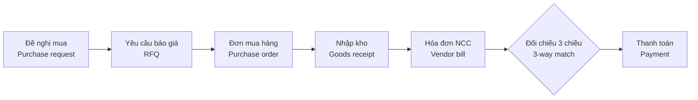
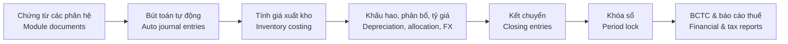
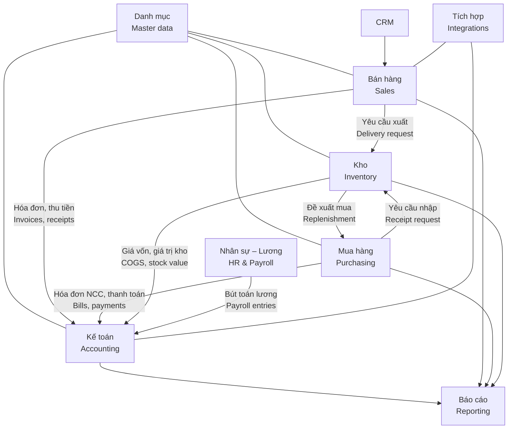

# 00 · Tổng quan dự án / Project Overview

[← Mục lục / Index](../README.md)

---

## 1. Mục đích tài liệu / Purpose of this document

- **VI:** Tài liệu này mô tả bối cảnh, mục tiêu, phạm vi, giả định, ràng buộc và lộ trình triển khai hệ thống ERP. Đây là cơ sở để ban giám đốc, người dùng nghiệp vụ, đội phát triển và đội kiểm thử thống nhất về những gì hệ thống cần làm.
- **EN:** This document describes the background, objectives, scope, assumptions, constraints and delivery roadmap of the ERP system. It is the baseline for management, business users, developers and QA to agree on what the system must do.

## 2. Bối cảnh / Background

- **VI:** Doanh nghiệp hiện quản lý bán hàng, mua hàng, kho và kế toán trên nhiều công cụ rời rạc (Excel, phần mềm kế toán riêng lẻ, email, Zalo). Dữ liệu bị nhập lặp lại nhiều lần, khó đối chiếu giữa các bộ phận, báo cáo quản trị chậm và thiếu kiểm soát nội bộ (phê duyệt, phân quyền, nhật ký thay đổi).
- **EN:** The company currently manages sales, purchasing, inventory and accounting across disconnected tools (Excel, a standalone accounting package, email, Zalo). Data is re-entered several times, hard to reconcile across departments, management reporting is slow, and internal controls (approvals, permissions, change history) are weak.

> Bối cảnh trên là giả định ban đầu, cần xác nhận với ban giám đốc.
> The background above is an initial assumption to be confirmed with management.

## 3. Mục tiêu kinh doanh / Business objectives

| # | Mục tiêu (VI) | Objective (EN) | Chỉ số đề xuất / Proposed KPI |
|---|---|---|---|
| O-1 | Hợp nhất dữ liệu trên một nền tảng duy nhất | Single source of truth on one platform | 100% chứng từ mua, bán, kho, kế toán được lập trên ERP / 100% of purchasing, sales, inventory and accounting documents created in the ERP |
| O-2 | Rút ngắn thời gian xử lý đơn hàng | Shorter order processing time | Giảm ≥ 30% so với hiện tại / ≥ 30% reduction vs. today |
| O-3 | Rút ngắn thời gian khóa sổ tháng | Faster month-end close | ≤ 5 ngày làm việc / ≤ 5 working days |
| O-4 | Tồn kho chính xác | Accurate inventory | Độ chính xác ≥ 98% khi kiểm kê / ≥ 98% accuracy at stock count |
| O-5 | Báo cáo quản trị theo thời gian thực | Real-time management reporting | Số liệu cập nhật ngay khi chứng từ được ghi sổ / Figures updated as soon as documents are posted |
| O-6 | Tuân thủ quy định kế toán & thuế Việt Nam | Compliance with Vietnamese accounting & tax rules | 100% hóa đơn bán ra là HĐĐT hợp lệ; BCTC lập trực tiếp từ hệ thống / 100% valid e-invoices; financial statements produced directly from the system |
| O-7 | Tăng cường kiểm soát nội bộ | Stronger internal control | 100% chứng từ trọng yếu có luồng duyệt và nhật ký / 100% of key documents have approval flow and audit trail |

> Giá trị KPI là đề xuất, cần ban giám đốc chốt.
> KPI targets are proposals to be confirmed by management.

## 4. Phạm vi / Scope

### 4.1 Trong phạm vi / In scope

| Phân hệ / Module | Mã / Code | Chức năng chính (VI) | Key features (EN) | Giai đoạn / Phase |
|---|---|---|---|---|
| Quản trị hệ thống / System administration | SYS | Cơ cấu tổ chức, người dùng, phân quyền, luồng duyệt, đánh số chứng từ, nhật ký, mẫu in | Org structure, users, permissions, approval flows, document numbering, audit log, print templates | P1 |
| Dữ liệu danh mục / Master data | MDM | Sản phẩm, đối tác, kho, tiền tệ, thuế, điều khoản thanh toán | Products, business partners, warehouses, currencies, taxes, payment terms | P1 |
| Bán hàng / Sales | SAL | Báo giá, đơn bán hàng, giao hàng, hóa đơn, trả hàng, khuyến mãi | Quotations, sales orders, delivery, invoicing, returns, promotions | P1 (khuyến mãi / promotions: P2) |
| Mua hàng / Purchasing | PUR | Đề nghị mua, yêu cầu báo giá, đơn mua, nhận hàng, đối chiếu 3 chiều, trả hàng | Purchase requests, RFQs, POs, receiving, 3-way match, returns | P1 |
| Kho / Inventory | INV | Đa kho, nhập/xuất/chuyển kho, lô/serial, kiểm kê, tính giá xuất kho | Multi-warehouse, receipts/issues/transfers, lot/serial, stock count, inventory valuation | P1 |
| Kế toán – Tài chính / Accounting & Finance | ACC | Sổ cái, phải thu, phải trả, tiền & ngân hàng, thuế, BCTC; TSCĐ & CCDC | GL, AR, AP, cash & bank, tax, financial statements; fixed assets & tools | P1 (TSCĐ, ngân sách / FA, budget: P2) |
| Nhân sự – Tiền lương / HR & Payroll | HRM | Hồ sơ nhân sự, hợp đồng, chấm công, nghỉ phép, tính lương, bảo hiểm, thuế TNCN | Employee records, contracts, attendance, leave, payroll, social insurance, PIT | P2 |
| Quản lý khách hàng / CRM | CRM | Khách hàng tiềm năng, cơ hội, hoạt động, chăm sóc khách hàng | Leads, opportunities, activities, customer care | P2 |
| Báo cáo / Reporting | RPT | Dashboard theo vai trò, báo cáo chuẩn, xuất Excel/PDF | Role-based dashboards, standard reports, Excel/PDF export | P1 – P3 |
| Tích hợp / Integrations | INT | HĐĐT, ngân hàng, email, API, sàn TMĐT, vận chuyển | E-invoice, banks, email, API, marketplaces, carriers | P1 – P3 |

### 4.2 Ngoài phạm vi / Out of scope

| # | Hạng mục (VI) | Item (EN) | Ghi chú / Note |
|---|---|---|---|
| X-1 | **Sản xuất**: định mức nguyên vật liệu (BOM), hoạch định nhu cầu vật tư (MRP), lệnh sản xuất, quy trình công đoạn, quản lý xưởng, tính giá thành sản xuất, QC sản xuất | **Manufacturing**: BOM, MRP, work orders, routings, shop floor control, production costing, production QC | Dự án riêng trong tương lai / Separate future project |
| X-2 | Bán lẻ tại quầy (POS) | Retail point of sale (POS) | Có thể xem xét ở P3 / May be considered in P3 |
| X-3 | Website thương mại điện tử | E-commerce storefront | Chỉ tích hợp sàn TMĐT ở P3 / Only marketplace integration in P3 |
| X-4 | Quản lý dự án & chấm công theo dự án (timesheet) | Project management & timesheets | — |
| X-5 | Dịch vụ hiện trường, bảo hành, bảo trì | Field service, warranty, maintenance | — |
| X-6 | Quản lý vận tải & đội xe (TMS) | Transport & fleet management (TMS) | — |
| X-7 | Quản lý kho nâng cao (wave picking, robot, kho tự động) | Advanced WMS (wave picking, robotics, automated storage) | — |
| X-8 | Hợp nhất báo cáo tài chính tập đoàn | Group financial consolidation | — |
| X-9 | Email marketing / tự động hóa marketing | Email marketing / marketing automation | — |

- **VI:** Dù chưa làm Sản xuất, mô hình dữ liệu sản phẩm, kho và giá vốn phải được thiết kế để có thể bổ sung phân hệ Sản xuất sau này mà không phải thiết kế lại (xem `NFR-MNT-002`).
- **EN:** Although Manufacturing is out of scope, the product, inventory and costing data model must be designed so that a Manufacturing module can be added later without redesign (see `NFR-MNT-002`).

## 5. Giả định / Assumptions

| # | Giả định (VI) | Assumption (EN) |
|---|---|---|
| A-01 | Doanh nghiệp hoạt động tại Việt Nam, lĩnh vực thương mại – phân phối và dịch vụ. | The company operates in Vietnam in trading/distribution and services. |
| A-02 | Một pháp nhân, nhiều chi nhánh và nhiều kho; kiến trúc vẫn hỗ trợ nhiều công ty. | One legal entity with multiple branches and warehouses; the architecture still supports multiple companies. |
| A-03 | Khoảng 300 người dùng, tối đa 100 người dùng đồng thời trong 3 năm đầu. | About 300 named users, up to 100 concurrent users in the first 3 years. |
| A-04 | Đồng tiền hạch toán là VND; có giao dịch bằng ngoại tệ (USD, EUR, …). | Functional currency is VND; foreign-currency transactions exist (USD, EUR, …). |
| A-05 | Áp dụng chế độ kế toán doanh nghiệp hiện hành: Thông tư 99/2025/TT-BTC (thay thế Thông tư 200/2014/TT-BTC từ 01/01/2026) hoặc Thông tư 133/2016/TT-BTC cho doanh nghiệp nhỏ và vừa; chọn được theo công ty. | The current Vietnamese enterprise accounting regime applies: Circular 99/2025/TT-BTC (replacing Circular 200/2014/TT-BTC from 2026-01-01) or Circular 133/2016/TT-BTC for SMEs; selectable per company. |
| A-06 | Doanh nghiệp sử dụng hóa đơn điện tử qua một nhà cung cấp dịch vụ HĐĐT có API. | The company issues e-invoices through an e-invoice service provider that offers an API. |
| A-07 | Hệ thống triển khai trên cloud, người dùng truy cập qua trình duyệt web. | The system is cloud-hosted and accessed through a web browser. |
| A-08 | Dữ liệu đầu kỳ (danh mục, tồn kho, công nợ, số dư tài khoản) được chuyển từ hệ thống cũ qua mẫu Excel. | Opening data (master data, stock, open AR/AP, account balances) is migrated from legacy systems via Excel templates. |

> Các tham chiếu pháp lý cần được kế toán trưởng / tư vấn thuế xác nhận lại tại thời điểm triển khai.
> Legal references must be re-validated by the chief accountant / tax advisor at implementation time.

## 6. Ràng buộc / Constraints

| # | Ràng buộc (VI) | Constraint (EN) |
|---|---|---|
| C-01 | Giao diện và tên danh mục hỗ trợ song ngữ Việt – Anh. | UI and master-data names support Vietnamese and English. |
| C-02 | Tuân thủ pháp luật Việt Nam về kế toán, thuế, hóa đơn điện tử và bảo vệ dữ liệu cá nhân. | Comply with Vietnamese law on accounting, tax, e-invoicing and personal data protection. |
| C-03 | Chứng từ và sổ kế toán được lưu trữ tối thiểu 10 năm theo Luật Kế toán. | Accounting documents and books are retained for at least 10 years under the Law on Accounting. |
| C-04 | Công nghệ đề xuất: NestJS, Next.js, PostgreSQL (chi tiết tại [12 · NFR](12-non-functional.md), mục 11). | Proposed technology: NestJS, Next.js, PostgreSQL (details in [12 · NFR](12-non-functional.md), section 11). |

## 7. Các bên liên quan / Stakeholders

| Bên liên quan (VI) | Stakeholder (EN) | Vai trò trong dự án / Role in the project |
|---|---|---|
| Ban giám đốc | Executive board | Nhà tài trợ dự án, duyệt phạm vi & ngân sách / Project sponsor, approves scope & budget |
| Kế toán trưởng | Chief accountant | Chủ sở hữu nghiệp vụ kế toán – thuế / Owner of accounting & tax processes |
| Trưởng phòng kinh doanh | Sales manager | Chủ sở hữu nghiệp vụ bán hàng & CRM / Owner of sales & CRM processes |
| Trưởng phòng mua hàng | Purchasing manager | Chủ sở hữu nghiệp vụ mua hàng / Owner of purchasing processes |
| Quản lý kho | Warehouse manager | Chủ sở hữu nghiệp vụ kho / Owner of inventory processes |
| Trưởng phòng nhân sự | HR manager | Chủ sở hữu nghiệp vụ nhân sự – tiền lương / Owner of HR & payroll processes |
| Bộ phận IT | IT department | Hạ tầng, bảo mật, quản trị hệ thống / Infrastructure, security, system administration |
| Đội dự án (PM, BA, Dev, QA) | Project team (PM, BA, Dev, QA) | Phân tích, xây dựng, kiểm thử, triển khai / Analysis, build, test, rollout |

## 8. Quy trình nghiệp vụ tổng thể / End-to-end business processes

### 8.1 Bán hàng – Thu tiền / Order-to-Cash (O2C)

### 8.2 Mua hàng – Thanh toán / Procure-to-Pay (P2P)

### 8.3 Ghi nhận – Báo cáo / Record-to-Report (R2R)

### 8.4 Sơ đồ liên kết phân hệ / Module integration map

## 9. Lộ trình triển khai / Roadmap

| Giai đoạn / Phase | Phạm vi (VI) | Scope (EN) | Điều kiện hoàn thành / Exit criteria |
|---|---|---|---|
| **P1 — MVP** | SYS, MDM, SAL, PUR, INV, ACC (sổ cái, phải thu, phải trả, tiền & ngân hàng, thuế GTGT, HĐĐT, BCTC), báo cáo cơ bản, tích hợp HĐĐT – email – Excel | SYS, MDM, SAL, PUR, INV, ACC (GL, AR, AP, cash & bank, VAT, e-invoice, financial statements), basic reports, e-invoice/email/Excel integrations | Vận hành song song 1 kỳ kế toán và khóa sổ thành công trên ERP / One accounting period run in parallel and closed successfully in the ERP |
| **P2 — Mở rộng / Expansion** | HRM, CRM, TSCĐ & CCDC, ngân sách, khuyến mãi, quét mã vạch, dashboard nâng cao, REST API công khai | HRM, CRM, fixed assets & tools, budgeting, promotions, barcode scanning, advanced dashboards, public REST API | Tính lương 1 kỳ trên ERP; dashboard điều hành được ban giám đốc sử dụng / One payroll run in the ERP; executive dashboard in use by management |
| **P3 — Tối ưu / Optimization** | Open API ngân hàng, sàn TMĐT, đơn vị vận chuyển, báo cáo tùy biến / BI, ứng dụng di động | Bank Open API, marketplaces, carriers, custom reports / BI, mobile app | Theo kế hoạch chi tiết từng hạng mục / Per item plan |

> Mốc thời gian cụ thể sẽ được xác định sau khi chốt phạm vi P1.
> Dates will be set after P1 scope is frozen.

## 10. Câu hỏi mở / Open questions

| # | Câu hỏi (VI) | Question (EN) | Ảnh hưởng / Impacts |
|---|---|---|---|
| Q-01 | Ngành hàng cụ thể và đặc thù (FMCG, dược, vật liệu xây dựng, thiết bị…)? | Specific industry and its particulars (FMCG, pharma, building materials, equipment…)? | MDM, INV (lô/hạn dùng / lot/expiry) |
| Q-02 | Số pháp nhân, chi nhánh, kho hiện tại và dự kiến? | Current and planned number of legal entities, branches, warehouses? | SYS, ACC, INV |
| Q-03 | Áp dụng Thông tư 99/2025 hay Thông tư 133/2016? | Circular 99/2025 or Circular 133/2016? | ACC |
| Q-04 | Phương pháp tính giá xuất kho (bình quân cuối kỳ, bình quân tức thời, FIFO, đích danh)? | Inventory costing method (periodic average, moving average, FIFO, specific identification)? | INV, ACC |
| Q-05 | Xuất hóa đơn theo số lượng đặt hay số lượng đã giao? | Invoice on ordered or delivered quantity? | SAL, ACC |
| Q-06 | Nhà cung cấp HĐĐT hiện tại là ai? | Who is the current e-invoice provider? | INT |
| Q-07 | Triển khai cloud hay tại chỗ (on-premise)? Có yêu cầu lưu dữ liệu tại Việt Nam? | Cloud or on-premise? Is data residency in Vietnam required? | NFR |
| Q-08 | Nhân sự – tiền lương có cần đưa lên P1 không? | Should HR & payroll be moved into P1? | Lộ trình / Roadmap |
| Q-09 | Có thiết bị cần tích hợp (máy chấm công, máy quét mã vạch, máy in nhãn)? | Any devices to integrate (time clocks, barcode scanners, label printers)? | INT, INV, HRM |
| Q-10 | Cần chuyển đổi bao nhiêu năm dữ liệu lịch sử? | How many years of historical data must be migrated? | Chuyển đổi dữ liệu / Data migration |
| Q-11 | Ngưỡng giá trị và các cấp duyệt cho từng loại chứng từ? | Value thresholds and approval levels for each document type? | SYS, SAL, PUR, ACC |

## 11. Lịch sử phiên bản / Revision history

| Phiên bản / Version | Ngày / Date | Mô tả / Description | Người thực hiện / Author |
|---|---|---|---|
| 0.1 | 2026-10-04 | Khởi tạo bản nháp / Initial draft | — |
