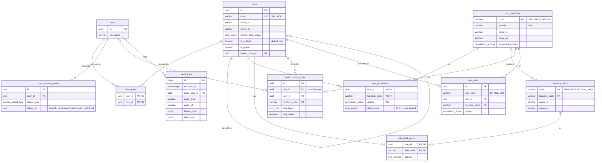

# 01 · Vai trò & Phân quyền / Roles & Permissions

[← Mục lục / Index](../README.md)

---

## 1. Mô hình phân quyền / Permission model

- **VI:** Hệ thống áp dụng phân quyền theo vai trò (RBAC) kết hợp phạm vi dữ liệu. Một người dùng có thể có nhiều vai trò; quyền hiệu lực là hợp của quyền các vai trò. Mọi kiểm tra quyền phải được thực hiện ở phía máy chủ.
- **EN:** The system uses role-based access control (RBAC) combined with data scope. A user may hold several roles; effective permissions are the union of all role permissions. All permission checks must be enforced server-side.

| Thành phần (VI) | Component (EN) | Giá trị / Values | Giai đoạn / Phase |
|---|---|---|---|
| Chức năng | Function | Màn hình / nghiệp vụ, ví dụ "Đơn bán hàng" / Screen or business function, e.g. "Sales order" | P1 |
| Hành động | Action | Xem / View · Tạo / Create · Sửa / Edit · Xóa / Delete · Duyệt / Approve · Hủy / Cancel · In / Print · Xuất / Export · Nhập / Import | P1 |
| Phạm vi dữ liệu | Data scope | Của tôi / Own · Toàn công ty / All (P1) · Phòng ban / Department · Chi nhánh / Branch · Kho, quỹ được gán / Assigned (P2) | P1 – P2 |
| Hạn mức | Limits | Chiết khấu tối đa, giá trị duyệt tối đa… / Max discount, max approval amount… | P2 |
| Quyền theo trường | Field-level | Ẩn giá vốn, lãi gộp, lương… / Hide cost, gross margin, salary… | P2 |

- **VI:** P1 chỉ cần ma trận chức năng × hành động và hai phạm vi Của tôi / Toàn công ty. Các phạm vi còn lại, hạn mức, quyền theo trường và quy tắc phân tách nhiệm vụ bổ sung ở P2.
- **EN:** P1 only needs the function × action matrix and the two scopes Own / All. The remaining scopes, limits, field-level permissions and segregation-of-duties rules are added in P2.

## 2. Danh sách vai trò mặc định / Default roles

| Mã / Code | Vai trò (VI) | Role (EN) | Phạm vi mặc định / Default scope | Giai đoạn / Phase |
|---|---|---|---|---|
| `ADM` | Quản trị hệ thống | System administrator | Toàn công ty (chỉ cấu hình) / All (configuration only) | P1 |
| `CEO` | Ban giám đốc | Executive | Toàn công ty / All | P1 |
| `SAL` | Nhân viên kinh doanh | Sales staff | Của tôi / Own | P1 |
| `SLM` | Trưởng phòng kinh doanh | Sales manager | Phòng ban hoặc chi nhánh / Department or branch | P1 |
| `PUR` | Nhân viên mua hàng | Purchasing staff | Phòng ban / Department | P1 |
| `PUM` | Trưởng phòng mua hàng | Purchasing manager | Toàn công ty / All | P1 |
| `WH` | Thủ kho | Warehouse keeper | Kho được gán / Assigned warehouses | P1 |
| `WHM` | Quản lý kho | Warehouse manager | Chi nhánh / Branch | P1 |
| `ACC` | Kế toán viên | Accountant | Toàn công ty / All | P1 |
| `CAC` | Kế toán trưởng | Chief accountant | Toàn công ty / All | P1 |
| `CSH` | Thủ quỹ | Cashier | Quỹ được gán / Assigned cash funds | P1 |
| `HR` | Nhân viên nhân sự | HR staff | Toàn công ty / All | P3 |
| `HRM` | Trưởng phòng nhân sự | HR manager | Toàn công ty / All | P3 |
| `EMP` | Nhân viên (tự phục vụ) | Employee (self-service) | Của tôi / Own | P2 |
| `AUD` | Kiểm soát / Kiểm toán (chỉ xem) | Auditor (read-only) | Toàn công ty / All | P1 |

- **VI:** Trong P1 chỉ có phạm vi Của tôi và Toàn công ty; các vai trò có phạm vi mặc định là phòng ban, chi nhánh hoặc kho / quỹ được gán dùng Toàn công ty cho đến P2.
- **EN:** P1 only has the Own and All scopes; roles whose default scope is department, branch or assigned warehouses / cash funds use All until P2.

## 3. Ma trận phân quyền mặc định / Default permission matrix

Ký hiệu / Legend: `V` Xem / View · `C` Tạo / Create · `E` Sửa / Edit · `D` Xóa / Delete · `A` Duyệt / Approve · `—` Không / None

| Chức năng / Function | Giai đoạn / Phase | ADM | CEO | SAL | SLM | PUR | PUM | WH | WHM | ACC | CAC | CSH | HR | HRM | AUD |
|---|---|---|---|---|---|---|---|---|---|---|---|---|---|---|---|
| Người dùng & vai trò / Users & roles | P1 | VCED | — | — | — | — | — | — | — | — | — | — | — | — | V |
| Cấu hình hệ thống / System settings | P1 | VCE | V | — | — | — | — | — | — | — | V | — | — | — | V |
| Nhật ký hệ thống / Audit log | P1 | V | V | — | — | — | — | — | — | — | V | — | — | — | V |
| Sản phẩm / Products | P1 | V | V | V | V | VCE | VCEA | V | VCE | V | VE | — | — | — | V |
| Khách hàng / Customers | P1 | — | V | VCE | VCEA | — | — | — | — | V | VE | V | — | — | V |
| Nhà cung cấp / Suppliers | P1 | — | V | — | — | VCE | VCEA | — | — | V | VE | V | — | — | V |
| Bảng giá bán / Price lists | P1 | — | VA | V | VCE | — | — | — | — | V | V | — | — | — | V |
| Báo giá / Quotations | P1 | — | V | VCE | VCEDA | — | — | — | — | — | — | — | — | — | V |
| Đơn bán hàng / Sales orders | P1 | — | VA | VCE | VCEDA | — | — | V | V | V | V | — | — | — | V |
| Trả hàng bán / Sales returns | P1 | — | V | VC | VCEA | — | — | V | V | V | VA | — | — | — | V |
| Đề nghị mua hàng / Purchase requests | P2 | — | VA | VC | VC | VCE | VCEA | VC | VC | VC | VC | — | VC | VC | V |
| Đơn mua hàng / Purchase orders | P1 | — | VA | — | — | VCE | VCEDA | V | V | V | V | — | — | — | V |
| Nhập / xuất / chuyển kho / Receipts, issues, transfers | P1 | — | V | — | — | V | V | VCE | VCEDA | V | V | — | — | — | V |
| Kiểm kê / Stock count | P1 | — | V | — | — | — | — | VCE | VCEA | V | VA | — | — | — | V |
| Hóa đơn bán / Customer invoices | P1 | — | V | V | V | — | — | — | — | VCE | VCEDA | — | — | — | V |
| Hóa đơn mua / Vendor bills | P1 | — | V | — | — | V | V | — | — | VCE | VCEDA | — | — | — | V |
| Phiếu thu / chi tiền mặt / Cash receipts & payments | P1 | — | VA | — | — | — | — | — | — | VCE | VCEDA | VCE | — | — | V |
| Giao dịch ngân hàng / Bank transactions | P1 | — | VA | — | — | — | — | — | — | VCE | VCEDA | — | — | — | V |
| Bút toán thủ công / Manual journal entries | P2 | — | — | — | — | — | — | — | — | VCE | VCEDA | — | — | — | V |
| Khóa sổ kỳ / Period close | P2 | — | V | — | — | — | — | — | — | — | VA | — | — | — | V |
| Báo cáo tài chính / Financial statements | P2 | — | V | — | — | — | — | — | — | V | V | — | — | — | V |
| Hồ sơ nhân sự / Employee records | P3 | — | V | — | — | — | — | — | — | — | — | — | VCE | VCEDA | — |
| Bảng lương / Payroll | P3 | — | VA | — | — | — | — | — | — | V | V | — | VCE | VCEA | — |
| Dashboard điều hành / Executive dashboard | P2 | — | V | — | — | — | — | — | — | — | V | — | — | — | — |

- **VI:** Ma trận trên là cấu hình mặc định khi khởi tạo; quản trị viên có thể thay đổi. Cột Giai đoạn cho biết chức năng có từ giai đoạn nào. Vai trò `EMP` chỉ truy cập cổng tự phục vụ (P4) và tạo đề nghị mua hàng / tạm ứng.
- **EN:** The matrix above is the initial default configuration; administrators can change it. The Phase column shows when each function becomes available. The `EMP` role only accesses the self-service portal (P4) and can create purchase requests / advance requests.

## 4. Quy tắc phân tách nhiệm vụ / Segregation-of-duties rules

#### BR-ROL-001 · Không tự duyệt / No self-approval
`Must` · `P1`

- **VI:** Người tạo chứng từ không được duyệt chính chứng từ đó, kể cả khi có quyền duyệt.
- **EN:** The creator of a document cannot approve that same document, even if they hold the approve permission.

#### BR-ROL-002 · Tách thủ quỹ và ghi sổ / Separate cash handling and posting
`Must` · `P2`

- **VI:** Thủ quỹ không được tạo hoặc sửa bút toán sổ cái và không được duyệt phiếu chi.
- **EN:** Cashiers cannot create or edit GL journal entries and cannot approve cash payments.

#### BR-ROL-003 · Tách thông tin ngân hàng NCC và duyệt chi / Separate supplier bank details and payment approval
`Must` · `P2`

- **VI:** Người sửa tài khoản ngân hàng của nhà cung cấp không được duyệt thanh toán cho nhà cung cấp đó trong cùng kỳ.
- **EN:** A user who changes a supplier's bank account cannot approve payments to that supplier within the same period.

#### BR-ROL-004 · Điều chỉnh tồn kho cần duyệt / Stock adjustments require approval
`Must` · `P1`

- **VI:** Thủ kho không được điều chỉnh tồn kho (thừa/thiếu) nếu không qua phê duyệt của quản lý kho hoặc kế toán trưởng.
- **EN:** Warehouse keepers cannot post stock adjustments (surplus/shortage) without approval from the warehouse manager or chief accountant.

#### BR-ROL-005 · Quản trị viên không có quyền nghiệp vụ mặc định / Admins have no business permissions by default
`Must` · `P1`

- **VI:** Vai trò `ADM` chỉ có quyền cấu hình; không mặc định được xem hay sửa dữ liệu nghiệp vụ (đơn hàng, lương, sổ sách).
- **EN:** The `ADM` role has configuration rights only; by default it cannot view or edit business data (orders, payroll, ledgers).

#### BR-ROL-006 · Thay đổi phân quyền được ghi nhật ký / Permission changes are audited
`Must` · `P1`

- **VI:** Mọi thay đổi vai trò, quyền, phạm vi dữ liệu đều được ghi vào nhật ký kiểm toán (người thực hiện, thời điểm, giá trị trước – sau).
- **EN:** Every change to roles, permissions or data scope is written to the audit log (actor, timestamp, before/after values).

## 5. Mô hình dữ liệu / Data model

- **VI:** Lược đồ đề xuất cho PostgreSQL 16 (xem [12 · NFR](12-non-functional.md), mục 11). Bảng `users`, `branches`, `departments` thuộc [02 · Quản trị hệ thống](02-system-administration.md); bảng kho và quỹ thuộc phân hệ INV, ACC. Hệ thống chỉ phục vụ một công ty nên không có bảng `companies` và không có cột `company_id`; thông tin doanh nghiệp là một bản ghi cấu hình duy nhất (FR-SYS-001). Đây là bản nháp để xem xét, có thể thay đổi khi thiết kế chi tiết.
- **EN:** Proposed schema for PostgreSQL 16 (see [12 · NFR](12-non-functional.md), section 11). The `users`, `branches`, `departments` tables belong to [02 · System administration](02-system-administration.md); warehouse and cash-fund tables belong to INV and ACC. The system serves a single company, so there is no `companies` table and no `company_id` column; the company profile is a single settings record (FR-SYS-001). This is a draft for review and may change during detailed design.

### 5.1 Sơ đồ quan hệ / Entity-relationship diagram



### 5.2 Danh sách bảng / Tables

| Bảng / Table | Mục đích (VI) | Purpose (EN) | Giai đoạn / Phase |
|---|---|---|---|
| `roles` | Vai trò: 15 vai trò mặc định (`is_system = true`, không xóa, không đổi mã) và vai trò tùy chỉnh. | Roles: the 15 default roles (`is_system = true`, cannot be deleted or re-coded) plus custom roles. | P1 |
| `app_functions` | Danh mục chức năng — các hàng của ma trận mục 3. Khai báo trong mã nguồn, nạp bằng seed; người dùng không sửa. | Function catalog — the rows of the section 3 matrix. Defined in code and seeded; not user-editable. | P1 |
| `role_permissions` | Mỗi dòng là một ô chức năng × hành động được cấp cho vai trò. `data_scope` để trống thì dùng phạm vi mặc định của vai trò. | One row per function × action granted to a role. An empty `data_scope` falls back to the role's default scope. | P1 |
| `user_roles` | Gán vai trò cho người dùng; một người dùng có thể có nhiều vai trò. | Assigns roles to users; a user may hold several roles. | P1 |
| `user_access_grants` | Chi nhánh, phòng ban, kho, quỹ mà người dùng được truy cập; dùng để tính phạm vi dữ liệu. | Branches, departments, warehouses and cash funds a user may access; used to evaluate data scope. | P2 |
| `sensitive_fields` | Danh mục trường nhạy cảm: giá vốn, lãi gộp, giá mua, lương… | Catalog of sensitive fields: cost, gross margin, purchase price, salary… | P2 |
| `role_field_grants` | Vai trò được xem / sửa trường nhạy cảm nào. Không có dòng = ẩn. | Which role may view / edit which sensitive field. No row = hidden. | P2 |
| `authorization_limits` | Hạn mức theo vai trò **hoặc** theo người dùng (FR-SYS-014). | Limits per role **or** per user (FR-SYS-014). | P2 |
| `sod_rules` | Quyền mà người giữ một vai trò không được có, dù đến từ vai trò nào. | Permissions a holder of a given role must not have, whichever role grants them. | P2 |
| `audit_logs` | Nhật ký kiểm toán dùng chung, chỉ ghi thêm. | Shared, append-only audit log. | P1 |

### 5.3 Kiểu liệt kê / Enumerations

| Kiểu / Type | Giá trị / Values |
|---|---|
| `permission_action` | `VIEW` · `CREATE` · `EDIT` · `DELETE` · `APPROVE` · `CANCEL` · `PRINT` · `EXPORT` · `IMPORT` |
| `data_scope` | `OWN` · `DEPARTMENT` · `BRANCH` · `ASSIGNED` (kho / quỹ được gán / assigned warehouses / cash funds) · `ALL` (toàn công ty / whole company). P1 chỉ dùng `OWN`, `ALL` / P1 only uses `OWN`, `ALL` |
| `access_object_type` | `BRANCH` · `DEPARTMENT` · `WAREHOUSE` · `CASH_FUND` |
| `field_access` | `VIEW` · `EDIT` |
| `limit_type` | `MAX_DISCOUNT_PCT` · `MAX_SELF_CONFIRM_AMOUNT` · `MAX_APPROVAL_AMOUNT` |

### 5.4 Mã chức năng / Function codes

Ánh xạ các hàng của ma trận mục 3 sang `app_functions.code` / Maps the section 3 matrix rows to `app_functions.code`:

| Mã / Code | Chức năng / Function |
|---|---|
| `SYS.USER_ROLE` | Người dùng & vai trò / Users & roles |
| `SYS.SETTINGS` | Cấu hình hệ thống / System settings |
| `SYS.AUDIT_LOG` | Nhật ký hệ thống / Audit log |
| `MDM.PRODUCT` | Sản phẩm / Products |
| `MDM.CUSTOMER` | Khách hàng / Customers |
| `MDM.SUPPLIER` | Nhà cung cấp / Suppliers |
| `MDM.PRICE_LIST` | Bảng giá bán / Price lists |
| `SAL.QUOTATION` | Báo giá / Quotations |
| `SAL.SALES_ORDER` | Đơn bán hàng / Sales orders |
| `SAL.SALES_RETURN` | Trả hàng bán / Sales returns |
| `PUR.PURCHASE_REQUEST` | Đề nghị mua hàng / Purchase requests |
| `PUR.PURCHASE_ORDER` | Đơn mua hàng / Purchase orders |
| `INV.STOCK_MOVE` | Nhập / xuất / chuyển kho / Receipts, issues, transfers |
| `INV.STOCK_COUNT` | Kiểm kê / Stock count |
| `ACC.CUSTOMER_INVOICE` | Hóa đơn bán / Customer invoices |
| `ACC.VENDOR_BILL` | Hóa đơn mua / Vendor bills |
| `ACC.CASH_VOUCHER` | Phiếu thu / chi tiền mặt / Cash receipts & payments |
| `ACC.BANK_TXN` | Giao dịch ngân hàng / Bank transactions |
| `ACC.JOURNAL_ENTRY` | Bút toán thủ công / Manual journal entries |
| `ACC.PERIOD_CLOSE` | Khóa sổ kỳ / Period close |
| `ACC.FIN_STATEMENT` | Báo cáo tài chính / Financial statements |
| `HRM.EMPLOYEE` | Hồ sơ nhân sự / Employee records |
| `HRM.PAYROLL` | Bảng lương / Payroll |
| `RPT.EXEC_DASHBOARD` | Dashboard điều hành / Executive dashboard |

Ví dụ / Example — ô `SAL` × Đơn bán hàng = `VCE` trở thành 3 dòng `role_permissions` / becomes 3 `role_permissions` rows:

| role | function_code | action | data_scope |
|---|---|---|---|
| `SAL` | `SAL.SALES_ORDER` | `VIEW` | `NULL` → `OWN` |
| `SAL` | `SAL.SALES_ORDER` | `CREATE` | `NULL` → `OWN` |
| `SAL` | `SAL.SALES_ORDER` | `EDIT` | `NULL` → `OWN` |

### 5.5 Tính quyền hiệu lực / Resolving effective permissions

| # | Quy tắc (VI) | Rule (EN) | Giai đoạn / Phase |
|---|---|---|---|
| 1 | Chỉ xét các vai trò đang hoạt động (`is_active = true`) được gán cho người dùng. | Only active roles (`is_active = true`) assigned to the user are considered. | P1 |
| 2 | Người dùng có quyền chức năng × hành động nếu ít nhất một vai trò có dòng `role_permissions` tương ứng. | A user holds a function × action if at least one of their roles has the matching `role_permissions` row. | P1 |
| 3 | Mỗi vai trò cấp quyền tạo ra một điều kiện lọc theo phạm vi (bảng dưới); điều kiện hiệu lực là **OR** của các điều kiện đó. | Each granting role yields one scope filter (table below); the effective filter is the **OR** of those filters. | P1 |
| 4 | Trường nhạy cảm ẩn mặc định, chỉ hiện khi có ít nhất một vai trò được cấp trong `role_field_grants`; `EDIT` bao gồm `VIEW`. Áp dụng cho màn hình, báo cáo, bản in, dữ liệu xuất và API. | Sensitive fields are hidden by default and shown only when at least one role has a `role_field_grants` row; `EDIT` implies `VIEW`. Applies to screens, reports, printouts, exports and the API. | P2 |
| 5 | Hạn mức: dòng theo người dùng được ưu tiên; nếu không có, lấy giá trị lớn nhất trong các vai trò; không có dòng nào = không giới hạn (xem Q-ROL-04). Số tiền tính theo đồng tiền hạch toán. | Limits: a user-level row wins; otherwise the highest value across roles applies; no row at all = unlimited (see Q-ROL-04). Amounts are in the functional currency. | P2 |
| 6 | Khi gán vai trò cho người dùng hoặc sửa quyền của vai trò, hệ thống từ chối nếu kết quả vi phạm `sod_rules`. | Assigning a role to a user or changing a role's permissions is rejected if the result violates `sod_rules`. | P2 |

| Phạm vi / Scope | Điều kiện lọc trên chứng từ (VI) | Filter on documents (EN) | Giai đoạn / Phase |
|---|---|---|---|
| `OWN` | `owner_id` = người dùng hiện tại | `owner_id` = current user | P1 |
| `DEPARTMENT` | `department_id` thuộc phòng ban được gán, kể cả phòng ban con | `department_id` in assigned departments, including sub-departments | P2 |
| `BRANCH` | `branch_id` thuộc chi nhánh được gán | `branch_id` in assigned branches | P2 |
| `ALL` | Không lọc (toàn công ty) | No filter (whole company) | P1 |
| `ASSIGNED` | `warehouse_id` / `cash_fund_id` thuộc kho / quỹ được gán | `warehouse_id` / `cash_fund_id` in assigned warehouses / cash funds | P2 |

- **VI:** Để áp dụng được phạm vi dữ liệu, mọi bảng chứng từ phải có `branch_id`, `department_id`, `owner_id` (người phụ trách, mặc định là người tạo).
- **EN:** For data scope to work, every document table must carry `branch_id`, `department_id` and `owner_id` (the responsible user, defaulting to the creator).

### 5.6 Ánh xạ quy tắc nghiệp vụ / Business-rule mapping

| Quy tắc / Rule | Cơ chế (VI) | Mechanism (EN) |
|---|---|---|
| BR-ROL-001 | Kiểm tra khi duyệt: người duyệt ≠ `created_by` của chứng từ. | Checked at approval: approver ≠ the document's `created_by`. |
| BR-ROL-002 | `sod_rules`: `CSH` × `ACC.JOURNAL_ENTRY` (`CREATE`, `EDIT`) và `CSH` × `ACC.CASH_VOUCHER` (`APPROVE`). | `sod_rules`: `CSH` × `ACC.JOURNAL_ENTRY` (`CREATE`, `EDIT`) and `CSH` × `ACC.CASH_VOUCHER` (`APPROVE`). |
| BR-ROL-003 | Kiểm tra khi duyệt chi: tra `audit_logs` các thay đổi tài khoản ngân hàng của NCC trong kỳ; người sửa ≠ người duyệt. | Checked at payment approval: look up the supplier's bank-account changes in `audit_logs` for the period; editor ≠ approver. |
| BR-ROL-004 | Dữ liệu khởi tạo: `WH` không có `APPROVE` trên `INV.STOCK_COUNT`; điều chỉnh tồn kho chỉ ghi sổ sau khi được duyệt. | Seed data: `WH` has no `APPROVE` on `INV.STOCK_COUNT`; stock adjustments post only after approval. |
| BR-ROL-005 | Dữ liệu khởi tạo: `ADM` chỉ có các dòng theo ma trận mục 3, không có quyền trên chứng từ, lương, sổ sách. | Seed data: `ADM` only has the rows from the section 3 matrix, with no rights on documents, payroll or ledgers. |
| BR-ROL-006 | Mọi thay đổi trên `roles`, `role_permissions`, `user_roles`, `user_access_grants`, `role_field_grants`, `authorization_limits`, `sod_rules` được ghi vào `audit_logs` trong cùng giao dịch. | Every change to `roles`, `role_permissions`, `user_roles`, `user_access_grants`, `role_field_grants`, `authorization_limits`, `sod_rules` is written to `audit_logs` in the same transaction. |

### 5.7 DDL (PostgreSQL 16)

<details>
<summary>Xem DDL / Show DDL</summary>

```sql
-- Bảng users thuộc tài liệu 02 / users is defined in doc 02.

CREATE TYPE permission_action  AS ENUM ('VIEW','CREATE','EDIT','DELETE','APPROVE','CANCEL','PRINT','EXPORT','IMPORT');
CREATE TYPE data_scope         AS ENUM ('OWN','DEPARTMENT','BRANCH','ASSIGNED','ALL');
CREATE TYPE access_object_type AS ENUM ('BRANCH','DEPARTMENT','WAREHOUSE','CASH_FUND');
CREATE TYPE field_access       AS ENUM ('VIEW','EDIT');
CREATE TYPE limit_type         AS ENUM ('MAX_DISCOUNT_PCT','MAX_SELF_CONFIRM_AMOUNT','MAX_APPROVAL_AMOUNT');

CREATE TABLE roles (
  id                  uuid         PRIMARY KEY DEFAULT gen_random_uuid(),
  code                varchar(20)  NOT NULL UNIQUE,
  name_vi             varchar(100) NOT NULL,
  name_en             varchar(100) NOT NULL,
  description         text,
  default_data_scope  data_scope   NOT NULL,
  is_system           boolean      NOT NULL DEFAULT false,
  is_active           boolean      NOT NULL DEFAULT true,
  cloned_from_id      uuid         REFERENCES roles(id),
  created_at          timestamptz  NOT NULL DEFAULT now(),
  created_by          uuid         REFERENCES users(id),
  updated_at          timestamptz  NOT NULL DEFAULT now(),
  updated_by          uuid         REFERENCES users(id)
);

-- Seed từ mã nguồn / seeded from code
CREATE TABLE app_functions (
  code               varchar(50)         PRIMARY KEY,
  module             varchar(10)         NOT NULL,
  name_vi            varchar(150)        NOT NULL,
  name_en            varchar(150)        NOT NULL,
  supported_actions  permission_action[] NOT NULL,
  sort_order         integer             NOT NULL DEFAULT 0,
  is_active          boolean             NOT NULL DEFAULT true
);

CREATE TABLE role_permissions (
  role_id        uuid              NOT NULL REFERENCES roles(id) ON DELETE CASCADE,
  function_code  varchar(50)       NOT NULL REFERENCES app_functions(code),
  action         permission_action NOT NULL,
  data_scope     data_scope,       -- NULL = roles.default_data_scope
  created_at     timestamptz       NOT NULL DEFAULT now(),
  created_by     uuid              REFERENCES users(id),
  PRIMARY KEY (role_id, function_code, action)
);

CREATE TABLE user_roles (
  user_id      uuid        NOT NULL REFERENCES users(id),
  role_id      uuid        NOT NULL REFERENCES roles(id),
  assigned_at  timestamptz NOT NULL DEFAULT now(),
  assigned_by  uuid        REFERENCES users(id),
  PRIMARY KEY (user_id, role_id)
);
CREATE INDEX ON user_roles (role_id);

-- object_id trỏ tới branches / departments / warehouses / cash_funds tùy object_type
-- object_id points to branches / departments / warehouses / cash_funds depending on object_type
-- P2
CREATE TABLE user_access_grants (
  id           uuid               PRIMARY KEY DEFAULT gen_random_uuid(),
  user_id      uuid               NOT NULL REFERENCES users(id),
  object_type  access_object_type NOT NULL,
  object_id    uuid               NOT NULL,
  granted_at   timestamptz        NOT NULL DEFAULT now(),
  granted_by   uuid               REFERENCES users(id),
  UNIQUE (user_id, object_type, object_id)
);

-- P2
CREATE TABLE sensitive_fields (
  code           varchar(80)  PRIMARY KEY,  -- vd / e.g. 'MDM.PRODUCT.cost_price'
  function_code  varchar(50)  NOT NULL REFERENCES app_functions(code),
  name_vi        varchar(150) NOT NULL,
  name_en        varchar(150) NOT NULL
);

-- P2
CREATE TABLE role_field_grants (
  role_id     uuid         NOT NULL REFERENCES roles(id) ON DELETE CASCADE,
  field_code  varchar(80)  NOT NULL REFERENCES sensitive_fields(code),
  access      field_access NOT NULL DEFAULT 'VIEW',
  PRIMARY KEY (role_id, field_code)
);

-- P2
CREATE TABLE authorization_limits (
  id             uuid          PRIMARY KEY DEFAULT gen_random_uuid(),
  role_id        uuid          REFERENCES roles(id) ON DELETE CASCADE,
  user_id        uuid          REFERENCES users(id),
  function_code  varchar(50)   NOT NULL REFERENCES app_functions(code),
  limit_type     limit_type    NOT NULL,
  limit_value    numeric(18,4) NOT NULL CHECK (limit_value >= 0),
  updated_at     timestamptz   NOT NULL DEFAULT now(),
  updated_by     uuid          REFERENCES users(id),
  CHECK (num_nonnulls(role_id, user_id) = 1),
  CHECK (limit_type <> 'MAX_DISCOUNT_PCT' OR limit_value <= 100),
  UNIQUE NULLS NOT DISTINCT (role_id, user_id, function_code, limit_type)
);

-- P2
CREATE TABLE sod_rules (
  id             uuid              PRIMARY KEY DEFAULT gen_random_uuid(),
  rule_code      varchar(20)       NOT NULL,  -- vd / e.g. 'BR-ROL-002'
  role_id        uuid              NOT NULL REFERENCES roles(id) ON DELETE CASCADE,
  function_code  varchar(50)       NOT NULL REFERENCES app_functions(code),
  action         permission_action NOT NULL,
  is_active      boolean           NOT NULL DEFAULT true,
  UNIQUE (role_id, function_code, action)
);

-- Chỉ ghi thêm: thu hồi UPDATE/DELETE của tài khoản ứng dụng; nên phân vùng theo tháng
-- Append-only: revoke UPDATE/DELETE from the app account; consider monthly partitioning
CREATE TABLE audit_logs (
  id              bigint       GENERATED ALWAYS AS IDENTITY PRIMARY KEY,
  occurred_at     timestamptz  NOT NULL DEFAULT now(),
  actor_user_id   uuid         REFERENCES users(id),
  entity_type     varchar(50)  NOT NULL,
  entity_id       varchar(100) NOT NULL,
  operation       varchar(10)  NOT NULL CHECK (operation IN ('INSERT','UPDATE','DELETE')),
  before_data     jsonb,
  after_data      jsonb,
  ip_address      inet,
  user_agent      text,
  correlation_id  varchar(64)
);
CREATE INDEX ON audit_logs (entity_type, entity_id, occurred_at DESC);
CREATE INDEX ON audit_logs (actor_user_id, occurred_at DESC);
```

</details>

## 6. Câu hỏi mở / Open questions

| # | Câu hỏi (VI) | Question (EN) |
|---|---|---|
| Q-ROL-01 | Có cần thêm vai trò đặc thù (giám sát bán hàng theo vùng, kế toán kho, kế toán công nợ…)? | Are additional roles needed (regional sales supervisor, inventory accountant, AR/AP accountant…)? |
| Q-ROL-02 | Nhân viên kinh doanh có được xem giá vốn / lãi gộp không? | May sales staff see cost / gross margin? |
| Q-ROL-03 | Ngưỡng giá trị phiếu chi cần ban giám đốc duyệt? | Payment amount threshold requiring executive approval? |
| Q-ROL-04 | Vai trò có quyền duyệt nhưng chưa khai báo hạn mức thì được duyệt không giới hạn hay bị chặn? | If a role can approve but has no limit configured, is approval unlimited or blocked? |
