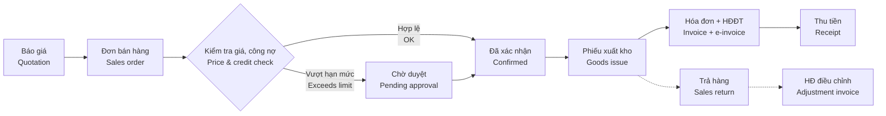

# 04 · Bán hàng / Sales (SAL)

[← Mục lục / Index](../README.md)

---

## 1. Mục tiêu / Objectives

- **VI:** Quản lý toàn bộ chu trình bán hàng từ báo giá đến giao hàng, xuất hóa đơn và xử lý trả hàng; kiểm soát giá, chiết khấu và công nợ; cung cấp thông tin tình trạng đơn hàng theo thời gian thực.
- **EN:** Manage the full sales cycle from quotation to delivery, invoicing and returns; control pricing, discounts and credit; provide real-time order status.

## 2. Phạm vi / Scope

| Trong phạm vi / In scope | Ngoài phạm vi / Out of scope |
|---|---|
| Báo giá, đơn bán hàng, giao hàng, hóa đơn, trả hàng, khuyến mãi (P3), hoa hồng (P4) / Quotations, sales orders, delivery, invoicing, returns, promotions (P3), commissions (P4) | Bán lẻ POS, website TMĐT, hợp đồng dịch vụ định kỳ phức tạp (subscription) / Retail POS, e-commerce storefront, complex subscription contracts |

## 3. Quy trình / Process flow

## 4. Yêu cầu chức năng / Functional requirements

| Giai đoạn / Phase | Nội dung (VI) | Scope (EN) |
|---|---|---|
| `P1` | Báo giá (tạo, gửi PDF / email, chuyển thành đơn); đơn bán hàng lấy giá từ bảng giá, chiết khấu dòng, giá gồm / chưa gồm thuế; giao hàng nhiều lần; hóa đơn (ghi số HĐĐT phát hành trên cổng nhà cung cấp); trả hàng; báo cáo bán hàng cơ bản. Duyệt đơn dùng cơ chế duyệt một cấp chung (`FR-SYS-016`). | Quotations (create, send PDF / email, convert to order); sales orders priced from price lists, line discounts, tax-inclusive / exclusive prices; partial deliveries; invoices (recording e-invoice numbers issued on the provider's portal); returns; basic sales reports. Order approval uses the common single-level approval (`FR-SYS-016`). |
| `P2` | Phiên bản & hết hạn báo giá; giữ hàng; kiểm tra hạn mức công nợ; duyệt đơn theo điều kiện; tiền đặt cọc; chiết khấu tổng đơn; phát hành HĐĐT từ ERP, hóa đơn điều chỉnh / thay thế; giảm giá sau bán. | Quotation revisions & expiry; stock reservation; credit limit check; conditional order approval; deposits; order-level discounts; issuing e-invoices from the ERP, adjustment / replacement invoices; post-sale price reductions. |
| `P3` | Chương trình khuyến mãi; báo giá cho lead từ CRM. | Promotion programs; quotations for CRM leads. |
| `P4` | Hoa hồng, chỉ tiêu doanh số; ảnh xác nhận giao hàng. | Commissions, sales targets; proof-of-delivery photos. |

### 4.1 Giai đoạn 1 — Cơ bản / Phase 1 — Basic

**Báo giá / Quotations**

#### FR-SAL-001 · Tạo báo giá / Create quotation
`Must` · `P1` (mở rộng / extended: `P3`)

- **VI:** Nhân viên kinh doanh tạo báo giá gồm: khách hàng, người liên hệ, ngày báo giá, ngày hết hiệu lực, tiền tệ, điều khoản thanh toán, điều kiện giao hàng, các dòng sản phẩm (số lượng, đơn vị tính, đơn giá, chiết khấu, thuế suất), ghi chú, điều khoản kèm theo.
- **EN:** Sales staff create quotations with: customer, contact, quotation date, expiry date, currency, payment terms, delivery terms, product lines (quantity, UoM, unit price, discount, tax rate), notes and terms & conditions.

#### FR-SAL-003 · Gửi báo giá / Send quotation
`Must` · `P1`

- **VI:** Xuất báo giá ra PDF theo mẫu in (`FR-SYS-021`; bản EN / song ngữ từ P2) và gửi email trực tiếp từ hệ thống; ghi nhận thời điểm gửi và chuyển trạng thái "Đã gửi".
- **EN:** Export the quotation to PDF using the print template (`FR-SYS-021`; EN / bilingual from P2) and email it from the system; record the send time and set status to "Sent".

#### FR-SAL-004 · Chuyển báo giá thành đơn hàng / Convert quotation to order
`Must` · `P1`

- **VI:** Chuyển báo giá thành đơn bán hàng bằng một thao tác, cho phép chọn toàn bộ hoặc một phần dòng; đơn hàng giữ liên kết với báo giá gốc.
- **EN:** Convert a quotation to a sales order in one action, selecting all or some lines; the order keeps a link to the source quotation.

**Đơn bán hàng / Sales orders**

#### FR-SAL-006 · Tạo đơn bán hàng / Create sales order
`Must` · `P1`

- **VI:** Tạo đơn từ báo giá hoặc trực tiếp gồm: khách hàng, địa chỉ giao hàng, ngày giao dự kiến, kho xuất, nhân viên bán hàng, điều khoản thanh toán, tiền tệ và tỷ giá, dòng hàng, phí vận chuyển, ghi chú nội bộ và ghi chú cho khách.
- **EN:** Create an order from a quotation or directly with: customer, shipping address, expected delivery date, source warehouse, salesperson, payment terms, currency and rate, lines, shipping fee, internal and customer notes.

#### FR-SAL-007 · Tự động lấy giá / Automatic pricing
`Must` · `P1` (mở rộng / extended: `P2`)

- **VI:** Đơn giá được lấy tự động theo thứ tự ưu tiên: bảng giá riêng của khách hàng → bảng giá của nhóm khách hàng → bảng giá chung, theo thời gian hiệu lực. Người dùng có quyền mới được sửa giá.
- **EN:** Unit price is filled automatically by priority: customer-specific price list → customer group price list → general price list, by validity period. Only authorized users can override prices.

#### FR-SAL-008 · Chiết khấu / Discounts
`Must` · `P1` (mở rộng / extended: `P2`)

- **VI:** Chiết khấu theo dòng (% hoặc số tiền).
- **EN:** Line discounts (% or amount).

#### FR-SAL-009 · Giá gồm thuế hoặc chưa gồm thuế / Tax-inclusive or exclusive prices
`Must` · `P1`

- **VI:** Bảng giá và đơn hàng hỗ trợ cả giá đã gồm thuế GTGT và chưa gồm thuế; hệ thống tính ngược tiền hàng và tiền thuế khi giá đã gồm thuế.
- **EN:** Price lists and orders support both VAT-inclusive and VAT-exclusive prices; the system back-calculates net and tax amounts for inclusive prices.

#### FR-SAL-010 · Kiểm tra tồn kho khả dụng / Stock availability check
`Must` · `P1` (mở rộng / extended: `P2`)

- **VI:** Khi nhập dòng hàng, hiển thị tồn thực tế theo kho; cảnh báo nếu không đủ hàng.
- **EN:** When entering a line, show on-hand stock per warehouse; warn if insufficient.

#### FR-SAL-014 · Giao hàng nhiều lần / Partial deliveries
`Must` · `P1`

- **VI:** Một đơn có thể giao nhiều lần; hệ thống theo dõi số lượng đã giao, còn lại và cho phép đóng phần còn lại (không giao tiếp).
- **EN:** An order can be delivered in several shipments; the system tracks delivered and remaining quantities and allows closing the remaining balance.

#### FR-SAL-016 · Sửa và hủy đơn / Amend and cancel orders
`Must` · `P1`

- **VI:** Sửa đơn đã xác nhận cần quyền riêng và có thể phải duyệt lại (`BR-SYS-005`). Chỉ hủy được đơn hoặc phần chưa giao; bắt buộc nhập lý do hủy.
- **EN:** Editing a confirmed order requires a specific permission and may trigger re-approval (`BR-SYS-005`). Only orders or undelivered portions can be cancelled; a cancellation reason is mandatory.

#### FR-SAL-017 · Theo dõi tình trạng đơn / Order tracking
`Must` · `P1`

- **VI:** Trên mỗi đơn hiển thị tình trạng giao hàng, xuất hóa đơn, thanh toán và các chứng từ liên quan (phiếu xuất, hóa đơn, phiếu thu, trả hàng).
- **EN:** Each order shows delivery, invoicing and payment status plus related documents (goods issues, invoices, receipts, returns).

#### FR-SAL-018 · Bán dịch vụ / Selling services
`Must` · `P1` (mở rộng / extended: `P2`)

- **VI:** Dòng hàng là dịch vụ không qua kho và được xuất hóa đơn trực tiếp.
- **EN:** Service lines bypass the warehouse and are invoiced directly.

**Giao hàng / Delivery**

#### FR-SAL-019 · Yêu cầu xuất kho / Delivery request
`Must` · `P1`

- **VI:** Đơn đã xác nhận tự động tạo phiếu xuất kho ở trạng thái chờ để kho xử lý (xem `FR-INV-003`).
- **EN:** Confirmed orders automatically create pending goods issues for the warehouse to process (see `FR-INV-003`).

#### FR-SAL-020 · Phiếu giao hàng & xác nhận giao / Delivery note & proof of delivery
`Must` · `P1`

- **VI:** In phiếu giao hàng / biên bản bàn giao có chữ ký khách hàng; cập nhật trạng thái "Đã giao". Đính kèm ảnh xác nhận giao hàng từ điện thoại là `Could`, `P4`.
- **EN:** Print delivery notes / handover minutes for customer signature; update status to "Delivered". Attaching proof-of-delivery photos from a phone is `Could`, `P4`.

**Hóa đơn / Invoicing**

#### FR-SAL-021 · Tạo hóa đơn bán hàng / Create customer invoice
`Must` · `P1` (mở rộng / extended: `P2`)

- **VI:** Tạo hóa đơn từ đơn hàng hoặc phiếu xuất; gộp nhiều phiếu xuất của cùng khách hàng vào một hóa đơn; xuất hóa đơn một phần. Hóa đơn điện tử được phát hành trên cổng của nhà cung cấp HĐĐT; người dùng ghi nhận ký hiệu và số hóa đơn điện tử vào hóa đơn trên ERP.
- **EN:** Create invoices from orders or goods issues; combine several goods issues of the same customer into one invoice; invoice partially. E-invoices are issued on the e-invoice provider's portal; users record the e-invoice series and number on the ERP invoice.

#### FR-SAL-022 · Chính sách xuất hóa đơn / Invoicing policy
`Must` · `P1` (mở rộng / extended: `P2`)

- **VI:** Một chính sách chung cho doanh nghiệp (tham số hệ thống `FR-SYS-020`): xuất hóa đơn theo số lượng đặt hoặc theo số lượng đã giao.
- **EN:** One company-wide policy (system parameter `FR-SYS-020`): invoice on ordered quantity or on delivered quantity.

**Trả hàng & điều chỉnh / Returns & adjustments**

#### FR-SAL-024 · Trả hàng bán / Sales return
`Must` · `P1`

- **VI:** Tạo phiếu trả hàng từ hóa đơn hoặc phiếu xuất gốc; số lượng trả không vượt số lượng đã giao; chọn kho nhận lại (có thể là kho hàng lỗi); bắt buộc nhập lý do trả.
- **EN:** Create a return from the original invoice or goods issue; return quantity cannot exceed delivered quantity; choose the receiving warehouse (possibly a defective-goods warehouse); a return reason is mandatory.

**Báo cáo / Reports**

#### FR-SAL-030 · Báo cáo bán hàng / Sales reports
`Must` · `P1` (mở rộng / extended: `P2`)

- **VI:** Doanh số theo khách hàng, sản phẩm, nhân viên, chi nhánh, thời gian; đơn chưa giao; hàng đã giao chưa xuất hóa đơn; lãi gộp theo đơn / sản phẩm (chỉ người được cấp quyền xem báo cáo này).
- **EN:** Revenue by customer, product, salesperson, branch and period; open (undelivered) orders; delivered-not-invoiced; gross margin by order / product (only for users granted access to this report).

### 4.2 Giai đoạn 2 — Hoàn thiện / Phase 2 — Completion

**Báo giá / Quotations**

#### FR-SAL-002 · Phiên bản báo giá / Quotation revisions
`Should` · `P2`

- **VI:** Sửa báo giá đã gửi khách sẽ tạo phiên bản mới (ví dụ `QT-0001-R2`); các phiên bản cũ được giữ lại để tra cứu.
- **EN:** Editing a quotation already sent creates a new revision (e.g. `QT-0001-R2`); previous revisions are kept for reference.

#### FR-SAL-005 · Hết hạn báo giá / Quotation expiry
`Should` · `P2`

- **VI:** Báo giá quá ngày hiệu lực tự động chuyển trạng thái "Hết hạn"; nhân viên được nhắc trước N ngày.
- **EN:** Quotations past their expiry date move to "Expired" automatically; salespeople are reminded N days before.

**Đơn bán hàng / Sales orders**

#### FR-SAL-011 · Giữ hàng / Stock reservation
`Should` · `P2`

- **VI:** Đơn đã xác nhận tự động giữ hàng trong kho xuất; giữ hàng được giải phóng khi đơn bị hủy, đóng hoặc sau khi xuất kho.
- **EN:** Confirmed orders automatically reserve stock in the source warehouse; reservations are released when the order is cancelled, closed or delivered.

#### FR-SAL-012 · Kiểm tra hạn mức công nợ / Credit limit check
`Must` · `P2`

- **VI:** Khi xác nhận đơn, hệ thống tính: công nợ hiện tại + giá trị đơn đã xác nhận chưa xuất hóa đơn + giá trị đơn này. Nếu vượt hạn mức, hoặc khách hàng có nợ quá hạn quá N ngày, hệ thống chặn hoặc chuyển đơn sang "Chờ duyệt" (cấu hình theo nhóm khách hàng).
- **EN:** On confirmation the system computes: current receivable + confirmed but uninvoiced orders + this order. If this exceeds the credit limit, or the customer has debt overdue by more than N days, the order is blocked or sent to "Pending approval" (configurable per customer group).

**Tiêu chí chấp nhận / Acceptance criteria**

- **AC-1 — VI:** Khách hàng có hạn mức 100.000.000 ₫, công nợ hiện tại 80.000.000 ₫. Xác nhận đơn 30.000.000 ₫ → đơn chuyển "Chờ duyệt" với lý do "Vượt hạn mức công nợ".
  **EN:** Customer credit limit ₫100,000,000, current receivable ₫80,000,000. Confirming a ₫30,000,000 order → order goes to "Pending approval" with reason "Credit limit exceeded".
- **AC-2 — VI:** Cùng khách hàng, đơn 15.000.000 ₫ và không có nợ quá hạn → đơn được xác nhận ngay.
  **EN:** Same customer, ₫15,000,000 order and no overdue debt → order is confirmed immediately.

#### FR-SAL-013 · Duyệt đơn hàng / Order approval
`Must` · `P2`

- **VI:** Đơn hàng đi qua luồng duyệt (`FR-SYS-015`) khi: chiết khấu vượt hạn mức của người lập, giá bán thấp hơn giá tối thiểu, vượt hạn mức công nợ, hoặc giá trị đơn vượt ngưỡng cấu hình.
- **EN:** Orders go through the approval flow (`FR-SYS-015`) when: the discount exceeds the creator's limit, price is below the minimum price, the credit limit is exceeded, or order value exceeds a configured threshold.

#### FR-SAL-015 · Tiền đặt cọc / Customer deposits
`Should` · `P2`

- **VI:** Ghi nhận tiền đặt cọc / trả trước gắn với đơn hàng; tự động cấn trừ khi xuất hóa đơn.
- **EN:** Record deposits / prepayments linked to an order; automatically offset them when invoicing.

**Hóa đơn / Invoicing**

#### FR-SAL-023 · Phát hành hóa đơn điện tử / Issue e-invoice
`Must` · `P2`

- **VI:** Từ hóa đơn bán hàng, phát hành hóa đơn điện tử qua nhà cung cấp HĐĐT (`FR-INT-001`); nhận về ký hiệu, số hóa đơn, mã của cơ quan thuế (nếu có) và trạng thái; tự động gửi email hóa đơn cho khách hàng.
- **EN:** Issue an e-invoice from the customer invoice via the e-invoice provider (`FR-INT-001`); receive the series, invoice number, tax authority code (if any) and status; email the invoice to the customer automatically.

**Trả hàng & điều chỉnh / Returns & adjustments**

#### FR-SAL-025 · Hóa đơn điều chỉnh / thay thế / Adjustment or replacement invoice
`Must` · `P2`

- **VI:** Lập hóa đơn điều chỉnh (tăng/giảm) hoặc hóa đơn thay thế theo quy định về hóa đơn điện tử, liên kết với hóa đơn gốc; cập nhật công nợ và doanh thu tương ứng.
- **EN:** Issue adjustment (increase/decrease) or replacement invoices per e-invoice regulations, linked to the original invoice; update receivables and revenue accordingly.

#### FR-SAL-026 · Giảm giá sau bán / Post-sale price reduction
`Should` · `P2`

- **VI:** Ghi nhận giảm giá hàng bán hoặc chiết khấu thương mại theo doanh số sau khi đã xuất hóa đơn, không làm thay đổi tồn kho.
- **EN:** Record price reductions or volume rebates after invoicing without affecting stock.

**Mở rộng yêu cầu của giai đoạn trước / Extensions to earlier-phase requirements**

| Mã / ID | Mở rộng (VI) | Extension (EN) |
|---|---|---|
| FR-SAL-007 | Giá theo bậc số lượng, theo tiền tệ và chi nhánh (`FR-MDM-025`). | Quantity-tier, currency and branch pricing (`FR-MDM-025`). |
| FR-SAL-008 | Chiết khấu tổng đơn, được phân bổ xuống từng dòng để tính thuế và doanh thu chính xác. | Order-level discounts, allocated to lines so tax and revenue are computed correctly. |
| FR-SAL-010 | Hiển thị tồn khả dụng (tồn thực tế − đã giữ) và số lượng đang về. | Show available stock (on hand − reserved) and incoming quantity. |
| FR-SAL-018 | Xuất hóa đơn dịch vụ theo tiến độ hoàn thành. | Invoice services by completion milestones. |
| FR-SAL-021 | Phát hành hóa đơn điện tử trực tiếp từ ERP (`FR-SAL-023`). | Issue e-invoices directly from the ERP (`FR-SAL-023`). |
| FR-SAL-022 | Cấu hình chính sách theo sản phẩm hoặc khách hàng. | Configure the policy per product or customer. |
| FR-SAL-030 | So sánh với kỳ trước; ẩn giá vốn, lãi gộp bằng quyền theo trường (`FR-SYS-013`). | Comparison with prior periods; hide cost and gross margin through field-level permissions (`FR-SYS-013`). |

### 4.3 Giai đoạn 3 — Mở rộng / Phase 3 — Expansion

**Khuyến mãi & hoa hồng / Promotions & commissions**

#### FR-SAL-027 · Chương trình khuyến mãi / Promotion programs
`Should` · `P3`

- **VI:** Cấu hình khuyến mãi: giảm %, giảm tiền, mua X tặng Y, theo thời gian, nhóm khách hàng, sản phẩm, giá trị đơn tối thiểu. Hàng tặng được xuất kho và thể hiện trên hóa đơn theo quy định về hàng khuyến mãi.
- **EN:** Configure promotions: % off, amount off, buy X get Y, by period, customer group, product, minimum order value. Free goods are issued from stock and shown on invoices according to promotional-goods rules.

**Mở rộng yêu cầu của giai đoạn trước / Extensions to earlier-phase requirements**

| Mã / ID | Mở rộng (VI) | Extension (EN) |
|---|---|---|
| FR-SAL-001 | Báo giá cho khách hàng tiềm năng (lead) từ CRM. | Quotations for leads from CRM. |

### 4.4 Giai đoạn 4 — Nâng cao / Phase 4 — Advanced

**Khuyến mãi & hoa hồng / Promotions & commissions**

#### FR-SAL-028 · Hoa hồng bán hàng / Sales commissions
`Could` · `P4`

- **VI:** Tính hoa hồng cho nhân viên bán hàng theo doanh số, lãi gộp hoặc doanh số đã thu tiền; chuyển dữ liệu sang tính lương.
- **EN:** Compute salesperson commissions based on revenue, gross margin or collected revenue; feed results into payroll.

#### FR-SAL-029 · Chỉ tiêu doanh số / Sales targets
`Could` · `P4`

- **VI:** Đặt chỉ tiêu doanh số theo nhân viên, nhóm, chi nhánh, tháng; theo dõi tỷ lệ hoàn thành.
- **EN:** Set revenue targets per salesperson, team, branch and month; track achievement.

## 5. Trạng thái chứng từ / Document statuses

| Chứng từ / Document | Trạng thái / Statuses |
|---|---|
| Báo giá / Quotation | Nháp / Draft → Đã gửi / Sent → Đã chấp nhận / Accepted · Từ chối / Rejected · Hết hạn / Expired · Đã hủy / Cancelled |
| Đơn bán hàng / Sales order | Nháp / Draft → Chờ duyệt / Pending approval → Đã xác nhận / Confirmed → Giao một phần / Partially delivered → Đã giao / Delivered → Hoàn tất / Done · Tạm giữ / On hold · Đã hủy / Cancelled |
| Hóa đơn bán / Customer invoice | Nháp / Draft → Đã ghi sổ / Posted → Thu một phần / Partially paid → Đã thu đủ / Paid · Đã hủy / Cancelled |
| Trả hàng / Sales return | Nháp / Draft → Chờ duyệt / Pending approval → Đã nhận hàng / Received → Đã điều chỉnh / Credited |

## 6. Quy tắc nghiệp vụ / Business rules

| Mã / ID | Quy tắc (VI) | Rule (EN) |
|---|---|---|
| BR-SAL-001 | Không hủy đơn đã có phiếu xuất kho đã ghi sổ; phải lập phiếu trả hàng. | Orders with posted goods issues cannot be cancelled; a return must be created instead. |
| BR-SAL-002 | Số lượng xuất hóa đơn không vượt số lượng đã giao (chính sách theo giao hàng) hoặc số lượng đặt (chính sách theo đơn). | Invoiced quantity cannot exceed delivered quantity (delivery policy) or ordered quantity (order policy). |
| BR-SAL-003 | Giá bán dưới giá tối thiểu hoặc chiết khấu vượt hạn mức của người lập bắt buộc phải được duyệt. | Prices below the minimum or discounts above the creator's limit require approval. |
| BR-SAL-004 | Thời điểm lập hóa đơn tuân theo quy định về hóa đơn điện tử; hệ thống cảnh báo phiếu xuất đã giao nhưng chưa lập hóa đơn quá N ngày. | Invoice timing follows e-invoice regulations; the system warns about delivered goods not invoiced after N days. |
| BR-SAL-005 | Doanh thu bằng ngoại tệ được quy đổi sang VND theo tỷ giá giao dịch thực tế tại thời điểm ghi nhận doanh thu. | Foreign-currency revenue is converted to VND at the actual transaction rate on the recognition date. |
| BR-SAL-006 | Thành tiền VND làm tròn đến đơn vị đồng; phương pháp làm tròn tiền thuế (theo dòng hoặc theo tổng) cấu hình được và phải khớp với nhà cung cấp HĐĐT. | VND amounts are rounded to whole đồng; tax rounding (per line or per total) is configurable and must match the e-invoice provider. |

## 7. Câu hỏi mở / Open questions

| # | Câu hỏi (VI) | Question (EN) |
|---|---|---|
| Q-SAL-01 | Khi vượt hạn mức công nợ: chặn hẳn hay chuyển duyệt? | When the credit limit is exceeded: block or route for approval? |
| Q-SAL-02 | Có bán hàng ký gửi (hàng gửi đại lý) không? | Is consignment selling (goods held at dealers) needed? |
| Q-SAL-03 | Các loại khuyến mãi đang áp dụng thực tế? | Which promotion types are actually used today? |
