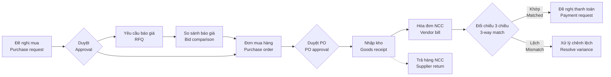

# 05 · Mua hàng / Purchasing (PUR)

[← Mục lục / Index](../README.md)

---

## 1. Mục tiêu / Objectives

- **VI:** Chuẩn hóa quy trình mua hàng từ đề nghị mua đến nhận hàng, ghi nhận hóa đơn và thanh toán; kiểm soát ngân sách, phê duyệt và đối chiếu 3 chiều để tránh mua sai, trả tiền sai.
- **EN:** Standardize purchasing from request to receipt, vendor billing and payment; enforce budget control, approvals and 3-way matching to prevent wrong purchases and wrong payments.

## 2. Phạm vi / Scope

| Trong phạm vi / In scope | Ngoài phạm vi / Out of scope |
|---|---|
| Đề nghị mua, yêu cầu báo giá, đơn mua (trong nước & nhập khẩu), nhận hàng, hóa đơn NCC, đối chiếu 3 chiều, chi phí mua hàng, trả hàng NCC / Purchase requests, RFQs, POs (domestic & import), receiving, vendor bills, 3-way match, landed cost, supplier returns | Đấu thầu điện tử, cổng thông tin nhà cung cấp (P4) / E-tendering, supplier portal (P4) |

## 3. Quy trình / Process flow

## 4. Yêu cầu chức năng / Functional requirements

| Giai đoạn / Phase | Nội dung (VI) | Scope (EN) |
|---|---|---|
| `P1` | Đơn mua lập trực tiếp, gửi PDF / email, theo dõi; nhận hàng theo đơn mua; ghi nhận hóa đơn nhà cung cấp, chống trùng hóa đơn; trả hàng nhà cung cấp; báo cáo mua hàng cơ bản. Duyệt đơn mua dùng cơ chế duyệt một cấp chung (`FR-SYS-016`). | Direct purchase orders, sent as PDF / email and tracked; receiving against POs; vendor bills with duplicate prevention; supplier returns; basic purchasing reports. PO approval uses the common single-level approval (`FR-SYS-016`). |
| `P2` | Đề nghị mua (tạo, tự động, duyệt, gộp); gợi ý giá mua; duyệt đơn mua theo ngưỡng; ứng trước nhà cung cấp; dung sai nhận hàng; nhập XML hóa đơn đầu vào; đối chiếu 3 chiều; hàng về chưa có hóa đơn / hàng mua đang đi đường; chi phí mua hàng, hàng nhập khẩu. | Purchase requests (create, automatic, approval, consolidation); purchase price suggestions; threshold-based PO approval; supplier prepayments; receiving tolerance; inbound e-invoice XML import; 3-way match; goods received not invoiced / goods in transit; landed cost, imports. |
| `P3` | Yêu cầu báo giá & so sánh báo giá. | RFQs & bid comparison. |
| `P4` | Hợp đồng khung; kiểm tra chất lượng khi nhận; đánh giá nhà cung cấp. | Blanket agreements; incoming quality check; supplier evaluation. |

### 4.1 Giai đoạn 1 — Cơ bản / Phase 1 — Basic

**Đơn mua hàng / Purchase orders**

#### FR-PUR-007 · Tạo đơn mua hàng / Create purchase order
`Must` · `P1` (mở rộng / extended: `P2`, `P3`)

- **VI:** Tạo đơn mua gồm: nhà cung cấp, tiền tệ và tỷ giá, điều khoản thanh toán, ngày giao dự kiến, kho nhận, dòng hàng (số lượng, đơn vị tính, đơn giá, chiết khấu, thuế suất), chi phí khác.
- **EN:** Create a PO with: supplier, currency and rate, payment terms, expected date, receiving warehouse, lines (quantity, UoM, unit price, discount, tax rate), other charges.

#### FR-PUR-010 · Gửi đơn mua / Send PO
`Must` · `P1`

- **VI:** Xuất đơn mua ra PDF theo mẫu in (`FR-SYS-021`; bản EN từ P2) và gửi email cho nhà cung cấp; ghi nhận ngày nhà cung cấp xác nhận.
- **EN:** Export the PO to PDF using the print template (`FR-SYS-021`; EN from P2) and email it to the supplier; record the supplier's confirmation date.

#### FR-PUR-011 · Theo dõi đơn mua / PO tracking
`Must` · `P1`

- **VI:** Theo dõi số lượng đã nhận, đã nhận hóa đơn, đã thanh toán theo từng dòng; cảnh báo đơn trễ hạn giao.
- **EN:** Track received, billed and paid quantities per line; alert on late deliveries.

**Nhận hàng / Receiving**

#### FR-PUR-014 · Nhận hàng theo đơn mua / Receive against PO
`Must` · `P1` (mở rộng / extended: `P2`)

- **VI:** Đơn mua đã duyệt tự động tạo phiếu nhập kho chờ xử lý; thủ kho nhận đủ hoặc một phần (`FR-INV-002`).
- **EN:** Approved POs create pending goods receipts; the warehouse receives fully or partially (`FR-INV-002`).

**Hóa đơn nhà cung cấp & đối chiếu / Vendor bills & matching**

#### FR-PUR-017 · Ghi nhận hóa đơn nhà cung cấp / Record vendor bill
`Must` · `P1`

- **VI:** Nhập hóa đơn mua gồm: ký hiệu, số hóa đơn, ngày hóa đơn, mã số thuế người bán, tiền hàng, tiền thuế theo từng thuế suất, tổng tiền; liên kết với đơn mua và phiếu nhập.
- **EN:** Record vendor bills with: invoice series, number, date, seller tax ID, net amount, tax per rate, total; link to the PO and goods receipt.

#### FR-PUR-020 · Chống trùng hóa đơn / Duplicate bill prevention
`Must` · `P1`

- **VI:** Chặn ghi nhận hóa đơn trùng (cùng mã số thuế người bán + ký hiệu + số hóa đơn).
- **EN:** Block duplicate bills (same seller tax ID + series + invoice number).

**Trả hàng nhà cung cấp / Supplier returns**

#### FR-PUR-024 · Trả hàng nhà cung cấp / Return to supplier
`Must` · `P1`

- **VI:** Lập phiếu trả hàng từ phiếu nhập gốc; xuất kho; ghi giảm công nợ phải trả; xử lý hóa đơn liên quan theo quy định hiện hành về hóa đơn.
- **EN:** Create returns from the original goods receipt; issue the goods from stock; reduce the payable; handle related invoices according to current invoicing rules.

**Báo cáo / Reports**

#### FR-PUR-026 · Báo cáo mua hàng / Purchasing reports
`Must` · `P1` (mở rộng / extended: `P2`)

- **VI:** Giá trị mua theo nhà cung cấp, sản phẩm, thời gian; đơn mua chưa nhận đủ; hàng đã nhận chưa có hóa đơn; lịch sử giá mua.
- **EN:** Purchase value by supplier, product and period; open POs; received-not-billed; purchase price history.

### 4.2 Giai đoạn 2 — Hoàn thiện / Phase 2 — Completion

**Đề nghị mua hàng / Purchase requests**

#### FR-PUR-001 · Tạo đề nghị mua hàng / Create purchase request
`Must` · `P2`

- **VI:** Nhân viên có quyền tạo đề nghị mua gồm: sản phẩm (hoặc mô tả tự do cho hàng chưa có mã), số lượng, ngày cần hàng, mục đích sử dụng, phòng ban, khoản mục chi phí, nhà cung cấp gợi ý, đính kèm.
- **EN:** Authorized employees create purchase requests with: product (or free-text description for uncoded items), quantity, required date, purpose, department, expense category, suggested supplier, attachments.

#### FR-PUR-002 · Đề nghị mua tự động / Automatic purchase requests
`Should` · `P2`

- **VI:** Hệ thống tự động đề xuất đề nghị mua khi tồn kho dự kiến xuống dưới điểm đặt hàng lại (`FR-INV-017`).
- **EN:** The system proposes purchase requests automatically when projected stock falls below the reorder point (`FR-INV-017`).

#### FR-PUR-003 · Duyệt đề nghị mua / Purchase request approval
`Must` · `P2`

- **VI:** Đề nghị mua đi qua luồng duyệt theo phòng ban và giá trị ước tính; người duyệt có thể điều chỉnh số lượng.
- **EN:** Purchase requests follow approval flows by department and estimated value; approvers may adjust quantities.

#### FR-PUR-004 · Gộp đề nghị mua / Consolidate requests
`Should` · `P2`

- **VI:** Nhân viên mua hàng gộp nhiều đề nghị đã duyệt thành một yêu cầu báo giá hoặc đơn mua theo nhà cung cấp; giữ liên kết để truy vết.
- **EN:** Buyers consolidate several approved requests into one RFQ or PO per supplier, keeping links for traceability.

**Đơn mua hàng / Purchase orders**

#### FR-PUR-008 · Gợi ý giá mua / Purchase price suggestion
`Should` · `P2`

- **VI:** Đơn giá được gợi ý từ bảng giá nhà cung cấp (`FR-MDM-027`) hoặc giá lần mua gần nhất; cảnh báo khi giá cao hơn lần mua trước quá X%.
- **EN:** Unit price is suggested from the supplier price list (`FR-MDM-027`) or the last purchase price; warn when it exceeds the last price by more than X%.

#### FR-PUR-009 · Duyệt đơn mua theo ngưỡng / PO approval by threshold
`Must` · `P2`

- **VI:** Đơn mua được duyệt theo ngưỡng giá trị và nhóm hàng; đơn chưa duyệt không được gửi nhà cung cấp và không được nhận hàng.
- **EN:** POs are approved by value thresholds and product category; unapproved POs cannot be sent to suppliers or received.

#### FR-PUR-013 · Ứng trước cho nhà cung cấp / Supplier prepayments
`Must` · `P2`

- **VI:** Ghi nhận khoản trả trước theo đơn mua; tự động cấn trừ khi thanh toán hóa đơn.
- **EN:** Record prepayments against a PO; offset them automatically when paying the bill.

**Nhận hàng / Receiving**

#### FR-PUR-015 · Dung sai nhận hàng / Receiving tolerance
`Should` · `P2`

- **VI:** Cho phép nhận vượt số lượng đặt trong dung sai X% (cấu hình theo nhóm hàng); vượt dung sai phải được duyệt.
- **EN:** Allow over-receipt within X% tolerance (configurable per category); exceeding it requires approval.

**Hóa đơn nhà cung cấp & đối chiếu / Vendor bills & matching**

#### FR-PUR-018 · Nhập hóa đơn điện tử đầu vào từ XML / Import inbound e-invoice XML
`Should` · `P2`

- **VI:** Đọc file XML hóa đơn điện tử của nhà cung cấp để tự điền thông tin hóa đơn và dòng hàng; gợi ý ghép với đơn mua / phiếu nhập; kiểm tra trạng thái hóa đơn với cơ quan thuế qua tích hợp (`FR-INT-002`).
- **EN:** Parse the supplier's e-invoice XML to pre-fill bill header and lines; suggest matching POs / receipts; check invoice status with the tax authority via integration (`FR-INT-002`).

#### FR-PUR-019 · Đối chiếu 3 chiều / 3-way match
`Must` · `P2`

- **VI:** Đối chiếu đơn mua – phiếu nhập – hóa đơn theo số lượng và đơn giá. Chênh lệch vượt dung sai sẽ chặn ghi sổ hóa đơn hoặc yêu cầu duyệt (cấu hình).
- **EN:** Match PO – goods receipt – bill on quantity and unit price. Variances beyond tolerance block bill posting or require approval (configurable).

**Tiêu chí chấp nhận / Acceptance criteria**

- **AC-1 — VI:** Đơn mua 100 cái × 50.000 ₫, đã nhận 100 cái, hóa đơn 100 cái × 50.500 ₫ (lệch 1%, dung sai giá 2%) → hóa đơn được ghi sổ; chênh lệch giá được phân bổ vào giá trị kho hoặc giá vốn tùy tình trạng tồn.
  **EN:** PO 100 pcs × ₫50,000, 100 pcs received, bill 100 pcs × ₫50,500 (1% variance, 2% tolerance) → bill is posted; the price variance goes to inventory value or COGS depending on remaining stock.
- **AC-2 — VI:** Cùng đơn, hóa đơn 110 cái nhưng mới nhận 100 cái → hóa đơn bị chặn với thông báo "Số lượng hóa đơn vượt số lượng đã nhận".
  **EN:** Same PO, bill for 110 pcs but only 100 received → bill is blocked with "Billed quantity exceeds received quantity".

#### FR-PUR-021 · Hàng về chưa có hóa đơn và hàng mua đang đi đường / Goods received not invoiced & goods in transit
`Must` · `P2`

- **VI:** Hỗ trợ hàng về trước hóa đơn (nhập kho theo giá tạm tính, điều chỉnh khi có hóa đơn) và hóa đơn về trước hàng (ghi nhận hàng mua đang đi đường).
- **EN:** Support goods received before the bill (receipt at provisional price, adjusted when the bill arrives) and bills received before the goods (goods in transit).

**Chi phí mua hàng & nhập khẩu / Landed cost & imports**

#### FR-PUR-022 · Phân bổ chi phí mua hàng / Landed cost allocation
`Should` · `P2`

- **VI:** Ghi nhận chi phí vận chuyển, bảo hiểm, thuế nhập khẩu, phí hải quan… và phân bổ vào giá trị hàng nhập theo giá trị, số lượng, trọng lượng hoặc thể tích.
- **EN:** Record freight, insurance, import duty, customs fees… and allocate them to received goods by value, quantity, weight or volume.

#### FR-PUR-023 · Mua hàng nhập khẩu / Import purchases
`Should` · `P2`

- **VI:** Đơn mua bằng ngoại tệ; ghi nhận thông tin tờ khai hải quan (số, ngày), thuế nhập khẩu, thuế GTGT hàng nhập khẩu; xử lý chênh lệch tỷ giá khi thanh toán.
- **EN:** Foreign-currency POs; record customs declaration info (number, date), import duty and import VAT; handle exchange differences on payment.

**Mở rộng yêu cầu của giai đoạn trước / Extensions to earlier-phase requirements**

| Mã / ID | Mở rộng (VI) | Extension (EN) |
|---|---|---|
| FR-PUR-007 | Tạo đơn mua từ đề nghị mua đã duyệt. | Create POs from approved purchase requests. |
| FR-PUR-014 | Ghi nhận lô / serial / hạn dùng khi nhận hàng. | Record lot / serial / expiry on receipt. |
| FR-PUR-026 | Hiệu suất giao hàng của nhà cung cấp. | Supplier delivery performance. |

### 4.3 Giai đoạn 3 — Mở rộng / Phase 3 — Expansion

**Yêu cầu báo giá / Requests for quotation**

#### FR-PUR-005 · Gửi yêu cầu báo giá / Send RFQs
`Should` · `P3`

- **VI:** Tạo yêu cầu báo giá và gửi email cho nhiều nhà cung cấp cùng lúc kèm file PDF.
- **EN:** Create an RFQ and email it to several suppliers at once with a PDF.

#### FR-PUR-006 · So sánh báo giá / Bid comparison
`Should` · `P3`

- **VI:** Nhập báo giá của từng nhà cung cấp; bảng so sánh đơn giá, tổng tiền, thời gian giao, điều khoản thanh toán; chọn nhà cung cấp kèm lý do lựa chọn và tạo đơn mua.
- **EN:** Enter each supplier's quote; compare unit price, total, lead time and payment terms side by side; select a supplier with a justification and create the PO.

**Mở rộng yêu cầu của giai đoạn trước / Extensions to earlier-phase requirements**

| Mã / ID | Mở rộng (VI) | Extension (EN) |
|---|---|---|
| FR-PUR-007 | Tạo đơn mua từ yêu cầu báo giá đã chọn nhà cung cấp. | Create POs from RFQs with a selected supplier. |

### 4.4 Giai đoạn 4 — Nâng cao / Phase 4 — Advanced

**Đơn mua hàng / Purchase orders**

#### FR-PUR-012 · Hợp đồng khung / Blanket agreements
`Could` · `P4`

- **VI:** Hợp đồng nguyên tắc với nhà cung cấp (giá, số lượng cam kết, thời hạn); các đơn mua trích từ hợp đồng và theo dõi lượng đã thực hiện.
- **EN:** Framework agreements with suppliers (price, committed quantity, term); POs are released against the agreement and consumption is tracked.

**Nhận hàng / Receiving**

#### FR-PUR-016 · Kiểm tra chất lượng khi nhận / Incoming quality check
`Could` · `P4`

- **VI:** Ghi nhận kết quả kiểm tra (đạt / không đạt) khi nhận; hàng không đạt chuyển sang kho chờ xử lý hoặc trả lại nhà cung cấp.
- **EN:** Record inspection results (pass / fail) on receipt; failed goods move to a quarantine warehouse or are returned to the supplier.

**Quản lý nhà cung cấp / Supplier management**

#### FR-PUR-025 · Đánh giá nhà cung cấp / Supplier evaluation
`Could` · `P4`

- **VI:** Tính điểm nhà cung cấp theo tỷ lệ giao đúng hạn, tỷ lệ hàng lỗi, biến động giá; hiển thị trên hồ sơ nhà cung cấp.
- **EN:** Score suppliers on on-time delivery rate, defect rate and price variance; show the score on the supplier record.

## 5. Trạng thái chứng từ / Document statuses

| Chứng từ / Document | Trạng thái / Statuses |
|---|---|
| Đề nghị mua / Purchase request | Nháp / Draft → Chờ duyệt / Pending approval → Đã duyệt / Approved → Đang xử lý / In progress → Hoàn tất / Done · Từ chối / Rejected · Đã hủy / Cancelled |
| Đơn mua / Purchase order | Nháp / Draft → Chờ duyệt / Pending approval → Đã duyệt / Approved → Đã gửi NCC / Sent → Nhận một phần / Partially received → Đã nhận đủ / Received → Hoàn tất / Done · Đã đóng / Closed · Đã hủy / Cancelled |
| Hóa đơn NCC / Vendor bill | Nháp / Draft → Chờ đối chiếu / Pending match → Đã ghi sổ / Posted → Trả một phần / Partially paid → Đã thanh toán / Paid · Đã hủy / Cancelled |

## 6. Quy tắc nghiệp vụ / Business rules

| Mã / ID | Quy tắc (VI) | Rule (EN) |
|---|---|---|
| BR-PUR-001 | Đơn mua vượt ngưỡng giá trị cấu hình phải được duyệt trước khi gửi nhà cung cấp. | POs above the configured threshold must be approved before being sent. |
| BR-PUR-002 | Không nhận hàng khi không có đơn mua, trừ khi người dùng có quyền "nhận hàng không đơn". | Goods cannot be received without a PO unless the user has the "receive without PO" permission. |
| BR-PUR-003 | Dung sai mặc định: số lượng 0%, đơn giá ±2% (cấu hình được). | Default tolerances: quantity 0%, unit price ±2% (configurable). |
| BR-PUR-004 | Hóa đơn trùng (mã số thuế người bán + ký hiệu + số) bị chặn. | Duplicate bills (seller tax ID + series + number) are blocked. |
| BR-PUR-005 | Người tạo đơn mua không được tự duyệt đơn đó (`BR-ROL-001`). | The PO creator cannot approve it (`BR-ROL-001`). |
| BR-PUR-006 | Cảnh báo khi nhà cung cấp có mã số thuế ở trạng thái ngừng hoạt động hoặc rủi ro (nếu tra cứu được). | Warn when the supplier's tax ID is inactive or flagged as risky (when lookup is available). |

## 7. Câu hỏi mở / Open questions

| # | Câu hỏi (VI) | Question (EN) |
|---|---|---|
| Q-PUR-01 | Tỷ trọng hàng nhập khẩu và các loại chi phí nhập khẩu thường gặp? | Share of imported goods and typical import costs? |
| Q-PUR-02 | Có bắt buộc yêu cầu báo giá từ tối thiểu N nhà cung cấp cho đơn trên ngưỡng nào đó? | Is a minimum number of quotes required above a certain value? |
| Q-PUR-03 | Mua dịch vụ / chi phí (không qua kho) có đi qua đơn mua không? | Do service / expense purchases (non-stock) go through POs? |
