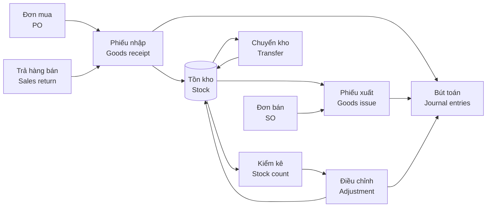

# 06 · Kho / Inventory (INV)

[← Mục lục / Index](../README.md)

---

## 1. Mục tiêu / Objectives

- **VI:** Quản lý tồn kho chính xác theo thời gian thực trên nhiều kho, theo lô / serial / hạn dùng; chuẩn hóa nghiệp vụ nhập – xuất – chuyển – kiểm kê; tính giá xuất kho và hạch toán tự động sang kế toán.
- **EN:** Maintain accurate real-time stock across warehouses by lot / serial / expiry; standardize receipts, issues, transfers and stock counts; value inventory and post to accounting automatically.

## 2. Phạm vi / Scope

| Trong phạm vi / In scope | Ngoài phạm vi / Out of scope |
|---|---|
| Đa kho, vị trí, nhập/xuất/chuyển kho, lô/serial/hạn dùng, kiểm kê, bổ sung tồn kho, tính giá xuất kho, báo cáo kho / Multi-warehouse, locations, receipts/issues/transfers, lot/serial/expiry, stock count, replenishment, costing, inventory reports | Xuất nguyên vật liệu cho sản xuất, nhập thành phẩm, WMS nâng cao / Material issue to production, finished-goods receipt, advanced WMS |

## 3. Quy trình / Process flow

## 4. Yêu cầu chức năng / Functional requirements

| Giai đoạn / Phase | Nội dung (VI) | Scope (EN) |
|---|---|---|
| `P1` | Nhiều kho; phiếu nhập, phiếu xuất, chuyển kho một bước, xác nhận chứng từ; tồn thực tế theo kho; chặn xuất âm; kiểm kê cơ bản và điều chỉnh; tính giá bình quân gia quyền; báo cáo nhập – xuất – tồn. | Multiple warehouses; receipts, issues, one-step transfers, document confirmation; on-hand stock per warehouse; negative stock prevention; basic counts and adjustments; weighted-average costing; stock movement reports. |
| `P2` | Kho đặc biệt, chuyển kho hai bước; lô / hạn dùng, serial, gợi ý FIFO / FEFO (đưa lên P1 nếu ngành hàng bắt buộc — `Q-01`); tồn khả dụng, đang về; kiểm kê nâng cao, khóa giao dịch khi kiểm kê; tồn tối thiểu / tối đa; FIFO, đích danh; hạch toán tự động, điều chỉnh giá trị tồn. | Special warehouses, two-step transfers; lots / expiry, serials, FIFO / FEFO suggestions (move to P1 if the industry requires it — `Q-01`); available and incoming stock; advanced counts, count freeze; min / max rules; FIFO, specific identification; automatic posting, stock value adjustment. |
| `P3` | Quét mã vạch. | Barcode scanning. |
| `P4` | Soạn hàng & đóng gói; dự phòng giảm giá hàng tồn kho. | Picking & packing; inventory write-down provision. |

### 4.1 Giai đoạn 1 — Cơ bản / Phase 1 — Basic

**Cấu trúc kho / Warehouse structure**

#### FR-INV-001 · Đa kho & kho đặc biệt / Multi-warehouse & special warehouses
`Must` · `P1` (mở rộng / extended: `P2`)

- **VI:** Hỗ trợ nhiều kho thuộc nhiều chi nhánh (`FR-MDM-021`).
- **EN:** Support multiple warehouses across branches (`FR-MDM-021`).

**Nghiệp vụ kho / Stock operations**

#### FR-INV-002 · Phiếu nhập kho / Goods receipt
`Must` · `P1` (mở rộng / extended: `P2`)

- **VI:** Nhập kho từ: đơn mua, trả hàng bán, chuyển kho đến, nhập thừa kiểm kê, nhập khác (có lý do). In phiếu nhập kho theo mẫu của chế độ kế toán áp dụng.
- **EN:** Receive from: POs, sales returns, inbound transfers, count surpluses, other receipts (with reason). Print goods receipt notes in the applicable accounting-regime format.

#### FR-INV-003 · Phiếu xuất kho / Goods issue
`Must` · `P1`

- **VI:** Xuất kho cho: đơn bán hàng, trả hàng nhà cung cấp, sử dụng nội bộ (theo phòng ban, khoản mục chi phí), chuyển kho đi, xuất thiếu kiểm kê, xuất khác. In phiếu xuất kho theo mẫu của chế độ kế toán áp dụng.
- **EN:** Issue for: sales orders, supplier returns, internal use (by department, expense category), outbound transfers, count shortages, other issues. Print goods issue notes in the applicable accounting-regime format.

#### FR-INV-004 · Chuyển kho / Stock transfer
`Must` · `P1` (mở rộng / extended: `P2`)

- **VI:** Chuyển kho một bước giữa hai kho.
- **EN:** One-step transfers between two warehouses.

#### FR-INV-006 · Xác nhận chứng từ kho / Confirm stock documents
`Must` · `P1`

- **VI:** Chứng từ kho chỉ làm thay đổi tồn kho khi được thủ kho xác nhận; trước đó chỉ là kế hoạch (ảnh hưởng tồn dự kiến).
- **EN:** Stock documents change on-hand quantities only when confirmed by the warehouse keeper; before that they only affect projected stock.

**Theo dõi tồn kho / Stock visibility**

#### FR-INV-008 · Tồn kho thời gian thực / Real-time stock
`Must` · `P1` (mở rộng / extended: `P2`)

- **VI:** Xem tồn thực tế theo sản phẩm và kho, theo đơn vị tính cơ bản và đơn vị quy đổi.
- **EN:** View on-hand quantities by product and warehouse, in base and alternate UoMs.

#### FR-INV-011 · Chặn xuất âm / Negative stock prevention
`Must` · `P1`

- **VI:** Mặc định không cho phép tồn kho âm; có thể cho phép theo kho cho người dùng có quyền, kèm báo cáo các mặt hàng đang âm.
- **EN:** Negative stock is disallowed by default; it can be allowed per warehouse for authorized users, with a report of negative items.

**Kiểm kê / Stock count**

#### FR-INV-013 · Lập kỳ kiểm kê / Create stock count
`Must` · `P1` (mở rộng / extended: `P2`)

- **VI:** Tạo đợt kiểm kê toàn bộ hoặc theo kho.
- **EN:** Create full counts or counts by warehouse.

#### FR-INV-014 · Ghi nhận số lượng thực tế / Record counted quantities
`Must` · `P1` (mở rộng / extended: `P2`, `P3`)

- **VI:** Nhập số lượng thực tế bằng tay hoặc từ file Excel.
- **EN:** Enter counted quantities manually or from Excel.

#### FR-INV-015 · Xử lý chênh lệch kiểm kê / Count variance processing
`Must` · `P1` (mở rộng / extended: `P2`)

- **VI:** Lập báo cáo chênh lệch và biên bản kiểm kê; sau khi duyệt, hệ thống tự tạo phiếu điều chỉnh thừa / thiếu.
- **EN:** Produce the variance report and count minutes; after approval, the system creates surplus / shortage adjustment documents.

**Tính giá & hạch toán / Costing & accounting**

#### FR-INV-018 · Phương pháp tính giá xuất kho / Costing method
`Must` · `P1` (mở rộng / extended: `P2`)

- **VI:** Hỗ trợ một phương pháp: bình quân gia quyền (cuối kỳ hoặc tức thời, chốt theo `Q-04`), áp dụng chung cho doanh nghiệp và nhất quán trong năm tài chính.
- **EN:** Support one method: weighted average (periodic or perpetual, decided under `Q-04`), applied company-wide and consistently within the fiscal year.

#### FR-INV-019 · Tính giá vốn / Cost calculation
`Must` · `P1` (mở rộng / extended: `P2`)

- **VI:** Chạy tính giá xuất kho (với bình quân cuối kỳ) và cập nhật giá vốn vào phiếu xuất; tự động tính lại khi có chứng từ phát sinh lùi ngày trong kỳ chưa khóa.
- **EN:** Run costing (for periodic average) and update costs on issues; recalculate automatically when back-dated documents are posted in an open period.

**Báo cáo / Reports**

#### FR-INV-023 · Báo cáo kho / Inventory reports
`Must` · `P1` (mở rộng / extended: `P2`)

- **VI:** Thẻ kho; sổ chi tiết vật tư, hàng hóa; báo cáo nhập – xuất – tồn theo số lượng và giá trị; giá trị tồn theo kho.
- **EN:** Stock card; detailed inventory ledger; stock movement summary (opening – in – out – closing) by quantity and value; stock value by warehouse.

### 4.2 Giai đoạn 2 — Hoàn thiện / Phase 2 — Completion

**Theo dõi tồn kho / Stock visibility**

#### FR-INV-009 · Lô & hạn dùng / Lots & expiry
`Must` · `P2`

- **VI:** Truy xuất nguồn gốc hai chiều: từ lô → nhà cung cấp, phiếu nhập; và lô → khách hàng, phiếu xuất. Cảnh báo lô sắp hết hạn trước N ngày (cấu hình theo nhóm hàng); chặn xuất lô đã hết hạn.
- **EN:** Two-way traceability: lot → supplier, receipt; and lot → customer, issue. Alert on lots expiring within N days (configurable per category); block issuing expired lots.

#### FR-INV-010 · Số serial / Serial numbers
`Should` · `P2`

- **VI:** Theo dõi từng đơn vị hàng bằng số serial; tra cứu lịch sử nhập – xuất – trả của một serial.
- **EN:** Track each unit by serial number; look up the full receipt – issue – return history of a serial.

#### FR-INV-012 · Gợi ý xuất theo FIFO / FEFO / FIFO / FEFO suggestions
`Should` · `P2`

- **VI:** Khi xuất hàng theo lô, hệ thống gợi ý lô theo nguyên tắc hết hạn trước xuất trước (FEFO) hoặc nhập trước xuất trước (FIFO).
- **EN:** When issuing lot-tracked goods, the system suggests lots by first-expired-first-out (FEFO) or first-in-first-out (FIFO).

**Kiểm kê / Stock count**

#### FR-INV-016 · Khóa giao dịch khi kiểm kê / Freeze during count
`Should` · `P2`

- **VI:** Tùy chọn khóa giao dịch nhập – xuất trên phạm vi đang kiểm kê từ lúc chốt số sổ sách đến khi hoàn tất.
- **EN:** Optionally freeze receipts and issues in the count scope from book-quantity snapshot until completion.

**Bổ sung tồn kho / Replenishment**

#### FR-INV-017 · Quy tắc tồn tối thiểu / tối đa / Min / max rules
`Should` · `P2`

- **VI:** Hệ thống tính tồn dự kiến (tồn khả dụng + đang về) và đề xuất đề nghị mua hàng hoặc chuyển kho khi xuống dưới điểm đặt hàng lại, đưa về mức tối đa.
- **EN:** The system computes projected stock (available + incoming) and proposes purchase requests or transfers when it falls below the reorder point, up to the maximum level.

**Tính giá & hạch toán / Costing & accounting**

#### FR-INV-020 · Hạch toán tự động / Automatic posting
`Must` · `P2`

- **VI:** Mỗi chứng từ kho đã xác nhận sinh bút toán theo cấu hình tài khoản (xem bảng hạch toán mẫu tại [07 · Kế toán](07-accounting-finance.md), mục 3).
- **EN:** Each confirmed stock document generates journal entries based on account configuration (see the sample posting table in [07 · Accounting](07-accounting-finance.md), section 3).

#### FR-INV-021 · Điều chỉnh giá trị tồn kho / Inventory value adjustment
`Should` · `P2`

- **VI:** Điều chỉnh giá trị hàng tồn mà không thay đổi số lượng (ví dụ chi phí mua hàng phát sinh sau); có phê duyệt.
- **EN:** Adjust stock value without changing quantity (e.g. late landed costs); approval required.

**Mở rộng yêu cầu của giai đoạn trước / Extensions to earlier-phase requirements**

| Mã / ID | Mở rộng (VI) | Extension (EN) |
|---|---|---|
| FR-INV-001 | Kho đặc biệt: hàng đi đường, hàng gửi bán, hàng lỗi / chờ xử lý; người dùng chỉ thao tác được trên các kho được gán. | Special warehouses: in transit, consignment, defective / quarantine; users can only operate on assigned warehouses. |
| FR-INV-002 | Ghi nhận lô, ngày sản xuất, hạn dùng, serial, vị trí; tài khoản đối ứng cho nhập khác. | Record lot, manufacturing date, expiry, serial and location; offset account for other receipts. |
| FR-INV-004 | Chuyển kho hai bước qua kho hàng đi đường (xuất – nhận) giữa các chi nhánh; lập phiếu xuất kho kiêm vận chuyển nội bộ điện tử khi cần (qua nhà cung cấp HĐĐT). | Two-step transfers via an in-transit warehouse (ship – receive) between branches; issue electronic internal transfer delivery notes when required (via the e-invoice provider). |
| FR-INV-008 | Xem tồn đã giữ, khả dụng, đang về (từ đơn mua), đang chuyển; theo vị trí và lô. | View reserved, available, incoming (from POs) and in-transit quantities; by location and lot. |
| FR-INV-013 | Kiểm kê theo nhóm hàng, vị trí; kiểm kê cuốn chiếu (cycle count). | Counts by category or location; cycle counts. |
| FR-INV-014 | Kiểm kê "mù" (không hiển thị số sổ sách cho người đếm). | "Blind" count (book quantity hidden from counters). |
| FR-INV-015 | Tự sinh bút toán thừa / thiếu (`FR-INV-020`). | Generate surplus / shortage journal entries automatically (`FR-INV-020`). |
| FR-INV-018 | Bổ sung nhập trước xuất trước (FIFO), thực tế đích danh; tùy chọn phương pháp theo kho hoặc nhóm hàng. | Add FIFO and specific identification; optional method per warehouse or category. |
| FR-INV-019 | Cập nhật giá vốn vào bút toán. | Update costs on journal entries. |
| FR-INV-023 | Tồn kho theo lô và hạn dùng; báo cáo hàng chậm luân chuyển và tuổi tồn kho. | Stock by lot and expiry; slow-moving and stock-aging reports. |

### 4.3 Giai đoạn 3 — Mở rộng / Phase 3 — Expansion

**Nghiệp vụ kho / Stock operations**

#### FR-INV-007 · Quét mã vạch / Barcode scanning
`Should` · `P3`

- **VI:** Nhập, xuất, kiểm kê bằng máy quét mã vạch hoặc camera điện thoại; hỗ trợ mã vạch sản phẩm, lô và vị trí.
- **EN:** Receive, issue and count using barcode scanners or phone cameras; support product, lot and location barcodes.

**Mở rộng yêu cầu của giai đoạn trước / Extensions to earlier-phase requirements**

| Mã / ID | Mở rộng (VI) | Extension (EN) |
|---|---|---|
| FR-INV-014 | Ghi nhận số lượng bằng quét mã vạch (`FR-INV-007`). | Record quantities by barcode scanning (`FR-INV-007`). |

### 4.4 Giai đoạn 4 — Nâng cao / Phase 4 — Advanced

**Nghiệp vụ kho / Stock operations**

#### FR-INV-005 · Soạn hàng & đóng gói / Picking & packing
`Could` · `P4`

- **VI:** Tạo danh sách soạn hàng theo vị trí và thứ tự hết hạn; xác nhận đóng gói, số kiện, trọng lượng.
- **EN:** Generate pick lists ordered by location and expiry; confirm packing, number of parcels and weight.

**Tính giá & hạch toán / Costing & accounting**

#### FR-INV-022 · Dự phòng giảm giá hàng tồn kho / Inventory write-down provision
`Could` · `P4`

- **VI:** Hỗ trợ lập dự phòng giảm giá hàng tồn kho dựa trên giá trị thuần có thể thực hiện được do người dùng nhập.
- **EN:** Support inventory write-down provisions based on user-entered net realizable values.

## 5. Trạng thái chứng từ / Document statuses

| Chứng từ / Document | Trạng thái / Statuses |
|---|---|
| Phiếu nhập / xuất / Receipt / Issue | Nháp / Draft → Chờ xử lý / Waiting → Sẵn sàng (đã giữ hàng) / Ready → Đã xác nhận / Done · Đã hủy / Cancelled |
| Chuyển kho 2 bước / Two-step transfer | Nháp / Draft → Đã xuất (đang chuyển) / Shipped (in transit) → Đã nhận / Received · Đã hủy / Cancelled |
| Kiểm kê / Stock count | Mới / New → Đang kiểm / In progress → Chờ duyệt / Pending approval → Đã điều chỉnh / Adjusted · Đã hủy / Cancelled |

## 6. Quy tắc nghiệp vụ / Business rules

| Mã / ID | Quy tắc (VI) | Rule (EN) |
|---|---|---|
| BR-INV-001 | Mọi thay đổi tồn kho phải qua chứng từ; không sửa trực tiếp số tồn. | Every stock change goes through a document; quantities are never edited directly. |
| BR-INV-002 | Chứng từ kho đã xác nhận không được sửa; chỉ được hủy bằng chứng từ đảo nếu kỳ chưa khóa. | Confirmed stock documents cannot be edited; they can only be reversed if the period is open. |
| BR-INV-003 | Không thay đổi phương pháp tính giá trong năm tài chính. | The costing method cannot change within a fiscal year. |
| BR-INV-004 | Hàng theo dõi lô / serial bắt buộc khai báo lô / serial khi nhập và xuất. | Lot / serial-tracked goods require lot / serial on every receipt and issue. |
| BR-INV-005 | Mặc định xuất theo FEFO; chọn lô khác cần quyền riêng. | FEFO is the default; choosing another lot requires a specific permission. |
| BR-INV-006 | Điều chỉnh tồn kho sau kiểm kê phải được quản lý kho và kế toán trưởng duyệt (theo ngưỡng giá trị). | Count adjustments require warehouse manager and chief accountant approval (by value threshold). |

## 7. Câu hỏi mở / Open questions

| # | Câu hỏi (VI) | Question (EN) |
|---|---|---|
| Q-INV-01 | Có cần quản lý vị trí (kệ, ô) trong kho ngay từ P1? | Are bin locations needed in P1? |
| Q-INV-02 | Có hàng gửi bán tại đại lý hoặc hàng nhận ký gửi không? | Are there goods on consignment at dealers, or consigned goods received? |
| Q-INV-03 | Tần suất kiểm kê hiện tại (tháng, quý, năm)? | Current count frequency (monthly, quarterly, yearly)? |
