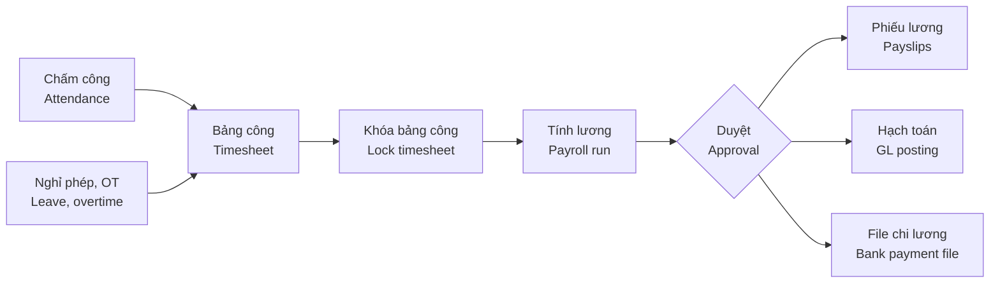

# 08 · Nhân sự – Tiền lương / HR & Payroll (HRM)

[← Mục lục / Index](../README.md)

> **Giai đoạn / Phase:** P2 — Trong P1 chỉ dùng danh mục nhân viên cơ bản (`FR-MDM-022`).
> **Phase:** P2 — P1 only uses the basic employee list (`FR-MDM-022`).

---

## 1. Mục tiêu / Objectives

- **VI:** Số hóa hồ sơ nhân sự, hợp đồng, chấm công, nghỉ phép; tính lương, bảo hiểm bắt buộc và thuế TNCN chính xác theo quy định; hạch toán lương tự động sang kế toán; cung cấp cổng tự phục vụ cho nhân viên.
- **EN:** Digitize employee records, contracts, attendance and leave; compute payroll, mandatory insurance and personal income tax accurately per regulations; post payroll to accounting automatically; provide an employee self-service portal.

## 2. Phạm vi / Scope

| Trong phạm vi / In scope | Ngoài phạm vi / Out of scope |
|---|---|
| Hồ sơ nhân sự, cơ cấu tổ chức, hợp đồng, chấm công, nghỉ phép, làm thêm giờ, tiền lương, bảo hiểm, thuế TNCN, cổng nhân viên / Employee records, org structure, contracts, attendance, leave, overtime, payroll, insurance, PIT, self-service | Tuyển dụng, đào tạo, đánh giá hiệu suất (P3); kết nối trực tiếp cổng BHXH / Recruitment, training, performance reviews (P3); direct social-insurance portal integration |

## 3. Quy trình tính lương / Payroll process

## 4. Yêu cầu chức năng / Functional requirements

### 4.1 Hồ sơ nhân sự / Employee records

#### FR-HRM-001 · Hồ sơ nhân viên / Employee profile
`Should` · `P2`

- **VI:** Thông tin cá nhân, số định danh cá nhân / CCCD, mã số thuế cá nhân, số sổ BHXH, tài khoản ngân hàng, trình độ, người phụ thuộc, liên hệ khẩn cấp, tài liệu đính kèm; thông tin công việc: phòng ban, chức danh, cấp bậc, quản lý trực tiếp, ngày vào làm.
- **EN:** Personal data, personal ID / citizen ID, personal tax ID, social insurance number, bank account, education, dependents, emergency contact, attachments; job data: department, title, grade, direct manager, start date.

#### FR-HRM-002 · Sơ đồ tổ chức & chức danh / Org chart & job titles
`Should` · `P2`

- **VI:** Hiển thị sơ đồ tổ chức theo phòng ban và quan hệ báo cáo; danh mục chức danh, cấp bậc.
- **EN:** Display the org chart by department and reporting lines; maintain job titles and grades.

#### FR-HRM-003 · Hợp đồng lao động / Employment contracts
`Should` · `P2`

- **VI:** Quản lý hợp đồng (thử việc, xác định thời hạn, không xác định thời hạn), phụ lục, mức lương hợp đồng và lương đóng bảo hiểm; cảnh báo hợp đồng sắp hết hạn trước 30 ngày; in hợp đồng theo mẫu.
- **EN:** Manage contracts (probation, fixed-term, indefinite), annexes, contractual salary and insurance salary; alert 30 days before expiry; print contracts from templates.

#### FR-HRM-004 · Quá trình công tác / Employment history
`Should` · `P2`

- **VI:** Ghi nhận bổ nhiệm, điều chuyển, thay đổi lương, khen thưởng, kỷ luật, nghỉ việc; mỗi thay đổi có ngày hiệu lực và quyết định đính kèm.
- **EN:** Record promotions, transfers, salary changes, rewards, disciplinary actions, terminations; each change has an effective date and an attached decision.

### 4.2 Chấm công & nghỉ phép / Attendance & leave

#### FR-HRM-005 · Ca làm việc / Shifts & schedules
`Should` · `P2`

- **VI:** Khai báo ca làm việc (giờ vào, giờ ra, nghỉ giữa ca), lịch làm việc theo tuần, ngày nghỉ lễ.
- **EN:** Define shifts (in, out, breaks), weekly work schedules and public holidays.

#### FR-HRM-006 · Dữ liệu chấm công / Attendance data
`Should` · `P2`

- **VI:** Nhập dữ liệu chấm công từ máy chấm công hoặc file; điều chỉnh có phê duyệt. Chấm công bằng điện thoại (GPS, Wi-Fi) là `Could`, `P3`.
- **EN:** Import attendance from time clocks or files; corrections require approval. Mobile check-in (GPS, Wi-Fi) is `Could`, `P3`.

#### FR-HRM-007 · Làm thêm giờ / Overtime
`Should` · `P2`

- **VI:** Đăng ký và duyệt làm thêm giờ; hệ số làm thêm giờ (ngày thường, ngày nghỉ, ngày lễ, ban đêm) cấu hình được theo quy định.
- **EN:** Request and approve overtime; overtime rates (weekday, rest day, holiday, night) are configurable per regulations.

#### FR-HRM-008 · Nghỉ phép / Leave management
`Should` · `P2`

- **VI:** Loại nghỉ (phép năm, ốm đau, thai sản, việc riêng có lương, không lương…); số ngày phép năm theo quy định và thâm niên; nhân viên gửi đơn, quản lý duyệt; theo dõi số dư phép và phép tồn chuyển năm.
- **EN:** Leave types (annual, sick, maternity, paid personal, unpaid…); annual entitlement by regulation and seniority; employees request, managers approve; track balances and carry-over.

#### FR-HRM-009 · Bảng công tổng hợp / Monthly timesheet
`Should` · `P2`

- **VI:** Tổng hợp ngày công, giờ làm thêm, ngày nghỉ theo nhân viên trong kỳ; khóa bảng công trước khi tính lương.
- **EN:** Summarize workdays, overtime hours and leave per employee for the period; lock the timesheet before payroll.

### 4.3 Tiền lương / Payroll

#### FR-HRM-010 · Thành phần lương / Pay components
`Should` · `P2`

- **VI:** Khai báo thành phần lương: lương cơ bản, phụ cấp (đánh dấu có chịu thuế TNCN, có đóng bảo hiểm hay không), thưởng, làm thêm giờ, hoa hồng (`FR-SAL-028`), khấu trừ; công thức tính cấu hình được.
- **EN:** Define pay components: base salary, allowances (flagged as PIT-taxable and insurance-contributable or not), bonuses, overtime, commissions (`FR-SAL-028`), deductions; formulas are configurable.

#### FR-HRM-011 · Bảo hiểm bắt buộc / Mandatory insurance
`Should` · `P2`

- **VI:** Tính BHXH, BHYT, BHTN phần người lao động và người sử dụng lao động, kinh phí công đoàn; tỷ lệ, mức trần, mức sàn (lương cơ sở, lương tối thiểu vùng) cấu hình theo ngày hiệu lực.
- **EN:** Compute social, health and unemployment insurance (employee and employer shares) and trade-union fee; rates, caps and floors (base salary, regional minimum wage) are configurable with effective dates.

#### FR-HRM-012 · Thuế thu nhập cá nhân / Personal income tax
`Should` · `P2`

- **VI:** Tính thuế TNCN theo biểu lũy tiến từng phần cho người cư trú có hợp đồng từ 3 tháng trở lên; giảm trừ gia cảnh cho bản thân và người phụ thuộc; các trường hợp khấu trừ khác theo quy định. Biểu thuế và mức giảm trừ cấu hình theo ngày hiệu lực.
- **EN:** Compute PIT using progressive brackets for residents with contracts of 3 months or more; family deductions for the taxpayer and dependents; other withholding cases per regulations. Brackets and deductions are configurable with effective dates.

#### FR-HRM-013 · Tính lương & phiếu lương / Payroll run & payslips
`Should` · `P2`

- **VI:** Chạy tính lương theo kỳ tháng cho toàn bộ hoặc nhóm nhân viên; xem trước, điều chỉnh, duyệt; gửi phiếu lương qua email (PDF có mật khẩu là `Could`) và hiển thị trên cổng nhân viên.
- **EN:** Run monthly payroll for all or a group of employees; preview, adjust, approve; email payslips (password-protected PDF is `Could`) and show them on the self-service portal.

#### FR-HRM-014 · Hạch toán lương / Payroll posting
`Should` · `P2`

- **VI:** Sau khi duyệt, tự động sinh bút toán chi phí lương theo bộ phận, phải trả người lao động, các khoản bảo hiểm và thuế TNCN phải nộp sang phân hệ Kế toán.
- **EN:** After approval, automatically generate entries for salary expense by department, payables to employees, insurance and PIT liabilities in the Accounting module.

#### FR-HRM-015 · File chi lương ngân hàng / Bank payroll file
`Should` · `P2`

- **VI:** Xuất file chi lương theo định dạng của ngân hàng trả lương.
- **EN:** Export the payroll payment file in the paying bank's format.

#### FR-HRM-016 · Báo cáo nhân sự – tiền lương / HR & payroll reports
`Should` · `P2`

- **VI:** Bảng lương tổng hợp và chi tiết; báo cáo tăng / giảm lao động tham gia bảo hiểm; dữ liệu tờ khai khấu trừ và quyết toán thuế TNCN; báo cáo biến động nhân sự, cơ cấu lao động.
- **EN:** Payroll summary and detail; insurance enrollment change reports; data for PIT withholding and annual finalization returns; headcount movement and workforce structure reports.

### 4.4 Tự phục vụ / Self-service

#### FR-HRM-017 · Cổng nhân viên / Employee portal
`Should` · `P2`

- **VI:** Nhân viên xem hồ sơ của mình, phiếu lương, số ngày phép còn lại; gửi đơn nghỉ phép, làm thêm giờ, tạm ứng, đề nghị cập nhật thông tin cá nhân; giao diện dùng tốt trên điện thoại.
- **EN:** Employees view their profile, payslips and leave balance; submit leave, overtime, advance and personal-data update requests; mobile-friendly UI.

## 5. Quy tắc nghiệp vụ / Business rules

| Mã / ID | Quy tắc (VI) | Rule (EN) |
|---|---|---|
| BR-HRM-001 | Thông tin cá nhân và lương là dữ liệu cá nhân, chỉ người có quyền được xem; mọi lượt xem dữ liệu lương được ghi nhật ký. | Personal and salary data are personal data visible only to authorized users; every view of salary data is logged. |
| BR-HRM-002 | Bảng lương đã duyệt không được sửa; điều chỉnh ở kỳ sau hoặc bằng bảng lương bổ sung. | Approved payrolls cannot be edited; corrections go to the next period or a supplementary payroll. |
| BR-HRM-003 | Tham số luật định (tỷ lệ bảo hiểm, lương tối thiểu vùng, biểu thuế, mức giảm trừ) có ngày hiệu lực; hệ thống áp dụng giá trị hiệu lực của kỳ lương. | Statutory parameters (insurance rates, regional minimum wage, tax brackets, deductions) have effective dates; the system applies the values effective for the pay period. |
| BR-HRM-004 | Không tính lương khi bảng công của kỳ chưa khóa. | Payroll cannot run until the period's timesheet is locked. |

## 6. Câu hỏi mở / Open questions

| # | Câu hỏi (VI) | Question (EN) |
|---|---|---|
| Q-HRM-01 | Số nhân viên và số loại hình lương (thời gian, khoán, doanh số)? | Headcount and salary schemes (time-based, piece-rate, commission)? |
| Q-HRM-02 | Loại máy chấm công đang dùng và cách xuất dữ liệu? | Which time clocks are used and how do they export data? |
| Q-HRM-03 | Có cần đưa nhân sự – tiền lương lên P1? | Should HR & payroll be moved to P1? |
